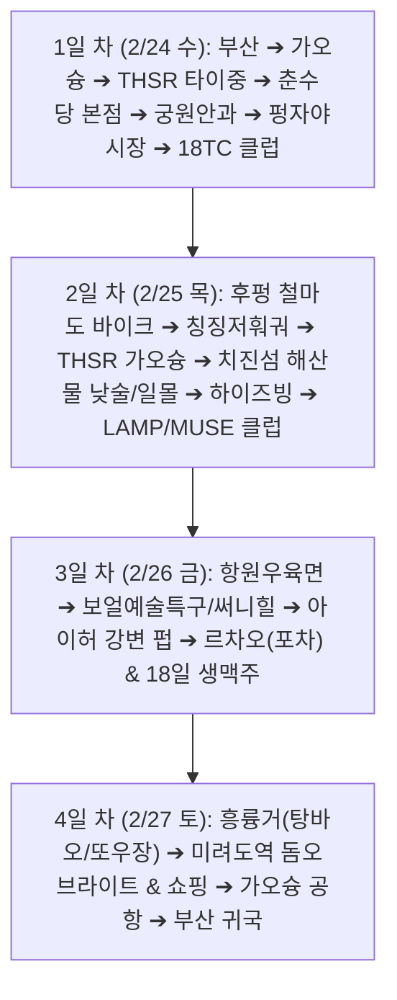

# 🇹🇼 2027 대만(가오슝·타이중) 3박 4일 자유여행 종합 계획서

> **여행 기간:** 2027년 2월 24일(수) ~ 2월 27일(토) [3박 4일]  
> **여행 인원:** 황요한, 유승화, 이영근 (남성 3인)  
> **여행 콘셉트:** 낮에는 1~2개 핵심 액티비티(터널 바이크, 치진섬 전동차) & 감성 인생샷 & 원조 미식 탐방 / 밤에는 대형 야시장 & 로컬 클럽 & 오션뷰 펍 & 르차오(실내포차)와 18일 생맥주

---

## 1. 📋 여행자 여권 정보 마스터 대장

| 구분 | **황요한 (본인)** | **유승화 님** | **이영근 님** |
| :--- | :--- | :--- | :--- |
| **한글 성명** | **황요한** | **유승화** | **이영근** |
| **영문 성 (Surname)** | **HWANG** | **YOO** | **LEE** |
| **영문 이름 (Given Name)** | **YOHAN** | **SEUNGHWA** | **YEONGGEUN** |
| **여권 번호** | **`M885J9226`** | **`M88568510`** | **`M370F2483`** |
| **생년월일** | **1986. 08. 21** | **1983. 08. 29** | **1982. 08. 13** |
| **성별** | **M (남성)** | **M (남성)** | **M (남성)** |
| **발급일** | **2022. 12. 21** | **2018. 10. 26** | **2026. 07. 20** |
| **기간 만료일** | **2032. 12. 21** | **2028. 10. 26** | **2036. 07. 20** |
| **여권 상태** | ✅ 유효 (입국 6개월 이상 완벽 충족) | ✅ 유효 (입국 6개월 이상 완벽 충족) | ✅ 유효 (입국 6개월 이상 완벽 충족) |

---

## 2. 🛂 대만 입국 비자 & 출국 전 행정 체크리스트

### 1) 무비자 입국 요건
* **비자 면제:** 대한민국 국적자는 관광 목적 시 **최대 90일간 무비자(비자 면제)** 입국 가능.
* **여권 유효기간:** 입국일 기준 6개월 이상 잔여 (3명 전원 완벽 충족).
* **왕복 항공권:** 대한민국 귀국 항공권(e-티켓) 소지 필수.

### 2) 온라인 입국신고서 (Online Arrival Card)
* **작성 시기:** 출국 1~3일 전 작성 권장.
* **작성 방법:** 대만 내무부 이민서 웹사이트([https://niaspeedy.immigration.gov.tw/webacard/](https://niaspeedy.immigration.gov.tw/webacard/))에서 무료 제출.
* **효과:** 기내에서 종이 입국신고서를 수기로 작성할 필요 없이 신속 입국 가능.

### 3) 🎁 대만 여행지원금 (대만 럭키랜드, Taiwan Lucky Land)
* **혜택:** 외국인 자유여행객 대상 **5,000 TWD (약 21만 원 상당)** 전자 바우처(이지카드 충전 등) 추첨 지급.
* **신청 방법:** 대만 도착 1~7일 전 대만 관광청 이벤트 공식 페이지에서 3명 각자 사전 등록 ➔ 가오슝 공항 입국장 이벤트 부스 태블릿에서 즉석 추첨.

### 4) 🚨 대만 입국 시 절대 반입 금지 품목 (적발 시 고액 벌금 주의!)
* **육류 및 육가공품 전면 금지 (컵라면/스프 포함):** 육포, 햄, 소시지, 만두, **고기 성분(소고기/돼지고기/닭고기/사골분말 등) 포함 컵라면/스프** 반입 금지 (적발 시 1차 20만 TWD, **한화 약 850만 원 벌금**).
* **만약 실수로 가방에 컵라면이나 소시지를 넣어왔다면?:** 가오슝 공항 수하물 찾는 곳과 세관 검사대 바로 앞에 비치된 노란색 **'사면 쓰레기통(Amnesty Bin)'**에 세관 통과 전 자진해서 버리시면 벌금이 전혀 부과되지 않습니다.
* 👉 **따라서 짐 싸실 때 라면류는 완전히 빼두시고, 여행 중 밤에 술 한잔 후 해장이 필요하실 때 숙소 앞 편의점/마트(세븐일레븐, 패밀리마트, 까르푸)에서 갓 사서 끓여 드시는 것을 강력히 추천합니다!** *(현지 편의점에 신라면, 너구리, 김치사발면, 불닭볶음면 등이 한국과 동일한 가격에 100% 구비되어 있으며 건더기가 훨씬 푸짐합니다)*
* **전자담배 전면 금지:** 궐련형/액상형 전자담배 및 관련 부품 대만 내 소지/반입 불법 (적발 시 압수 및 최고 500만 TWD 벌금). 일반 연초 담배는 1인 1보루 면세 가능.
* **생과일 및 채소:** 반입 금지.

---

## 3. ✈️ 항공권 예매 & 위약금 0원 최저가 전략

### 1) 비행 스케줄 (제주항공 추천 기준)
* **가는 편:** 2027년 2월 24일(수) 14:05 부산(PUS) 출발 ➔ 16:05 가오슝(KHH) 도착 (3시간 소요, 직항)
* **오는 편:** 2027년 2월 27일(토) 17:05 가오슝(KHH) 출발 ➔ 20:40 부산(PUS) 도착 (2시간 35분 소요, 직항)
* **1인 예상 운임:** 왕복 약 **₩437,300** (3인 총액 약 131만 원)

### 2) 100% 무료 취소 기한 & 프로모션 갈아타기 전략
* **취소 수수료 0원 기한:** **2026년 11월 25일(수) 23:59까지** (출발 91일 전)
* **위약금 부과 시작:** 2026년 11월 26일(목) 00:00부터
* **실전 전략:**
  1. 제주항공 공식 홈페이지에서 2/24~2/27 일정(43만 원대)을 먼저 결제하여 마지노선 좌석 확보.
  2. 9~10월 중 LCC 동계 정기 프로모션에서 30만 원대 특가가 오픈되면 새 티켓 예매 후 기존 티켓 전액 무료 환불.
  3. 특가가 뜨지 않을 경우 선점한 티켓으로 확정 탑승.

---

## 4. 🚅 교통 및 숙소 가이드

### 1) 도시 간 이동 (고속철도 THSR)
* **구간:** 가오슝 좌영역(Zuoying) ⇄ 타이중역(Taichung)
* **소요 시간:** 편도 약 45~50분 (배차간격 15~20분)
* **예매 오픈:** 탑승일 기준 **28일 전** 오픈 (외국인 20% 할인권 또는 1+1 티켓 활용 가능)

### 2) 시내 교통 & 바이크 대여
* **시내 이동:** MRT(지하철) 및 택시/우버 (3인 이동 시 시내 단거리는 우버/택시가 매우 경제적)
* **바이크 규정:** 일반 휘발유 오토바이는 국내 2종 소형(오토바이) 면허 필수. 그러나 **후펑 철마도**와 **치진섬**에서는 면허가 전혀 필요 없는 **레저용 전동 바이크/전기 스쿠터**를 렌트하므로 운전면허 없이도 100% 탑승 가능.

### 3) 권장 숙소 위치
* **타이중 (1박 / 2월 24일 수):** **펑자야시장 근처** 또는 **타이중 서구(West District)**
* **가오슝 (2박 / 2월 25일~27일 목·금):** **미려도역(Formosa Boulevard)** 근처 (MRT 환승 중심지, 보얼특구/치진섬 접근 용이, 심야 귀가 최적)

---

## 5. 🗓️ 3박 4일 상세 여행 일정표

### [1일 차 | 2월 24일 수요일] 가오슝 입국 ➔ 고속철도 타이중 이동 & 원조 미식과 클럽의 밤
| 시간 | 장소 / 일정 | 세부 내용 및 여행 꿀팁 |
| :--- | :--- | :--- |
| **14:05 ~ 16:05** | **부산(PUS) ➔ 가오슝(KHH)** | 제주항공 직항 탑승, 가오슝 국제공항 도착 |
| **16:05 ~ 17:00** | **가오슝 공항** | 입국 심사, 수하물 수령, 대만 럭키랜드 추첨 부스 참여, 이지카드 충전 |
| **17:15 ~ 18:20** | **공항 ➔ 좌영역 ➔ 타이중역** | MRT로 좌영역 이동(20분) 후 고속철도(THSR) 탑승 (50분 소요) |
| **18:40 ~ 19:20** | **타이중 숙소 체크인** | 펑자야시장 또는 서구 숙소 체크인 및 짐 보관 |
| **19:30 ~ 20:40** | **춘수당 창시점 (본점)** | **[미식 1]** 세계 최초 버블티 원조 본점에서 오리지널 버블티, 우육면, 공부면(비빔면) 저녁 식사 |
| **20:50 ~ 21:30** | **궁원안과 (Miyahara)** | 1920년대 안과를 개조한 호그와트 감성 인테리어 구경 & 수제 토핑 시그니처 아이스크림 디저트 |
| **21:45 ~ 23:30** | **펑자야시장 (봉갑야시장)** | **[술 1차]** 대만 최대 규모 야시장! 지파이, 대왕오징어구이, 고구마볼 안주와 길거리 맥주 한잔 🍺 |
| **23:30 ~ 심야** | **18TC (Eighteen TC) 클럽** | **[술 2차]** 타이중 최고의 로컬 핫플 클럽! 1층(힙합)/2층(EDM) 비트에 맞춰 첫날밤 불태우기 |

---

### [2일 차 | 2월 25일 목요일] 타이중 터널 바이크 ➔ 훠궈 ➔ 가오슝 치진섬 낮술 & 클럽
| 시간 | 장소 / 일정 | 세부 내용 및 여행 꿀팁 |
| :--- | :--- | :--- |
| **09:30 ~ 11:30** | **후펑 철마도 & 9호 터널** | **[액티비티 1]** 옛 기차 터널과 높다란 철교 위를 달리는 전동 바이크 라이딩 (체력 소모 0, 상쾌한 쾌감) |
| **12:00 ~ 13:30** | **칭징저훠궈 (Karuisawa)** | **[미식 2]** 박물관 같은 웅장한 인테리어 속 1인 1팟 개인 냄비로 깔끔하고 진한 정통 훠궈 점심 |
| **14:00 ~ 15:00** | **타이중 ➔ 가오슝 이동** | 고속철도(THSR) 타고 가오슝 좌영역 복귀 ➔ 미려도역 숙소 체크인 |
| **15:30 ~ 18:30** | **치진섬 (해산물 낮술 & 등대)** | **[바다 & 낮술]** 구산 선착장에서 페리(5분) 탑승. ① 다인승 전동 바이크 대여 후 해안도로 질주 ② **치진 옛거리:** 싱싱한 해산물 직접 골라 즉석 요리와 시원한 대만 맥주 낮술 🍺 ③ **가오슝 등대:** 언덕 위 오션뷰 카페에서 바다 일몰 감상 |
| **18:30 ~ 19:30** | **하이즈빙 (海之冰)** | 치진섬에서 나와 선착장 바로 앞 명물 빙수집에서 대형 생과일/망고 빙수로 해장 겸 디저트 |
| **22:00 ~ 심야** | **LAMP Disco 또는 MUSE 클럽** | **[술 2차]** 가오슝 대표 로컬 클럽에서 화끈한 분위기와 무제한 칵테일/보틀 즐기기 |

---

### [3일 차 | 2월 26일 금요일] 인생 우육면 ➔ 예술거리 산책 ➔ 불금 강변 펍 & 르차오(포차)
| 시간 | 장소 / 일정 | 세부 내용 및 여행 꿀팁 |
| :--- | :--- | :--- |
| **11:30 ~ 13:00** | **항원우육면 (Gang Yuan)** | **[미식 3]** 60년 전통의 인생 우육면. 진한 소고기 비빔면(우육반면)에 다진 생마늘 듬뿍 넣어 속 풀기 |
| **13:00 ~ 17:00** | **보얼예술특구 & 써니힐** | 항구 붉은 벽돌 창고를 개조한 세련된 예술거리 산책. • 감성 포토존 및 조형물 인증샷 • **써니힐(SunnyHills):** 무료 펑리수 1개 + 따뜻한 차 시음 체험 |
| **18:00 ~ 20:00** | **아이허(사랑의 강) 강변 펍** | **[술 1차]** 불금의 낭만적인 강변 야경을 바라보며 시원한 수제 맥주 / 칵테일 한잔 🍻 |
| **20:30 ~ 23:30** | **로컬 르차오 (100원 실내포차)** | **[술 2차]** 파볶음, 공심채, 바지락 볶음 등 가성비 안주 잔뜩 늘어놓고 **유통기한 '18일 생맥주'**로 여행 마지막 밤 피날레 |

---

### [4일 차 | 2월 27일 토요일] 대만 정통 조식 ➔ 미려도역 ➔ 가오슝 공항 ➔ 부산 귀국
| 시간 | 장소 / 일정 | 세부 내용 및 여행 꿀팁 |
| :--- | :--- | :--- |
| **09:30 ~ 10:40** | **흥륭거 (興隆居)** | **[미식 4]** 현지인 줄 서는 70년 전통 조식 노포. 육즙 가득한 탕바오(왕만두) + 고소하고 따뜻한 또우장(콩국)으로 아침 식사 |
| **11:00 ~ 13:30** | **미려도역 & 기념품 쇼핑** | • 세계에서 가장 아름다운 지하철역 중 하나인 '돔 오브 라이트' 유리 공예 관람 • 까르푸 / 드럭스토어에서 누가크래커, 밀크티 티백, 망고 젤리 등 기념품 쇼핑 |
| **14:00 ~ 14:30** | **가오슝 국제공항 이동** | MRT로 공항 이동 후 항공권 발권 및 출국 수속 |
| **17:05 ~ 20:40** | **가오슝(KHH) ➔ 부산(PUS)** | 면세점 쇼핑 후 비행기 탑승, 김해국제공항 도착 및 해산 |

---

## 6. 💰 3박 4일 총 여행 경비 및 예산 계획 (1인 기준 & 3인 총액)

술자리와 클럽, 액티비티를 아끼지 않고 넉넉하게 즐기는 **'풍족한 여행' 기준** 견적입니다.

### 1) 총 여행 경비 요약표
| 구분 항목 | **1인 예상 금액** | **3인 총액** | 비고 및 세부 내용 |
| :--- | :--- | :--- | :--- |
| **✈️ 항공권 (고정)** | **약 437,000원** | 약 1,311,000원 | 제주항공 직항 왕복 (최저가 기준) |
| **🏨 숙박비 (3박)** | **약 130,000원** | 약 390,000원 | 타이중 1박 + 가오슝 2박 (3인실/트리플룸 기준) |
| **🚅 교통비** | **약 95,000원** | 약 285,000원 | THSR 고속철도 왕복 + MRT + 우버/택시비 |
| **🚴 액티비티** | **약 25,000원** | 약 75,000원 | 후펑 철마도 & 치진섬 전동 바이크 렌트비 |
| **🍲 일반 식비/디저트** | **약 80,000원** | 약 240,000원 | 춘수당, 훠궈, 우육면, 궁원안과, 빙수, 조식 등 |
| **🍻 술 & 밤문화 (클럽/포차)** | **약 170,000원** | 약 510,000원 | 야시장 맥주 + 클럽 2회 + 르차오 포차 + 해산물 낮술 |
| **🎒 통신/보험/기념품** | **약 80,000원** | 약 240,000원 | eSIM(8천원) + 여행자보험(1만원) + 선물 쇼핑 |
| **👑 1인 총 예상 경비** | **약 101만 원 ~ 105만 원** | **약 305만 원 ~ 315만 원** | **[풍족하고 여유로운 기준]** |

> 💡 **가성비 절약 시:** 기념품 쇼핑을 줄이고 가성비 호텔을 잡을 경우 **1인당 약 85만 ~ 90만 원 선**에서도 충분히 가능합니다.  
> 🎁 **대만 럭키랜드(여행지원금 21만 원) 당첨 시:** 3명 중 1명이라도 당첨되면 총경비에서 21만 원이 즉시 세이브됩니다!

### 2) 항목별 세부 지출 내역
* **🏨 숙박비 (3박 / 3인실 기준 약 39만 원):**
  * 타이중 1박 (2/24 수): 펑자야시장 근처 3~4성급 호텔 트리플룸 약 12~14만 원
  * 가오슝 2박 (2/25~27 목·금): 미려도역/삼다상권 근처 깔끔한 호텔 트리플룸 1박당 약 12~14만 원 × 2박 = 약 24~26만 원 (1인당 약 13만 원 분담)
* **🚅 교통비 (1인당 약 9.5만 원):**
  * 고속철도(THSR) 왕복: 가오슝 좌영역 ⇄ 타이중역 (외국인 20% 할인 예매 시 1인 왕복 약 **5.5만 원**)
  * 시내 MRT / 치진섬 페리: 이지카드 충전 (1인 약 **2만 원** / 450 TWD)
  * 우버(Uber) 택시비: 밤늦게 클럽/르차오 이동 시 3인이 1/N (1인 약 **2만 원**)
* **🚴 액티비티 (1인당 약 2.5만 원):**
  * 후펑 철마도 9호 터널: 1인용 전동 스쿠터 대여 (1인 약 **1.5만 원** / 350 TWD)
  * 치진섬 해안도로: 지붕 있는 3인승 전동 바이크 2시간 대여 800 TWD (1인 약 **1만 원**)
* **🍲 일반 미식 & 디저트 (1인당 약 8만 원):**
  * 1일 차: 춘수당 본점 저녁(1.5만) + 궁원안과 아이스크림(8천)
  * 2일 차: 칭징저훠궈 점심(2.2만) + 하이즈빙 대형 빙수(3천)
  * 3일 차: 항원우육면 점심(8천) + 써니힐/보얼 카페(1만)
  * 4일 차: 흥륭거 탕바오/또우장 조식(5천) + 공항 간식(1만)
* **🍻 술 & 밤문화 (1인당 약 17만 원):**
  * 1일 차 밤 (타이중): 펑자야시장 안주/맥주(1.5만) + 18TC 클럽 입장료/프리드링크(3.5만)
  * 2일 차 낮&밤 (가오슝): 치진섬 해산물 거리 낮술(3만) + LAMP/MUSE 클럽 입장/바틀(3.5만)
  * 3일 차 밤 (가오슝): 아이허 강변 펍 맥주(2만) + 르차오(100원 포차) & 18일 생맥주 파티(3.5만)

### 3) 공금 운용 팁
* 현지 도착 후 식비, 술값, 택시비, 액티비티 비용을 위해 **1인당 약 30~35만 원(약 7,000~8,000 TWD)**씩 공금으로 모읍니다.
* **트래블월렛 1명 카드에 공금을 몰아 충전**해 두고 식당/우버 결제 시 카드로 긁거나, 공항 ATM에서 무료 인출하여 총무가 관리하면 계산이 매우 편리합니다.

---

## 7. 🍻 대만 식당/주점 맥주 & 안주 물가 심층 비교 (한국 vs 대만)

대만의 로컬 실내포차인 **'르차오(熱炒)'**나 일반 식당은 대형 냉장고에서 손님이 직접 맥주를 꺼내 마시고 나중에 빈 병을 세어 계산하는 시스템입니다.

| 구분 항목 | **대만 현지 식당 (르차오/노포)** | **한국 일반 식당/주점** | 체감 비교 |
| :--- | :--- | :--- | :--- |
| **대만 클래식/골드메달** | **600ml 대병** : 약 70~80 TWD (**약 3,000원 ~ 3,500원**) | 500ml 병맥주 : 5,000원 ~ 6,000원 | **용량은 20% 더 크고 가격은 40% 저렴!** |
| **18일 프리미엄 생맥주** | **600ml 대병** : 약 90~110 TWD (**약 3,900원 ~ 4,800원**) | 수제 생맥주 : 7,000원 ~ 9,000원 | 초신선 생맥주를 한국 카스 병맥주보다 싸게 마심 |
| **편의점 500ml 캔맥주** | 1캔 약 45~50 TWD (**약 2,000원 ~ 2,200원**) | 1캔 3,000원 ~ 3,500원 | 편의점 맥주도 30% 이상 저렴 |
| **포차(르차오) 안주 1접시** | 파볶음, 공심채, 조개볶음, 칠리새우 등 **접시당 100~200 TWD (약 4,300원 ~ 8,500원)** | 주점 안주 1개당 18,000원 ~ 25,000원 | **안주 5~6개 깔아도 3~4만 원대** |
| **클럽 (LAMP/MUSE)** | 오픈바(Open Bar) 요금제 시 **입장료 2~3만 원에 맥주/칵테일 무제한** | 클럽 테이블/바틀 30~50만 원 이상 | 가성비 무제한 음주 가능 |

* **💡 실전 술자리 비용 체감:** 르차오(포차)에서 3명이 맛있는 볶음 요리 안주 6~7개(새우, 조개, 고기, 볶음밥 등)와 **18일 생맥주 8~10병**을 맘껏 마셔도 **총 6~7만 원대 (1인당 2만 원대 초반)** 수준으로, 한국 대비 절반 이하의 비용으로 푸짐하게 마실 수 있습니다.

---

## 8. 🍽️ 핵심 미식 & 주류 주문 가이드

1. **춘수당 본점:** 오리지널 쩐주나이차(버블티) + 공부면(특제 소스 비빔면) + 우육면
2. **항원우육면:** 국물 우육면보다 **'비빔 우육면(우육반면, 牛肉拌麵)'** 강추! 테이블에 비치된 **다진 생마늘 1~2스푼**을 넣어 비비면 극상의 감칠맛.
3. **치진섬 해산물 거리:** 수조에서 해산물(새우, 오징어, 조개)을 직접 고르고 조리법(볶음/튀김/구이) 선택 후 대만 맥주와 곁들이기.
4. **18일 생맥주 (18天台灣生啤酒):** 제조 후 18일 동안만 냉장 유통되는 프리미엄 생맥주로, 편의점이나 르차오에서 발견 즉시 마셔볼 것!

---

## 9. 🎒 여행 준비물 및 실전 체크리스트

- [ ] **수하물 주의 (라면류 제외):** 고기 성분 포함 컵라면/스프/소시지는 짐에서 완전히 빼두기 (현지 편의점에서 구매).
- [ ] **전압 플러그:** 대만은 **110V 11자형 플러그(돼지코)** 사용 (멀티어댑터 1~2개 필수).
- [ ] **환전/결제:** 트래블로그 / 트래블월렛 카드 (대만 현지 수수료 무료 ATM 출금) + 야시장 및 노포용 현금 준비.
- [ ] **통신:** eSIM 또는 유심 사전 구매.
- [ ] **어플 설치:** 한국에서 사용하던 **우버(Uber)** 앱 로그인 확인 (심야 귀가 및 단거리 이동 시 최적).
- [ ] **복장:** 낮 최고 25°C 전후로 반팔/얇은 셔츠 + 밤에는 가벼운 바람막이 또는 가디건.
- [ ] **안전 수칙:** 대만 밤 치안은 세계 최고 수준이나, 밤길 보행 시 오토바이(스쿠터) 통행 주의.
- [ ] **우산/우비:** 접이식 소형 우산 1개 휴대.

