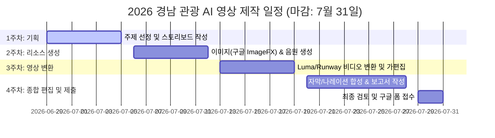
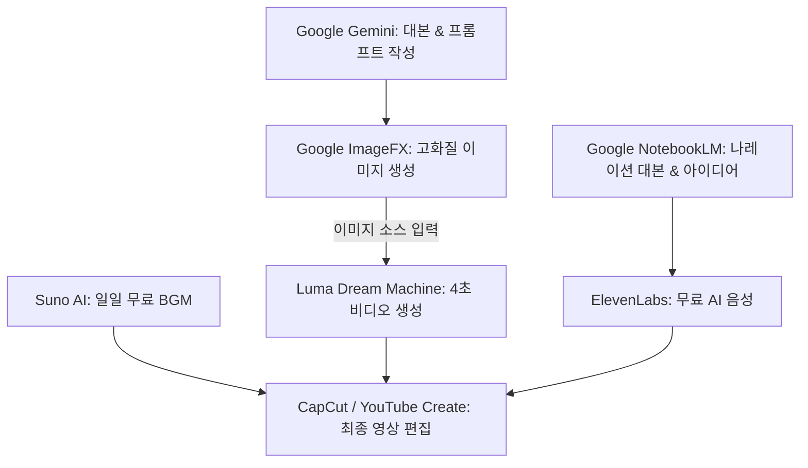

# [학생 지도 가이드] 2026 경남 관광 AI 홍보 영상 공모전 지도 계획 및 실전 가이드

이 문서는 **'상상이 현실이 되는 경남여행 - 2026 경남 관광 AI 홍보 영상 공모전'**에 참가하는 학생들을 지도하기 위해 작성된 종합 지도 계획 및 기술 가이드라인입니다. 학교 현장에서의 현실적인 예산 제약을 고려하여 **구글(Google)의 강력한 무료 AI 툴과 무료 요금제를 제공하는 도구들만을 활용한 '예산 Zero 파이프라인'**을 추가하여 재구성하였습니다.

---

## 1. 공모전 핵심 요구사항 및 분석

공모전 심사 기준과 규칙을 철저히 분석하여 탈락 요소를 방지하고 감점을 예방합니다.

| 항목 | 핵심 내용 및 기준 | 지도 포인트 |
| :--- | :--- | :--- |
| **참가 대상** | 전국민 대상 (중·고등학생 참여 가능) | 학생들의 눈높이에 맞는 숏폼 연출력 강조 |
| **핵심 주제** | 실제보다 더 생생한, 상상 속의 경남여행을 마주하다 | 단순히 예쁜 풍경 나열이 아닌 스토리텔링 필수 |
| **핵심 키워** | #경남여행의 상상력 #시공간 초월 #디지털 경남 | AI 기술이 아니면 표현할 수 없는 초현실적 연출 기법 적용 |
| **영상 규격** | 가로(16:9) 또는 세로(9:16), 러닝타임 30초~120초 | 모바일 환경과 2차 온라인 투표를 고려해 **세로형(9:16) 숏폼** 강력 권장 |
| **AI 비중** | 전체 영상 분량의 **60% 이상** 생성형 AI 기술 필수 사용 | 이미지, 비디오, 나레이션, BGM 등 전 분야에 걸친 AI 툴 파이프라인 구축 |
| **필수 제출 서류** | ① 참가신청서 ② 생성형 AI 기술 사용 보고서 ③ 참가확약서 및 동의서 ④ 영상 파일 | 1~3번 서류를 취합하여 **PDF 1개 파일**로 병합 제출하도록 지도 |

---

## 2. 주차별 지도 계획 (4주 완성 로드맵)

제출 마감일(7월 31일) 전까지 완성도 높은 결과물을 얻기 위한 4주 프로젝트 일정표입니다.

---

## 3. 예산 Zero! 무료 & 구글 AI 툴 파이프라인

유료 구독료 부담 없이 학교 및 개인의 구글 계정만으로 고품질 영상을 제작할 수 있는 도구 조합입니다.

### ① AI 도구별 구독 요금 비교 및 대체 안

| 작업 단계 | 대표 유료 툴 | 비용 부담 | 100% 무료 대체 툴 | 무료 사용 조건 및 팁 |
| :--- | :--- | :--- | :--- | :--- |
| **대본 / 기획** | ChatGPT Plus | 월 $20 | **Google Gemini** | 구글 계정으로 무상 무제한 제공, 최신 정보 검색 가능 |
| **이미지 생성** | Midjourney v6 | 월 $10~ | **Google ImageFX** | **구글 AI Test Kitchen을 통해 완전 무료 제공 (Imagen 3 탑재)** |
| **비디오 변환** | Runway Gen-3 | 월 $15~ | **Luma Dream Machine** | 매일 약 30회 무료 생성 크레딧 제공 |
| **나레이션 TTS** | Typecast 유료 | 월 9,900원~ | **ElevenLabs** | 매월 10,000자 무료 제공 (1~2분 분량 숏폼 제작에 충분) |
| **배경음악 BGM** | Suno Pro | 월 $10 | **Suno AI (무료 요금제)** | 매일 50크레딧(노래 10곡 분량) 무료 충전 제공 |
| **최종 영상 편집** | Premiere Pro | 월 24,000원~ | **CapCut / YouTube Create** | 워터마크 없이 편집 및 자동 자막 생성 지원 |

---

## 4. 구글 및 주요 무료 AI 툴 활용 가이드

### ① Google ImageFX (초고화질 이미지 생성)
*   **특징**: 구글의 최신 이미지 생성 엔진 **Imagen 3**가 탑재된 무료 도구로, 미드저니에 버금가는 극사실적(Photorealistic) 이미지 묘사가 가능합니다.
*   **학생 지도 요령**: 
    *   인터페이스 하단의 스타일 태그 키워드(예: *Photorealistic, Cinematic, 35mm lens, Dreamy*)를 활용하여 일관된 톤의 이미지를 뽑아냅니다.
    *   **프롬프트 예시**:
        > `A high school student looking at the futuristic digital cherry blossom light show in Jinhae Gyeonghwa Station, glowing pink lights, high detailed, cinematic lighting --ar 9:16`

### ② Google Gemini (스토리보드 및 번역)
*   **특징**: 한글 작문 능력이 우수하며 경남의 지형, 문화 정보를 빠르게 검색해 반영합니다.
*   **학생 지도 요령**:
    *   역사 고증이나 지역 특색(예: 진해 군항제 역사, 남해 다랭이마을의 지리적 배경)을 제미나이에 질문해 시나리오를 고도화하게 하세요.
    *   ImageFX에 입력할 영어 프롬프트를 상세하게 작성하고 번역하는 작업도 제미나이를 통해 손쉽게 수행할 수 있습니다.

### ③ Google NotebookLM (대화형 대본 기획)
*   **특징**: 경남 관광 보도자료나 브로셔를 업로드하면 자동으로 두 남녀의 재미있는 팟캐스트 형식 대화 오디오(Audio Overview)를 생성해 줍니다.
*   **학생 지도 요령**:
    *   학생들이 다큐멘터리식 나레이션에서 벗어나 **"경남 여행 라디오 쇼"**처럼 생동감 넘치는 팟캐스트 대화 음원을 얻고 싶을 때 매우 유용합니다.

### ④ Luma Dream Machine (무료 이미지-비디오 변환)
*   **특징**: 정지된 이미지를 현실감 넘치는 4초 비디오로 바꾸는 물리 엔진 기반 변환 툴입니다.
*   **학생 지도 요령**:
    *   매일 충전되는 30크레딧 한도 내에서 한 번에 1~2개 씬씩 신중하게 생성하도록 지도하세요.
    *   원하지 않는 깨짐 현상을 피하기 위해 모션 강도 조절 옵션을 사용합니다.

---

## 5. 심사 기준별 고득점 획득 전략

심사위원들의 채점 기준(100점 만점)을 분석하여 고득점을 획득할 수 있는 구체적인 연출 방향입니다.

### ① 기술적 완성도 (30점 - 배점 가장 높음)
*   **평가 요소**: 생성형 AI 기술을 매끄럽고 수준 높게 구현했는가?
*   **돌파 전략**: 
    *   **프레임 깜빡임(Flickering) 및 흐려짐 방지**: AI 비디오 생성 시 발생하는 깜빡임 현상을 막기 위해 컷 전환을 빠르게 가져가는 편집 기법(Fast-cut)을 활용하거나 CapCut의 모션 블러 효과 활용.
    *   **일관된 컬러 그레이딩**: 서로 다른 AI 툴에서 나온 비디오 클립들을 하나의 필터나 색조(Color LUT)로 묶어 시각적 이질감을 없앨 것.

### ② 주제 적합성 (25점)
*   **평가 요소**: 경남 관광의 매력을 정확히 이해하고 표현했는가?
*   **돌파 전략**:
    *   단순히 가상의 미래 도시만 보여주면 탈락할 수 있음. 반드시 **실제 경남의 대표 랜드마크(예: 진해 경화역, 창원 마산 눋스산, 진주 촉석루, 남해 다랭이마을)**의 실제 지형적 특징이 시각적으로 명확히 드러나야 함.
    *   *연출 기법*: "경화역 기찻길 위로 분홍빛 벚꽃 은하수가 쏟아지고, 그 사이로 디지털 미래 열차가 지나가는 모습"처럼 가상과 현실의 결합 지점을 제공할 것.

### ③ 창의성 및 독창성 (25점)
*   **평가 요소**: AI만의 초현실적/기획적 상상력이 돋보이는가?
*   **돌파 전략**:
    *   **시공간 초월 연출**: 역사 속 인물(예: 충무공 이순신)이 타임슬립하여 현대의 디지털 경남 관광지를 여행하며 셀카를 찍는 컨셉 등, 유머러스하면서도 신선한 기획을 권장.
    *   **소도시 판타지**: 잘 알려지지 않은 경남의 소도시들을 판타지 세계관(예: 거창 수승대가 요정의 숲으로 변함)으로 묘사하여 흥미 유발.

### ④ 대중성 및 홍보성 (20점)
*   **평가 요소**: 일반 대중에게 호감을 주며 실제 경남 방문을 유도할 수 있는가?
*   **돌파 전략**:
    *   **숏폼 트렌드 결합**: 유튜브 쇼츠나 틱톡에서 유행하는 '여행 브이로그'나 '현지인 추천 맛집/코스' 포맷을 벤치마킹하여, 친근한 나레이션과 빠른 템포의 편집 진행.
    *   **공식 폰트 및 고화질 자막**: 가독성이 뛰어난 한국어 폰트(에스코어 드림, 프리텐다드 등)를 사용해 자막을 또렷하게 표시하여 시청 피로감 축소.

---

## 6. [서식] 생성형 AI 기술 사용 보고서 작성 샘플

공모전 제출 서류 중 가장 중요한 '생성형 AI 기술 사용 보고서'의 작성 예시입니다. 아래 양식을 바탕으로 학생들이 프로젝트 진행 과정을 꼼꼼히 기록하도록 지도해야 합니다.

### [기본 정보]
*   **출품작 제목**: 시공간을 넘어 마주한 경남: 이순신 장군의 진해 나들이
*   **제작팀명 / 대표자**: 진해고등학교 AI 크리에이터팀 / 홍길동
*   **사용된 생성형 AI 기술 비중**: 약 75% (전체 60초 중 45초 영역 AI 직접 생성 및 변형 적용)

### [상세 기술 활용 내역]

| 타임코드 (초) | 씬 설명 (Scene) | 사용된 AI 도구 | 입력 프롬프트 (Prompt) / 작업 세부사항 | 비중 (%) |
| :--- | :--- | :--- | :--- | :--- |
| **00:00 - 00:15** | 조선시대 이순신 장군이 현대 진해 경화역으로 워프하는 오프닝 | Google ImageFX, Luma Dream Machine | ImageFX: `An ancient Korean naval general Admiral Yi Sun-sin standing in Jinhae Gyeonghwa Station with cherry blossom digital wind, cinematic lighting, 8k` Luma: `camera panning down, cherry blossoms falling naturally` | 80% |
| **00:15 - 00:40** | 미래형 디지털 진해 해양공원에서 이순신 장군이 로봇 갈매기와 소통 | Stable Diffusion, Luma Dream Machine | SD: `futuristic digital port Jinhae with holographic lights, sci-fi cyber elements` Luma: `character gently touching a robotic seagull, natural physical movement` | 75% |
| **00:40 - 00:55** | 남해 다랭이마을 상공에 나타난 초현실적인 거대 고래와 노을 | Photoshop AI, Luma Dream Machine | Photoshop: 남해 다랭이마을 실사 사진 로드 후 하늘에 `giant floating cosmic whale made of stars` 생성형 채우기 적용 | 65% |
| **전 구간** | 감성적인 홍보 영상 BGM 및 한국어 나레이션 오디오 | Suno AI, ElevenLabs | Suno: `lofi ambient pop, gayageum melody, warm guitar, cinematic, 95 bpm` ElevenLabs: 한국어 여성 보이스 'Seoyeon' 선택 후 나레이션 대본 입력 | 100% |

---

## 7. 지도교사 핵심 체크리스트

- [ ] **AI 사용 비율 60% 이상인가?**
  * 영상의 절반 이상이 실사 편집이 아닌 AI 툴(ImageFX, Luma 등)로 가공되거나 생성되었는지 타임라인 확인.
- [ ] **저작권 및 침해 요소가 없는가?**
  * Suno로 만든 BGM의 멜로디가 기존 상업 가요와 겹치지 않는지 필터링.
- [ ] **영상 포맷 규격을 준수했는가?**
  * 최소 30초 이상, 2분 이내의 분량인지 확인. 확장자가 `.mp4` 혹은 `.mov`인지 확인.
- [ ] **학생들이 작업 과정을 스크린샷으로 캡처했는가?**
  * 보고서에 첨부해야 할 사용 흔적 증빙 캡처본(프롬프트 창 등) 확보 확인.
- [ ] **파일 이름 형식을 맞췄는가?**
  * `2026 경남 관광 AI 홍보 영상 공모전 신청_이름또는팀명.pdf` 형식으로 신청서, 보고서, 동의서를 하나의 PDF로 묶어 제출하도록 점검.
