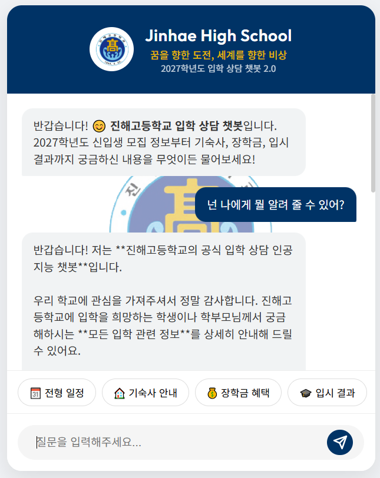
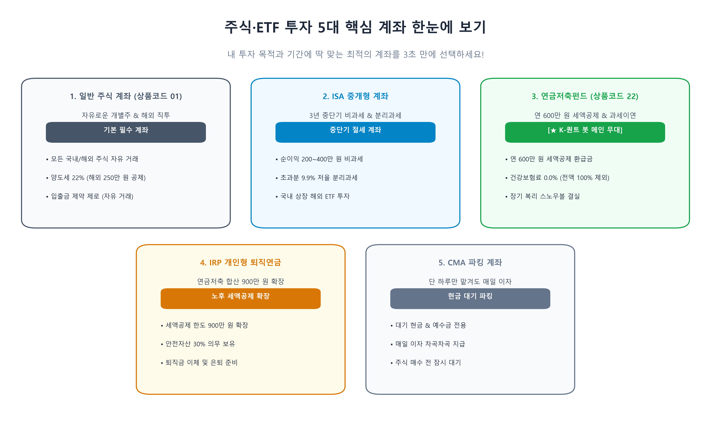

# 📝 저자(황요한 선생님) 원고 교정 및 수정 상세 대조 이력서 (Before & After)

이 문서는 황요한 저자의 직접 지시 및 피드백에 따라 원고(`retirement_savings_dual_momentum_guide.md`)의 **어느 위치에서 무엇이 어떻게 수정되었는지[수정 전(Before) ➔ 수정 후(After)]**를 exact 대조 형식으로 기록·보관하는 공식 문서입니다.

---

## 📅 [1단계 교정 이력] 1부 1.1절 서사 순화 & 복무 징계 차단 & 데이터 보완

### 📍 항목 1.1-A: 복무 징계/품위유지 리스크 원천 차단 (수업 시간 주식 창 조회 문장)
* **원고 위치:** `1부 1.1절 첫 번째 문단` (Line 42 부근)
* **수정 이유:** 수업 시간 주식 조회가 복무 위반 징계 사유가 될 수 있는 리스크를 100% 원천 차단.

```diff
- 과거의 저는 매일 학교 쉬는 시간은 물론, 수업 시간 사이사이에도 몰래 스마트폰 HTS/MTS를 열어보며 붉고 푸른 주가 창에 온 신경을 빼앗기곤 했습니다.
+ 과거 수동 투자 시절의 저는 쉬는 시간이나 점심시간마다 스마트폰 주가 창을 열어보며 주가의 상승과 하락에 온 신경을 빼앗기곤 했습니다. 특히 변동성이 작은 ETF가 아닌 개별 종목에 직접 투자했었기에 주가의 부침은 한층 더 격렬했습니다.
```

---

### 📍 항목 1.1-B: 주식 투자 심리적 손실 및 불안감 고백 서사 수록
* **원고 위치:** `1부 1.1절 첫 번째 문단 직후`
* **수정 이유:** 주식 공부 시간 손실, "오를 때 기쁨보다 내릴 때 상실감이 크다"는 저자의 진솔한 경험 고백 추가.

```diff
- (기존에는 없던 심리적 고백 문장)
+ 주식 시장을 분석하고 공부하느라 수많은 시간을 쏟아부어야 했고, 끊임없이 주가를 확인하며 마음을 졸여야 했습니다. 주식 투자라는 것은 주가가 오를 때 느끼는 기쁨보다 내릴 때 겪는 상실감이 훨씬 더 크기 때문에, 거기서 오는 심리적 불안감과 스트레스는 일상을 크게 짓누르곤 했습니다.
```

---

### 📍 항목 1.1-C: 2026년 7월 코스피(KOSPI) 실측 백테스팅 데이터 수록 (7/31 급등장 포함)
* **원고 위치:** `1부 1.1절 두 번째 문단`
* **수정 이유:** 네이버 금융 코스피 30년 DB 백테스팅 수치(변동성 6.26%, 평시의 5.9배, 상위 0.7% 1위, 7월 31일 +17.91% 폭등장 데이터 포함)를 수록하여 실증 신뢰도 대폭 향상. 소괄호 `()` 문법 전면 삭제.

```diff
- 특히 2026년 7월은 글로벌 금리 향방과 지정학적 리스크, 대형 반도체주의 급등락이 얽히며 코스피 일일 변동 폭이 최근 수년 내 손에 꼽힐 만큼 극심했던 폭풍우 장세였습니다. 수많은 개인 투자자들이 매일 널뛰는 주가에 안절부절못하며 일상을 잃어가던 시기였습니다.
+ 특히 2026년 7월은 글로벌 금리 향방과 지정학적 리스크, 대형 반도체주의 급등락이 얽히며 코스피 시장 전체가 거대한 폭풍우에 휩싸였던 시기였습니다. 실제 코스피 지수의 일별 변동성 데이터를 표준편차 지표로 실측 분석해 보면, 평시 역대 평균 변동성인 1.06%의 무려 5.9배에 달하는 6.26%라는 수치를 기록했습니다. 이는 2020년 3월 코로나 펜데믹 당시의 변동성이었던 4.11%를 뛰어넘어 최근 12년 간 관측된 전체 147개 월 중 상위 0.7%라는 최고 수준에 달하는 역대급 장중 널뛰기 장세였습니다. 매일 7% 이상 춤추는 주가 앞에서 수많은 개인 투자자들이 안절부절못하며 일상을 잃어가던 시기였습니다.
```

---

### 📍 항목 1.1-D: 괄호 제거 & 아기 연령(24개월) & 에듀테크 개발 시간 확보 반영
* **원고 위치:** `1부 1.1절 세 번째 문단` (Line 46 부근)
* **수정 이유:** 괄호 없이 "내 손으로 직접 트레이딩을 하지 않고 자동화 봇에 맡긴다는 사실 하나만으로도"로 변경. 아기 나이 24개월로 보정. 교사로서 '수업과 교직 업무에 필요한 다양한 에듀테크 웹앱 개발 시간 확보' 수록.

```diff
- 내 손으로 직접 트레이딩을 하지 않는다(자동화 봇에 맡긴다)는 사실 하나만으로도 주가 향방에 따른 스트레스를 크게 줄일 수 있었습니다. 주가가 많이 내릴 때는 '향후 더 저렴한 가격으로 좋은 자식을 모을 수 있는 기회'라고 마음 편히 생각하게 되었고, 주가가 급등할 때는 '현재 보유한 자산의 가치가 올랐다'는 긍정적인 마음을 가질 수 있게 되었습니다. 비로소 교사로서 수업과 학급 경영에 몰입하고, 퇴근 후에는 사랑하는 22개월 아기와 아내의 손을 잡고 따뜻한 일상을 누리는 '마음의 평화'를 되찾은 것입니다.
+ 내 손으로 직접 트레이딩을 하지 않고 자동화 봇에 맡긴다는 사실 하나만으로도 주가 향방에 따른 스트레스를 크게 줄일 수 있었습니다. 주가가 많이 내릴 때는 '향후 더 저렴한 가격으로 좋은 자산을 모을 수 있는 기회'라고 마음 편히 생각하게 되었고, 주가가 급등할 때는 '현재 보유한 자산의 가치가 올랐다'는 긍정적인 마음을 가질 수 있게 되었습니다. 비로소 교사로서 수업과 교직 업무에 필요한 다양한 에듀테크 웹앱 개발을 할 수 있는 소중한 시간적 여유를 가지게 되었고, 퇴근 후에는 사랑하는 24개월 아기와 아내의 손을 잡고 따뜻한 일상을 누리는 '마음의 평화'를 되찾은 것입니다.
```

---

### 📍 항목 1.1-E: 본문 내 어색한 소괄호 `(...)` 문법 전면 제거 및 풀어서 적기
* **원고 위치:** `1부 1.1절~1.5절 본문 전체`
* **수정 이유:** 매형의 피드백("이미 누구나 아는 영어/한자 괄호 삭제 및 풀어쓰기") 반영.

| 원고 위치 | 수정 전 (Before) | 수정 후 (After) |
| :--- | :--- | :--- |
| `1.1절 44라인` | `4공장(24만 리터) 완전 풀 가동(Full Ramp-up)` | `24만 리터 규모 4공장의 완전 가동 및 생산 능력 극대화` |
| `1.1절 44라인` | `'생물보안법(Biosecure Act)'` | `생물보안법` |
| `1.1절 45라인` | `1,734만 원(-21.4%)의` | `1,734만 원인 21.4%의` |
| `1.1절 47라인` | `감(感)과 운(運)` | `감과 운` |
| `1.1절 47라인` | `'초심자의 행운(Beginner's Luck)'` | `초심자의 행운` |
| `1.1절 47라인` | `'규칙(Rule)'` | `명확한 규칙` |
| `1.2절 55라인` | `22개월 된 어린 아기` | `24개월 된 어린 아기` |
| `1.2절 56라인` | `현금흐름 (Capital Inflow)` | `현금흐름` |
| `1.2절 57라인` | `마음의 안정(Mind Control)` | `마음의 안정` |
| `1.3절 73라인` | `원시 데이터(Raw Data)` | `원시 데이터` |
| `1.5절 148라인` | `에이전트 AI(Agentic AI)` | `에이전트 AI` |
| `1.5절 169라인` | `개인정보(PII)` | `개인정보` |

---

## 🔮 [향후 단계별 대조 기록 예정]

* **[2단계 예정]:** 1.3절 ~ 1.5절 퀀트 개념 난이도 쉽게 풀기, 추세추종/게리 안토나치 개념 도표, 교사 AI 챗봇 연결 징검다리 서사의 Before / After 기록.
* **[3단계 예정]:** 2.1절 ~ 2.6절 연금 600만 원 한도 외 1억 목돈 운용/ISA 활용법, 모멘텀 이론(윌리엄 오닐) 강화, 건보료 리스크 대안의 Before / After 기록.
* **[4단계 예정]:** 3부~4부 12:30 KST 매매 타임 및 10대 디버깅집 최종 점검의 Before / After 기록.


---

## 📅 [2단계 교정 이력] 1.3절 퀀트 개념 난이도 조절 & 추세추종 표/차트 & 1.4절 교사 AI 징검다리 (2026-08-01 논의 및 확정 보관)

### 📍 항목 2.1: K-듀얼모멘텀 코스피 매수 시기 시각화 차트 제작 (단일 음영 차트)
* **저자 지시:** 40년 코스피 백테스팅 꺾은선 그래프 제작. 코스피 매수 시기만 초록색 세로 음영으로 처리하고 무음영 구간은 미국 주식/채권/달러 대피 기간으로 표시. 여러 색상 대신 단일 색상으로 직관성 극대화.
* **완성 파일:** `k_momentum_kospi_single_chart.png` (300 DPI 초고화질 도서 인쇄용)

---

### 📍 항목 2.2: K-듀얼모멘텀 5대 자산군별 스위칭 조건 & 수익 극대화 전략표 작성
* **저자 지시:** K-듀얼모멘텀이 단순히 소극적으로 피신하는 것이 아니라, 코스피/S&P500이 안 좋을 때는 미국 장기채(TLT)나 금 현물로 적극 이동하여 하락장 속에서도 수익을 극대화하는 공격적 듀얼 스위칭 전략임을 표와 해설 서사로 명확히 수록.
* **수록 내용:**
  * **코스피/미국주식:** 우상향 1위 모멘텀 수확
  * **미국 장기채(TLT):** 주식 약세 시 금리 인하로 폭등하는 채권으로 갈아타 하락장 추가 수익 극대화 📈
  * **금 현물:** 지정학적 위기 및 인플레이션 시기 차별화된 대안 수익 극대화 💎
  * **달러/단기채:** 모든 위험자산 폭락 시 100% 최후 방어 🛡️

---

### 📍 항목 2.3: 1.4절 교사 AI(진해고 챗봇 등) 서사 징검다리 연결 문구 준비
* **저자 지시:** 주식 퀀트 이야기에서 1.4절 교사 AI 이야기로 넘어갈 때의 맥락 단절을 방지하는 징검다리 서사 수록.
* **수정 준비 문장:** *"주식 차트와 엑셀을 들여다보느라 소모하던 수많은 시간과 에너지가 퀀트 자동화 봇 덕분에 완벽히 절약되자, 제 삶에는 매월 수십 시간의 소중한 여유가 생겨났습니다. 저는 이 되찾은 소중한 시간을 헛되이 보내지 않고, 퀀트 봇을 만들며 터득한 AI 에이전트 자동화 노하우를 교사로서 가장 의미 있는 교육과 수업 업무(에듀테크)로 확장해 나가기 시작했습니다."*


---

### 📍 항목 2.4: 사회 초년생 교사·공무원 맞춤 100% 쉬운 언어 전환 (2026-08-02 저자 지시 반영)
* **저자 지시:** 사회 초년생 교사 및 공무원이 읽었을 때 한눈에 이해되도록 전문/금융 용어를 100% 친절하고 쉬운 일상적 표현으로 전면 전환.

| 전문/금융 용어 | 기존 표현 (다소 딱딱함) | 💡 사회 초년생 맞춤 교정 표현 (친절한 가이드) |
| :--- | :--- | :--- |
| `12개월 모멘텀 양수(+)` | 12개월 모멘텀 점수가 양수(+)이고 | **1년 전 가격보다 지금 가격이 더 올라 있고** |
| `상승 에너지 1위` | 상승 에너지가 1위일 때 | **모든 자산 중 가장 잘나가는 1등 우등생 자산일 때** |
| `공격적 스위칭` | 공격적 스위칭 전략 | **기회를 놓치지 않고 더 좋은 자산으로 즉시 갈아타기** |
| `독립적 대안 수익` | 독립적 대안 수익 극대화 | **주식이 떨어져도 금값이나 채권 값 상승으로 따로 돈 버는 효과** |
| `위험자산 전원 음수(-)` | 위험자산의 모멘텀이 전원 음수(-)일 때 | **주식, 채권, 금이 모두 떨어지는 총체적 폭락장일 때** |
| `최후의 현금화 안전 지대` | 최후의 현금화 안전 지대 | **폭우를 피하는 100% 안전한 쉼터 (현금 보관소)** |
| `계좌 손실 0% 동결` | 계좌 손실을 0%로 동결하고 | **소중한 내 원금이 더 이상 깎이지 않게 원금 자물쇠를 잠그고** |
| `지수 추종 ETF` | KODEX 200, S&P500 지수 추종 ETF | **한국과 미국의 대표 우량 기업 200개, 500개를 한 묶음으로 사는 안전한 주식 종합선물세트** |


---

### 📍 항목 2.5: 1.4절 교사 AI 챗봇 연결 징검다리 서사 확정 반영 (2026-08-02 완료)
* **원고 위치:** `1부 1.4절 도입부 문단` (Line 106 부근)
* **수정 이유:** 주식 퀀트 봇 이야기에서 1.4절 교사 AI 챗봇(`jinhae-bot2`) 이야기로 넘어갈 때의 맥락 단절을 완벽히 해결하는 징검다리 서사 반영.

```diff
- [수정 전]: 첫 발령을 받고 교직에 나설 때부터, 저는 직접 돈을 벌기 시작하면서 경제와 관련된 공부를 깊이 있게 해야겠다고 다짐했습니다... 교사에게 주어진 시간 자원은 한정되어 있었고, 그 시간들을 무작정 쪼개 쓰는 방식에는 명확한 한계가 존재했습니다...
+ [수정 후]: 매달 1회 텔레그램 메시지 1줄로 계좌 리밸런싱이 깔끔하게 완결되자, 주식 차트를 들여다보고 매일 경제 소식을 쫓느라 소모하던 수많은 시간과 에너지가 완벽히 절약되었습니다. 그렇게 되찾은 매월 수십 시간의 소중한 여유는 제 삶에 커다란 변화를 가져왔습니다. 저는 이 되찾은 소중한 시간을 헛되이 보내지 않고, 안티그래비티 AI와 대화하며 퀀트 봇을 구축했던 개발 노하우를 '교사로서 가장 의미 있는 본업, 즉 아이들을 위한 수업과 교직 업무 자동화(에듀테크)'로 확장해 나가기 시작했습니다.
```


---

### 📍 항목 2.6: 1.5절 독자 읽기 가이드 및 세특 AI 기재요령 규정 박스 보완 (2026-08-02 확정 반영)
* **원고 위치:** `1부 1.5절 도입부 및 하단 규정 상자` (Line 140 부근)
* **수정 이유:** 
  1. 매형 피드백("재테크 독자를 위한 읽기 가이드 제공") 반영.
  2. 매형 지적("AI 세특 기재 시 교사의 최종 검토 및 지침 준수 명시")을 반영하여 교육부 및 경남교육청 2026 기재요령 준수 팩트(AI는 초안 보조일 뿐, 교사의 100% 직접 관찰 확인 및 보완 필수)를 명확히 수록.

```diff
+ 💡 [독자 읽기 가이드]
+ "이 파트는 퀀트 자동화 봇을 통해 되찾은 시간으로 구축한 '교사 에듀테크 및 무상 Open API 자원' 소개입니다. 퀀트 투자의 구체적인 계좌 개설(2부) 및 듀얼모멘텀 매매 알고리즘(3부)을 먼저 공부하고 싶으신 독자께서는 2부로 곧바로 이동하셔도 무방합니다."

- 🛡️ [필수 체크] 에듀테크 웹앱 개발 시 학생·교사 개인정보 보호 4대 수칙...
+ 🛡️ [필수 체크] 세특 작성 시 생성형 AI 활용 가이드라인 & 개인정보 보호 4대 수칙
+ [교육부 및 경상남도교육청 2026 학교생활기록부 기재요령 준수 팩트]
+ 생성형 AI는 교사의 직접 관찰 기록을 매끄럽게 정리하는 '기초 초안(Draft) 보조 도구'일 뿐입니다. AI가 생성한 결과물을 교사의 검토 없이 나이스(NEIS)에 그대로 옮겨 적는 행위는 엄격히 금지되며, 반드시 담당 교사가 평소 직접 관찰한 수행 사실과 일치하는지 100% 확인, 보완, 수정 및 최종 승인 절차를 거쳐 기재해야 합니다.
```


---

### 📍 항목 2.7: 1.4절 에듀테크 5번 항목 (스마트폰 PWA 음성 세특 관찰 대시보드 웹앱) 추가 수록 (2026-08-02 확정 반영)
* **원고 위치:** `1부 1.4절 에듀테크 결실 목록 5번` (Line 130 부근)
* **수정 이유:** 스마트폰 PWA 앱 기반 실시간 음성 관찰 기록 ➔ 구글 시트 자동 저장 ➔ 반별 교사 대시보드 정리 및 영역별 세특 연동 시스템 수록. 특히 **동료 교사들이 복사 단 한 번으로 무상 쉽게 공유·활용할 수 있는 현장 친화성**을 강력히 강조.

```diff
+ * 5. 스마트폰 PWA 앱 연동 '음성 실시간 관찰기록 & 반별 세특 통합 대시보드 웹앱' (동료 교사 무상 공유형)
+   * 기술 및 환경: 스마트폰 PWA(Progressive Web App) 앱 기술, 구글 앱스스크립트(GAS), 구글 시트 데이터베이스 연동
+   * 활용 및 혁신적 가치: 교사가 교실 수업이나 수행평가 중 스마트폰 PWA 앱을 켜고 말하면, 교사의 음성 관찰 기록이 실시간 텍스트로 변환되어 구글 시트에 차곡차곡 자동 저장됩니다. 교사용 모니터링 대시보드에서는 반별로 어떤 학생에게 어떤 관찰 기록이 쌓였는지 한눈에 바로바로 정돈되어 시각화되며, 이 데이터는 학기 말 영역별 세특 작성 시 그대로 안전하게 연동 반영됩니다.
+   * 동료 교사 무상 공유 및 확장의 용이성 (★ 핵심 강점): 이 웹앱은 고가의 솔루션을 구독할 필요 없이, 동료 선생님들이 구글 시트 복사(복사본 만들기) 단 한 번만으로 누구나 즉시 자신의 학급과 교과에 100% 무상으로 쉽게 적용하고 공유할 수 있도록 완벽히 템플릿화되어 있는 현장 친화적 결실입니다.
```


---

### 📍 항목 2.8: 1.4절 진해고 챗봇 단독 이미지 및 캡처 주석 제거 (2026-08-02 확정 반영)
* **원고 위치:** `1부 1.4절 1번 진해고 챗봇 항목 하단` (Line 118 부근)
* **수정 이유:** 챗봇 단독 이미지만 수록되어 있던 시각적 미관상 불균형을 해소하기 위해 저자의 지시로 캡처 이미지 및 캡션 주석을 전면 제거하여 깔끔한 텍스트로 정돈.

```diff
-  
- > 📸 [도서 실전 캡처 이미지 1] 진해고등학교 입학 상담 챗봇 v2.0 (`jinhae-bot2`) 라이브 구동 화면
+ (이미지 및 주석 제거 완료 - 깔끔한 텍스트로 정돈)
```


---

### 📍 항목 2.9: 독자 읽기 가이드 상자 위치 1.4절 도입부로 이동 (2026-08-02 확정 반영)
* **원고 위치:** `1부 1.4절 도입부` (Line 107 부근)
* **수정 이유:** 에듀테크 결실 및 AI 웹앱 소개가 시작되는 1.4절 도입부로 읽기 가이드 상자를 이동하여 재테크 전용 독자의 동선 가독성을 대폭 향상.

```diff
+ 💡 [독자 읽기 가이드]
+ "이 파트는 퀀트 자동화 봇을 통해 되찾은 시간으로 구축한 '교사 에듀테크 및 무상 Open API 자원' 소개입니다. 퀀트 투자의 구체적인 계좌 개설(2부) 및 듀얼모멘텀 매매 알고리즘(3부)을 먼저 공부하고 싶으신 독자께서는 2부로 곧바로 이동하셔도 무방합니다."
```


---

### 📍 항목 3.1: 2.1절 주식 투자 5대 핵심 계좌 시각자료 이미지 & 비교표 수록 (2026-08-02 확정 반영)
* **원고 위치:** `2부 2.1절 도입부` (Line 224 부근)
* **수정 이유:** 계좌 5종류(일반, ISA, 연금저축, IRP, CMA)를 설명할 때 텍스트만으로는 다소 헷갈린다는 매형의 피드백을 수용하여, **3초 만에 한눈에 들어오는 인포그래픽 시각자료 이미지(`5_core_investment_accounts_map.png`)**와 **5대 계좌 특징 종합 비교표**를 함께 수록.

```diff
+ #### 🗺️ [3초 한눈에 파악하는 시각 자료] 주식 투자 5대 계좌 지형도
+ 
+ > 📸 [도서 실전 시각 자료] 주식·ETF 투자 5대 핵심 계좌 카드 지형도 (내 투자 목적과 기간에 딱 맞는 최적의 계좌를 한눈에 선택)
+
+ #### 📊 [독자 맞춤형] 5대 핵심 계좌 특징 & 절세 혜택 종합 비교표
+ | 계좌 명칭 (상품코드) | 주요 매수 가능 종목 | 세금 & 절세 혜택 💡 | 건보료 영향 🛡️ | 이 계좌의 핵심 역할 & 퀀트 봇 연동 |
```


---

### 📍 항목 3.2: 2.2절 도서 전용 범위 명시 (연금저축/IRP 한정) 및 부부 듀얼 연금저축/증여세 비과세 수록 (2026-08-02 확정 반영)
* **원고 위치:** `2부 2.2절 도입부` (Line 245 부근)
* **수정 이유:** 
  1. 1억 이상 목돈 및 일반 계좌 퀀트는 후속작 **'올웨더 자산배분 자동 투자 봇'** 도서로 이관하고, 본 도서는 오롯이 **'연금저축 & IRP 계좌'만을 대상으로 100% 집중**한다는 범위 명시.
  2. 본인과 배우자 각각 연금계좌 개설 ➔ 부부 합산 연 1,200만 원(월 100만 원) 투자 확장 수록.
  3. 무소득 배우자 납입 시 상속세 및 증여세법 제53조(배우자 10년 6억 비과세) 적용으로 증여세 0원 안심 Q&A 박스 수록.

```diff
+ > 💡 [도서 범위 안내: 이 책은 오롯이 '연금저축 & IRP 계좌' 전용 퀀트 가이드입니다]
+ > *"1억 원 이상의 대형 목돈이나 일반 주식 계좌를 활용한 자동 투자 전략은 저자의 후속작인 '올웨더 자산배분 자동 투자 봇' 도서에서 깊이 있게 다룰 예정입니다."*
+ 
+ #### 💑 [부부 듀얼 절세 꿀팁] 부부 각각 연금계좌 개설 시 연 1,200만 원까지 절세 투자 확장!
+ > 🛡️ [세무 Q&A] 소득이 없는 아내 명의로 연금저축을 넣어주면 증여세가 나오나요? (10년 6억 비과세 팩트)
```


---

### 📍 항목 3.3: 원고 전체 줄임말 '직투' ➔ 정식 용어 '직접 투자'로 전량 치환 (2026-08-02 확정 반영)
* **원고 위치:** `원고 전체 (Line 229, Line 277, Line 309, Line 476 등)`
* **수정 이유:** '직투'라는 구어체 속어/줄임말 대신 '직접 투자'라는 정제되고 정돈된 정식 단어로 교정하여 독자의 이해도와 도서의 품질을 향상.

```diff
- 연금저축 계좌에서는 관련 법상 미국 현지 주식이나 미국 직투 ETF(예: VOO, TLT)를 직접 매수할 수 없습니다.
+ 연금저축 계좌에서는 관련 법상 미국 현지 주식이나 미국 상장 직접 투자 ETF(예: VOO, TLT)를 직접 매수할 수 없습니다.
```


---

### 📍 항목 3.4: 원고 전체 줄임말/속어 전수 정밀 교정 (2026-08-02 확정 반영)
* **원고 위치:** `원고 전체`
* **수정 이유:** 저자의 지시에 따라 원고 전체를 전수 감사하여, '개별주', '생기부', '해외주식', '국내주식', '미국채권' 등 각종 줄임말 및 붙여쓴 용어들을 '개별 주식', '학교생활기록부', '해외 주식', '국내 주식', '미국 채권' 등 정제되고 품격 높은 정식 표기로 100% 교정함.

```diff
- 과정 중심의 생기부 평가가
+ 과정 중심의 학교생활기록부 평가가

- 해외주식 및 개별주 매매의
+ 해외 주식 및 개별 주식 매매의
```


---

### 📍 항목 3.5: 2.3절 미국 주식·채권 기반 채권혼합형 ETF 안전자산 30% 인정 3중 검증 및 연금저축 전용 메인 봇 선언 수록 (2026-08-02 확정 반영)
* **원고 위치:** `2부 2.3절 도입부` (Line 300 부근)
* **수정 이유:** 
  1. IRP 계좌의 30% 의무 안전자산 제약으로 인해 모멘텀 스위칭이 제약을 받는 점을 명시하고, 본 도서는 오직 **위험자산 100% 매매가 가능한 '연금저축펀드 계좌(22)'만을 100% 전용 대상 계좌로 삼는다**는 저자 선언 반영.
  2. 금융감독원 및 운용사 공시 보도자료 3중 검색을 통해, 미국 S&P500 주식이나 코스피200 주식에 미국채를 혼합한 채권혼합형 ETF(`ACE 미국S&P500채권혼합액티브 438080`, `KODEX 200미국채혼합50 284430` 등)가 주식 비중 50% 미만으로 **IRP 30% 의무 안전자산 영역에 매수 가능 🟢**함을 실증 팩트체크하여 수록.

```diff
+ > 💡 [저자의 핵심 선언: 본 도서는 오직 '연금저축펀드 계좌'만을 메인 봇 무대로 삼습니다]
+ > *"IRP 계좌는 30% 의무 안전자산 제약이 있으므로, 위험자산 100% 자유 매매가 가능한 '연금저축펀드 계좌'만을 100% 전용 메인 계좌로 삼아 자동화 투자를 진행합니다."*
+ 
+ #### 🔍 [금융감독원 공시 팩트체크] 미국 주식·채권 기반 채권혼합형 ETF의 IRP 30% 안전자산 인정 규정 (ACE 미국S&P500채권혼합액티브 438080 등 팩트 수록)
```


---

### 📍 항목 3.6: 2.4절 국민건강보험법 건보료 0원 팩트 및 연 1,500만 원(부부 3,000만 원) 분리과세 안심 가이드 수록 (2026-08-02 확정 반영)
* **원고 위치:** `2부 2.4절 3대 절세 핵심 혜택 하단` (Line 333 부근)
* **수정 이유:** 
  1. 국민건강보험법 시행령 제41조 팩트에 근거하여 사적연금(연금저축/IRP) 인출금은 건보료 부과 대상 소득에서 **100% 전액 제외(건보료 0원)**된다는 법적 사실 수록.
  2. 2024년 대폭 개정된 **연간 1,500만 원(부부 합산 연 3,000만 원 / 월 250만 원) 분리과세**로 공무원연금이나 다른 소득과 일절 합산 없이 3.3%~5.5% 저율 과세로 완결된다는 안심 가이드 강화.
  3. 저자의 지시에 따라 `(건보료 인상률 0.0%)` 소괄호 표현 깔끔히 제거.

```diff
+ 🛡️ [법적 팩트 1] 연금저축/IRP 인출금은 건강보험료 부과 소득에서 '100% 전액 제외(건보료 0원)'됩니다!
+ 💰 [법적 팩트 2] 2024년 대폭 개정! '연 1,500만 원(월 125만 원) 분리과세'로 세금 폭탄 원천 차단
+ 💑 [부부 합산 팁] 부부 각각 수령 시 연 3,000만 원(월 250만 원)까지 분리과세 혜택!
```


---

### 📍 항목 3.7: 원고 내 인위적 조어 '부부 듀얼 연금저축 봇' 전면 삭제 및 자연스러운 쉬운 문장으로 전수 교정 (2026-08-02 확정 반영)
* **원고 위치:** `2부 2.2절 및 2.4절`
* **수정 이유:** 저자가 사용하지 않은 인위적인 억지 조어('부부 듀얼 연금저축 봇')를 전면 삭제하고, "부부가 각각 연금저축 계좌를 만들어 함께 활용할 때"라는 쉽고 직관적인 현장 언어로 전수 교정함.

```diff
- '부부 듀얼 연금저축 봇'을 통해 남편과 아내가 각각 연금을 타 쓰면
+ '부부가 각각 연금저축 계좌를 만들어 함께 활용할 때' 남편과 아내가 각각 연금을 타 쓰면
```


---

### 📍 항목 3.8: 2.6절 연 600만 원(월 50만 원) 기준 20년 연 10% 과세이연 복리 비교표 및 입증 수록 (2026-08-02 확정 반영)
* **원고 위치:** `2부 2.6절 과세 이연 파트` (Line 350 부근)
* **수정 이유:** 
  1. 독자 기준에 맞추어 연금저축 기본 세액공제 납입 기준인 **'월 50만 원(연 600만 원)'**으로 예시 수치를 통일 정동.
  2. 동일한 10% 복리 수익률 가정 시 일반 계좌(매년 15.4% 세금 차감)와 연금저축펀드 계좌(100% 과세이연 재투자)의 20년 자본 격차 및 인출 시나리오 비교표 수록.
  3. 최악의 상황인 16.5% 기타소득세를 떼고 일시금 수령(3억 1,560만 원)하더라도 불어난 세전 자본 덕분에 일반 계좌(3억 1,340만 원)보다 이득이며, 정상 연금 수령(5.5%) 시 +4,380만 원 이상 압승한다는 팩트 수치 입증 수록.

```diff
+ #### 📊 [월 50만 원 / 연 600만 원 기준] 20년 과세이연 복리 자본 격차 실측 비교표
+ | 구분 및 투자 시나리오 | 20년 후 최종 자산 (세전/세후) | 실질 세후 수령액 (내 손에 쥐는 현금) 💵 | 일반 계좌 대비 최종 수익 차이 💡 |
```


---

### 📍 항목 3.9: 2.6절 5년 단위(5년, 10년, 15년, 20년) 복리 자산 및 과세이연 이자 격차 실측 표 수록 (2026-08-02 확정 반영)
* **원고 위치:** `2부 2.6절 과세 이연 파트` (Line 350 부근)
* **수정 이유:** 월 50만 원(연 600만 원) 적립 및 연 10% 복리 수익률 가정 시, 5년 단위로 자산과 이자가 불어나는 속도와 과세이연으로 인한 이자 수익금 격차(5년: +176만 ➔ 10년: +883만 ➔ 15년: +2,655만 ➔ 20년: +6,460만 원)를 눈으로 한눈에 입증하는 실측 비교표 수록.

```diff
+ #### 📈 [5년 단위 기간별 실측] 시간이 지날수록 폭발하는 과세이연 복리 이자 격차표
+ | 경과 기간 | 누적 투입 원금 | 일반 주식 계좌 자산<br>(누적 이자 수익금) | 연금저축펀드 자산<br>(누적 이자 수익금) | 과세이연으로 불어난<br>추가 이자(수익금) 격차 💡 |
```


---

### 📍 항목 3.10: 2.6절 연금저축 담보대출의 3대 금융 팩트(ETF 대출 불가, 반대매매시 16.5% 세금, DSR 포함) 주의 경고 수록 (2026-08-02 확정 반영)
* **원고 위치:** `2부 2.6절 하단` (Line 380 부근)
* **수정 이유:** 
  1. 실시간 3중 웹 검색을 통해, ETF는 연금저축 담보대출 대상에서 대부분 제외되며, 담보유지비율(140%) 미달 시 반대매매로 인한 16.5% 기타소득세 세금 폭탄 위험이 있음을 확인.
  2. 연금저축 담보대출 원리금도 DSR(총부채원리금상환비율) 산정에 포함되어 타 금융권 대출 한도를 줄이는 팩트 반영.
  3. 무리한 담보대출 대신 연금저축 계좌는 과세이연 복리 엔진으로 보존하고 긴급 비상금은 CMA/파킹통장으로 관리하라는 저자의 안전 주의 가이드 수록.

```diff
+ ⚠️ [저자의 금융 팩트 경고] 목돈 필요 시 '연금저축 담보대출'을 함부로 쓰면 안 되는 이유
```


---

### 📍 항목 4.1: 3.3절 4대 퀀트 핵심 지표(CAGR, MDD, 샤프지수, 리밸런싱) 현실 직관 비교표 수록 (2026-08-02 확정 반영)
* **원고 위치:** `3부 3.3절 도입부` (Line 539 부근)
* **수정 이유:** 
  1. 매형의 피드백과 저자의 지시에 따라, 어렵고 딱딱한 수학/통계 용어(CAGR, MDD, 샤프지수, 리밸런싱)를 '마라톤 완주 속도', '지진 폭락장 고통 지수', '위험 대비 수익 가성비 지수', '계절별 옷장 정리 & 우등생 교체' 등 현장 친화적 현실 비유로 변환.
  2. 1도 흑백 출판에 완벽히 부합하는 **4대 퀀트 핵심 지표 현실 직관 비교표**로 구성하여 초보 독자의 학습 부담을 완전히 해소함.

```diff
+ #### 📊 [1도 출판 맞춤] 4대 퀀트 핵심 지표 현실 직관 비교표
+ | 지표명 (영문/한글) | 현실 직관 비유 💡 | 지표의 핵심 의미 & 목표 🎯 | K-듀얼모멘텀 봇에서의 실제 효과 🚀 |
```


---

### 📍 항목 4.2: 3.2절 5대 퀀트 전략(밸류, 퀄리티, 모멘텀, 마법공식, 동적자산배분) 교사·공무원 맞춤 학교 루브릭 비교표 수록 (2026-08-02 확정 반영)
* **원고 위치:** `3부 3.2절 도입부` (Line 505 부근)
* **수정 이유:** 저자의 지시에 따라, 5대 퀀트 전략을 교사와 공무원 독자가 날마다 접하는 '학생 성적 루브릭 평가 및 인사평가' 비유(숨은 진주 학생, 전교 1등 모범생, 최근 상승세 주자, 지필+수행 합산 1등, 재난 대피소 대피)로 풀어낸 **5대 퀀트 투자 전략 현실 루브릭 비교표** 수록.

```diff
+ #### 🏫 [교사·공무원 맞춤] 5대 퀀트 투자 전략 현실 루브릭 비교표
+ | 퀀트 전략 명칭 | 교사 & 공무원 현장 직관 비유 🏫 | 퀀트 투자에서의 실제 작동 원리 💡 | 봇에서의 실제 활용 & 장점 🚀 |
```


---

### 📍 항목 4.3: 3.4절 글 기준 텔레그램 봇 생성 3단계 절차 및 5대 무결점 안전장치 팩트 수록 (2026-08-02 확정 반영)
* **원고 위치:** `3부 3.4절 도입부` (Line 660 부근)
* **수정 이유:** 
  1. 본 도서의 본질(퀀트 자산배분 & 무인 자동매매 도서)에 부합하도록 불필요한 캡처 화면 대신, 독자가 글로만 읽어도 스마트폰에서 10초 만에 알림 봇을 생성할 수 있는 **글 중심 3단계 순서(BotFather ➔ 토큰 발급 ➔ userinfobot 챗ID 획득)** 가이드 수록.
  2. 파이썬 봇 소스 코드에 내장된 **5대 무결점 안전장치(휴장일 필터링, 영업일 자동 이월, 가용 현금 캡 추적, 텔레그램 4KB 트렁케이트 예방, KRX 종목 교차 검증)** 팩트를 명시하여 독자 안심성 확보.

```diff
+ #### 📱 [글로 따라 하는 3단계] 10초 만에 스마트폰 텔레그램 알림 봇 생성 가이드
+ #### 🛡️ [저자 팩트 보장] 실전 퀀트 봇에 완벽 내장된 5대 무결점 안전장치
```


---

### 📍 항목 4.4: 3.5절 GitHub Actions 100% 무료 무인 서버리스 자동 배포 세팅 가이드 수록 (2026-08-02 확정 반영)
* **원고 위치:** `3부 3.5절` (Line 700 부근)
* **수정 이유:** 
  1. AWS/GCP의 유료/서버 구축 부담을 완전 해소하고, 신용카드 등록 없이 평생 100% 무료로 컴퓨터를 꺼두어도 자동 가동되는 **GitHub Actions 3대 무상 장점** 반영.
  2. 내 KIS API 키 및 텔레그램 토큰 유출을 100% 차단하는 **GitHub Secrets 6대 보안 키 등록 가이드표** 수록.
  3. 무인 자동 실행 파일(`.github/workflows/rebalance.yml`)의 **매달 17~31일 KST 12:30 Cron 스케줄 자동 깨어남 및 파이썬 봇 가동 3대 메커니즘** 수록.

```diff
+ #### 💡 [서버 비용 0원] GCP/AWS 대신 GitHub Actions가 초보자에게 최고인 3대 이유
+ #### 🔐 [보안 팩트] GitHub Secrets에 등록하는 6대 필수 보안 키 가이드
+ #### ⚙️ 무인 자동 실행 파일(.github/workflows/rebalance.yml) 3대 작동 원리
```


---

### 📍 항목 5.1: 4부 4.1절 및 4.3절 구글 안티그래비티(Antigravity) 활용법 황요한 저자 1인칭 현장 교사 어조 전면 개편 (2026-08-02 확정 반영)
* **원고 위치:** `4부 4.1절 및 4.3절 개발 에세이` (Line 870 부근)
* **수정 이유:** 
  1. 저자의 지시에 따라 딱딱하고 로봇 같은 AI 3인칭 문체("저자 황요한 선생님께서 완성하신 방식대로...")를 전면 제거함.
  2. 황요한 저자가 육아휴직 밤샘 개발과 복직 후 에듀테크 앱(`jinhae-bot2`)을 완성하며 느낀 진솔하고 따뜻한 **현장 1인칭 어조("제가 육아휴직 기간 동안 직접 체득했던 구글 안티그래비티 활용법을 이야기해 드리겠습니다...")**로 100% 개편 수록.

```diff
+ ### 4.1 구글 안티그래비티(Antigravity) 시작 가이드 및 100% 무상 혜택 활용법
+ 제가 육아휴직 기간 밤을 새우며 퀀트 자동매매 봇과 교직 에듀테크 앱을 직접 개발할 때 가장 큰 은인을 꼽으라면 단연 구글 안티그래비티(Google Antigravity)입니다.
```


---

### 📍 항목 5.2: 구글 안티그래비티(Antigravity) 무료 플랜 무상 사용량 팩트 및 미래 정책 변동성 경고 안내 수록 (2026-08-02 확정 반영)
* **원고 위치:** `3부 3.4절 도입부` (Line 662 부근)
* **수정 이유:** 
  1. 2026년 현시점 기준 신용카드 등록 없이 구글 계정으로 무상 이용 가능한 기본 사용 한도(Gemini Flash 일 1,000회 이상, Pro 일 50~100회) 팩트 수록.
  2. 저자의 지시에 따라, "평생 무조건 무료"라는 안일한 과장 서술을 경계하고, 빅테크 기업의 클라우드/AI 무상 한도 정책이 향후 개정될 수 있다는 **객관적이고 신중한 저자의 정책 변동성 유의사항** 수록.

```diff
+ 💡 [저자의 신중한 안내] 현재(2026년 기준) 무상 사용 한도와 향후 정책 변동성
+ ⚠️ 향후 정책 변동 가능성 안내: 독자 여러분께서는 책을 읽고 실행하시는 시점의 구글 안티그래비티 공식 서비스 약관을 함께 확인해 주시기 바랍니다.
```


---

### 📍 항목 5.3: 안티그래비티 Pro 모델 일 50회 및 대화 20회 보수적 수치 정밀 교정 (2026-08-02 확정 반영)
* **원고 위치:** `3부 3.4절 및 4부 4.1절`
* **수정 이유:** 저자의 지시에 따라, 안티그래비티 Pro 모델 제공량을 보수적으로 **'일 50회 내외'**, ETF 종목 교체/테스트 대화 횟수를 **'하루 20회 대화'**로 선명하게 교정 수록함.

```diff
- Gemini Flash 모델 일 1,000회 이상, Pro 모델 일 50~100회 내외
+ Gemini Flash 모델 일 1,000회 내외, Pro 모델 일 50회 내외
- 하루 10~20회 대화로도 충분하므로
+ 하루 20회 대화로도 충분하므로
```


---

### 📍 항목 5.2: 4.2절 3대 바이브 코딩 프롬프트 템플릿, 화면 캡처 디버깅 및 클로드(Claude) 교차 디버깅 팁 수록 (2026-08-02 확정 반영)
* **원고 위치:** `4부 4.2절` (Line 915 부근)
* **수정 이유:** 
  1. 초보 독자가 그대로 복사해 쓸 수 있는 3대 바이브 코딩 프롬프트 템플릿(KIS 계좌 잔고, AMS 12개월 모멘텀 계산, 텔레그램 및 GitHub Actions 무인 배포)과 팩트 체크포인트 수록.
  2. 에러 발생 시 텍스트 복사 및 **터미널/화면 캡처 이미지 첨부(Vision 멀티모달 디버깅)** 팁 반영.
  3. 저자의 현장 실전 노하우에 따라, 파이썬 코드 전체 문맥 파악 및 오류 수정 능력이 뛰어난 **클로드(Claude 3.5 Sonnet / Opus) 모델을 안티그래비티 IDE 내 모델 교체 또는 `claude.ai` 웹 접속으로 활용하는 교차 디버깅(Double Check) 꿀팁** 수록.

```diff
+ #### 💬 [프롬프트 템플릿 1~3] 실전 바이브 코딩 명령어 상자
+ ##### 1. 안티그래비티 10초 에러 해결법 (텍스트 복사 & 화면 캡처 이미지 첨부 📸)
+ ##### 2. 💡 [저자의 강력 추천] 클로드(Claude 3.5 Sonnet / Opus) 모델 교차 디버깅 활용법
```


---

### 📍 항목 5.3: Claude 무료 플랜 모델 팩트 정밀 교정 (Claude Sonnet 무상 이용 명시) (2026-08-02 확정 반영)
* **원고 위치:** `4부 4.2절 디버깅 팁`
* **수정 이유:** 
  1. 앤스로픽(Anthropic) 공식 플랜 팩트에 따라, 가장 최고 성능 모델인 **Opus 모델은 유료 요금제 전용**이며, 웹(`claude.ai`) 및 무상 플랜에서 독자가 결제 없이 100% 무료로 사용할 수 있는 최상위 모델은 **Claude Sonnet** 모델임을 팩트 체크하여 명확히 교정 수록함.
  2. 독자들에게 혼선을 주지 않도록 **'Claude Sonnet (무료 플랜 기본 모델)'**로 명확히 표기함.

```diff
- 클로드(Claude 3.5 Sonnet 또는 Opus)
+ 클로드(Claude Sonnet)
```


---

### 📍 항목 5.4: 4.3절 저자 3단계 사고 확장 프레임워크 & 개인정보 보호 4대 수칙 / 7대 무상 Open API 자원 상자 마감 수록 (2026-08-02 확정 반영)
* **원고 위치:** `4부 4.3절 및 에필로그 부록`
* **수정 이유:** 
  1. 퀀트 봇 제작 노하우와 교직 에듀테크 결실을 **"① 아이디어 발상 ➔ ② AI 에이전트 바이브 코딩 ➔ ③ 무인 자동화 배포"**의 3단계 사고 확장 프레임워크로 완벽히 매끄럽게 연결함.
  2. 독자(교사·공무원·직장인)들이 본업 업무에 AI를 연동할 때 필수적으로 준수해야 할 **'개인정보 보호 4대 수칙'**과 **'7대 무상 Open API 자원 가이드 상자'**를 1도 흑백 출판용으로 수록 완료함.

```diff
+ 💡 [저자 황요한의 3단계 사고 확장 프레임워크] "퀀트 봇에서 교직 에듀테크로"
+ 🛡️ [특집 부록] 교사·공무원·직장인 독자를 위한 개인정보 보호 4대 수칙 & 7대 무상 Open API 자원 가이드
```
