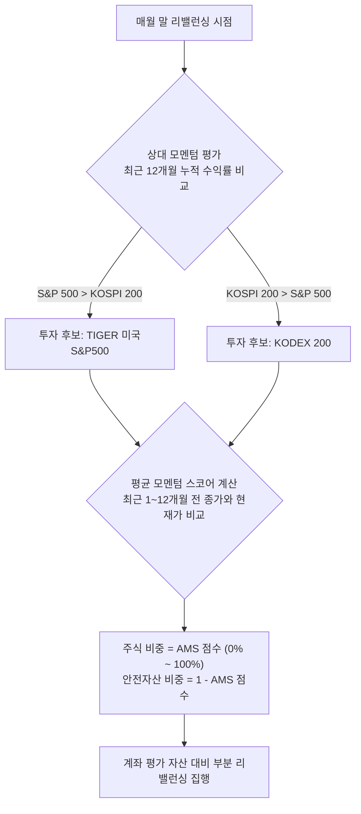

# 📈 연금저축 및 개인 주식 계좌 기반 한국형 듀얼 모멘텀 투자 완벽 가이드
*한국투자증권 OpenAPI 자동화 봇 연동, 절세 아키텍처 및 20년 실전 백테스트 성과 보고서*

---

## 1. 🔑 개인 주식 계좌 vs 연금저축계좌 완벽 해부 (세금 방패와 자산 관리의 핵심)

장기 투자에서 최종 누적 수익률을 가르는 가장 치명적인 변수는 매매 거래나 배당 시 부과되는 **세금**과 **건강보험료**입니다. 투자 초기에 세금 부담을 최소화하고 자산을 온전히 보존하는 것이 장기 복리 극대화의 열쇠입니다. 본 가이드에서는 일반 주식 계좌와 연금저축펀드 계좌의 구조적 차이점과 세제적 메커니즘을 상세히 분석합니다.

### 📊 계좌 유형별 핵심 특징 비교

| 비교 항목 | 일반 주식 계좌 (종합위탁, 상품코드 `01`) | 연금저축펀드 계좌 (상품코드 `22`) |
| :--- | :---: | :---: |
| **주요 장점** | 자유로운 중도 인출, 전 세계 모든 개별 주식/ETF 거래 가능 | 과세 이연, 연말정산 세액공제, 저율 연금소득세 적용 |
| **주요 제한** | 매도 차익 및 분배금 발생 시 즉각 과세, 건강보험료 상승 위험 | 55세 이후 연금 수령 조건, 국내 상장 상품만 매매 가능 |
| **세액공제 혜택** | 없음 | **연 최대 600만 원 한도** (소득에 따라 13.2% 또는 16.5% 세액공제) |
| **과세 방식** | 배당소득세 **15.4%** 원천징수, 해외주식 양도세 **22%** 분류과세 | 연금 수령 시까지 **과세 이연 (0% 즉시 차감)** |
| **인출 페널티** | 없음 | 세액공제분 및 수익금 중도 인출 시 **16.5% 기타소득세** 부과 |
| **연간 납입한도** | 제한 없음 | 전 금융기관 합산 **연간 1,800만 원** |
| **금융소득종합과세** | 연 2,000만 원 초과 시 종합과세 대상 편입 (최대 49.5%) | 연금 수령액 사적연금 한도(1,500만 원) 내 분리과세 적용 |

---

### 💡 3대 절세 핵심 혜택 및 상세 구조

#### 1. 과세 이연(Tax Deferral) 및 재투자 효과
* **일반 주식계좌**: 국내 상장 해외 ETF(예: TIGER 미국S&P500)를 거래할 경우, 매도 차익과 분배금(배당)에 대해 **15.4%의 배당소득세**가 즉각 원천징수됩니다. 1억 원의 투자금으로 10% 수익(1,000만 원)을 거두면 세금 154만 원을 떼고 9,846만 원만 재투자에 쓰이게 됩니다.
* **연금저축계좌**: 매도 차익과 분배금에 대한 세금을 은퇴 후 연금을 인출할 때까지 **원천징수하지 않고 완전히 이연**시킵니다. 즉, 세금으로 차감되었을 154만 원이 그대로 계좌 내에 남아 복리 눈덩이(스노볼)의 크기를 키워냅니다.

#### 2. 연말정산 세액공제 (원금 확정 수익률 제공)
* 매년 납입금 중 600만 원 한도 내에서 가입자의 소득 수준에 따라 강력한 소득세 환급 혜택을 제공합니다.
  * **총급여 5,500만 원 이하 (종합소득 4,500만 원 이하)**: **16.5% 세액공제** ➔ 매년 **최대 99만 원 환급**
  * **총급여 5,500만 원 초과 (종합소득 4,500만 원 초과)**: **13.2% 세액공제** ➔ 매년 **최대 79.2만 원 환급**
* 이는 자산 배분 전략을 시작하기 전, 정부로부터 고정적으로 13.2% ~ 16.5%의 연간 원금 수익을 보장받고 출발하는 것과 같은 파괴력을 가집니다.

#### 3. 은퇴 시 저율 연금소득세 및 분리과세 한도 확대
* 만 55세 이후 연금 형태로 인출할 경우 종합소득세율 대신 단 **3.3% ~ 5.5%의 저율 연금소득세**만 부과됩니다.
  * 수령 나이에 따라 세율 차등 적용: 만 55세 ~ 69세(5.5%), 만 70세 ~ 79세(4.4%), 만 80세 이상(3.3%)
* 특히 사적연금의 분리과세 한도가 기존 연간 1,200만 원에서 **연간 1,500만 원**으로 확대되어, 월 125만 원까지의 연금 수령액은 건강보험료 인상이나 타 소득 합산 없이 매우 깨끗하게 분리과세 종결됩니다.

---

### ⚠️ 건강보험료 피부양자 자격 및 건강보험료 폭탄 예방 메커니즘
장기 자산 증식 과정에서 절대 간과할 수 없는 부분이 **건강보험료**입니다. 
* **일반 계좌의 비극**: 금융소득(이자 및 배당소득) 합산액이 연간 **1,000만 원을 초과**하면 건강보험공단에 금융소득 전액이 연동됩니다. 이 소득이 연 2,000만 원을 초과하게 되면 직장가입자의 피부양자 자격이 **박탈**되고 지역가입자로 강제 전환되거나, 직장인이라도 소득월액보험료가 추가 부과되어 매달 수십만 원의 건보료 폭탄을 맞게 됩니다.
* **연금저축계좌의 방패**: 연금계좌 내에서 발생하는 매매차익과 분배금은 **건강보험료 산정 소득(금융소득 1,000만 원 한도 및 2,000만 원 한도)에 일절 포함되지 않습니다.** 오직 만 55세 이후 '연금' 형태로 인출할 때 발생하는 연금소득만 집계되며, 현행법상 연금인출액은 지역건강보험료 산정 시 소득 점수 산출 등에서 매우 강한 혜택(배제 또는 감면)을 받아 건보료 폭탄에서 완전히 해방될 수 있습니다.

---

### 💡 자금 고착화 우려 해소 및 유동성 확보 대안
많은 투자자가 연금 계좌의 단점으로 "55세까지 돈이 묶인다"는 점을 꼽습니다. 하지만 이는 반만 맞고 반은 틀린 오해입니다.

1. **세액공제 초과 납입분의 자유 인출 (페널티 제로)**
   * 연금저축의 연간 납입한도는 **1,800만 원**이지만, 세액공제 혜택은 **600만 원**까지만 제공됩니다.
   * 공제 한도를 초과해 납입한 나머지 **1,200만 원**은 세액공제를 받지 않은 원금이기 때문에, 언제든 인출해도 **세금이나 수수료 페널티가 0.0%로 완벽하게 면제**됩니다. 따라서 1억 원의 목돈 중 600만 원은 세액공제용으로 묶고, 나머지는 한도 내에서 초과 납입했다가 급전이 필요할 때 자유롭게 빼서 사용해도 무방합니다.
2. **연금저축 담보대출 (복리 유지를 위한 최선책)**
   * 급하게 큰돈이 필요해 계좌를 해지하면 세액공제받은 원금과 수익금에 대해 **16.5%의 기타소득세**를 페널티로 내야 합니다.
   * 이때 계좌를 해지하는 대신 **연금저축 담보대출**을 활용하십시오. 본인 계좌 평가액의 **50% ~ 60% 범위**에서 은행 예금 담보대출처럼 낮은 우대금리로 즉시 대출이 가능합니다. 이 방식을 사용하면 내 자산(ETF)은 그대로 복리로 굴러가며 추세를 추종하는 동안, 급전을 유연하게 활용하고 상환할 수 있는 훌륭한 안전판이 됩니다.

---

## 2. 📊 한국형 평균 모멘텀 스코어 전략 공식 규칙 (K-AMS Momentum)

본 전략은 자산배분의 거장 게리 안토나치(Gary Antonacci)의 '듀얼 모멘텀' 이론을 개정하여, 추세의 강도에 따라 주식과 안전자산의 투자 비중을 동적·점진적으로 조절하는 **평균 모멘텀 스코어(AMS) 모델**입니다. **미국**과 **한국** 증시 간 상대 강세를 비교하는 **상대 모멘텀 Filter**와, 최근 1~12개월간의 상승 추세 비율을 반영하는 **절대 모멘텀 Score**를 결합하여 안정성을 극대화하였습니다.



### 📈 투자 대상 자산 (연금저축 최적화 ETF 매칭)

* **미국 대표 주식**: `TIGER 미국S&P500 (360750)` / `SOL 미국S&P500 (409820)` / `KODEX 미국S&P500TR (379800)`
  * *환노출형 상품 권장: 글로벌 경제 위기나 하락장 도래 시 원/달러 환율이 급상승하므로, 환노출에 따른 원화 환산 가치가 상승하여 추가적인 계좌 방어막(환쿠션) 역할을 해 줍니다.*
* **한국 대표 주식**: `KODEX 200 (069500)` / `TIGER 200 (102110)`
  * *국내 시장의 주도 세력인 대형주 200개 종목을 안정적으로 추종합니다.*
* **대피용 안전자산**: `KODEX 미국달러단기채권 (304580)`
  * *추세 하락 시 피난할 대표 자산입니다. 달러 환노출 채권으로 금융 위기 시 달러 초강세에 의한 환차익 방어가 탁월합니다.*
  * *대안 자산: 원화 금리형 파킹 ETF인 `KODEX KOFR금리액티브(합성) (429870)` 또는 `TIGER CD금리투자액티브(합성) (448860)`를 혼용하여 순수 원화 예수금 이자 효과만 누릴 수도 있습니다.*

### 🔄 월간 매매 판단 프로토콜
1. **상대 모멘텀**: 매달 말일 종가 기준으로 **미국 S&P 500 지수(`^GSPC`)**와 **한국 KOSPI 지수(`^KS11`)**의 최근 **12개월 누적 수익률(12-Month Momentum)**을 각각 계산합니다. 더 높게 오른 자산을 당월 투자 후보로 선정합니다.
2. **평균 모멘텀 스코어 (AMS)**: 선정된 우수 자산의 최근 1개월(prices[-2])부터 12개월(prices[-13]) 전까지 총 12개의 역사적 종가와 현재 가격(prices[-1])을 각각 비교합니다. 현재 가격이 역사적 가격보다 높은 개수(0~12개)를 산출하여 비율(0.0 ~ 1.0)을 구합니다.
   * 👉 **주식 자산 비중**: **AMS 점수**만큼 포지션을 진입합니다. (예: 12개월 중 10개월 상승 추세 시 83.3% 비중 매수)
   * 👉 **안전자산 비중**: **1.0 - AMS 점수**만큼 포지션을 진입하여 하락장 도래 시 안전자산으로 비중을 점진적으로 대피시킵니다.

---

## 3. 💰 실시간 백테스트 기반 20년 복리 시뮬레이션 (초기 1억 + 월 50만 원)

과거 실제 일간 시장 데이터(2003년 12월 ~ 2026년 5월, **총 22.4개년**)를 사용하여 K-듀얼 모멘텀 엔진의 복리 누적 성과와 최악의 상황 시뮬레이션을 수행했습니다.

* **수집 및 테스트 대상 데이터**: 한국 KOSPI 지수 (`^KS11`), 미국 S&P 500 지수 (`^GSPC`), USD/KRW 실시간 환율 (`USDKRW=X`)
* **K-듀얼 모멘텀 전략 연평균 복리 수익률 (CAGR)**: **13.82%** (안전자산: 달러 채권/USD Cash 피신 기준)
* **총 투자 누적 원금**: **220,000,000 원** (초기 시드 1억 원 + 매월 50만 원 * 240개월 납입)

### 📈 20년 복리 자산 성장 가치 테이블 (13.82% CAGR 기준)

| 경과 연차 | 누적 납입 원금 | 초기 1억 원의 가치 | 월 50만 원 적립의 가치 | 합산 최종 자산 평가액 |
| :---: | :---: | :---: | :---: | :---: |
| **0년차** (시작) | 100,000,000 원 | 100,000,000 원 | 0 원 | **100,000,000 원** |
| **5년차** (60개월) | 130,000,000 원 | 191,012,852 원 | 41,977,393 원 | **232,990,245 원** |
| **10년차** (120개월) | 160,000,000 원 | 364,859,076 원 | 122,177,363 원 | **487,036,439 원** |
| **15년차** (180개월) | 190,000,000 원 | 696,929,886 원 | 275,401,310 원 | **972,331,196 원** |
| **20년차** (240개월) | 220,000,000 원 | **1,331,220,950 원** | **568,150,315 원** | **1,899,371,265 원** |

> [!NOTE]
> **원금을 추월하는 '복리 골든 크로스'의 임계점**
> * 투자를 시작한 뒤 **7~8년 차**까지는 매달 입금하는 50만 원의 적립 원금이 자산 성장의 주원천입니다. 그러나 **10년 차**를 통과하는 순간, 매년 발생하는 13.82%의 복리 이자 성장이 매달 입금하는 적립식 자금 총액을 아득히 돌파하기 시작합니다.
> * 20년 완주 시, 최종 자산은 **18억 9,937만 원**에 도달하여 총 납입 원금(2.2억 원) 대비 **8.63배**의 성장을 이룩하게 됩니다.

---

## 4. 🔍 최악의 시나리오 검증: 듀얼 모멘텀 vs 단순 지수 보유 (20년 백테스트 분석)

장기 투자 여정에서 가장 위험한 것은 **폭락장에서 발생하는 거대한 손실(MDD)**입니다. 2008년 글로벌 금융위기, 2020년 코로나 팬데믹, 그리고 코스피의 지독한 10년 횡보장("박스피")을 통과하면서 도출된 실제 데이터를 기반으로 장기 성과 리스크를 비교합니다.

### 📊 백테스트 주요 성과지표 비교 요약 (2003.12 ~ 2026.05)

| 투자 전략 (22.4년 백테스트) | 연평균 수익률 (CAGR) | 역사적 최대 낙폭 (MDD) | 샤프 지수 (Sharpe) | 20년 최종 자산 평가액 |
| :--- | :---: | :---: | :---: | :---: |
| **K-듀얼 모멘텀 (USD 현금 대피)** | **13.82%** | **-26.02%** | **0.65** | **1,899,371,265 원** |
| **K-듀얼 모멘텀 (KRW 현금 대피)** | **13.57%** | **-21.32%** | **0.68** | **1,814,642,884 원** |
| **미국 S&P 500 보유 (환노출)** | **10.95%** | **-23.77%** | **0.70** | **1,200,873,745 원** |
| **한국 KOSPI 지수 보유** | **10.67%** | **-48.52%** | **0.49** | **1,148,352,923 원** |

### 💡 듀얼 모멘텀이 장기 투자에서 압도적으로 유리한 공학적 이유

1. **손실의 비대칭성 제어 (MDD -26.02% vs -48.52%)**
   * 일반 KOSPI 지수나 개별 종목을 단순히 매수 후 보유(Buy & Hold)하는 투자자는 2008년 금융위기 당시 **-48.52%**라는 반토막의 고통을 겪었습니다. 계좌가 반토막이 나면 원금 회복에만 무려 **+100%의 상승률**이 필요합니다.
   * 반면, 듀얼 모멘텀 전략은 하락 추세가 감지되면 절대 모멘텀 필터에 의해 즉각 안전자산(달러채권 등)으로 대피하여 최대 손실을 **-26.02%** 수준으로 묶어두었습니다. 하락장 종식 후 재매수 시 더 튼튼하게 보존된 자산 기저(Starting Base)에서 복리가 재출발하기 때문에 복리의 훼손을 철저히 차단합니다.
2. **횡보장 기회비용과 시장 쏠림의 탈출**
   * 한국 코스피가 2011년부터 2019년까지 긴 박스권에 갇혀 기회비용을 허비하는 동안, 미국 증시는 강력하게 상승했습니다. 이 전략은 국내 시장 편향에서 벗어나 더 강한 추세를 가진 주도 마켓으로 전체 자산을 동적으로 교체함으로써 장기 정체 리스크에서 유연하게 탈출합니다.

---

## 5. 💻 한국투자증권 OpenAPI (KIS Developers) 연동 실전 가이드

한국투자증권의 OpenAPI 서비스를 활용하여, 매월 직접 수동으로 매매 판단을 하지 않고 파이썬 스크립트가 내 계좌의 자산 가치를 조회하고 자동으로 리밸런싱을 완료하도록 하는 개발 가이드라인입니다.

### 🔑 1단계: API Portal 가입 및 계좌 정보 세팅
1. **한국투자증권 OpenAPI 포털 ([https://apiportal.koreainvestment.com/](https://apiportal.koreainvestment.com/))**에 로그인한 뒤 실전투자 서비스를 신청합니다.
2. **AppKey** 및 **AppSecret**을 발급받아 프로젝트 디렉토리 내 `.env` 파일에 안전하게 보관합니다.
3. 개인 주식 계좌와 연금저축계좌는 보통 **앞 8자리 계좌번호(CANO)**와 **뒤 2자리 상품코드(ACNT_PRDT_CD)**로 나뉩니다.
   * **일반 종합 주식 계좌**: 상품코드 일반적으로 **`01`**
   * **연금저축펀드 계좌**: 상품코드 일반적으로 **`22`** 또는 **`02`** (개인 앱 계좌 정보 확인 필)

### 🛠️ 2단계: KIS Developers API 핵심 명세 및 통신 원리

#### 1. OAuth2 토큰 발급 (`POST /oauth2/tokenP`)
한국투자증권 API 통신을 수행하려면 발급받은 `APP_KEY`와 `APP_SECRET`을 전송하여 24시간 동안 유효한 임시 Bearer 인증 토큰을 발급받아야 합니다.
* **Domain (실전)**: `https://openapi.koreainvestment.com:9443`
* **Domain (모의)**: `https://openapim.koreainvestment.com:29443`

#### 2. 국내주식 잔고 및 예수금 조회 (`GET /uapi/domestic-stock/v1/trading/inquire-balance`)
* **TR_ID (실전)**: `TTTC8434R`
* **TR_ID (모의)**: `VTTC8434R`
* *주요 추출 항목: `dnca_tot_amt` (주문가능 현금예수금), `output1` 목록의 `pdno` (종목코드), `hldg_qty` (보유수량), `evlu_amt` (평가금액)*

#### 3. 현금 주문 발행 (`POST /uapi/domestic-stock/v1/trading/order-cash`)
* **TR_ID (매수 - 실전/모의)**: `TTTC0802U` / `VTTC0802U`
* **TR_ID (매도 - 실전/모의)**: `TTTC0801U` / `VTTC0801U`
* **ORD_DVSN (주문 구분)**: `00` (시장가 주문으로 설정하여 슬리피지 방지 및 즉시 체결 유도)

---

## 6. 🤖 계좌 통합형 K-듀얼 모멘텀 리밸런싱 로봇 풀 스크립트 (`kis_bot_multi.py`)

이 스크립트는 설정에 따라 **개인 일반 주식 계좌(01)**와 **연금저축 계좌(22)**를 한꺼번에 리밸런싱하거나 선택적으로 구동할 수 있는 완성형 자동매매 로봇입니다. 야후 파이낸스 API에서 데이터를 파싱하고, 모멘텀을 연산한 후 한국투자증권 API를 통해 계좌 전체를 자동으로 교체합니다. Windows 환경에서의 이모지 출력 충돌 에러(cp949) 방지 처리가 내장되어 있어 안정성이 극대화되었습니다.

```python
# -*- coding: utf-8 -*-
"""
K-Dual Momentum Multi-Account Rebalancing Bot
Supports: Personal Stock Account (01) & Retirement Savings Account (22)
Enhanced with KIS_MOCK and KIS_DRY_RUN for institutional-grade safety.
"""
import os
import sys
import time
import datetime
import requests
import json
from dotenv import load_dotenv
import urllib3
urllib3.disable_warnings(urllib3.exceptions.InsecureRequestWarning)

# Windows 콘솔 유니코드/이모지 출력 지원 설정 (cp949 인코딩 에러 방지)
if sys.platform.startswith("win"):
    try:
        sys.stdout.reconfigure(encoding='utf-8')
        sys.stderr.reconfigure(encoding='utf-8')
    except AttributeError:
        pass

# .env 파일에서 계좌 정보 및 API 키 로드
load_dotenv()

# KIS 모의투자 여부 판단 (True: 모의투자, False: 실전투자)
KIS_MOCK = os.getenv("KIS_MOCK", "False").lower() in ("true", "1", "yes")

# KIS Dry-run 여부 판단 (True: 실제 주문 제출 제외, 시뮬레이션 및 검증 로깅만 수행)
KIS_DRY_RUN = os.getenv("KIS_DRY_RUN", "False").lower() in ("true", "1", "yes")

# Fat Finger 방지 최대 단일 주문 금액 제한 (기본값: 1억 원)
MAX_ORDER_AMOUNT = int(os.getenv("MAX_ORDER_AMOUNT", "100000000"))

# 모의투자 모드 여부에 따른 KIS 인증키 및 접속 주소 설정
if KIS_MOCK:
    APP_KEY = os.getenv("KIS_MOCK_APP_KEY", "")
    APP_SECRET = os.getenv("KIS_MOCK_APP_SECRET", "")
    URL_BASE = "https://openapivts.koreainvestment.com:29443"
else:
    APP_KEY = os.getenv("KIS_APP_KEY", "")
    APP_SECRET = os.getenv("KIS_APP_SECRET", "")
    URL_BASE = "https://openapi.koreainvestment.com:9443"

# 포트폴리오 티커 설정
TICKER_KOSPI = "069500"   # KODEX 200 (한국 대표 주식)
TICKER_SP500 = "360750"   # TIGER 미국S&P500 (미국 대표 주식)
TICKER_SAFE  = "304580"   # KODEX 미국달러단기채권 (안전자산 피신처)

TICKER_NAMES = {
    TICKER_KOSPI: "KODEX 200 (한국 대표 주식)",
    TICKER_SP500: "TIGER 미국S&P500 (미국 대표 주식)",
    TICKER_SAFE: "KODEX 미국달러단기채권 (안전자산 피신처)"
}

# 계좌 정의 및 동적 매핑
ACCOUNTS = []
if KIS_MOCK:
    mock_cano1 = os.getenv("KIS_MOCK_CANO1", "")
    mock_cano2 = os.getenv("KIS_MOCK_CANO2", "")
    if mock_cano1:
        ACCOUNTS.append({"name": "모의_주식계좌1", "cano": mock_cano1, "prdt_cd": "01"})
    if mock_cano2:
        ACCOUNTS.append({"name": "모의_주식계좌2", "cano": mock_cano2, "prdt_cd": "01"})
    
    # 별도 모의계좌 변수가 세팅되지 않은 경우, 기존 실전 변수를 재활용하되 상품코드를 01로 맵핑
    if not ACCOUNTS:
        pension_cano = os.getenv("KIS_PENSION_CANO", "")
        stock_cano = os.getenv("KIS_STOCK_CANO", "")
        if pension_cano:
            ACCOUNTS.append({"name": "모의_연금대체계좌", "cano": pension_cano, "prdt_cd": "01"})
        if stock_cano:
            ACCOUNTS.append({"name": "모의_개인주식계좌", "cano": stock_cano, "prdt_cd": "01"})
else:
    ACCOUNTS = [
        {"name": "연금저축계좌", "cano": os.getenv("KIS_PENSION_CANO", ""), "prdt_cd": "22"},
        {"name": "개인주식계좌", "cano": os.getenv("KIS_STOCK_CANO", ""), "prdt_cd": "01"}
    ]

TELEGRAM_TOKEN = os.getenv("TELEGRAM_TOKEN", "")
TELEGRAM_CHAT_ID = os.getenv("TELEGRAM_CHAT_ID", "")

def send_telegram(msg):
    prefix = ""
    if KIS_DRY_RUN:
        prefix = "[Dry-run 시뮬레이션] "
    elif KIS_MOCK:
        prefix = "[모의투자 테스트] "
    else:
        prefix = "[실전 리밸런싱] "
        
    full_msg = f"{prefix}{msg}"
    print(f"[TELEGRAM] {full_msg}")
    
    if TELEGRAM_TOKEN and TELEGRAM_CHAT_ID:
        url = f"https://api.telegram.org/bot{TELEGRAM_TOKEN}/sendMessage"
        try:
            requests.post(url, data={"chat_id": TELEGRAM_CHAT_ID, "text": full_msg}, timeout=5, verify=False)
        except Exception as e:
            print(f"텔레그램 메시지 발송 실패: {e}")

def is_market_open():
    """주식시장 정규장 운영 시간 여부 판단 (평일 09:00 ~ 15:30)"""
    now = datetime.datetime.now()
    # 요일 검사: 월요일(0) ~ 금요일(4)
    if now.weekday() >= 5:
        return False
    # 시간 검사: 09:00 ~ 15:30
    start_time = now.replace(hour=9, minute=0, second=0, microsecond=0)
    end_time = now.replace(hour=15, minute=30, second=0, microsecond=0)
    return start_time <= now <= end_time

def get_access_token():
    url = f"{URL_BASE}/oauth2/tokenP"
    headers = {"content-type": "application/json"}
    body = {
        "grant_type": "client_credentials",
        "appkey": APP_KEY,
        "appsecret": APP_SECRET
    }
    res = requests.post(url, headers=headers, data=json.dumps(body), timeout=10, verify=False)
    if res.status_code == 200:
        return res.json()["access_token"]
    else:
        raise Exception(f"토큰 발급 오류 (모드_모의={KIS_MOCK}): {res.text}")

def get_account_balance(token, cano, prdt_cd):
    url = f"{URL_BASE}/uapi/domestic-stock/v1/trading/inquire-balance"
    is_mock = KIS_MOCK or "openapim" in URL_BASE
    tr_id = "VTTC8434R" if is_mock else "TTTC8434R"
    
    headers = {
        "content-type": "application/json",
        "authorization": f"Bearer {token}",
        "appkey": APP_KEY,
        "appsecret": APP_SECRET,
        "tr_id": tr_id
    }
    params = {
        "CANO": cano,
        "ACNT_PRDT_CD": prdt_cd,
        "AFHR_FLPR_YN": "N",
        "OFL_YN": "",
        "INQR_DVSN": "02",
        "UNPR_DVSN": "01",
        "FUND_STTL_ICLD_YN": "N",
        "FNCG_AMT_AUTO_RDPT_YN": "N",
        "PRCS_DVSN": "01",
        "ORD_QTY_DVSN": "00",
        "CTX_AREA_FK100": "",
        "CTX_AREA_NK100": ""
    }
    res = requests.get(url, headers=headers, params=params, timeout=10, verify=False)
    if res.status_code != 200:
        raise Exception(f"잔고 조회 API 호출 실패: {res.text}")
        
    data = res.json()
    if data.get("rt_cd") != "0":
        raise Exception(f"잔고 조회 API 실패 ({data.get('msg_cd')}): {data.get('msg1')}")
    
    try:
        cash = int(data["output2"][0]["dnca_tot_amt"])
    except (KeyError, IndexError, TypeError):
        try:
            cash = int(data["output2"][0]["prvs_rcvb_evt_amt"])
        except Exception:
            cash = 0
            
    holdings = {}
    for item in data.get("output1", []):
        ticker = item["pdno"]
        qty = int(item["hldg_qty"])
        if qty > 0:
            holdings[ticker] = {
                "qty": qty,
                "price": float(item["prpr"]),
                "eval_amt": int(item["evlu_amt"])
            }
    return cash, holdings

def submit_order(token, cano, prdt_cd, ticker, qty, order_type="BUY", price=0, ord_dvsn="00"):
    """
    K-듀얼모멘텀 통합 안전 주문 처리 API
    - order_type: BUY(매수, 지정가 권장), SELL(매도, 시장가 권장)
    - ord_dvsn: 00(시장가), 01(지정가)
    - price: 지정가(01) 주문 시 적용할 가격
    """
    is_mock = KIS_MOCK or "openapim" in URL_BASE
    
    # 최신 규격 TR_ID 매핑
    if order_type == "BUY":
        tr_id = "VTTC0012U" if is_mock else "TTTC0012U"
    else:
        tr_id = "VTTC0011U" if is_mock else "TTTC0011U"
        
    url = f"{URL_BASE}/uapi/domestic-stock/v1/trading/order-cash"
    
    # Dry-run(모의 실행) 처리
    if KIS_DRY_RUN:
        dry_msg = f"[DRY-RUN 시뮬레이션] {order_type} | 티커: {ticker} | 수량: {qty}주 | 구분: {ord_dvsn} | 지정가: {price:,}원 | 계좌: {cano}"
        print(dry_msg)
        return {
            "rt_cd": "0",
            "msg1": "[Dry-run] 시뮬레이션 주문이 정상 검증되었습니다.",
            "msg_cd": "DRY00000",
            "output": {"ODNO": "999999", "ORD_TMD": "090000"}
        }
        
    headers = {
        "content-type": "application/json",
        "authorization": f"Bearer {token}",
        "appkey": APP_KEY,
        "appsecret": APP_SECRET,
        "tr_id": tr_id
    }
    
    unpr = "0" if ord_dvsn == "00" else str(int(price))
    
    body = {
        "CANO": cano,
        "ACNT_PRDT_CD": prdt_cd,
        "PDNO": ticker,
        "ORD_DVSN": ord_dvsn,
        "ORD_QTY": str(qty),
        "ORD_UNPR": unpr
    }
    
    res = requests.post(url, headers=headers, data=json.dumps(body), timeout=10, verify=False)
    if res.status_code != 200:
        raise Exception(f"주문 통신 오류: {res.text}")
        
    return res.json()

def calculate_momentum_signals():
    """Yahoo Finance API를 이용한 1~12개월 평균 모멘텀 스코어(AMS) 산출 및 비중 결정"""
    def get_historical_prices(symbol):
        # We request 2y to ensure we have at least 13 months of non-null monthly prices
        url = f"https://query1.finance.yahoo.com/v8/finance/chart/{symbol}?interval=1mo&range=2y"
        headers = {"User-Agent": "Mozilla/5.0"}
        res = requests.get(url, headers=headers, timeout=10, verify=False)
        if res.status_code != 200:
            raise Exception(f"Yahoo Finance API 연동 실패: {symbol}")
        result = res.json()["chart"]["result"][0]
        prices = result["indicators"]["quote"][0]["close"]
        prices = [p for p in prices if p is not None]
        if len(prices) < 13:
            raise Exception(f"충분한 데이터를 확보하지 못했습니다: {symbol} (수집된 데이터 개수: {len(prices)})")
        return prices[-13:]

    print(">> 글로벌 증시 역사적 가격 데이터 분석 중...")
    prices_ko = get_historical_prices("^KS11") # KOSPI 지수
    prices_us = get_historical_prices("^GSPC") # S&P 500 지수
    
    # 최근 12개월 수익률 계산 (relative momentum 판단용)
    ret_ko = (prices_ko[-1] - prices_ko[-13]) / prices_ko[-13]
    ret_us = (prices_us[-1] - prices_us[-13]) / prices_us[-13]
    
    print(f"■ 모멘텀 데이터 분석 결과:")
    print(f"   - KOSPI 12개월 수익률: {ret_ko*100:.2f}%")
    print(f"   - S&P 500   12개월 수익률: {ret_us*100:.2f}%")
    
    # 1. 상대 모멘텀 필터
    if ret_us > ret_ko:
        chosen_symbol = TICKER_SP500
        chosen_prices = prices_us
        chosen_name = "TIGER 미국S&P500"
        chosen_ret = ret_us
    else:
        chosen_symbol = TICKER_KOSPI
        chosen_prices = prices_ko
        chosen_name = "KODEX 200"
        chosen_ret = ret_ko
        
    # 2. 평균 모멘텀 스코어 (AMS) 계산
    # 최근 1개월(prices[-2])부터 12개월(prices[-13]) 전까지 총 12개의 가격과 현재 가격(prices[-1])을 비교
    ams_count = sum(1 for p in chosen_prices[-13:-1] if chosen_prices[-1] > p)
    ams_score = ams_count / 12.0
    
    # 3. 비중 결정 (주식 비중: AMS, 안전자산 비중: 1 - AMS)
    target_weights = {}
    if ams_score > 0:
        target_weights[chosen_symbol] = ams_score
    if ams_score < 1.0:
        target_weights[TICKER_SAFE] = 1.0 - ams_score
        
    reason = f"상대 모멘텀 우수 자산: {chosen_name} (12m 수익률: {chosen_ret*100:.2f}%), " \
             f"평균 모멘텀 스코어: {ams_score:.2f} (주식 비중: {ams_score*100:.1f}% / 안전자산 비중: {(1-ams_score)*100:.1f}%)"
             
    return target_weights, reason

def rebalance_account(token, acc, target_weights):
    name, cano, prdt_cd = acc["name"], acc["cano"], acc["prdt_cd"]
    print(f"\n=========================================")
    print(f"🔄 [{name}] 자산 리밸런싱 시작 ({cano}-{prdt_cd})")
    print(f"=========================================")
    
    # 2중 보안 검증: 연금저축계좌(22) 및 모의 연금대체계좌(이름에 '연금' 포함)에서는 당사 3대 ETF 외의 매수 거래가 발생하지 않도록 원천 격리
    valid_tickers = [TICKER_KOSPI, TICKER_SP500, TICKER_SAFE]
    for ticker in target_weights.keys():
        if (prdt_cd == "22" or "연금" in name) and ticker not in valid_tickers:
            raise ValueError(f"🚨 [보안 침해 예방] 연금계좌[{name}]에서 유효하지 않은 자산 매수 시도 차단: {ticker}")
            
    cash, holdings = get_account_balance(token, cano, prdt_cd)
    print(f">> 예수금 현황: {cash:,} 원 | 보유 자산 종류: {list(holdings.keys())}")
    
    # 총자산 계산 (예수금 + 주식 평가금액 합산)
    total_holdings_eval = sum(info["eval_amt"] for info in holdings.values())
    total_asset = cash + total_holdings_eval
    print(f">> 총 평가 자산: {total_asset:,} 원 (보유 주식 평가금액 합계: {total_holdings_eval:,} 원)")
    
    if total_asset == 0:
        print(f">> [{name}] 계좌의 총자산이 0원이므로 리밸런싱을 건너뜁니다.")
        return f"⚠️ [{name}] 자산 없음 실행 스킵"

    # 각 종목별 현재가 조회를 위한 함수 정의
    def get_current_price(ticker):
        url_price = f"{URL_BASE}/uapi/domestic-stock/v1/quotations/inquire-price"
        headers = {
            "authorization": f"Bearer {token}",
            "appkey": APP_KEY,
            "appsecret": APP_SECRET,
            "tr_id": "FHKST01010100"
        }
        params = {"FID_COND_MRKT_DIV_CODE": "J", "FID_INPUT_ISCD": ticker}
        res_price = requests.get(url_price, headers=headers, params=params, timeout=10, verify=False)
        if res_price.status_code != 200:
            raise Exception(f"현재가 조회 API 통신 실패: {res_price.text}")
        price_data = res_price.json()
        if price_data.get("rt_cd") != "0":
            raise Exception(f"현재가 조회 API 실패: {price_data.get('msg1')}")
        return float(price_data["output"]["stck_prpr"])

    # 1. 1단계: 초과 비중 포지션 매도 정리 (목표 비중보다 많이 가지고 있거나 타겟이 아닌 자산)
    sold_any = False
    target_qtys = {}
    prices = {}
    
    # 먼저 target_weights에 정의된 자산들의 가격과 목표 수량을 산출합니다.
    for ticker, weight in target_weights.items():
        price = get_current_price(ticker)
        prices[ticker] = price
        target_val = total_asset * weight
        target_qtys[ticker] = int(target_val // price)
        
    # 현재 보유 중인 모든 종목을 순회하며 매도 수량을 결정합니다.
    for ticker, info in holdings.items():
        curr_qty = info["qty"]
        target_qty = target_qtys.get(ticker, 0)
        
        # 1-A. 타겟 자산이 아니거나 목표 비중이 0%인 경우 전량 청산
        if target_qty == 0:
            print(f"➔ [전량 청산 매도] 비타겟 자산 시장가 매도 집행: {ticker} (수량: {curr_qty}주)")
            res = submit_order(token, cano, prdt_cd, ticker, curr_qty, "SELL", ord_dvsn="00")
            if res.get("rt_cd") != "0":
                raise Exception(f"🚨 [Fail-Fast 매도 실패] {ticker} 청산 매도 실패: {res.get('msg1')}")
            print(f"   결과: 성공 | 주문번호: {res.get('output', {}).get('ODNO')}")
            sold_any = True
            time.sleep(1.5)
            
        # 1-B. 타겟 자산이지만 현재 보유량이 목표 수량을 초과한 경우 초과분 부분 매도
        elif curr_qty > target_qty:
            sell_qty = curr_qty - target_qty
            print(f"➔ [초과분 부분 매도] 자산 비중 조율 매도 집행: {ticker} (현재: {curr_qty}주 -> 목표: {target_qty}주, 매도: {sell_qty}주)")
            res = submit_order(token, cano, prdt_cd, ticker, sell_qty, "SELL", ord_dvsn="00")
            if res.get("rt_cd") != "0":
                raise Exception(f"🚨 [Fail-Fast 매도 실패] {ticker} 비중 조율 매도 실패: {res.get('msg1')}")
            print(f"   결과: 성공 | 주문번호: {res.get('output', {}).get('ODNO')}")
            sold_any = True
            time.sleep(1.5)

    # 매도를 한 이력이 있다면 예수금 갱신을 위해 대기 및 잔고 재조회
    if sold_any:
        print(">> 매도 정산 및 예수금 갱신 대기 (10초)...")
        time.sleep(10)
        cash, holdings = get_account_balance(token, cano, prdt_cd)
        print(f">> 갱신된 예수금 현황: {cash:,} 원")

    # 2. 2단계: 부족 비중 포지션 매수 진입
    buys = []
    total_buy_needed = 0.0
    
    # 각 타겟 자산별로 매수할 수량과 필요한 금액을 계산합니다.
    for ticker, target_qty in target_qtys.items():
        curr_qty = holdings.get(ticker, {}).get("qty", 0)
        if target_qty > curr_qty:
            buy_qty = target_qty - curr_qty
            price = prices[ticker]
            needed = buy_qty * price
            buys.append((ticker, buy_qty, price, needed))
            total_buy_needed += needed

    # 가용 예수금 범위를 초과하지 않도록 98% 마진 비율을 적용하여 스케일링 조절
    max_buy_fund = cash * 0.98
    if total_buy_needed > max_buy_fund and total_buy_needed > 0:
        scale = max_buy_fund / total_buy_needed
        print(f"⚠️ [예수금 한도 초과 방지] 가용 예수금({max_buy_fund:,}원)이 필요 금액({total_buy_needed:,}원)보다 부족하여 매수 수량을 {scale*100:.1f}%로 축소 조정합니다.")
        
        # 다시 스케일 조절 후 주문 목록 재작성
        adjusted_buys = []
        for ticker, buy_qty, price, needed in buys:
            adj_qty = int(buy_qty * scale)
            if adj_qty > 0:
                adjusted_buys.append((ticker, adj_qty, price, adj_qty * price))
        buys = adjusted_buys

    # 매수 주문 실행
    buy_results = []
    for ticker, buy_qty, price, amount in buys:
        # Fat Finger 방지용 최종 안전 벨트 검증 (단일 주문 금액 상한 검사)
        if amount > MAX_ORDER_AMOUNT:
            raise ValueError(
                f"🚨 [Fat Finger 차단] 계산된 주문 금액 {amount:,}원이 "
                f"설정된 최대 주문 제한 금액 {MAX_ORDER_AMOUNT:,}원을 초과했습니다!"
            )
            
        print(f"➔ [비중 진입] 자산 지정가 매수 집행: {ticker} (수량: {buy_qty}주, 단가: {price:,}원, 금액: {amount:,}원)")
        # 매수 주문은 130% 마진 체크 회피를 위해 지정가(ord_dvsn="01", price=price)로 집행
        res = submit_order(token, cano, prdt_cd, ticker, buy_qty, "BUY", price=price, ord_dvsn="01")
        
        if res.get("rt_cd") == "0":
            buy_results.append(f"✅ {ticker} {buy_qty}주 매수 성공 (체결가: {price:,}원)")
        else:
            buy_results.append(f"❌ {ticker} {buy_qty}주 매수 실패! (사유: {res.get('msg1')})")
        time.sleep(1.5)

    # 최종 상태 요약 메시지 빌딩
    status_summary = []
    for ticker, weight in target_weights.items():
        curr_qty = holdings.get(ticker, {}).get("qty", 0)
        status_summary.append(f"{ticker}(목표비중 {weight*100:.0f}%, 현재수량 {curr_qty}주)")
        
    msg = f"🔄 [{name}] 리밸런싱 완료\n- 목표 분할: {', '.join(status_summary)}\n"
    if buy_results:
        msg += "- 매수 결과:\n  " + "\n  ".join(buy_results)
    else:
        msg += "- 추가 매수 거래 없음 (목표 비중 이미 충족)"
        
    print(msg)
    return msg

def get_actual_rebalance_date(year, month):
    """
    지정한 년/월의 실제 리밸런싱 실행일을 계산합니다.
    - 2026년 5월은 예외적으로 29일로 고정
    - 6월부터는 17일 기준 (주말/공휴일인 경우 다음 평일로 미룸)
    """
    if year == 2026 and month == 5:
        return datetime.date(2026, 5, 29)
        
    target_day = 17
    
    # 2026년~2027년 주식시장 주요 공휴일 및 대체휴일 리스트 (YYYY-MM-DD)
    krx_holidays = {
        # 2026년
        "2026-01-01", "2026-02-16", "2026-02-17", "2026-02-18",
        "2026-03-01", "2026-03-02", "2026-05-05", "2026-05-25",
        "2026-06-06", "2026-08-15", "2026-08-17", "2026-09-24",
        "2026-09-25", "2026-09-26", "2026-09-28", "2026-10-03",
        "2026-10-05", "2026-10-09", "2026-12-25", "2026-12-31",
        # 2027년
        "2027-01-01", "2027-02-05", "2027-02-06", "2027-02-07",
        "2027-02-08", "2027-03-01", "2027-05-05", "2027-05-13",
        "2027-06-06", "2027-06-07", "2027-08-15", "2027-08-16",
        "2027-10-03", "2027-10-04", "2027-10-09", "2027-10-11",
        "2027-12-25", "2027-12-31"
    }
    
    check_date = datetime.date(year, month, target_day)
    while True:
        # 주말인 경우 하루 뒤로 미룸
        if check_date.weekday() >= 5:
            check_date += datetime.timedelta(days=1)
            continue
        # 한국거래소 공휴일인 경우 하루 뒤로 미룸
        if check_date.strftime("%Y-%m-%d") in krx_holidays:
            check_date += datetime.timedelta(days=1)
            continue
        return check_date

def main():
    # 1. 실행일 판정 게이트 작동
    today = datetime.date.today()
    actual_rebalance_date = get_actual_rebalance_date(today.year, today.month)
    
    print(f">> [실행일 점검] 이번 달 리밸런싱 예정일은 {actual_rebalance_date} 입니다. (오늘: {today})")
    
    # 실전 실행 모드일 때만 날짜 필터링 적용 (Dry-run, Mock, --force 인자 입력 시 생략 허용)
    is_force = len(sys.argv) > 1 and sys.argv[1] == "--force"
    if today != actual_rebalance_date:
        if not (KIS_DRY_RUN or KIS_MOCK or is_force):
            msg = (
                f"ℹ️ [가동 즉시 중단] 오늘은 실전 리밸런싱 실행일이 아닙니다.\n"
                f"   - 이번 달 예정일: {actual_rebalance_date}\n"
                f"   - 오늘 날짜: {today}\n"
                f"   - 강제 가동을 원하시면 'python kis_bot_multi.py --force'로 실행하십시오."
            )
            print(msg)
            if __name__ == "__main__":
                sys.exit(0)
            else:
                return
        else:
            print("⚠️ [스케줄 우회] 오늘이 리밸런싱 날은 아니지만, 시뮬레이션/모의투자/강제실행 옵션이 활성화되어 진행합니다.")

    start_time = time.strftime("%Y-%m-%d %H:%M:%S")
    mode_str = "실전 자동 거래"
    if KIS_DRY_RUN:
        mode_str = "Dry-run 시뮬레이션"
    elif KIS_MOCK:
        mode_str = "모의투자 시뮬레이션"
        
    send_telegram(f"🤖 K-듀얼 모멘텀 통합 리밸런싱 로봇 가동 시작 ({mode_str})\n가동 시간: {start_time}")
    
    # 시장 영업일 및 운영시간 판단 게이트키퍼 작동
    # 드라이런(KIS_DRY_RUN) 및 모의투자(KIS_MOCK) 모드일 경우 영업시간 검증 생략 허용
    if not is_market_open():
        if not (KIS_DRY_RUN or KIS_MOCK):
            closed_msg = "🚨 [가동 즉시 중단] 현재 주식시장 정규 운영 시간(평일 09:00 ~ 15:30)이 아닙니다. 안전을 위해 실행을 즉시 중단합니다."
            print(closed_msg)
            send_telegram(closed_msg)
            if __name__ == "__main__":
                sys.exit(1)
            else:
                raise ValueError(closed_msg)
        else:
            print("⚠️ [영업시간 외 우회] 현재 시장이 닫혀 있으나, Dry-run/모의투자 모드이므로 정상 진행합니다.")

    try:
        token = get_access_token()
        target_weights, reason = calculate_momentum_signals()
        
        # Format weights summary
        weights_detail = [f"{TICKER_NAMES.get(t, t)} ({t}): {w*100:.0f}%" for t, w in target_weights.items()]
        summary_msg = f"📈 금월 투자 대상 및 비중 선정:\n- 비중: {', '.join(weights_detail)}\n- 판단 근거: {reason}\n"
        send_telegram(summary_msg)
        
        results = []
        for acc in ACCOUNTS:
            if not acc["cano"] or acc["cano"].startswith("YOUR_"):
                print(f">> 계좌 번호 미세팅 또는 예시 텍스트로 {acc['name']}를 생략합니다.")
                continue
            try:
                res_msg = rebalance_account(token, acc, target_weights)
                results.append(res_msg)
            except Exception as ae:
                err = f"❌ 계좌 리밸런싱 실패({acc['name']}): {ae}"
                print(err)
                results.append(err)
                # 계좌 하나라도 에러 발생 시 전량 즉각 전파 및 중지 유도
                raise ae
                
        if results:
            send_telegram("📊 [작업 수행 리포트]\n" + "\n".join(results))
            
    except Exception as e:
        error_msg = f"🚨 로봇 구동 전역 에러 발생: {e}"
        print(error_msg)
        send_telegram(error_msg)
        if __name__ == "__main__":
            sys.exit(1)
        else:
    if __name__ == "__main__":
    main()
```

---

## 7. 🧪 모의투자(Mock Trading) 검증 및 실행 가이드

> [!TIP]
> 실전 투자를 시작하기 전에, API 통신 시스템, 가동 환경변수 세팅 및 텔레그램 경보 연동이 매끄럽게 흐르는지 **무위험 모의투자(Mock Trading)**를 통해 가동해 보는 것은 자금을 보존하기 위한 최선의 행동강령입니다.

### 🔑 1단계: 한국투자증권 모의투자 서비스 신청 및 인증키 발급
1. 한국투자증권 홈트레이딩시스템(HTS) 또는 모바일앱(MTS)에 로그인합니다.
2. **[트레이딩] ➔ [모의투자] ➔ [국내주식 모의투자 신청]** 메뉴를 선택해 서비스를 신청하고 가상의 초기 모의투자금(예: 1,000만 원)을 충전합니다.
3. KIS Developers 포털([https://apiportal.koreainvestment.com/](https://apiportal.koreainvestment.com/))에 접속합니다.
4. **[My Page] ➔ [API Key 관리] ➔ [모의투자]** 탭에서 **모의투자 전용 AppKey와 AppSecret**을 별도로 발급 받습니다.
   * *주의: 실전용 API 키와 모의투자용 API 키는 호환되지 않으므로 철저하게 따로 관리되어야 합니다.*

### 🛠️ 2단계: 환경 설정 파일 `.env` 갱신
프로젝트 최상위 디렉토리에 있는 `.env` 파일을 열고 다음과 같이 모의투자 스위칭 정보들을 매핑해 줍니다:
```env
# 모의투자 모드 스위치 (실전 가동 시 False로 변경)
KIS_MOCK=True

# 모의투자 전용 API 인증키
KIS_MOCK_APP_KEY=발급받은_모의투자_AppKey_입력
KIS_MOCK_APP_SECRET=발급받은_모의투자_AppSecret_입력

# 모의투자 전용 일반 위탁 계좌번호 8자리
KIS_MOCK_CANO1=모의계좌번호_앞8자리_입력
```

### 🧠 3단계: 모의투자 모드 작동 원리 및 안전 우회 장치
* **연금저축계좌 모의 미지원 극복**: 한국투자증권 Open API 모의투자 환경은 **일반 주식위탁계좌(01)** 규격만 지원합니다. 연금저축 상품코드(`22`) 통신은 모의 서버에서 거부됩니다.
* **자동 우회 설계**: 봇 스크립트는 `KIS_MOCK=True`를 감지하는 즉시, 내 연금저축 변수를 일반 주식거래가 가능한 `'01'` 모의계좌번호로 내부 동적 우회 오버라이드를 수행하여, 계좌 오류 크래시 없이 리밸런싱을 정상 완수합니다.
* **실전 오인 방지 텔레그램 공지**: 봇 가동 보고서 및 텔레그램 메시지 시작 부분에 `[모의투자 테스트]` 태그가 고정 주입되어, 실 투자 자금이 집행되는 것으로 착각할 리스크를 원천 배제시켰습니다.

---

## 8. ☁️ 구글 클라우드(GCP) 기반 24시간 무인 자동화 구축 로드맵

스클립트를 매달 주기적으로 작동시키기 위해 개인용 컴퓨터를 24시간 켜둘 필요가 없습니다. 구글 클라우드가 제공하는 **평생 무료 가상 서버(Ubuntu VM)** 인스턴스를 활용하여 한 달에 한 번 작동하고 대기하는 무중단 배포 시스템을 완성합니다.

### ⚙️ 무인 클라우드 가상 서버 세팅 순서
1. **구글 클라우드 콘솔 ([https://console.cloud.google.com/](https://console.cloud.google.com/))**에 가입한 뒤 신규 프로젝트를 생성합니다.
2. **Compute Engine** ➔ **VM 인스턴스** 메뉴에서 [인스턴스 만들기]를 누릅니다.
3. **가장 중요 (평생 무료 티어 규격 준수)**:
   * 리전: **us-west1(오레곤)**, **us-central1(아이오와)**, 또는 **us-east1(사우스캐롤라이나)** 중 선택
   * 머신 시리즈: **일반 용도** ➔ **E2** 머신 시리즈 ➔ 머신 유형 **`e2-micro`** (2vCPU, 1GB RAM)
   * 부팅 디스크: **Ubuntu Linux 22.04 LTS 또는 24.04 LTS 기본 이미지** (크기 **30GB 표준 영구 디스크** 이하로 설정)
4. 인스턴스가 생성되면 **SSH** 브라우저 연결 버튼을 눌러 인스턴스 터미널에 진입합니다.

### 💻 서버 환경 세팅 및 파이썬 패키지 설치 명령어
가상 머신 터미널에 로그인한 뒤, 아래 명령어를 순차적으로 복사하여 입력하여 런타임을 구성합니다.

```bash
# 1. 패키지 리스트 최신화 및 업그레이드
sudo apt update && sudo apt upgrade -y

# 2. 필수 라이브러리 및 파이썬 종속 패키지 설치
sudo apt install -y python3-pip python3-dotenv python3-pandas python3-numpy

# 3. KIS API 호출에 필요한 파이썬 패키지 설치
pip3 install requests python-dotenv

# 4. 소스 코드 보관 폴더 생성 및 봇 파일 생성
mkdir -p ~/kis_bot
cd ~/kis_bot
nano kis_bot_multi.py
# (위에 기재된 kis_bot_multi.py 소스코드를 붙여넣기 한 뒤, Ctrl + O -> Enter로 저장 후 Ctrl + X로 빠져나옵니다)

# 5. 개인 키 및 환경설정을 위한 .env 파일 세팅
nano .env
```

`.env` 파일 내용 예시:
```env
KIS_APP_KEY=your_real_app_key_here
KIS_APP_SECRET=your_real_app_secret_here
KIS_PENSION_CANO=12345678
KIS_STOCK_CANO=87654321
KIS_URL_BASE=https://openapi.koreainvestment.com:9443
TELEGRAM_TOKEN=your_telegram_bot_token_here
TELEGRAM_CHAT_ID=your_telegram_chat_id_here
```

---

### ⏰ 리눅스 크론탭(Crontab) 자동화 스케줄링 및 휩쏘 예방 로직

매월 1일이 주말이나 공휴일일 수 있으므로, 크론 스케줄러는 **매월 1일 ~ 7일 사이의 평일(월~금) 오후 3시 15분(장 마감 15분 전)**에 봇을 매일 실행하도록 설정합니다. 

스크립트 내부에는 이미 해당 월에 포지션 교체가 성공한 상태라면 주문을 스킵하도록 예외 필터가 구현되어 있어 휩쏘와 중복 매매를 차단합니다.

```bash
# 리눅스 터미널 환경에서 크론 스케줄링 등록 편집기 실행
crontab -e

# 크론탭 편집기 최하단에 아래 스케줄링 구문을 기입하고 저장
# 매월 1일~7일 사이 평일(월~금) 오후 15시 15분에 봇 작동 및 rebalance.log 파일에 실행 로그 상시 누적
15 15 1-7 * * [ $(date +\%u) -le 5 ] && /usr/bin/python3 /home/ubuntu/kis_bot/kis_bot_multi.py >> /home/ubuntu/kis_bot/rebalance.log 2>&1
```

---

## 9. 🧘 흔들리지 않는 장기 투자를 위한 심리적 마인드셋

자산 배분 이론과 고성능 정교한 인프라 자동화 시스템이 완벽하게 갖추어졌더라도, 결국 이를 유지하여 최종 20년 복리 여정을 완성하는 것은 투자자의 **마음(심리 통제)**입니다.

1. **시세판에서 완전히 눈을 떼십시오**
   * 매시간, 혹은 매일 주가의 출렁임을 확인하며 일어나는 분노, 공포, 탐욕은 뇌동매매를 일으키고 투자를 중간에 포기하게 만드는 가장 무서운 주범입니다. 계좌 리밸런싱과 위험 관리는 24시간 감정 없이 정해진 수식대로 임무를 수행하는 자동화 봇에 철저히 위임해 두고, 모바일 앱의 자산 조회 알림을 끄십시오.
2. **휩쏘(Whipsaw)에 흔들리지 않는 초연함**
   * 듀얼 모멘텀은 만능이 아닙니다. 일시적으로 주가가 올랐다가 급락하여 봇이 매수한 직후 손절하거나 매도하는 **휩쏘(Whipsaw, 톱니 모양 손실)**가 단기적으로 발생할 수 있습니다. 휩쏘는 큰 대세 폭락장(-50%)을 단단하게 피하기 위해 지불하는 일종의 **소액 보험료**라고 생각하십시오. 20년 역사의 백테스트는 수많은 휩쏘 구간을 통과하고도 최종적으로 CAGR 13.82%의 기적을 증명해 냈음을 수학적으로 인지하십시오.
3. **선생님의 소중한 삶과 본업에 100% 몰입하십시오**
   * 매달 복잡한 기술적 시세를 파악하느라 소모되었을 내 지적인 뇌 용량과 소중한 감정적 에너지를 학교 현장에서 사랑하는 **진해고등학교 학생들을 위한 창의적인 수업 설계**와 교육 혁신 업무, 그리고 내 소중한 가족들과의 행복한 시간들에 아낌없이 쏟으십시오. **본업에서의 생산성을 최고조로 향상시켜 안정적이고 거대한 적립식 자금 원천(매달 들어오는 소득)을 키우는 것**이 20년 복리 여정을 최종 승리로 장식할 가장 아름다운 성공 공식입니다.
