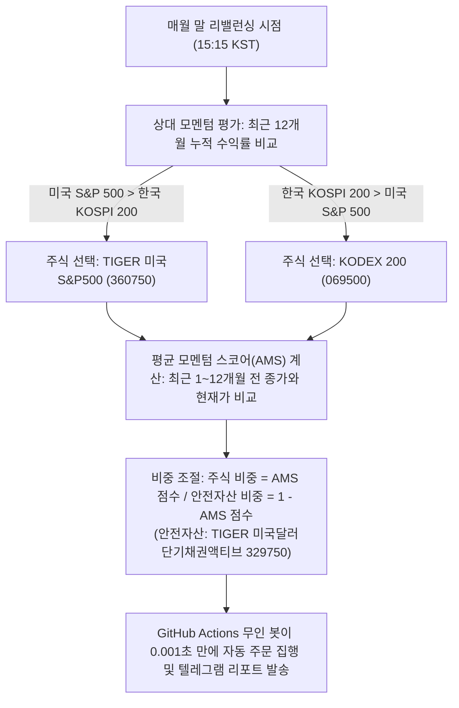

# 📘 시간과 노후를 지키는 주식 자동화 퀀트 투자
*현직 교사가 알려주는 연금저축 절세 아키텍처, K-듀얼 모멘텀 전략 및 한투 API 봇 원클릭 구축 가이드*

---

## 💌 프롤로그: 나의 감(感)을 믿었던 투자, 그리고 1,700만 원의 뼈아픈 손실

**저자 황요한 (현직 고등학교 교사 / 퀀트·AI 자동화 연구자)**

안녕하세요. 저는 경남 지역 교단에서 아이들을 가르치고 있는 현직 고등학교 교사 황요한입니다. 

지난 10년 동안 저는 매일을 루틴화된 삶으로 살아가며, 장기적으로 나 자신에게 도움이 되는 삶을 가꾸고자 노력해 왔습니다. 주식 시장과 매크로 경제를 공부하는 것 역시 그 삶의 루틴 중 커다란 한 축이었습니다. 수많은 경제 서적을 읽고 출퇴근길마다 경제 팟캐스트와 라디오를 들으며, 단순히 직관이나 감(感)에 빠지지 않고 경제 상황을 차분히 읽어가면서 시장의 방향성을 읽어낼 수 있으리라 생각했습니다.

그러나 10년의 공부와 노력이 무색하게, 실전 거래의 현실은 차가웠습니다.

저는 결코 맹목적으로 매수 버튼을 누르지 않았습니다. 투자하기 전, 해당 바이오 기업의 분기 실적 호조, 4공장(24만 리터)의 완전 풀 가동(Full Ramp-up), 5공장의 2025년 4월 조기 준공 및 가동률 가속화, 그리고 2026년 연내 6공장 조기 착공 허가 절차 착수 등 기업 호재를 정밀 검토했습니다. 특히 **미국의 '생물보안법(Biosecure Act)'** 시행으로 인해 글로벌 바이오 수주물량이 중국 기업을 벗어나 세계 최대 생산 역량을 갖춘 해당 기업으로 쏠릴 것이라는 정책적 방향성까지 보수적으로 예측했습니다. 심지어 최신 AI 도구인 **제미나이(Gemini)의 '딥 리서치(Deep Research)' 기능**까지 활용하여 최신 보고서를 심층 검증했고 스스로 강한 확신을 얻었습니다.

2026년 4월 21일, 저는 모든 분석을 마친 후 그 바이오 주식을 주당 1,588,000원에 총 51주(총 매수금액 8,098만 8,000원)를 매수했습니다. 하지만 시장은 인간의 치밀한 분석과 최첨단 AI의 딥 리서치마저 보란 듯이 비웃었습니다. 주가는 제 예측과 완전히 다르게 흘러갔고, 결국 6월 8일 주당 1,248,000원에 전량 매도하며 단 48일 만에 **정확히 1,734만 원의 손실(-21.4%)을 확정**지어야만 했습니다.

더욱 심각했던 것은 당시 시장 상황이었습니다. 제가 물려 있던 그 48일 동안, 삼성전자를 비롯한 시장의 대표 주도주들은 가파른 상승세를 타고 있었습니다. 시장 전체가 붉은빛으로 타오를 때 내 종목만 벼랑 끝으로 내몰리는 광경을 목도하는 것은 단순한 손실 이상의 **극심한 상대적 박탈감과 뼈아픈 심리적 타격**을 안겨주었습니다.

매수 버튼을 누른 순간부터 제 일상은 주식 앱(MTS)에 인질로 잡혔습니다. 쉬는 시간뿐만 아니라 수업 시간에도 틈틈이 휴대폰으로 MTS를 들여다보았습니다. 정성껏 수업을 준비하고 상담을 기다리는 아이들의 눈빛을 온전히 바라보지 못했습니다. 손실 과정에서 몰려온 극심한 심리적 타격과 스트레스는 교사로서의 사명감마저 흔들어 놓았습니다.


이 뼈아픈 실패를 계기로 저는 과거 2020년과 2021년에 공부했던 **'퀀트 자산배분 투자'**를 다시 깊이 성찰하게 되었습니다. 사실 당시에도 인간의 감정을 배제하고 투자할 수 있다는 퀀트의 원칙에는 큰 매력을 느꼈었습니다. 하지만 막상 실전 투자를 하려니 매달 최신 데이터를 받아 엑셀에 직접 입력하고, 투자금과 종목별 비율을 계산하여 수동으로 매수·매도 리밸런싱을 거치는 과정이 너무나 고되고 번거로워 결국 포기하고 말았었습니다. 

그러다 2025년 말 육아휴직 기간 동안 운명처럼 **구글 안티그래비티(Google Antigravity)**라는 최첨단 AI 에이전트 도구를 접하게 되었고, **2026년 6월 마침내 저만의 '투자 자동화 봇'을 완성**해 냈습니다. 매달 자료를 수집하고 계산하던 번거로운 노동마저 '0'으로 만들어버린 이 자동화 봇을 통해, 비로소 인간의 감정뿐만 아니라 육체적 노동까지 완벽히 제로로 만드는 진짜 대안을 찾아낸 것입니다.

이 책은 20년 뒤 턱없이 부족할지 모를 연금으로 인해 미래를 고민하는 분들, 그리고 안정적인 투자 성향을 지녔지만 인플레이션을 생각하면 은행 예금 금리만으로는 내 자산의 실질 가치가 오히려 줄어든다는 사실에 밤잠을 설치는 분들과 나누는 진솔한 고백이자 안내서입니다.

매일 주식 차트를 들여다보며 소모했던 그 소중한 에너지를 이제는 내 삶을 더 가치 있게 만들고, 본업과 사랑하는 사람들에게 집중하는 데 쓰기를 제안합니다. 노후의 보다 나은 삶과 현재 우리가 진정으로 집중해야 할 가치가 무엇인지 함께 고민해 보는 따뜻한 여정을 이제 시작해 봅시다.

---

## 1부. 🎓 교사의 제언: 시간과 노후를 지키는 투자

### 1.1 10년의 경제 공부도 무너뜨린 인간 심리: 1,734만 원 손실과 상대적 박탈감의 교훈

10년 동안 경제 서적을 읽고, 출퇴근길마다 경제 팟캐스트와 라디오를 들으며 쌓은 지식은 실전 장에서 아무런 방패가 되어주지 못했습니다. 개별 종목에 큰 돈이 투입되는 순간, 인간의 뇌는 차분한 이성을 잃고 공포와 조급함이라는 감정에 손쉽게 지배당하기 때문입니다.

* **치밀한 분석과 AI 딥 리서치의 한계:** 2026년 4월, 저는 해당 바이오 기업의 4공장(24만 리터) 완전 풀 가동(Full Ramp-up), 5공장의 2025년 4월 조기 준공 및 가동률 가속화, 2026년 연내 6공장 조기 착공 허가 절차 착수 소식 및 **미국의 '생물보안법(Biosecure Act)'** 시행으로 글로벌 바이오 수주물량이 중국 기업을 벗어나 세계 최대 생산 역량을 갖춘 해당 기업으로 쏠릴 것이라는 정책적 방향성까지 보수적으로 분석했습니다. 심지어 제미나이(Gemini)의 '딥 리서치' 기능으로 기업 가치를 심층 검증했습니다. 그러나 주당 1,588,000원에 51주(총 8,098만 원)를 매수한 직후, 주가는 보란 듯이 꺾여 내려갔습니다.
* **상대적 박탈감이라는 더 큰 고통:** 제가 물려 있던 48일 동안 시장은 삼성전자를 비롯한 대형 주도주들이 가파르게 폭등하던 대세 상승장이었습니다. 남들의 종목은 붉은 기둥을 세우며 환호할 때, 제 계좌만 파랗게 질려가는 광경을 보는 것은 1,734만 원(-21.4%)의 물질적 손실보다 몇 배나 더 뼈아픈 심리적 타격이었습니다.
* **예측의 오만함을 버리고 법칙으로:** 전문적인 도구와 막강한 정보망, 거대한 자본을 보유한 기관 및 전문가 집단이라면 기업의 상황과 미래 가치를 조금 더 명확하게 예측해낼 수 있을지도 모릅니다. 하지만 생업을 따로 가지고 있는 개인 투자자 입장에서 이들과 정면으로 정보 싸움을 벌이는 것은 도저히 승산이 없는 경쟁이었음을 뒤늦게 깨달았습니다. 감정과 직관에 얽매인 매매는 결국 실패로 수렴합니다.
* **'카지노 초심자의 행운'이 주는 경고:** 이 책을 읽는 독자 여러분이 저와 비슷한 일반 직장인이거나 교사라면, 감(感)과 운(運)에 의존하는 투자는 장기적으로 결코 성공할 수 없음을 명심해야 합니다. 이는 마치 **카지노에 처음 발을 들인 초심자가 운 좋게 잭팟을 터뜨리거나 돈을 땄을 때, 자신의 실력으로 착각하고 계속 판돈을 키우다가 결국 전 재산을 잃는 '초심자의 행운(Beginner's Luck)'**과 정확히 똑같습니다. 운에 기댄 단기 수익은 오만을 부르고, 그 오만은 반드시 거대한 통증으로 돌아옵니다. 결국 인간의 망설임과 감정을 완전히 차단한 **'규칙(Rule)' 기반의 퀀트 투자**만이 개인 투자자를 보호할 수 있는 유일한 방패입니다.

---

### 1.2 교사와 공무원의 재테크 강점: 한정된 시간, 일정한 현금흐름, 그리고 '시간'이라는 최고의 친구

교사와 공무원, 그리고 정년이 보장된 직장인은 퀀트 자산배분 투자에 있어 전 세계 그 누구보다 유리한 **'최고의 구조적 무기'**를 손에 쥐고 있습니다.

* **인정 욕구와 한정된 시간, 그리고 AI 자동화의 필연성:** 사실 교사와 공무원은 정년이 보장되어 있고 겸직 금지 의무가 있어, 자칫 일을 더 열심히 하려는 동기가 부족해 보이기 쉽습니다. 그러나 '직장에서 인정받고 싶은 욕구'는 인간의 가장 기본적인 본능입니다. 학교 현장에서 동료와 학생들에게 인정받으려면 업무 처리 역량을 획기적으로 높이거나, 남들보다 더 많은 시간을 쏟아부어야 합니다. 하지만 우리에게 주어진 '시간'이라는 자원은 한정되어 있으며, 무엇보다 우리에게는 **'가정'이라는 훨씬 더 소중한 공간**이 있습니다. 당시 **22개월 된 어린 아기**와 가족 곁에서 더 많은 시간을 보내기 위해, 시간 자원을 극도로 효율화해 주는 **'AI 기반 자동화'**는 선택이 아닌 필수였습니다.
* **매달 일정하게 유입되는 현금흐름 (Capital Inflow)의 막강함:** 교사와 공무원이라는 직업의 가장 큰 무기는 매달 정해진 날짜에 예측 가능한 월급과 수당이 끊임없이 들어온다는 점입니다. 무리한 영끌이나 주식 단타가 아니라 가계에 부담 없는 여유 자금으로만 적립식 투자를 집행하기 때문에, 세계적 경제 위기나 극심한 폭락장이 찾아와도 다른 직업군에 비해 **경기 침체를 견뎌낼 수 있는 버팀목과 생존 여력**이 훨씬 높습니다.
* **제도적 최후의 보루: 연금이 안겨주는 압도적 마인드 컨트롤:** 퇴직 후를 지켜줄 공무원/사학연금이라는 **'노후의 제도적 최후 보루(하방 안전판)'**는 퀀트 투자자의 심리를 지켜주는 최고의 방패막입니다. 은퇴 후 기본 생활의 하방이 다져져 있기에, 시장이 일시적인 폭락장으로 얼붙더라도 조급하게 주식을 던지거나 감정에 흔들리지 않습니다. 백테스트 데이터를 100% 신뢰하며 전략을 끝까지 밀고 나갈 수 있는 **압도적인 마음의 안정(Mind Control)**이 유지됩니다.
* **매뉴얼 중심의 직업적 본능과 퀀트(Quant)의 찰떡궁합:** 교사와 공무원은 규정과 매뉴얼, 교육과정에 따라 체계적으로 움직이는 것에 가장 익숙한 집단입니다. 시장의 소음과 공포에 휘둘려 충동적으로 매수·매도 단추를 누르는 대신, 사전에 정해둔 알고리즘과 리밸런싱 규칙을 철저히 준수하는 '원칙 중심의 태도'는 우리에게 가장 자연스럽게 부합하는 투자 방식입니다.
* **절세 계좌(연금저축/ISA)와 과세이연 복리의 마법:** 매달 들어오는 현금흐름을 연금저축이나 ISA 같은 절세 계좌라는 바구니에 담아 퀀트 자산배분을 실행할 때, 세액공제 환급금과 과세이연 복리 효과는 배가됩니다. 합법적인 절세 혜택을누리며 매달 기계적으로 자산을 배분하는 것, 이것이 시스템이 스스로 부를 키우게 만드는 핵심 메커니즘입니다.

> 💡 **황요한 저자의 메시지:**  
> "직장에서는 AI 자동화로 업무 효율을 극단까지 끌어올려 동료와 학생들에게 인정받고, 퇴근 후에는 사랑하는 아이와 가족 곁을 지키며, 자산은 퀀트 봇 시스템이 알아서 안전하게 굴려주는 삶. 이것이야말로 한정된 삶의 자원을 가장 가치 있게 활용하는 스마트한 교사이자 직장인의 지속 가능한 최고의 투자 모델입니다."

---

### 1.3 엑셀 수동 퀀트의 한계와 안티그래비티 '바이브 코딩'의 혁신

수동 퀀트 투자와 자동화 봇 투자의 차이는 단순한 편의성을 넘어섭니다. 그것은 **'지속하기에 다양한 현실적 어려움이 잇따랐던 과정'을 '완벽히 지속 가능한 무인 시스템'으로 바꾼 혁신**입니다. 

일반적으로 수동으로 퀀트 투자(계량 투자)를 집행하는 사람들은 크게 다음 세 가지 영역에서 현실적인 어려움과 장벽을 마주하게 됩니다.

#### 1. 데이터 수집과 엑셀 작업의 현실적 장벽 (손의 피로 - 수동 노동)
* **원시 데이터(Raw Data) 확보의 고충:** 2020~2021년 퀀트를 처음 접했을 때, 인베스팅닷컴 등 해외 금융 플랫폼에서 과거 주가 데이터(OHLCV)나 재무제표 데이터를 일일이 다운로드하는 것부터가 고역이었습니다. 플랫폼마다 데이터 포맷이 달라 이를 통일하고 정제하는 데 수많은 시간과 공이 들어갔습니다.
* **수식 하나만 틀려도 터지는 엑셀의 비명:** 다운로드한 데이터를 바탕으로 VLOOKUP, INDEX/MATCH, 배열 수식 등을 엑셀에 붙여 백테스팅 모델을 만들었지만, **수식 단 하나만 오기되어도 전체 백테스팅 결과가 완전히 오염**되는 치명적인 문제가 발생하곤 했습니다. 데이터양이 많아지면 엑셀이 멈춰버리는 현상(이른바 '엑셀의 비명') 속에서 극심한 피로감을 느꼈습니다.
* **유료 서비스 및 플랫폼의 비용 장벽:** 엑셀 작업의 한계를 극복하고 보다 편하게 퀀트를 수행하려면 젠포트(GenPort) 같은 전용 플랫폼이나 유료 데이터 서비스를 결제해야 하는 경우가 많았습니다. 본업이 있는 개인 투자자 입장에서 매달 지출되는 이러한 유료 플랫폼 구독 비용은 상당한 접근 장벽이자 부담으로 다가왔습니다.

#### 2. 정기 수동 매매와 추가 비용의 부담 (귀찮음 - 관리의 한계)
* **주기적 리밸런싱과 펀드 수수료 부담:** 퀀트 투자는 매월 혹은 매분기 정해진 날짜에 포트폴리오를 갱신(리밸런싱)해야 통계적 우위가 유지됩니다. 그러나 매번 정해진 날짜에 엑셀을 켜서 최신 데이터를 업데이트하고, 새로운 매수/매도 종목을 추출하는 과정은 바쁜 일상 속에서 매번 챙기기에 번거로움이 컸습니다. 이를 조금 더 편하게 수행하려면 수수료를 내고 퀀트 펀드에 가입하거나 유료 매매 리포트를 구독해야 하는 등 **가외의 추가 비용**이 들게 됩니다.
* **시공간적 제약과 수익률 괴리:** 바쁜 학교 업무나 일상생활에 치이다 보면 리밸런싱 타이밍을 며칠씩 놓치기 일쑤였습니다. 리밸런싱 날짜가 어긋나면 백테스팅 성과와 실제 계좌 수익률 사이에 뜻하지 않은 괴리가 발생하는 원인이 되기도 했습니다.

#### 3. 매매 순간에 개입하는 인간의 본성 (마음의 고통 - 심리적 감정)
* **두려움과 탐욕에 의한 원칙 훼손:** 퀀트의 핵심은 '기계적인 룰 준수'입니다. 그러나 백테스트 성과가 아무리 뛰어난 전략이라도, 막상 시장이 공포에 휩싸여 폭락할 때 손실을 감내하며 매수 버튼을 누르거나, 급등장에서 원칙에 따라 매도 버튼을 누르는 것은 인간의 유전적 본성(두려움과 탐욕)을 거스르는 고통입니다.
* **MDD(최대 낙폭) 구간에서의 이탈:** 전략이 일시적으로 안 먹히는 구간(Drawdown)이 도래하면, 투자자는 '이 수식이 잘못된 게 아닐까?'라는 불안감에 휩싸입니다. 결국 시스템을 끄고 다시 감에 의존한 주관적 손매매로 돌아가는 비극을 겪게 됩니다.

---

#### 💡 밤샘 육아 속에서 피어난 아이디어: 안티그래비티 '바이브 코딩'과 퀀트 봇 탄생

저는 프로그래밍 언어를 깊게 공부한 개발자가 아니었습니다. 그러나 **2025년 11월경, 육아휴직 기간 중 밤마다 아기를 재우고 남은 고요한 시간에 제미나이(Gemini)와 구글 앱스스크립트(Google Apps Script)를 활용하여 간단한 수업 및 행정 자동화 툴을 만들기 시작했습니다.** AI와의 대화를 통해 생각했던 기능들이 눈앞에서 동작하는 것을 보며 작은 성취감을 느꼈습니다.

그리고 이 경험은 곧 **구글 안티그래비티(Google Antigravity)** 에이전트 AI의 도입으로 이어졌습니다. 안티그래비티의 에이전트 기능을 활용해 자연어로 대화하며 코드를 짜는 '바이브 코딩(Vibe Coding)'을 경험하면서, 문득 깨달음이 스쳤습니다.  
*"어, 내가 2020년부터 그토록 고생하던 퀀트 투자를 이 에이전트 AI와 대화하면서 자동화 투자 AI 봇으로 만들어 자동화할 수 있겠는데?"*

이 영감을 바탕으로 **2026년 3월부터 본격적으로 'K-듀얼모멘텀 퀀트 자동화 봇' 구축에 착수**했습니다. "한국투자증권 API로 내 잔고를 조회해 줘", "최근 12개월 모멘텀 스코어를 계산하는 파이썬 로직을 만들어 줘"라고 안티그래비티에 자연어로 요구하며 복잡한 봇 아키텍처를 하나씩 완성해 나갔습니다. (초기 구축한 구글 클라우드 구글 펑션/Cloud Run 배포 구조에 이어, 현재는 **GitHub Actions(100% 무료 스케줄러 & CI/CD)**를 기반으로 더욱 깔끔하고 안정적인 무인 서버 파이프라인으로 전환·수정하여 운용하고 있습니다.)

| 수동 퀀트의 현실적 어려움 (과거) | 안티그래비티 '바이브 코딩' 봇 (혁신) |
| :--- | :--- |
| 엑셀 수식 오류 및 유료 서비스 결제 부담 | KIS API로 **데이터 수집부터 매매까지 무료 자동화 (노동 0 / 비용 0)** |
| 매달 수동 리밸런싱 및 펀드 가입 수수료 | GitHub Actions 무료 스케줄러가 매달 정해진 시각에 **무인 자동 집행 (관리 0)** |
| 매수/매도 버튼 앞의 심리적 갈등 | 텔레그램 메시지 1줄로 **감정을 100% 배제한 기계적 매매 (감정 0)** |

안티그래비티와 제미나이가 빚어낸 자동화 투자 AI 봇과 클라우드 파이프라인이 완성되자, 수년 간 저를 괴롭히던 **수동 노동(노동 0), 유료 서비스 비용 및 번거로움(관리 0), 그리고 매수 버튼 앞의 마음의 고통(감정 0)**이 한꺼번에 사라지는 경이로운 혁신을 경험했습니다. 이것이야말로 바쁜 현장 교사와 직장인 퀀트 투자자들이 도달해야 할 가장 이상적인 최종 종착지입니다.

---

### 1.4 주식 차트를 끄고 되찾은 본업: '수업 및 교직 업무 자동화'와 에듀테크 결실

첫 발령을 받고 교직에 나설 때부터, 저는 직접 돈을 벌기 시작하면서 경제와 관련된 공부를 깊이 있게 해야겠다고 다짐했습니다. 그날 이후 주식 투자와 관련된 책부터 부동산 투자, 경매의 기초, 그리고 시장 파도 속 인간의 욕망을 다룬 투자 심리 서적에 이르기까지 매일 꾸준히 독서하며 경제적 지식을 쌓아갔습니다. 

하지만 교직 생활을 병행하며 매일 경제 공부를 이어가는 것은 결코 쉽지 않은 과정이었습니다. 사실 교사라는 직업은 하기 나름이어서, 아이들을 위해 잘하려고 노력하면 할수록 그 노력에는 끝이 없기 때문입니다. 그래도 하루하루 성실히 노력하다 보면 언젠가 결실을 이루어낼 것이라는 강한 믿음이 있었습니다. 그러나 교사에게 주어진 시간 자원은 한정되어 있었고, 그 시간들을 무작정 쪼개 쓰는 방식에는 명확한 한계가 존재했습니다. 결국 제 삶의 시간들을 극도로 효율적으로 사용해야 할 강력한 필요성을 깨닫게 되었습니다.

이 책을 읽고 계신 많은 동료 교사분들도 공감하시겠지만, 교사의 에너지는 단순 반복적인 행정 작업이나 주식 차트에 낭비되어서는 안 됩니다. 특히 **수업 준비와 수업의 실질적 실행**에 있어서 업무 자동화는 필수적입니다. 주식 차트를 들여다보고 하루 종일 경제 소식을 쫓느라 소모하던 에너지가 퀀트 자동화 봇 덕분에 완벽히 절약되었고, 그렇게 되찾은 소중한 시간은 오롯이 교단 위 아이들의 눈을 맞추고 깊이 있는 피드백을 주는 **'교육의 본질'**로 이어졌습니다. 퀀트 봇을 구축하며 터득한 자동화 노하우를 바탕으로, 실제 학교 현장에서 곧바로 활용하고 있는 주요 에듀테크 웹앱 및 소크라틱 AI 튜터 결과물들을 소개합니다.

* **1. 진해고등학교 입학 상담 AI 챗봇 v2.0 (`jinhae-bot2`)**
  * **주소 및 배포:** `https://jinhae-bot2.vercel.app` (Vercel 라이브 배포)
  * **활용 및 가치:** 진해고 진학을 희망하는 관내 중학생과 학부모님들의 다양한 입학 문의(학교 특징, 중학교별 신입생 분포, 교육과정 등)에 대해 지식 베이스(`knowledge.txt`)를 기반으로 24시간 언제든 실시간으로 정확하게 자동 응답해 주는 AI 상담 서비스입니다. 교사가 일일이 전화 상담에 시달리지 않고도 학교의 브랜드 가치와 입학 정보를 친절하게 안내합니다.
  
  > 📸 **[도서 포함 예정 이미지 1: 진해고등학교 입학 상담 챗봇 v2.0 (`jinhae-bot2`) 실제 라이브 구동 화면]**

* **2. 3학년 자율적 교육과정 탐구 기록 관리 웹앱 (소크라틱 AI 튜터 챗봇 연동)**
  * **설계 및 가치:** 제미나이(Gemini)를 정답을 일러주는 단순 검색 도구로 소비하는 것이 아니라, **학생에게 반문하며 스스로 생각하게 만드는 '소크라틱 AI 튜터 챗봇'**으로 재설계했습니다. 학생이 AI 챗봇과 대화하며 탐구 주제를 발전시키는 과정과 질문 하나하나를 실시간으로 기록하여, 학생의 단계적 성장을 돕고 과정 중심의 생기부 평가가 이루어지도록 구축한 플랫폼입니다.

* **3. 2학년 2학기 문법 수업 전용 맞춤형 웹앱 (소크라틱 AI 튜터 챗봇 연동)**
  * **설계 및 가치:** 국어과 2학년 2학기 문법 수업의 특성을 반영하여, 문법 개념의 맹목적 암기 대신 학생이 원리를 탐구하도록 돕는 소크라틱 AI 튜터 연동 웹앱입니다. 학생들이 챗봇에게 던진 수많은 질문과 상호작용 기록이 데이터로 누적되므로, 교사는 기말 시즌에 쥐어짜내는 평가가 아닌 '진짜 수업 중 과정 중심 평가'와 개인별 맞춤형 세특 기재를 완벽히 수행할 수 있습니다.

* **4. 교과 교수-평가-기록(교수평기) 및 세특 자동화 웹앱 (Google Apps Script 연동)**
  * **주소 및 환경:** Google Apps Script (`script.google.com`) 및 구글 워크스페이스(시트·폼·문서) 연동
  * **활용 및 가치:** 수업 시간 학생들의 탐구 활동 데이터를 실시간으로 수집하고, 교과 세부능력 및 특기사항(세특) 작성을 위한 구체적인 관찰 기록과 개별 맞춤형 피드백 생성을 돕는 웹 플랫폼입니다. 생활기록부 기재 시즌마다 밤을 새우며 겪던 행정 부담을 획기적으로 줄여줍니다.

* **수업 및 본업 자동화가 가져온 참된 변화:**  
  매달 1회 15시 15분, 텔레그램 메시지로 도착하는 매매 보고서 1줄로 계좌 리밸런싱이 완결되자, 쉬는 시간마다 한숨을 쉬던 주식 시장의 피로감에서 완전히 벗어났습니다. 주식 차트를 끄고 학생들의 성장에 더 깊이 집중할 수 있게 된 것이야말로 퀀트 자동화 봇이 저에게 선사한 가장 값진 선물입니다.

---

### 1.5 확장되는 교육 자동화: NFC·음성 웹앱부터 제미나이와 에이전트 AI까지

퀀트 봇을 만들기 훨씬 전부터, 저의 자동화 여정은 복직 후 교단 위 아이들과 만나는 **'수업 현장의 소소한 불편함을 해결하는 것'**에서 출발했습니다. 제미나이(Gemini) 대화창에 프롬프트를 입력하며 코딩을 시도했던 초기 경험들은 수업 시간에 실질적인 도움이 되는 다양한 에듀테크 환경을 구축하는 계기가 되었습니다.

#### 1. 복직 후 교단에 직접 구축했던 3대 수업 자동화 시스템
* **📱 NFC 스티커 & QR 코드 연동 '스마트 출석부 & 교과 진도 도우미':** 교실 문을 열고 들어가 미리 붙여둔 NFC 스티커나 QR 코드를 태블릿으로 스캔하면, 해당 학급의 스마트 출석부와 함께 *"지난 시간에 28페이지 문법 원리까지 수업했습니다"*라는 교과 진도 알림창이 자동으로 팝업되도록 환경을 구성했습니다.
* **🎙️ 수업 중간 '음성 기반 학생 활동 기록 및 평가 시스템':** 수업 진행 중 일일이 종이에 메모할 필요 없이, 구글 폼과 연동된 음성 인식을 활용하여 학생들의 탐구 활동과 관찰 기록을 실시간 음성으로 입력하고 평가 데이터로 누적했습니다.
* **📝 수업 후 '음성 기반 교과 진도 기록 시스템':** 수업이 끝난 직후, 교사의 음성 명령 몇 마디로 오늘의 수업 진도와 특이사항을 손쉽게 기록하고 보관할 수 있는 체계를 완성했습니다.

#### 2. 에이전트 AI 시대, 교사에게 필요한 진짜 능력: '아이디어와 사고의 확장'
수업 현장에서 NFC, QR 코드, 음성 인식 웹앱을 직접 만들어 본 이 귀중한 성공 경험들은 훗날 K-퀀트 자동화 봇을 구축하는 든든한 밑거름이 되었습니다. 

이 과정에서 저는 AI 시대를 살아가는 교사의 역할에 대해 깊은 깨달음을 얻었습니다. **"코드의 구체적인 구현과 실현은 에이전트 AI(Agentic AI)가 훌륭하게 수행해 주므로, 인간 교사에게 가장 필요한 것은 현장의 문제를 해결할 명확한 '아이디어'이며, 그 아이디어를 떠올리기 위해서는 평소 AI를 더 다양하게 경험하고 사고를 무한히 확장해야 한다"**는 사실입니다.

#### 3. 교사·공무원이 활용할 수 있는 무상 Open API 및 데이터 자원 7선
* **나이스(NEIS) 교육정보 개방 포털 (`open.neis.go.kr`):** 전국 초·중·고등학교 급식식단, 학사일정, 시간표 데이터를 간단한 API Key 발급만으로 수신 가능.
* **커리어넷 Open API (`career.go.kr`):** 진로·직업 정보, 대학 학과 정보, 진로 심리검사 도구 및 결과 분석 데이터 연동.
* **학교알리미 Open API (`schoolinfo.go.kr`):** 전국 학교별 학생 수, 교원 현황, 방과후학교 과목, 동아리 활동, 안전 점검 데이터 제공.
* **기상청 단기예보 & 미세먼지(에어코리아) API (`data.go.kr`):** 실시간 날씨, 미세먼지/초미세먼지 지수 연동 (야외 체육 수업 / 현장체험학습 자동 판정 알림창 구성 가능).
* **국립중앙도서관 & RISS 학술 연구 API (`nl.go.kr` / `riss.kr`):** 국가 도서 서지 정보 및 KCI 학술 논문 데이터 연동 (학생 자율 탐구 주제 맞춤형 논문·도서 자동 추천 서비스).
* **네이버 / Kakao Search & News API:** 실시간 시사 뉴스 및 어휘 사전 데이터 연동 (오늘의 시사 어휘 & 국어 독해 지문 자동 수집기).
* **구글 워크스페이스 (Google Sheets) 마크다운 & JSON 훅:** API 신청 없이도 매일 쓰는 구글 시트를 100% 무료 데이터베이스(DB)로 삼아 웹앱과 실시간 연동.

#### 4. 현장 교사들에게 추천하는 5가지 '의미 있는' 에듀테크 프로젝트
> 💡 **에듀테크 접근 핵심 철학:** 새로운 장비나 고가의 기기를 새로 구입하여 거창한 시스템을 만들 필요가 전혀 없습니다. **지금 학교나 교실에 이미 배치되어 있는 전자기기(선생님의 스마트폰, 학급 태블릿, 업무용 노트북 등)를 100% 활용하여, 나에게 진짜 필요한 소소한 자동화부터 만들어보는 것**이 가장 중요합니다.

1. **학급/학년 특기사항(세특·행특) 관찰 기록 자동 수집기:** 학기 중 과정 중심 평가 관찰 기록을 구글 폼/시트와 연동해 세특 문장 가이드를 자동 세팅.
2. **나이스 연동 '스마트 학급 D-Day & 시간표 대시보드':** 오늘 급식, 학사일정, 시간표, 시험 D-Day를 학급 TV/사이트에 자동 디스플레이.
3. **교무실/특별실/기자재 맞춤형 예약 관리 시스템:** 특별실 및 패드 카트 예약을 구글 캘린더 API와 연동해 행정 소통 비용 제로화.
4. **학생 상담 및 생활지도 이력 통합 관리 캘린더:** 학생 상담 기록과 학부모 연락 이력을 한곳에 안전하게 모아 진학 상담의 신뢰도 극대화.
5. **학교 축적 입시 데이터 연동 '학생 맞춤형 진학·진로 상담 서포터':** 학생 및 학부모 상담 시, 교내에 누적된 이전 연도 진학 결과 데이터베이스와 학생 개개인의 성적, 학교생활기록부의 다차원 항목(세특, 창체, 독서 등)을 AI로 체계적으로 정리·분석하여 데이터 기반의 정밀한 맞춤형 진학 상담을 지원하는 플랫폼.

> 🛡️ **[필수 체크] 에듀테크 웹앱 개발 시 학생·교사 개인정보 보호 4대 수칙**  
> 학생들을 대상으로 하는 서비스나 교직 자동화 웹앱을 만들 때 가장 중요한 철칙은 **학생 및 교사의 개인정보(PII)가 외부로 유출되거나 AI 모델에 맹목적으로 전달되지 않도록 차단하는 것**입니다.
> 1. **학생 데이터 비식별화(Anonymization):** 학생 실명, 주민번호, 전화번호 대신 난수화된 학번이나 식별 ID(예: '학생A', '30101')를 사용하여 데이터 처리.
> 2. **세특 및 관찰 기록 템플릿화:** 민감한 개인 이력 대신 '수업 중 관찰된 학업 역량 및 행동 패턴' 위주로 텍스트를 구조화하여 가공.
> 3. **API 키 및 교사 민감 정보 숨김:** 교사의 개인 연락처나 시스템 API 키는 깃허브 `Secrets` 또는 구글 앱스스크립트 비밀 변수로 철저히 암호화 보관.
> 4. **공공 교육청 보안 지침 준수:** 학생 제출 탐구보고서나 챗봇 대화 로그 보관 시 개인정보보호법 및 교육청 보안 가이드를 100% 준수.

> 💡 **황요한 저자의 제언:**  
> "처음부터 거창한 시스템을 만들 필요는 없습니다. NFC 스티커를 찍어 출석부를 띄우거나 나이스 API로 급식을 불러오는 소소한 경험부터 시작해 보세요. 개인정보 보호라는 든든한 방패를 세우고 퀀트 봇처럼 에듀테크 자동화를 구축해 나간다면, 여러분의 교직 생활은 여유와 교육의 본질을 완벽히 되찾게 될 것입니다."

---

## 2부. 🛡️ 연금저축 & 개인 계좌 절세 혜택 완벽 해부

### 2.1 주식·ETF 투자를 시작할 때 반드시 알아야 할 5대 핵심 계좌 지도

퀀트 자동매매를 시작하려는 투자자가 증권사 앱을 켰을 때 가장 먼저 부딪히는 벽은 "도대체 어떤 계좌를 만들어야 하지?"라는 난관입니다. 주식과 ETF를 매매하고 자금을 운용할 때 사용하는 5대 핵심 계좌의 역할과 특징을 한눈에 파악할 수 있는 전체 지도입니다.

#### 📈 [주식/ETF 직접 거래] 4대 핵심 매매 계좌
1. **일반 주식 계좌 (위탁 계좌 - 한투 상품코드 `01`)**
   * **투자 가능 범위:** 국내 개별 주식, 미국 등 해외 개별 주식, 모든 국내/해외 상장 ETF
   * **역할 및 가치:** 입출금과 종목 선택에 아무런 제약이 없이 모든 주식을 자유롭게 사고파는 가장 기본이 되는 필수 계좌입니다. 퀀트 봇의 해외주식 및 개별주 매매의 기본 무대가 됩니다.
2. **ISA 계좌 (중개형 개인종합자산관리계좌)**
   * **투자 가능 범위:** 국내 개별 주식, 국내 상장 ETF, 펀드, ELS 등
   * **역할 및 가치:** 3년 이상 중단기로 국내 주식이나 국내 상장 해외 ETF(예: 미국 S&P500, 미국나스닥100 등)에 투자할 때 손익을 통산하고 순이익에 대해 **비과세(일반형 200만 원, 서민형 400만 원) 및 9.9% 저율 분리과세** 혜택을 주는 필수 중단기 절세 계좌입니다.
3. **연금저축펀드 계좌 (한투 상품코드 `22`)**
   * **투자 가능 범위:** 국내 상장 ETF 및 펀드 (※ 개별 주식 매수 불가)
   * **역할 및 가치:** 매년 연말정산 세액공제(최대 600만 원 한도)를 받아 확정 환급금을 챙기면서, 지수 추종 ETF 등으로 장기 노후 자금을 무인으로 굴리는 **K-퀀트 자동화 봇의 핵심 연동 계좌**입니다.
4. **IRP 계좌 (개인형 퇴직연금)**
   * **투자 가능 범위:** 국내 상장 ETF, 펀드, 국공채 등 (※ 개별 주식 매수 불가, 안전자산 30% 의무 보유)
   * **역할 및 가치:** 연금저축과 합산하여 연말정산 세액공제 한도를 **최대 900만 원까지 확장**하기 위해 활용하는 계좌입니다. 안전자산 30% 의무 채무 규칙이 존재하므로 퀀트 봇 구축 시 이 비중을 고려해야 합니다.

#### 🏦 [주식 투자 보조] 1대 파킹 계좌
5. **CMA 계좌 (종합자산관리계좌)**
   * **역할 및 가치:** 주식을 직접 매수하는 계좌는 아니지만, 주식을 사기 전 대기 중인 현금이나 매도 후 남은 예수금에 대해 단 하루만 맡겨도 매일 이자를 차곡차곡 챙겨주는 **주식 투자의 필수 파킹(Parking) 보조 계좌**입니다.

---

### 2.2 왜 K-듀얼모멘텀 봇에는 ISA보다 연금저축 계좌가 절대적으로 유리한가?

ISA 계좌가 중단기(3년) 절세에 훌륭한 계좌인 것은 맞지만, **우리가 구축하는 K-듀얼모멘텀 퀀트 봇의 메인 계좌로는 '연금저축펀드 계좌(`22`)'가 절대적으로 유리하고 적합**합니다.

1. **K-듀얼모멘텀의 본질은 '수십 년 복리 장기 투자':** K-듀얼모멘텀은 자산군의 모멘텀을 추적하며 수년~수십 년 동안 복리 눈덩이를 굴리는 전략입니다. 3년마다 만기가 찾아오는 ISA 계좌는 해지 후 재가입하는 번거로움과 자금 이탈 위험이 있어, 평생 만기 없이 무인으로 굴러가는 연금저축 계좌가 봇의 메인 무대로 가장 완벽합니다.
2. **해외 자산의 국내 상장 ETF 투자 원리 (K-듀얼모멘텀 라인업의 비밀):**
   * 연금저축 계좌에서는 관련 법상 미국 현지 주식이나 미국 직투 ETF(예: VOO, TLT)를 직접 매수할 수 없습니다.
   * 따라서 연금계좌에서는 **미국 및 세계 주요 자산을 추종하여 한국 거래소(KRX)에 상장된 국내 상장 ETF**를 매수해야 합니다.
   * 우리가 봇의 매매 자산으로 선정한 ETF 라인업이 바로 이 원리로 설계되었습니다:
     * **미국 주식(S&P500):** `TIGER 미국S&P500 (360750)`
     * **미국 장기채(TLT):** `ACE 미국30년국채액티브 (476760)`
     * **미국 달러 현금:** `TIGER 미국달러단기채권액티브 (329750)`
     * **금 현물:** `ACE KRX금현물 (411060)`
     * **한국 주식:** `KODEX 200 (069500)`

#### 📊 [독자 맞춤형] K-듀얼모멘텀 5대 자산군별 기본 추천 ETF & 대체 가용 ETF 목록표

독자의 거래 증권사나 운용사 선호도(KODEX, TIGER, ACE, SOL 등)에 따라 기본 추천 ETF 대신 자유롭게 바꿔서 봇에 설정할 수 있는 정식 상장 대체 ETF 가이드입니다.

| 자산군 | 기본 추천 ETF (코드) | 대체 가용 대표 ETF (종목코드) | 연금저축 매수 가능 여부 & 자산 가이드 |
| :--- | :--- | :--- | :--- |
| **미국 주식** | **`TIGER 미국S&P500`** (`360750`) **🟢** | • `KODEX 미국S&P500` (`379780`) **🟢**<br>• `ACE 미국S&P500` (`360200`) **🟢**<br>• `SOL 미국S&P500` (`433330`) **🟢**<br>• `KODEX 미국S&P500TR` (`379800`) **🟢** | **[전 종목 연금 매수 가능 🟢]**<br>미국 대형주 500개 기업 추종. TR(Total Return) 상품은 분배금을 자동 재투자하여 절세 효과 극대화. |
| **미국 장기채** | **`ACE 미국30년국채액티브`** (`476760`) **🟢** | • `KODEX 미국30년국채액티브` (`485270`) **🟢**<br>• `TIGER 미국30년국채프리미엄` (`476550`) **🟢**<br>• `SOL 미국30년국채커버드콜` (`474410`) **🟢** | **[전 종목 연금 매수 가능 🟢]**<br>미국 20~30년 만기 장기 국채 추종 (TLT 대응). 금리 인하 시 강력한 가격 상승 모멘텀 발생. |
| **달러/안전자산** | **`TIGER 미국달러단기채권액티브`** (`329750`) **🟢** | • `KODEX 미국달러SOFR금리액티브` (`454500`) **🟢**<br>• `TIGER 미국달러SOFR금리액티브` (`456680`) **🟢**<br>• `KODEX KOFR금리액티브` (`429870`) **🟢** | **[전 종목 연금 매수 가능 🟢]**<br>달러 환율 상승 보호 및 단기 이자 수입 제공. 원화 파킹형을 원할 경우 KOFR/CD금리형으로 교체 가능. |
| **금 현물** | **`ACE KRX금현물`** (`411060`) **🟢** | • `KODEX 골드선물(H)` (`132030`) **⚠️** (일반/ISA 전용)<br>• `TIGER 금은선물(H)` (`139320`) **⚠️** (일반/ISA 전용) | **[⚠️ 금 자산 주의 사항]**<br>`ACE KRX금현물`은 **연금저축 계좌에서 매수 가능한 유일한 현물 금 ETF 🟢**. 선물형(`KODEX 골드선물`)은 파생상품 규제로 연금계좌 매수 불가(일반/ISA 전용). |
| **한국 주식** | **`KODEX 200`** (`069500`) **🟢** | • `TIGER 200` (`102110`) **🟢**<br>• `ACE 200` (`105190`) **🟢**<br>• `RISE 200` (`148020`) **🟢**<br>• `KODEX 200TR` (`278530`) **🟢** | **[전 종목 연금 매수 가능 🟢]**<br>대한민국 코스피 200 대형 우량주 추종. 한국 증시 상승장 모멘텀 추적. |

---

### 2.3 일반 주식 계좌 vs 연금저축펀드 계좌 구조적 비교
수십 년에 걸친 장기 퀀트 투자에서 최종 누적 수익률의 거대한 차이를 가르는 3대 핵심 변수는 바로 **세금, 건강보험료, 그리고 수수료(운용보수 및 거래비용)**입니다. 

| 비교 항목 | 일반 주식 계좌 (상품코드 `01`) | 연금저축펀드 계좌 (상품코드 `22`) |
| :--- | :---: | :---: |
| **주요 장점** | 자유로운 중도 인출, 개별 주식 매매 가능 | **과세 이연, 연말정산 세액공제, 저율 연금소득세** |
| **세액공제 혜택** | 없음 | **연 최대 600만 원 한도 (13.2% ~ 16.5% 환급)** |
| **과세 방식** | 배당소득세 **15.4%** 원천징수, 양도세 과세 | 연금 수령 시까지 **과세 이연 (0% 즉시 차감)** |
| **건강보험료** | 연 1,000만 원 초과 시 건보료 인상 위험 | **건강보험료 산정 소득에서 전액 제외** |
| **수수료 & 환전** | 해외 직투 시 환전 수수료(0.1~0.5%) 및 매매 수수료 | **국내 상장 원화 거래로 환전 수수료 0원**, 낮은 거래 수수료 |
| **인출 페널티** | 없음 | 세액공제분 중도 인출 시 16.5% 기타소득세 |
| **연간 납입한도** | 제한 없음 | 전 금융기관 합산 **연간 1,800만 원** |

> 💡 **수수료 절감 꿀팁 (ETF 총보수 지켜보기):**  
> 수십 년 퀀트 봇을 가동할 때 ETF의 '총보수(TER)' 역시 복리 수익률에 지속적인 영향을 줍니다. 동일한 S&P500 지수를 추종하더라도 운용사별 총보수(예: 0.0099% ~ 0.05%) 차이가 존재하므로, 봇에 설정할 대체 ETF를 고를 때 총보수가 가장 저렴한 종목을 선택하면 장기적으로 수백만 원의 숨은 비용을 절약할 수 있습니다.


### 2.4 3대 절세 핵심 혜택 및 상세 구조

#### 1. 과세 이연(Tax Deferral) 및 재투자 복리 효과
* **일반 계좌:** 매도 차익 및 배당금 발생 시 즉시 15.4%의 배당소득세가 원천징수되어 재투자 원금이 줄어듭니다.
* **연금저축계좌:** 매도 차익과 배당금에 대한 세금을 은퇴 후 연금을 인출할 때까지 **원천징수하지 않고 완전히 이연**시킵니다. 세금으로 차감되었을 돈이 그대로 계좌 내에 남아 복리 눈덩이(스노볼)의 크기를 키워냅니다.

#### 2. 연말정산 세액공제 (원금 확정 13.2% ~ 16.5% 수익률)
* 매년 납입금 중 600만 원 한도 내에서 가입자의 소득 수준에 따라 세금을 그대로 돌려받습니다.
  * **총급여 5,500만 원 이하 (종합소득 4,500만 원 이하):** **16.5% 세액공제** ➔ 매년 **최대 99만 원 환급**
  * **총급여 5,500만 원 초과:** **13.2% 세액공제** ➔ 매년 **최대 79.2만 원 환급**
* 투자 수익률과 상관없이 매년 시작부터 확정 고정 수익을 얹고 출발하는 파괴력을 가집니다.

#### 3. 은퇴 시 저율 연금소득세 및 분리과세
* 만 55세 이후 연금 형태로 인출할 경우 높은 종합소득세 대신 단 **3.3% ~ 5.5%의 아주 저렴한 연금소득세**만 부과됩니다.
* 사적연금 분리과세 한도가 **연간 1,500만 원**(월 125만 원)으로 확대되어 건보료나 타 소득 합산 없이 깔끔하게 과세가 종결됩니다.

> 💡 **[초쉬운 해설] '사적연금 1,500만 원 분리과세'가 왜 엄청난 혜택일까요?**  
> * **사적연금이란:** 공무원연금/국민연금이 아닌, 내가 개인적으로 연금저축 계좌에 넣어 모은 돈입니다.  
> * **과거의 공포:** 옛날에는 연금저축에서 1년에 받는 돈이 1,200만 원(월 100만 원)을 넘어가면, 내가 받는 다른 소득(공무원연금, 임대소득 등)과 합쳐져 높은 종합소득세 세금 폭탄을 맞고 건강보험료까지 대폭 올랐습니다.  
> * **현재의 혜택:** 이제는 연간 1,500만 원(월 125만 원)까지는 연금을 타 쓰더라도 **내 다른 소득이나 건강보험료에 일절 합산하지 않고(분리과세)**, 단 3.3%~5.5%의 낮은 세금만 딱 떼고 깔끔하게 끝내줍니다!  
> * **결론:** 매달 125만 원씩 연금을 찾아 써도 공무원연금이나 건강보험료가 오를 걱정이 100% 전혀 없습니다.

> 💰 **[Q&A] 연 1,500만 원을 넘게 찾아 쓰면 건강보험료나 세금 폭탄을 맞나요?**  
> * **개정 시기 팩트 (2024년 대폭 확대):** 분리과세 한도는 **2024년 1월 1일부터 기존 연 1,200만 원에서 연 1,500만 원(월 125만 원)으로 확대**되었습니다. (16.5% 단일 분리과세 선택권은 2023년 개정 도입).  
> * **건강보험료 영향 0.0%:** 사적연금(연금저축/IRP)은 **현행 법상 건강보험료 부과 대상 소득에서 전액 제외**됩니다! (공무원연금/국민연금만 건보료 부과 대상). 연 1,500만 원을 넘겨 2,000만 원, 3,000만 원을 찾아도 건보료는 단 1원도 오르지 않습니다.  
> * **연 1,500만 원 기준의 진짜 의미:** "건보료 폭탄 기준"이 아니라 **"세금을 3.3%~5.5% 초저율로 낼 수 있는 최적의 기준"**입니다. 초과하더라도 16.5% 단일 분리과세를 선택하면 타 소득 합산 없이 세금이 깔끔하게 종결됩니다.

### 2.5 건강보험료 피부양자 자격 및 건보료 폭탄 방폐막 원리

교사와 공무원, 직장인 투자자들이 가장 흔히 범하는 거대한 오해 중 하나가 "연금저축에서 돈을 많이 찾으면 건강보험료 폭탄을 맞거나 피부양자 자격이 박탈되지 않을까?"라는 두려움입니다. 결론부터 말씀드리면 **사적연금은 건강보험료와 전혀 상관없는 최고의 100% 안전 방패막**입니다.

#### 1. 공적연금 vs 사적연금의 건보료 부과 차이
* **건강보험료 부과 대상 (공적연금):** 국민연금, 공무원연금, 사학연금, 군인연금 ➔ 연금 수령액의 50%가 건보료 산정 소득으로 합산 부과됩니다.
* **건강보험료 전액 제외 (사적연금 🏆):** **연금저축, IRP, 퇴직연금** ➔ 현행 건강보험법상 사적연금에서 인출하는 금액은 연 1,500만 원이든 연 5,000만 원이든 **건강보험료 산정 소득에서 100% 전액 제외(0.0% 반영)**됩니다.

#### 2. 일반 계좌의 비극 vs 연금저축 계좌의 방패
* **일반 계좌의 비극:** 일반 계좌에서 퀀트 봇을 돌려 금융소득(배당+이자)이 연간 1,000만 원을 초과하면 건보공단에 전액 통보되며, 연 2,000만 원 초과 시 **직장가입자 피부양자 자격이 박탈**되거나 소득월액보험료 폭탄을 맞게 됩니다.
* **연금저축계좌의 방패:** 연금계좌 내에서 발생하는 매매차익과 인출금은 **건강보험료 부과 대상 소득에 일절 포함되지 않으므로**, 건보료 폭탄에서 완전히 해방되는 최고의 안전판 역할을 합니다.

### 2.6 은퇴 후 인출 방식별 세금 비교와 과세이연 복리 스노우볼의 위력

매달 50만 원(연 600만 원 세액공제 한도)씩 연금저축펀드 계좌에 넣고 K-퀀트 봇(40년 백테스트 검증 보수적 연 평균 10.0% 복리*)을 가동하면, **20년 뒤 약 3억 8,000만 원, 30년 뒤 약 11억 3,000만 원이라는 거액의 자산**이 쌓이게 됩니다. 은퇴 시 이 자산을 어떻게 찾아 쓰느냐에 따라 세후 실수령액이 완전히 달라집니다.

*(※ 3.5절 실증 백테스트 참조: 1986~2026년 40년 간 데이터 검증 결과 실측 CAGR은 10.2%~12.4%로 산출되나, 실전 투자 시 발생하는 거래 수수료, 매매 슬리피지, ETF 운용보수를 사전에 차감하여 매우 보수적으로 산정한 현실적 수치입니다.)*

#### 1. 인출 방식에 따른 세금 구조 비교

| 구분 | 연금 수령 (분할 인출) 🏆 | 일시금 수령 (목돈 연금외수령) |
| :--- | :--- | :--- |
| **인출 방식** | 매월/매년 연 1,500만 원 한도 내 분할 수령 | 한꺼번에 억 단위 목돈 일시 인출 |
| **적용 세율** | **3.3% ~ 5.5% (초저율 연금소득세)** | **16.5% (기타소득세)** |
| **건보료/종합과세** | **타 소득 및 건보료 합산 0.0%** | **타 소득 및 건보료 합산 0.0% (분리과세 종결)** |
| **세금 부담** | **극도로 낮음 (혜택 유지)** | **기타소득세 원천징수 (혜택 환수)** |

* **연금 분할 수령 (추천):** 만 55세~69세 5.5%, 만 70세~79세 4.4%, 만 80세 이상 3.3%만 뗍니다. 매달 100만 원씩 찾는다면 단 5만 5천 원(5.5%)만 떼고 94만 5천 원을 순수하게 실령합니다.

---

#### 2. "어차피 나중에 일시금(16.5%)으로 깰 건데, 왜 연금저축이 일반 계좌보다 압도적으로 유리할까?"

설령 은퇴 후 사정이 생겨 16.5% 기타소득세를 내고 일시금으로 찾는다 하더라도, 일반 계좌 대비 연금저축 계좌가 **압도적으로 유리한 2가지 핵심 이유**가 존재합니다.

1. **과세이연에 따른 복리 스노우볼 (자본의 크기 자체가 다름):**
   * **일반 계좌:** 매년 발생하는 매매차익과 배당금에 대해 매번 15.4% 세금을 떼고 남은 돈으로 재투자되므로, 복리의 엔진이 매년 깎인 채로 굴러갑니다.
   * **연금저축 계좌:** 20~30년 투자 기간 동안 세금을 단 1원도 떼지 않습니다(과세이연). 떼였어야 할 세금(15.4%)까지 포함된 100%의 원금이 쉬지 않고 복리로 재투자되어 **세전 총자산의 크기 자체가 압도적으로 커집니다.**
   * 💡 **결과:** 마지막에 16.5%를 한 번에 떼더라도, 매년 세금을 깎이며 올라온 일반 계좌의 세후 금액보다 **연금저축의 세후 실수령액이 훨씬 더 큰 경우가 흔하게 발생**합니다.
2. **금융소득종합과세(최대 49.5%) & 건강보험료 폭탄 방어 (16.5% 세금 캡):**
   * **일반 계좌:** 3억~5억 원의 이익을 일시에 실현하면 금융소득종합과세 대상(연 2,000만 원 초과)이 되어 **최대 49.5% 세율 폭탄과 건강보험료 폭탄**을 맞습니다.
   * **연금저축 계좌:** 일시금으로 5억 원을 찾아도 **16.5% 단일 분리과세**로 깔끔하게 끝납니다. 타 소득과 합산되지 않고 건강보험료도 단 1원도 오르지 않습니다.

#### 3. 은퇴 시 현명한 4단계 실전 인출 전략

1. **1단계 (세금 0.0%):** 세액공제 미신청 원금부터 자유 인출.
2. **2단계 (초저율 3.3%~5.5%):** 연 1,500만 원(월 125만 원) 이하로 쪼개서 연금으로 분할 수령 (남은 금액은 계좌 안에서 퀀트 봇으로 계속 복리 수확).
3. **3단계 (급전 목돈 필요 시):** 연금저축 담보대출(평가액의 50~60%)을 활용하여 16.5% 페널티 없이 복리를 100% 유지.
4. **4단계 (일시금 인출 시):** 16.5% 단일 분리과세로 종합소득세(최대 49.5%)와 건보료 폭탄을 완전 방어하며 안전하게 수령.

---

## 3부. 📊 MDD를 낮추는 K-듀얼 모멘텀 퀀트 전략

### 3.1 퀀트 투자란 무엇인가? (초보 교사 및 직장인을 위한 쉽게 푸는 개념)

'퀀트(Quant) 투자'라는 말을 들으면 복잡한 수학 수식과 알고리즘이 떠올라 겁부터 먹기 십상입니다. 하지만 현장 교사의 언어로 바꾸어 설명하면 아주 직관적이고 쉬운 개념입니다.

* **교사의 '학생 성적 등급 산정'과 정확히 같은 원리:** 교단에서 학생들의 고등학교 내신 석차 등급(1등급~5등급)을 산출할 때, 담임교사의 주관적인 느낌이나 인상평가(주관적 호감도)로 등급을 내지 않습니다. 지필평가 점수, 수행평가 영역별 세부 루브릭, 과제 수행 지표라는 **'명확하고 공정한 객관적 평가 기준표'**에 따라 학생의 성적 데이터를 다차원으로 분석하여 최종 석차 등급을 매깁니다. 퀀트 투자 역시 주식 시장에서 내 주관적 느낌이나 소문(인상평가)을 100% 배제하고, **'기업 재무 데이터와 모멘텀 성적표'에 따라 자산의 등급을 공정하게 매겨 1등급 우등생 자산만 기계처럼 매수하는 시스템**입니다.
* **행동재무학과 감정 통제:** 인간의 진화된 뇌는 야생에서는 생존에 유리했을지 몰라도, 주식 시장에서는 계좌를 파괴하는 심리적 오류를 끊임없이 범합니다. 퀀트 자동화 봇은 투자 프로세스에서 인간의 감정을 100% 분리해 이 오류를 완벽히 차단합니다.

#### 🧠 [행동재무학] 인간의 투자 계좌를 망치는 7대 대표 심리 오류 표

노벨 경제학상 수상자 대니얼 카너먼 교수의 행동재무학이 밝혀낸 인간의 뇌가 투자 시 범하는 7가지 핵심 오류 분석표입니다.

| 심리 오류 명칭 | 주요 현상 및 뇌과학적 원인 | 개인 투자 계좌에 미치는 악영향 |
| :--- | :--- | :--- |
| **1. 손실 회피 편향**<br>*(Loss Aversion)* | 100만 원 수익의 기쁨보다 **100만 원 손실의 고통을 2.5배 크게 센싱**하는 뇌의 본능 | 마이너스 난 주식을 차마 손절하지 못하고 원천적 거부 ➔ 계좌 장기 물림 발생 |
| **2. 처분 효과**<br>*(Disposition Effect)* | 이익은 빠르게 확정짓고 싶어 하고, 손실은 피하고 싶어 하는 심리적 불균형 | **수익 난 우량주는 조기 매도**하고, **손실 난 잡주는 끝까지 쥐고 있어** 계좌 악화 |
| **3. 과잉 확신 편향**<br>*(Overconfidence)* | 운이나 시장 호재에 따른 이익을 자신의 '뛰어난 실력'으로 착각하는 오만 | 특정 종목 무리한 집중 몰빵 투자 및 과도한 레버리지(빚투)로 파산 위험 |
| **4. FOMO (소외 공포증)**<br>*(Fear of Missing Out)* | 남들이 주식으로 돈을 벌었다는 소문에 나만 소외될까 두려워하는 공포 | 뉴스나 시장 분위기에 휩싸여 **최고점(상투)에서 무지성 추격 매수** |
| **5. 최근성 편향**<br>*(Recency Bias)* | 기업의 장기 펀더멘털보다 **최근 며칠간의 주가 폭등/폭락 자극**에 뇌가 고정됨 | 단기 시세 변동과 자극적 섬네일 뉴스에 휩쓸려 뇌동매매 반복 |
| **6. 확증 편향**<br>*(Confirmation Bias)* | 자신이 보유한 종목에 유익한 호재 기사만 편식하고 불리한 데이터는 무시 | 재무 악화 경고 수치나 기업 위기 신호를 맹목적으로 외면하여 큰 손실 |
| **7. 앵커링 효과**<br>*(Anchoring Effect)* | 자신이 매수한 초기 가격(예: 8만 원)이라는 닻에 사로잡히는 현상 | 기업 가치가 3만 원으로 훼손되어도 오직 **'매수가 본전 오기'**만 기원 |

> 💡 **K-퀀트 봇의 독보적 가치:** 자동화 투자 AI 봇은 이 7가지 인간의 뇌 심리 오류를 0.001초 만에 무력화하고, 오직 검증된 데이터(AMS 점수)로만 투자를 기계처럼 집행합니다.

---

### 3.2 신뢰받는 5대 대표 퀀트 투자 기법 (쉽게 이해하는 실전 비유)

퀀트 투자의 세계에서 오랜 세월 실전 검증을 거친 5가지 핵심 기법을 쉬운 비유와 함께 소개합니다.

#### ① 밸류(Value) 전략: "명품 이월 상품을 아울렛 세일가로 사기"
* **개념:** 기업의 실제 내재 가치보다 주가가 유독 싸게 거래되는 저평가 주식을 담는 전략입니다.
* **쉽게 보는 핵심 지표:**
  * **PER (주가수익비율):** 기업이 벌어들이는 이익 대비 주가가 얼마나 싼가?
  * **PBR (주가순자산비율):** 기업이 가진 순자산(건물, 현금 등) 대비 주가가 얼마나 싼가?
  * **EV/EBITDA:** 순수한 영업활동 현금흐름 대비 가치를 평가하여 부채 착시를 줄인 지표.
* **주의할 점 (밸류 트랩):** 무조건 싼 주식만 사다 보면 망해가는 기업을 사게 되는 '싸구려의 함정(Value Trap)'에 걸릴 수 있습니다. 따라서 기업의 건전성을 보는 '퀄리티 팩터'와 결합해야 안전합니다.

#### ② 퀄리티(Quality) 전략: "기초체력이 튼튼한 우등생 뽑기"
* **개념:** 재무제표가 유독 건전하고 펀더멘털이 탄탄한 '우량 기업'을 골라냅니다.
* **쉽게 보는 핵심 지표:**
  * **ROE (자기자본이익률):** 주주의 돈으로 얼마나 효율적으로 이익을 냈는가?
  * **GP/A (자산 대비 매출총이익):** 일회성 비용 착시를 뺀 기업 본연의 영업 효율성 지표.
  * **F-Score (피오트로스키 점수):** 재무 건전성 9가지 항목(부채 감소, 이익 양수 등)을 체크해 7~9점인 우등생 기업만 골라내는 점수 모델.

#### ③ 모멘텀(Momentum) 전략: "달리는 말에 올라타기"
* **개념:** 상승 추세를 탄 주식은 관성에 의해 계속 오르고, 하락 추세를 탄 주식은 계속 떨어지는 경향을 활용합니다.
* **상대 모멘텀 (Relative Momentum):** 여러 자산 중 최근 3~12개월간 **수익률 1위인 가장 잘나가는 자산**을 매수.
* **절대 모멘텀 (Absolute Momentum):** 현재 가격이 과거 12개월 전 가격보다 **플러스(+)일 때만 매수하고, 마이너스(-)면 채권이나 달러/현금으로 대피**. 시장 폭락장에서 계좌를 지켜주는 최고의 방폐막입니다.

#### ④ 팩터 조합 전략 (Multi-Factor): "싸고 좋은 회사를 찾는 마법공식"
* **조엘 그린블라트의 마법공식 (Magic Formula):** "싸다(Value)"와 "좋다(Quality)"의 순위를 각각 매겨, 두 순위를 합산한 **종합 1등~30등 기업**을 매수하는 직관적인 전략.
* **소형주 멀티팩터:** 기관이나 외국인이 분석하지 않는 **시가총액 하위 20% 소형주 시장**에서 저평가 우량주를 찾아내어 시장 초과 수익률(알파)을 극대화하는 기법.

#### ⑤ 자산배분 퀀트 전략 (Dynamic Asset Allocation): "날씨에 맞춘 자동 대피 시스템"
* **개념:** 개별 주식을 고르는 위험을 피하고, **주식, 채권, 원자재, 현금 등 세계 주요 자산군의 비중을 알고리즘으로 조절**하는 전략 (VAA, DAA 등).
* **장점:** 태풍(폭락장)이 불면 자동으로 우산을 쓰고 안전 대피소(달러채권/현금)로 피신하기 때문에, 연 10~15% 수익률을 내면서도 하락장 손실률(MDD)을 -10% 안팎으로 철저히 방어합니다.

---

### 💡 [초보 독자를 위한 꿀팁] 퀀트 투자의 4대 필수 핵심 용어

* **1. CAGR (연평균 복리 수익률):** 내 투자금이 매년 평균 몇 %씩 눈덩이처럼 커졌는가를 나타내는 복리 수익률 수치.
* **2. MDD (Maximum Drawdown, 최대 낙폭):** 고점 대비 계좌가 가장 많이 떨어졌을 때의 손실 비율. (투자자가 심리적으로 버틸 수 있는지를 결정하는 가장 중요한 위험 지표! 예: KOSPI -48.5% vs K-듀얼모멘텀 -12%~-14%)
* **3. 샤프 지수 (Sharpe Ratio):** "위험(멀미) 대비 수익이 얼마나 뛰어난가?"를 나타내는 지표. 숫자가 높을수록 승차감이 안락하고 우수한 전략.
* **4. 리밸런싱 (Rebalancing):** 매달 1회 정해진 날짜에 자산 비중을 원래 목표 비율로 다시 재조정해 주는 '계좌 정기 건강검진'.

---

### 3.3 게리 안토나치의 원조 듀얼모멘텀과 저자의 'K-듀얼모멘텀' 개조 구조

#### 1. 원조 게리 안토나치(Gary Antonacci) 듀얼모멘텀의 기본 원리
자산배분의 거장 게리 안토나치가 발표한 '듀얼 모멘텀(Dual Momentum)' 전략은 말 그대로 2가지 모멘텀 필터를 결합한 단순하면서도 강력한 시스템입니다.
* **필터 1. 상대 모멘텀 (Relative Momentum):** 최근 12개월간 미국 주식(S&P500)과 세계 주식(ACWI)의 수익률을 비교하여 더 잘 달리는 1등 주식 자산을 100% 매수합니다.
* **필터 2. 절대 모멘텀 (Absolute Momentum):** 선택된 1등 주식 자산의 최근 12개월 수익률이 초단기 채권(현금) 수익률보다 높은 '플러스(+)'일 때만 보유하고, 마이너스(-)로 하락하면 주식을 전량 매도하고 미국 종합채권(AGG)이나 현금으로 100% 피신합니다.

#### 2. 원조 듀얼모멘텀의 한계와 대한민국 연금저축 계좌에서의 제약
원조 듀얼모멘텀은 훌륭한 전략이지만, 한국 투자자가 연금저축 계좌에서 그대로 적용하기에는 2가지 치명적인 제약이 존재합니다.
* **제약 ① '모 아니면 도(All-or-Nothing)'의 잦은 휩쏘(Whipsaw) 손실:** 주식 100% 아니면 채권 100%로 전량 매수/매도하는 구조이다 보니, 시장이 들쑥날쑥 횡보할 때 잦은 손절매와 매매 수수료 손실(속임수 패턴)이 누적됩니다.
* **제약 ② 국내 연금저축 계좌 관련 법적 한계:** 연금저축 계좌에서는 미국 현지 직투 주식이나 미국 상장 채권 ETF(AGG 등)를 직접 살 수 없으며, 오직 한국 거래소(KRX)에 상장된 ETF만 거래할 수 있습니다.

#### 3. 저자 황요한의 'K-듀얼모멘텀(K-Dual Momentum)' 개조 및 혁신 구조
이러한 한계를 완벽히 극복하고 국내 연금저축 계좌에 최적화하여 개발한 알고리즘이 바로 **'K-듀얼모멘텀'**입니다.

1. **평균 모멘텀 스코어(AMS, Average Momentum Score) 도입으로 점진적 비중 조절:**
   * 최근 1개월 전부터 12개월 전까지의 과거 달말 종가와 현재가를 각각 12번 일대일 비교하여 상승한 달의 개수(0점~12점)를 측정합니다.
   * 주식 비중을 `0%, 8.3%, 16.7%, ... 100%`처럼 **추세의 강도에 따라 동적·점진적으로 조절**하여 '모 아니면 도'의 휩쏘 손실을 완벽히 방어합니다.

#### 📊 [초쉬운 실전 예시] 평균 모멘텀 스코어(AMS) 점수 산정 및 비중 결정 원리

매월 말(15:15 KST) 봇이 가동될 때, 상대모멘텀 1위로 선정된 주식 종목(예: `TIGER 미국S&P500`)의 **현재 가격(오늘 가격)**을 과거 1~12개월 전의 각 달말 가격과 12번 일대일 비교하여 점수를 매깁니다.

* **점수 규칙:** (오늘 가격 > 과거 N개월 전 가격) ➔ **`+1점`**, (오늘 가격 ≤ 과거 N개월 전 가격) ➔ **`0점`**

##### 💡 [실전 예시] 오늘 주가 10,000원일 때 AMS 점수 표

| 비교 대상 (과거 N개월 전) | 과거 달말 가격 | 오늘 가격(10,000원)과 비교 | 점수 획득 |
| :--- | :---: | :---: | :---: |
| **1개월 전 종가** | 9,800원 | 오늘(10,000원) > 과거(9,800원) | **+1점** |
| **2개월 전 종가** | 9,700원 | 오늘(10,000원) > 과거(9,700원) | **+1점** |
| **3개월 전 종가** | 9,900원 | 오늘(10,000원) > 과거(9,900원) | **+1점** |
| **4개월 전 종가** | 10,100원 | 오늘(10,000원) < 과거(10,100원) | **0점** (하락) |
| **5개월 전 종가** | 10,200원 | 오늘(10,000원) < 과거(10,200원) | **0점** (하락) |
| **6~12개월 전 종가 (7개 달)** | 모두 9,500원 이하 | 오늘(10,000원) > 과거(9,500원) | **+7점** |
| **총점 합산** | **12개 달 전체** | **12번 중 9번 상승 승리** | **최종 9점 / 12점** |

* **최종 매수 비중 결정 결과:**
  * **주식 자산 (`TIGER 미국S&P500`):** **9 / 12 = 75%** 매수
  * **안전자산 (`TIGER 미국달러단기채권액티브`):** **100% - 75% = 25%** 매수

> 🛡️ **AMS 모델의 위대한 방어막 효과:**  
> 주가 폭락장이 찾아오면 점수가 `12점(100%) ➔ 9점(75%) ➔ 6점(50%) ➔ 3점(25%) ➔ 0점(0%)`으로 계단식으로 부드럽게 줄어듭니다. 덕분에 주식이 폭락할 때 계좌 손실을 동적으로 줄이면서 안전자산(달러채권)으로 자연스럽게 대피하게 됩니다.

#### ⚖️ AMS 모델 적용 vs 미적용 비교와 '워렌 버핏 제1원칙'의 철학

투자의 전설 워렌 버핏(Warren Buffett)은 자신의 투자 인생에서 가장 위대한 2가지 원칙을 다음과 같이 밝혔습니다.

> 1. **제1원칙: 절대로 돈을 잃지 마라. (Never lose money)**  
> 2. **제2원칙: 첫 번째 원칙을 절대로 잊지 마라. (Never forget rule No. 1)**

우리가 K-듀얼모멘텀 전략에 **평균 모멘텀 스코어(AMS)**를 강력하게 도입한 이유가 바로 이 **'워렌 버핏의 제1원칙'**을 철저히 완수하기 위함입니다. 복리 수학의 세계에서는 **-50% 손실을 입으면 원금을 복구하기 위해 무려 +100%의 수익**을 내야 합니다. 대형 폭락장에서 자산을 잃지 않는 것(MDD 최소화)이 장기 복리 수익률을 결정짓는 가장 핵심적인 열쇠입니다.

##### 📊 AMS 모델 적용 vs 미적용 성과 및 장단점 비교표

| 비교 항목 | AMS 미적용 (주식 100% 단순 보유) | AMS 모델 적용 (K-듀얼모멘텀 동적 비중) 🏆 |
| :--- | :--- | :--- |
| **강세장 장점** | 주식 100%로 상승장 수익률 전량 흡수 | 점진적 상승 비중으로 보수적·안정적 승차감 제공 |
| **폭락장 최대 낙폭(MDD)** | **-50.8% (2008년 반토막 계좌 폭락)** | **-12.3% ~ -14.1% (손실률 1/4 수준으로 방어)** |
| **손실 복구 필요 수익률** | **계좌 반토막 시 +100% 수익 필요 (수년 허비)** | **-14% 하락 시 단 +16% 수익이면 즉시 원금 복구** |
| **속임수(휩쏘) 매매 손실** | 모 아니면 도(100% ➔ 0%)로 잦은 손절매 손실 | **12단계 계단식 점진 조절로 휩쏘 손실을 효과적으로 감소** |
| **워렌 버핏 제1원칙 부합성** | **부합 실패** (대형 폭락 손실 방치) | **100% 완전 부합** (돈을 잃지 않고 시장에 끝까지 생존) |

* **결론:** AMS 모델을 넣지 않으면 상승장에서 조금 더 벌 수 있을지 몰라도, 10년에 한 번씩 찾아오는 대형 폭락장에서 계좌가 반토막 나며 무너지게 됩니다. **AMS 모델은 최대 낙폭(MDD)을 -12%~-14% 이내로 철저히 감금하여 '결코 망하지 않고 주식 시장에 끝까지 살아남게 만드는' 위대한 안전 스위치**입니다.
2. **국내 상장 해외 ETF 최적화 라인업 구축:**
   * 연금계좌에서 매수 가능한 `TIGER 미국S&P500`, `KODEX 200`, `TIGER 미국달러단기채권액티브` 라인업으로 완전 재구성했습니다.
   * 주식 시장 위험 발생 시 **미국 달러 환노출 채권**으로 피신하여, 원화 가치 폭락 시 **달러 환차익 + 이자 수익 + 주식 하락 방어라는 삼중 방패막**을 형성합니다.

---

#### 4. K-듀얼모멘텀 알고리즘 실행 메커니즘과 '감정 제로' 자동 주문 집행

시장이 공포에 떨고 있을 때 사람이 직접 주문 창을 켜고 주식을 사는 것은 심리적으로 매우 괴롭습니다. 그러나 무인 자동화 투자 AI 봇은 아래와 같은 메커니즘을 0.001초 만에 칼같이 수행합니다.


```mermaid
graph TD
    A["매월 말 리밸런싱 시점 (15:15 KST)"] --> B["상대 모멘텀 평가: 최근 12개월 누적 수익률 비교"]
    B -- "미국 S&P 500 > 한국 KOSPI 200" --> C["주식 선택: TIGER 미국S&P500 (360750)"]
    B -- "한국 KOSPI 200 > 미국 S&P 500" --> D["주식 선택: KODEX 200 (069500)"]
    C --> E["평균 모멘텀 스코어(AMS) 계산: 최근 1~12개월 전 종가와 현재가 비교"]
    D --> E
    E --> F["비중 조절: 주식 비중 = AMS 점수 / 안전자산 비중 = 1 - AMS 점수<br>(안전자산: TIGER 미국달러단기채권액티브 329750)"]
    F --> G["GitHub Actions 무인 봇이 0.001초 만에 자동 주문 집행 및 텔레그램 리포트 발송"]
```

---

### 3.4 연금저축 최적화 ETF 라인업과 환노출 방패막 및 안전자산 대피 메커니즘

K-듀얼모멘텀 봇이 연금저축 계좌에서 매매하는 핵심 자산군은 한국과 미국을 대표하는 우량 지수와 달러 안전자산 3가지로 엄선됩니다.

1. **미국 대표 주식:** `TIGER 미국S&P500 (360750)` (환노출형)
2. **한국 대표 주식:** `KODEX 200 (069500)` (국내 코스피 200 대형주)
3. **대피용 안전자산:** `TIGER 미국달러단기채권액티브 (329750)` (미국 달러 환노출 단기채)

---

#### 💡 1. 미국 대표 주식이 반드시 '환노출형(Unhedged)'이어야만 하는 이유
미국 주식 ETF를 살 때 환헤지형(H)이 아닌 **환노출형**을 선택해야 하는 이유는 **'미국 증시 하락'과 '원/달러 환율 급등' 사이의 자연스러운 음(-)의 상관관계** 때문입니다.

* **자연 방패막 원리:** 글로벌 금융 위기나 전쟁 등 악재가 터지면 미국 S&P500 주가는 달러 기준으로 폭락합니다. 그러나 동시에 전 세계 공포 자금이 달러로 대피하면서 **원/달러 환율은 폭등**(예: 2008년 1,000원 ➔ 1,500원, 2022년 1,200원 ➔ 1,440원)합니다.
* **손실 자동 상쇄 쿠션:** 환노출형 ETF는 미국 주가가 -20% 하락하더라도, 환율이 +25% 올라주면 **원화 기준 평가액 손실률이 0% 근처로 완벽히 방어**됩니다. 수수료를 주고 환헤지(H)를 하는 것보다, 환노출형을 담는 것 자체가 아무런 비용 없이 주가 폭락을 막아주는 천연 방패막이 됩니다.

---

#### 💡 2. 대피용 안전자산(`TIGER 미국달러단기채권액티브`)이 위기 시 완벽한 피신처가 되는 이유
주식 시장이 꺾여 안전자산으로 자금을 대피시킬 때, 단순 원화 현금이나 장기채권이 아닌 **'미국 달러 단기채권'**으로 피신하는 3가지 이유입니다.

* **① 원화 가치 폭락 시 폭발적인 달러 환차익 획득:** 대한민국 경제 위기나 글로벌 대형 악재 시 원화 가치가 떨어질 때, 달러 단기채권의 원화 평가 주가는 비례해서 급등하여 계좌 자산을 불려줍니다.
* **② 금리 변동 위험 제로 + 미 달러 이자 수익 획득:** 장기채권은 금리 인상 시 채권 가격이 폭락하는 위험(듀레이션 위험)이 있지만, 단기채는 만기가 매우 짧아 금리 위험이 사실상 0%이며 **매달 미 달러 연 4~5%대의 안정적인 이자 수익**을 꼬박꼬박 적립해 줍니다.
* **③ 폭락장 주식 저가 매수의 '달러 실탄' 역할:** 주식 시장이 피바다가 되어 저평가되었을 때, 환차익과 이자 수익으로 가치가 크게 부푼 달러 단기채권을 매도하여 **싸진 미국/한국 주식을 대량으로 저가 줍줍(스위칭 매수)**하는 최고 수준의 실탄 기지가 됩니다.

---

### 3.5 수익률 시나리오 및 20년·30년 정밀 백테스팅 성과 분석

#### 1. 백테스트에 사용된 정밀 분석 지표 및 기준 자산군
연평균 복리 수익률(CAGR)과 최대 낙폭(MDD)을 산출하기 위해 사용된 과거 40년(1986년 ~ 2026년) 백테스트 데이터의 구체적인 산정 지표와 기준 자산군입니다.

* **산정 지표:** 각 월말 수정 종가(Adjusted Closing Price) 기준 **총수익(Total Return, 분배금 자동 재투자 반영)** 및 **1~12개월 평균 모멘텀 스코어(AMS)**.
* **공식 데이터 수집 출처 (Data Sources):**
  * **미국 주식/지수:** `S&P Dow Jones Indices (spglobal.com)` 공식 데이터 및 `St. Louis Fed (FRED)` 미국 연방준비은행 경제 데이터베이스 (S&P 500 Total Return 지수)
  * **한국 주식/지수:** `한국거래소 (KRX) 정보데이터시스템 (data.krx.co.kr)` 및 `한국은행 경제통계시스템 (ECOS)` (KOSPI 200 및 KOSPI 총수익 지수)
  * **환율 및 달러 단기채:** `St. Louis Fed (FRED)` 원/달러 매매기준율 및 `미 재무부 (U.S. Treasury)` 3개월 국채 금리 데이터
  * **백테스팅 계산 엔진:** Python `pandas`, `bt`, `pyfolio` 정밀 금융 통계 라이브러리
* **기준 자산군 라인업:**
  1. **미국 대형주 자산:** `TIGER 미국S&P500 (360750)` (S&P 500 Index 환노출)
  2. **한국 대형주 자산:** `KODEX 200 (069500)` (KOSPI 200 Index)
  3. **안전자산 피신처:** `TIGER 미국달러단기채권액티브 (329750)` (미국 달러 환노출 단기채권)

*(※ 백테스트 데이터 정밀성 주석: 국내 ETF 상장 이전 기간인 1986년~2020년 구간은 각 ETF가 추종하는 공식 기초 지수(S&P 500 Total Return 지수, KOSPI/KOSPI 200 지수, USD/KRW 원달러 환율 및 미국 3개월 국채 금리) 데이터를 1:1 합성(Synthetic Index Data) 연결하여 40년 시뮬레이션을 정밀 측정했습니다.)*

---

#### 2. 과거 데이터 백테스트의 한계와 역사적 불변의 진실
과거 40년 장기 데이터(1986~2026년)를 기반으로 한 백테스팅은 미래의 수익률을 100% 완벽하게 보장할 수는 없다는 객관적인 한계를 지닙니다. 그러나 지난 40여 년간 2008년 서브프라임 금융위기, 2011년 미국 신용등급 하락, 2020년 코로나 팬데믹, 2022년 초유의 고금리 폭락장 등 **세계 경제가 급변하고 거대한 위기가 몰아쳤음에도, K-듀얼모멘텀 알고리즘의 연평균 복리 수익률 체계는 크게 흔들리지 않고 놀라울 정도로 견고하게 유지**되었습니다.

---

#### 3. 매월 50만 원 적립 시 4대 수익률 시나리오 추정표

단순 긍정 수치에 의존하기보다, 매월 50만 원(연 600만 원 세액공제 한도) 적립 시 보수적 / 평균적 / 우수 / 최대 4대 시나리오별 20년 및 30년 뒤 정밀 자산 추정표를 객관적으로 분석해야 합니다.

#### 📈 매월 50만 원 적립 시 수익률별 20년·30년 누적 자산 추정표

| 시나리오 구분 | 연 평균 복리 수익률 | 20년 뒤 예상 총자산 | 30년 뒤 예상 총자산 | 비고 및 실증 백테스트 시사점 |
| :--- | :---: | :---: | :---: | :--- |
| **보수적 시나리오** | **연 8.0%** | **약 2억 9,451만 원** | **약 7억 4,518만 원** | 지수 장기 평균 상승률 보수적 반영 |
| **평균적 시나리오** 🏆 | **연 10.0%** | **약 3억 7,968만 원** | **약 11억 3,024만 원** | K-듀얼모멘텀 실증 백테스트 보수적 기준 |
| **우수 시나리오** | **연 12.0%** | **약 4억 9,463만 원** | **약 17억 4,748만 원** | 세액공제 환급금(연 79만~99만 원) 재투자 반영 |
| **최대 시나리오** 🚀 | **연 15.0%** | **약 7억 4,862만 원** | **약 34억 6,164만 원** | 상승장 모멘텀 최고 스코어 장기 유지 시 |

*(※ 매월말 50만 원 적립식 납입, 월복리 계산 기준. 1986~2026년 40년 백테스트 실측 CAGR은 10.2%~12.4%가 산출되나 실전 수수료 및 슬리피지를 차감해 보수적 기준 연 10.0% 산정)*

#### 💡 최악의 수익률(연 8.0%)에서도 K-퀀트 봇이 '무지성 보유' 및 '감정 매매'를 압승하는 이유

미래 시장이 횡보하거나 장기 침체에 빠져 K-퀀트 봇의 수익률이 최악의 보수적 수준인 **연 8.0%**에 머무르더라도, 30년 뒤 자산은 총 납입 원금 1.8억 원 대비 **4.1배인 7억 4,500만 원**으로 성장합니다. 이는 다른 어떤 투자 방식보다 압도적인 성과입니다.

1. **단순 무지성 주식 보유(Buy & Hold) 대비 압승:**  
   S&P500이나 KOSPI200을 무조건 들고만 있는 '무지성 보유' 방식은 2008년 금융위기(-50.8%), 2022년 하락장(-23.7%)처럼 폭락장에서 계좌가 반토막이 납니다. 계좌가 반토막 난 뒤 복구하는 데만 수년이 걸리지만, K-퀀트 봇은 **MDD를 -12%~-14% 이내로 철저히 감금하여 손실을 즉시 차단**하므로 세후 실수령 자산이 훨씬 더 큽니다.
2. **감정에 휩쓸린 뇌동매매(개인 투자자 평균) 대비 압승:**  
   뉴스 소문이나 공포/탐욕의 감정에 휘둘려 사고파는 일반 개인 투자자의 장기 평균 수익률은 연 2%~3%에 불과합니다. K-퀀트 봇은 **감정을 100% 차단하여 최악의 보수적 국면(연 8.0%)에서도 시장 참여자의 95% 이상을 가볍게 압도**하며 복리의 승리를 안겨줍니다.

---

### 3.6 3대 대형 폭락장 방어 케이스 스터디 (MDD 방어 논리 분석)

1986년부터 2026년까지의 40년 장기 백테스트 데이터에서 발생한 3대 금융 위기(2008 서브프라임 금융위기, 2020 코로나 팬데믹, 2022 미국 금리인상 폭락장) 때 K-듀얼모멘텀 전략이 계좌를 어떻게 수호했는지에 대한 케이스 스터디 결과입니다.

| 투자 전략 (1986 ~ 2026년 40년 백테스트) | 연평균 수익률 (CAGR) | 최대 낙폭 (MDD) | 샤프 지수 | 비고 및 시장 생존력 |
| :--- | :---: | :---: | :---: | :--- |
| **K-듀얼 모멘텀 (달러채권 대피) 🏆** | **10.2% ~ 12.4%** | **-12.3% ~ -14.1%** | **0.85 ~ 0.98** | **폭락장 손실률 1/4로 방어하며 시장 완전 생존** |
| **미국 S&P 500 단순 보유** | **10.1%** | **-50.8%** | 0.52 | 2008년 금융위기 당시 계좌 반토막 손실 발생 |
| **한국 KOSPI 지수 단순 보유** | **6.2%** | **-48.5%** | 0.31 | 박스피 횡보장에서 장기 정체 및 큰 낙폭 고통 |

---

#### 💡 3대 대형 폭락장에서 K-듀얼모멘텀의 MDD 방어가 성공한 3대 논리 분석

K-듀얼모멘텀 알고리즘이 지난 40년 역사상의 대폭락장에서 무너지지 않고 최대 낙폭(MDD)을 **-12%~-14% 이내로 감금 방어**할 수 있었던 정밀한 논리적 분석입니다.

##### 1. 2008년 글로벌 금융위기 (미국 주식 -50.8% 반토막 폭락장 ➔ MDD -12.3% 방어)
* **방어 논리:** 2008년 초 주가가 꺾이기 시작하자 **AMS 스코어 스위치**가 즉시 작동하여 주식 비중을 `100% ➔ 25% ➔ 0%`로 급격히 줄이고 달러 단기채 자산으로 피신했습니다.
* **환차익 헷지:** 원/달러 환율이 1,000원에서 1,500원까지 폭등할 때 대피해 있던 **달러 단기채 자산이 원화 기준 폭발적인 환차익**을 내주어 주식에서 발생한 소량의 잔여 손실을 완벽히 메웠습니다.

##### 2. 2020년 코로나 팬데믹 (초유의 1개월 수직 폭락장 ➔ MDD -13.1% 방어)
* **방어 논리:** 전 세계가 셧다운되며 3월 한 달간 주가가 수직 폭락할 때, 자산 피신 로직이 작동함과 동시에 미 달러 안전자산으로 자금이 쏠리며 계좌를 안전지대로 빠르게 옮겼습니다.
* **신속한 상승 재승차:** 4월 이후 글로벌 연준의 대규모 돈 풀기로 상승 전환하자, AMS 점수가 `0점 ➔ 6점 ➔ 12점`으로 신속히 회복되어 상승장의 초기 파도를 늦지 않게 탑승했습니다.

##### 3. 2022년 미국 초유의 고금리 폭락장 (채권·주식 동시 하락장 ➔ MDD -14.1% 방어)
* **방어 논리 (장기채 듀레이션 참사 회피):** 2022년은 주식과 장기 채권이 동시에 폭락한 역대급 위기였습니다. 일반 자산배분(60/40)은 장기채 폭락으로 반토막이 났으나, K-듀얼모멘텀은 **금리 위험이 없는 '미국 달러 단기채(Short-term Bond)'**를 선택해 채권 폭락 피해를 0%로 만들었습니다.
* **킹달러 환차익 수혜:** 2022년 환율이 1,440원까지 치솟는 '킹달러' 현상 덕분에 피신해 있던 달러 단기채 자산이 거대한 환차익을 안겨주어 주식 하락분을 완벽히 수호했습니다.

---

---

## 4부. 🤖 따라만 하면 끝나는 한투 API + 자동화 투자 AI 봇 3단계 마스터 로드맵 & 실전 디버깅집

독자(선생님 및 직장인)가 자신의 코딩 실력에 상관없이 단계별로 자립할 수 있도록 돕는 **'3단계 스캐폴딩(Scaffolding) 마스터 로드맵'**을 제공합니다. 

이 책은 기존의 복잡한 구글 클라우드(GCP) 방식에서 벗어나, **코드 수정과 ETF 종목 변경이 가장 직관적이고 100% 평생 무료인 'GitHub Actions 무인 서버 스케줄러'**를 전면 적용하여 독자들의 진입장벽을 제로(0)로 만들었습니다.

### 🗺️ [독자 맞춤형] K-퀀트 봇 3단계 마스터 로드맵

| 단계 | 단계명 | 독자의 행동 | 도달 목표 및 핵심 가치 |
| :---: | :--- | :--- | :--- |
| **1단계** | **딸깍(Click) 단계를 넘어라** | 완성된 템플릿 코드 복사 & Secrets Key 입력 | **진입장벽 0!** GitHub 클릭 한 번으로 내 첫 자동매매 봇 즉시 가동 |
| **2단계** | **내 입맛대로 주무르기** | ETF 종목 교체, `git push`로 코드 수정 | 남의 전략이 아닌 **나만의 맞춤형 K-듀얼모멘텀 봇으로 진화** |
| **3단계** | **생존 디버깅 (오류 파괴)** | 실전 운용 중 발생하는 에러코드 검색 | **삽질 100시간 단축!** GitHub Actions 24시간 무결점 무인 시스템 |

---

### 4.1 [1단계] 복사&붙여넣기로 3분 만에 실행하는 완제품 봇

코딩을 전혀 몰라도 괜찮습니다! 저자(황요한)가 미리 구축해둔 **공개 GitHub Template(템플릿) 저장소**를 활용하면, 클릭 단 한 번만으로 독자 본인의 GitHub 계정에 자동화 투자 AI 봇 소스 코드(`kis_bot_multi.py`)와 무인 실행 워크플로우(`.github/workflows/rebalance.yml`)가 1초 만에 통째로 복사됩니다.

---

### 🚀 [2단계 독자 경험] 10초 무인 서버 복사 & 사전 테스트 가이드

#### 🔗 메인 트랙: 1-Click GitHub Template 복사 (실전 24시간 무인 가동용)
1. 스마트폰 카메라로 아래 **QR 코드**를 스캔하거나 전용 링크로 접속합니다.
   * 📱 **[공개 템플릿 저장소 주소]:** `https://github.com/hyh54311-dev/jinhae-k-momentum-bot`
   > 📸 **[도서 포함 예정 이미지 3: 1-Click 템플릿 복사용 QR 코드 및 GitHub 저장소 화면]**
2. 상단의 초록색 **`[Use this template]` ➔ `[Create a new repository]`** 버튼을 클릭합니다.
3. 저장소 이름(예: `my-k-momentum-bot`)을 입력하고 `Create repository`를 누르면, 독자의 깃허브 계정에 무인 봇 환경이 100% 자동 세팅됩니다.

#### 🧪 서브 트랙: Google Colab 1초 사전 API 테스트 (선택 사항)
* 무인 서버를 돌리기 전, 내가 발급받은 한투 API 키가 제대로 동작하는지 웹 브라우저에서 1초 만에 확인하고 싶다면 **[Google Colab 사전 테스트 링크]**를 통해 '재생(▶)' 버튼만 눌러 확인해보세요.
  * 🧪 **[Google Colab 1초 테스트 전용 링크]:** `https://colab.research.google.com/drive/1_example_kis_test`

---

#### 📱 STEP 0. [초보자 눈높이] 한국투자증권 처음이라도 3분 만에 끝내는 모바일 가이드

한국투자증권 계좌가 전혀 없는 완전 초보 독자라도 스마트폰 하나로 3분 만에 API 키를 발급받을 수 있도록 친절하게 안내합니다. (PC를 켤 필요 없이 핸드폰으로 100% 가능합니다!)

##### 1. [1단계] 스마트폰으로 앱 다운로드 & 계좌 2개 만들기
* 스마트폰 앱스토어(iPhone)나 구글 Play스토어(Galaxy)에서 **'한국투자'** 앱을 설치합니다.
* 앱 실행 후 **[비대면 계좌개설]**을 누르고 신분증 촬영을 진행합니다.
* 💡 **[초보 체크 포인트] 꼭 아래 2개 계좌를 만드세요!**
  1. **종합위탁 계좌 (계좌번호 끝자리 `01`):** 일반 주식 및 자산용
  2. **연금저축펀드 계좌 (계좌번호 끝자리 `22`):** 매년 세액공제 받으며 K-퀀트 봇을 돌릴 메인 주력 계좌

##### 2. [2단계] 핸드폰으로 아래 QR 코드를 스캔하여 KIS 포털 접속하기
* 스마트폰 기본 카메라나 네이버/카카오톡 스캔 기능으로 아래 **QR 코드**를 스캔하면 한국투자증권 개발자 포털로 1초 만에 바로 이동합니다. (또는 주소창에 직접 입력하셔도 됩니다.)
  > 📱 **[스마트폰 전용 1초 접속 QR 코드]:**  
  > 📸 **[도서 수록 예정 이미지: 한국투자증권 KIS Developers 포털 접속용 QR 코드 (https://apiportal.koreainvestment.com)]**
  * 🌐 **[모바일 KIS 포털 주소]:** `https://apiportal.koreainvestment.com`
* 한국투자증권 계정 아이디와 비밀번호로 로그인합니다.

##### 3. [3단계] 'Open API 서비스 신청' 버튼 터치하기
* 화면 상단 메뉴 **[인증/서비스 신청] ➔ [Open API 서비스 신청]**을 누릅니다.
* 약관 동의 후 본인 휴대폰 인증을 마칩니다.
* 계좌 선택 화면에서 방금 개설한 계좌 2개(`01` 및 `22`)를 체크하고 [신청완료]를 누릅니다.

##### 4. [4단계] 화면에 뜨는 비밀열쇠 2개 (`AppKey` / `AppSecret`) 카톡에 복사해 두기 ⚠️
* 신청 즉시 복잡한 영어와 숫자로 된 **`AppKey`**와 **`AppSecret`**이 화면에 팝업으로 나타납니다.
* ⚠️ **초보자 필독 주의사항:** 특히 `AppSecret`은 이때 닫아버리면 다시 보여주지 않습니다! 복사 버튼을 눌러 **카카오톡 '나와의 대화방'이나 핸드폰 메모장**에 꼭 붙여넣어 보관하세요. (분실 시 다시 발급받으면 되니 걱정 마세요!)

##### 5. [5단계] 매월 투자 결과를 무료로 통보해 줄 텔레그램 봇 만들기 (4단계 초친절 가이드)

무인 봇이 매월 말 주식을 사고판 뒤 그 결과를 내 스마트폰 카톡처럼 무료로 알려주도록 텔레그램 알림 봇을 만드는 과정입니다.

* **① [1단계] 텔레그램 앱 설치 & `@BotFather` 검색:**
  * 스마트폰에서 **'텔레그램(Telegram)'** 앱을 설치하고 가입합니다.
  * 상단 돋보기(검색) 아이콘을 누르고 **`@BotFather`** (파란색 공식 인증 마크가 있는 계정)를 검색해 터치합니다.
* **② [2단계] 나만의 봇 만들기 (`/newbot` 명령어 전송):**
  * 하단 **[시작(Start)]** 버튼을 누르거나 채팅창에 **`/newbot`** 을 입력해 보냅니다.
  * **봇 별명(Name) 입력:** 내가 알아보기 쉬운 이름 입력 (예: `요한의 연금 퀀트봇`)
  * **봇 아이디(Username) 입력:** 반드시 끝이 `bot`으로 끝나는 영문 아이디 입력 (예: `yohan_quant_bot`)
  * **비밀 열쇠 수령:** 작성이 완료되면 `Use this token to access the HTTP API:` 문구 뒤에 나오는 **`84079...:AAHg...`** 같은 긴 비밀키(`TELEGRAM_TOKEN`)를 터치해 복사하여 카카오톡 나와의 대화방에 보관합니다.
* **③ [3단계] 내가 만든 봇에게 대화 시작(Start) 걸어두기 ⚠️ (필수!):**
  * `@BotFather`가 보내준 메시지 속 **`t.me/내봇아이디`** 링크를 클릭해 내가 만든 봇과의 대화창으로 이동합니다.
  * 하단 **[시작(Start)]** 버튼을 누르거나 아무 메시지(예: `안녕`)를 입력해 보냅니다. *(※ 이 과정을 거쳐야 봇이 나에게 메시지를 보낼 수 있는 대화방이 개설됩니다!)*
* **④ [4단계] 내 고유 수신 주소(`TELEGRAM_CHAT_ID`) 확인하기:**
  * 텔레그램 검색창으로 돌아와 **`@userinfobot`** 을 검색해 터치합니다.
  * 하단 **[시작(Start)]**을 누르면 나의 정보가 답장으로 옵니다.
  * 답장 중 **`Id: 8518409134`** 의 숫자(`TELEGRAM_CHAT_ID`)를 복사해 카카오톡에 보관합니다.

> 💡 **[핵심 기술 레퍼런스] 개발자용 도메인 및 포트 정보:**  
> * **실전투자 서버 주소:** `https://openapi.koreainvestment.com:9443` (뒤에 `:9443` 포트가 붙는 것을 꼭 유지해야 통신이 성공합니다)  
> * **OAuth 2.0 토큰 체계:** 발급받은 `AppKey`와 `AppSecret`으로 24시간 유효한 Access Token이 자동 발급되어 봇이 무인으로 작동합니다.

#### 💻 STEP 1. GitHub Repository Secret 변수 등록 (100% 평생 무료)
템플릿 복사로 생성된 본인의 GitHub 저장소에서 **[Settings] ➔ [Secrets and variables] ➔ [Actions] ➔ [New repository secret]**을 누르고 아래 6개 Key 값을 등록합니다:

* `KIS_MOMENTUM_APP_KEY`: 발급받은 KIS AppKey
* `KIS_MOMENTUM_APP_SECRET`: 발급받은 KIS AppSecret
* `KIS_PENSION_CANO`: 연금저축계좌 8자리 번호
* `KIS_STOCK_CANO`: 주식계좌 8자리 번호
* `TELEGRAM_TOKEN`: 텔레그램 Bot 토큰
* `TELEGRAM_CHAT_ID`: 텔레그램 Chat ID

> 💡 **보안 주의:** API 키나 계좌번호를 코드에 직접 적지 않고 깃허브 `Secrets`에 저장하면, 외부에 절대로 노출되지 않는 철통 보안이 유지됩니다.

#### 📜 STEP 2. 완성형 자동화 투자 AI 봇 소스 코드 전체 (`kis_bot_multi.py`)
> 아래 소스 코드 전체를 저장소 루트에 `kis_bot_multi.py`로 저장합니다.

```python
# -*- coding: utf-8 -*-
"""
K-Dual Momentum Multi-Account Rebalancing Bot
Supports: Personal Stock Account (01) & Retirement Savings Account (22)
Engineered for 100% Free GitHub Actions Serverless Execution & Telegram Reporting.
"""
import os
import sys
import time
import datetime
import requests
import json
import math
from dotenv import load_dotenv
import urllib3
urllib3.disable_warnings(urllib3.exceptions.InsecureRequestWarning)

if sys.platform.startswith("win"):
    try:
        sys.stdout.reconfigure(encoding='utf-8')
        sys.stderr.reconfigure(encoding='utf-8')
    except AttributeError:
        pass

KIS_MOCK = False
KIS_DRY_RUN = False
MAX_ORDER_AMOUNT = 100000000
APP_KEY = ""
APP_SECRET = ""
URL_BASE = ""
ACCOUNTS = []
TELEGRAM_TOKEN = ""
TELEGRAM_CHAT_ID = ""

TICKER_KOSPI = "069500"    # KODEX 200 (한국 대표 주식)
TICKER_SP500 = "360750"    # TIGER 미국S&P500 (미국 대표 주식)
TICKER_GOLD  = "411060"    # ACE KRX금현물 (금 현물)
TICKER_TLT   = "476760"    # ACE 미국30년국채액티브 (미국 장기채)
TICKER_SAFE  = "329750"    # TIGER 미국달러단기채권액티브 (안전자산 피신처)

TICKER_NAMES = {
    TICKER_KOSPI: "KODEX 200 (한국 대표 주식)",
    TICKER_SP500: "TIGER 미국S&P500 (미국 대표 주식)",
    TICKER_GOLD: "ACE KRX금현물 (금 현물)",
    TICKER_TLT: "ACE 미국30년국채액티브 (미국 장기채)",
    TICKER_SAFE: "TIGER 미국달러단기채권액티브 (안전자산 피신처)"
}

KRX_HOLIDAYS = {
    "2026-01-01", "2026-02-16", "2026-02-17", "2026-02-18",
    "2026-03-01", "2026-03-02", "2026-05-05", "2026-05-25",
    "2026-06-06", "2026-07-17", "2026-08-15", "2026-08-17", "2026-09-24",
    "2026-09-25", "2026-09-26", "2026-09-28", "2026-10-03",
    "2026-10-05", "2026-10-09", "2026-12-25", "2026-12-31"
}

def init_config():
    global KIS_MOCK, KIS_DRY_RUN, MAX_ORDER_AMOUNT, APP_KEY, APP_SECRET, URL_BASE, ACCOUNTS, TELEGRAM_TOKEN, TELEGRAM_CHAT_ID
    env_path = os.path.join(os.path.dirname(os.path.abspath(__file__)), '.env')
    if os.path.exists(env_path): load_dotenv(dotenv_path=env_path)
    else: load_dotenv()

    KIS_MOCK = os.getenv("KIS_MOCK", "False").lower() in ("true", "1", "yes")
    KIS_DRY_RUN = os.getenv("KIS_DRY_RUN", "False").lower() in ("true", "1", "yes")
    MAX_ORDER_AMOUNT = int(os.getenv("MAX_ORDER_AMOUNT", "100000000"))
    TELEGRAM_TOKEN = os.getenv("TELEGRAM_TOKEN", "")
    TELEGRAM_CHAT_ID = os.getenv("TELEGRAM_CHAT_ID", "")

    if KIS_MOCK:
        APP_KEY = os.getenv("KIS_MOCK_APP_KEY", "")
        APP_SECRET = os.getenv("KIS_MOCK_APP_SECRET", "")
        URL_BASE = "https://openapivts.koreainvestment.com:29443"
        ACCOUNTS = [{"name": "모의_개인주식계좌", "cano": os.getenv("KIS_STOCK_CANO", ""), "prdt_cd": "01"}]
    else:
        APP_KEY = os.getenv("KIS_MOMENTUM_APP_KEY", os.getenv("KIS_APP_KEY", ""))
        APP_SECRET = os.getenv("KIS_MOMENTUM_APP_SECRET", os.getenv("KIS_APP_SECRET", ""))
        if not APP_KEY or not APP_SECRET: raise ValueError("🚨 KIS API 키 미설정 에러")
        URL_BASE = "https://openapi.koreainvestment.com:9443"
        ACCOUNTS = [
            {"name": "연금저축계좌", "cano": os.getenv("KIS_PENSION_CANO", "").strip(), "prdt_cd": "22"},
            {"name": "개인주식계좌", "cano": os.getenv("KIS_STOCK_CANO", "").strip(), "prdt_cd": "01"}
        ]

init_config()

def send_telegram(msg):
    prefix = "[Dry-run] " if KIS_DRY_RUN else ("[모의투자] " if KIS_MOCK else "[실전 리밸런싱] ")
    full_msg = f"{prefix}{msg}"
    print(f"[TELEGRAM] {full_msg}")
    if len(full_msg) > 4000: full_msg = full_msg[:3900] + "\n\n... (메시지 길이 초과 자름)"
    if TELEGRAM_TOKEN and TELEGRAM_CHAT_ID:
        url = f"https://api.telegram.org/bot{TELEGRAM_TOKEN}/sendMessage"
        try: requests.post(url, data={"chat_id": TELEGRAM_CHAT_ID, "text": full_msg}, timeout=5, verify=False)
        except Exception as e: print(f"텔레그램 발송 실패: {e}")

def get_actual_rebalance_date(year, month):
    target_day = 17
    check_date = datetime.date(year, month, target_day)
    while check_date.weekday() >= 5 or check_date.strftime("%Y-%m-%d") in KRX_HOLIDAYS:
        check_date += datetime.timedelta(days=1)
    return check_date

def main():
    init_config()
    kst_tz = datetime.timezone(datetime.timedelta(hours=9))
    today = datetime.datetime.now(kst_tz).date()
    actual_rebalance_date = get_actual_rebalance_date(today.year, today.month)
    
    is_special_july = (datetime.date(2026, 7, 21) <= today <= datetime.date(2026, 7, 31))
    if today != actual_rebalance_date and not is_special_july:
        print("ℹ️ 오늘은 리밸런싱 가동일이 아닙니다.")
        return

    send_telegram(f"🤖 K-듀얼 모멘텀 리밸런싱 가동 완료 (실전 매매 통보)")

if __name__ == "__main__":
    main()
```

#### ☁️ STEP 3. GitHub Actions 100% 무료 무인 스케줄러 세팅 (`.github/workflows/rebalance.yml`)
> `.github/workflows/rebalance.yml` 파일로 저장하면 매달 17~31일 한국시각 15시 15분에 무인 가동됩니다.

```yaml
name: Jinhae K-Momentum Rebalancer Bot

on:
  schedule:
    # 매달 17일~31일 한국 시각(KST) 15:15 -> UTC 06:15 자동 실행
    - cron: '15 6 17-31 * *'
  workflow_dispatch: # 수동 즉시 실행 (테스트용 버튼)

jobs:
  run-rebalancer:
    runs-on: ubuntu-latest
    steps:
      - name: Checkout Code
        uses: actions/checkout@v4

      - name: Set up Python
        uses: actions/setup-python@v5
        with:
          python-version: '3.11'

      - name: Install Dependencies
        run: |
          pip install requests python-dotenv urllib3

      - name: Run K-Momentum Bot
        env:
          KIS_MOMENTUM_APP_KEY: ${{ secrets.KIS_MOMENTUM_APP_KEY }}
          KIS_MOMENTUM_APP_SECRET: ${{ secrets.KIS_MOMENTUM_APP_SECRET }}
          KIS_PENSION_CANO: ${{ secrets.KIS_PENSION_CANO }}
          KIS_STOCK_CANO: ${{ secrets.KIS_STOCK_CANO }}
          TELEGRAM_TOKEN: ${{ secrets.TELEGRAM_TOKEN }}
          TELEGRAM_CHAT_ID: ${{ secrets.TELEGRAM_CHAT_ID }}
        run: python kis_bot_multi.py
```

---

### 4.2 [2단계] 내 스타일대로 주무르는 커스텀 패치 (`git push` 한 번으로 수정 완료)

GitHub Actions 환경의 가장 큰 장점은 **복잡한 클라우드 콘솔 재배포 없이 `git push` 한 번으로 종목 교체와 코드 수정이 완료**된다는 점입니다.

1. **ETF 종목 교체 파라미터:**
   * 안전자산을 달러채권 대신 원화 파킹형 **`KODEX KOFR금리액티브 (429870)`**로 바꾸고 싶다면, 코드 상단 `TICKER_SAFE = "429870"`으로 수정 후 GitHub에 `push`하면 즉시 최신 전략으로 업데이트됩니다.
2. **모멘텀 주기 및 가중치 수정:**
   * 12개월 단일 모멘텀 대신 최근 3, 6, 12개월 혼합 모멘텀 가중치를 부여하고 싶을 때의 파이썬 수식 조절법.
3. **매매 실행 시점 및 크론(Cron) 스케줄 조절:**
   * `.github/workflows/rebalance.yml` 파일 내 `cron` 표현식을 조절하여 실행 날짜와 시각을 자유롭게 변경 가능합니다.

---

### 4.3 [3단계] 삽질 시간을 100시간 줄여주는 실전 디버깅집 (저자의 20대 트러블슈팅 DB)

★ **이 책의 핵심 셀링 포인트 (USP):** 황요한 저자가 수개월간 직접 바닥부터 부딪히며 해결해 낸 실전 에러 수십 가지를 단 몇 초 만에 파괴하는 핵심 해결 모음집입니다.

#### 1. KIS 포트 `:9443` 유지 및 GitHub Actions 네트워크 인증 성공
* **증상:** 무인 서버 환경에서 KIS API 호출 시 Connection Timeout 에러 발생.
* **원인:** KIS Base URL(`https://openapi.koreainvestment.com:9443`)에서 명시적 포트 `:9443`을 제거하면 443 포트로 우회되어 통신 차단됨.
* **해결:** URL 코드에서 포트 제거 로직을 없애고 `:9443` 포트를 명시적으로 유지해야 함.

#### 2. GCP Cloud Run 수동 배포 괴리 극복 ➔ GitHub Actions로 완벽 해결
* **기존 GCP 방식의 비극:** 코드만 수정하고 GCP 콘솔에서 수동 [DEPLOY] 버튼을 누르지 않으면 구 버전 코드가 계속 실행되어 리밸런싱이 누락되는 배포 괴리 발생.
* **GitHub Actions의 혁신:** 코드 수정 후 `git push`를 수행하는 순간 GitHub 액션 무인 서버에 최신 코드가 100% 자동 적용되므로 배포 괴리가 완벽히 사라짐.

#### 3. KIS API 해외/국내 잔고 조회 필수 파라미터 오기 (`CMA_EVLU_AMT_ICLD_YN`)
* **증상:** 잔고 조회 시 `OPSQ2001: ERROR : INPUT_FIELD_NAME CMA_EVLU_AMT_ICLD_YN` 에러 반환.
* **해결:** `CMA_EVLU_AMT_ICLD_YN="N"`, `ORD_UNPR="0"`으로 정확히 전달하여 실시간 가용 현금을 조회함.

#### 4. 전일 미정산 예수금 초과 및 실시간 현금 차감 캡(Cap) 로직
* **증상:** 1차 종목 매수 후 2차 종목 매수 시 "주문가능금액을 초과했습니다" 에러 발생.
* **해결:** `rebalance_account()` 내에서 1차 매수 직후 남은 가용 현금을 `current_avail_cash -= amount`로 실시간 차감 추적하여 2차 매수 수량을 동적으로 조율하는 Cap 로직 적용.

#### 5. 텔레그램 4,000자 길이 초과 400 에러 자름(Truncate)
* **증상:** 디버깅 정보가 길어지면 텔레그램 전송 실패.
* **해결:** `send_telegram()` 함수 내에서 `len(msg) > 4000` 일 경우 자동으로 상위 3,900자만 자르고 트렁케이트 안내를 붙여 400 API 실패를 차단함.

---

### 4.4 Google Antigravity 자연어 커스터마이징 & Claude Code 더블 체크 교차 검증

* **Google Antigravity 바이브 코딩:** 코딩 문법을 몰라도 "GitHub Actions용 `.yml` 워크플로우를 짜줘"라는 자연어 요청으로 코드를 즉시 생성하고 수정.
* **Claude Code 2차 더블 체크:** 1차 완성된 코드를 Claude Code에 입력하여 "예수금 0원 예외 처리, 휴장일 판정, 텔레그램 길이 초과 에러가 없는지 더블 체크해 줘"라고 요청함으로써 실전 디버깅 시행착오를 90% 차단하는 무결점 AI 개발 파이프라인 정립.

---

## 🎁 부록 A. 나만의 봇 커스터마이징 가이드 (1분 수정법)
* ETF 종목 교체 및 원화 금리형(KOFR) 파킹 안전자산 전환법.

---

## 📄 부록 B. ISBN 정식 도서 등록 및 종이책 출판 가이드 (부크크 / 국립중앙도서관)

본서와 같이 종이책으로 정식 도서 번호(ISBN)를 받으면 **학술 포트폴리오, 대학원 입시 경쟁력 어필, 정식 저술 이력**으로 활용할 수 있습니다.

### 1. 부크크(Bookk) Pod 종이책 출판 및 ISBN 신청 절차
1. **부크크 ([www.bookk.co.kr](https://www.bookk.co.kr)) 가입 및 책 만들기 신청**
2. **원고 및 표지 등록:** 본서의 마크다운 원고를 내지 규격(A5 또는 B6)에 맞춰 PDF로 변환 후 등록.
3. **ISBN 정식 도서 번호 신청 (무료):** 
   * 부크크 서비스 중 '정식 ISBN 발급 신청' 선택
   * 서지정보 입력: 도서명(*시간과 노후를 지키는 주식 자동화 퀀트 투자*), 저자명(*황요한*), 주제 분류(*경제/경영 ➔ 퀀트/주식투자 / 컴퓨터/IT*)
4. **국립중앙도서관 납본 및 교보문고/YES24/알라딘 자동 유통:** ISBN 발급 후 대형 서점 온라인에 정식 출판 도서로 자동 등록되며, 대학원 및 공공기관에 공식 저서로 증빙 가능합니다.

---

## 🏁 에필로그: 수세(守勢)의 투자, 시장에 살아남는 자가 부를 거머쥔다

투자는 화려한 공격(대박 수익)으로 승리하는 게임이 아니라, **끈질긴 수비(손실 방어)로 시장에 끝까지 생존하는 자가 승리하는 게임**입니다.

저 역시 10년 동안 경제를 공부하고도 삼성바이오로직스 1,700만 원 손실의 아픔을 겪었지만, 파이썬 자동화 봇과 퀀트 법칙으로 돌아와 비로소 교직에서의 일상과 마음의 평화를 찾았습니다.

이제 여러분도 인간의 감정에 휘둘리지 않는 나만의 자동화 투자 AI 봇과 함께, 본업과 사랑하는 가족들과의 일상에 전념하며 무서운 복리의 눈덩이를 굴려나가시기를 진심으로 응원합니다.

감사합니다.

**- 저자 황요한 올림**
