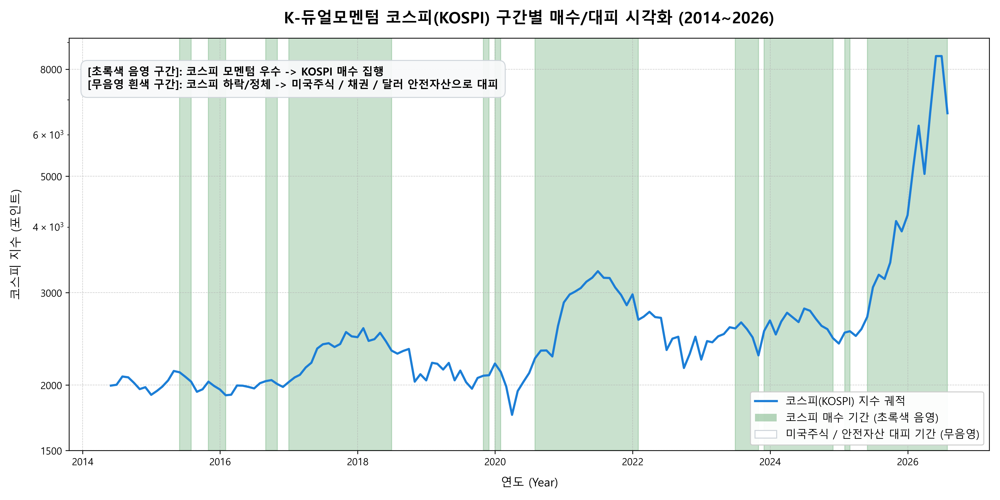
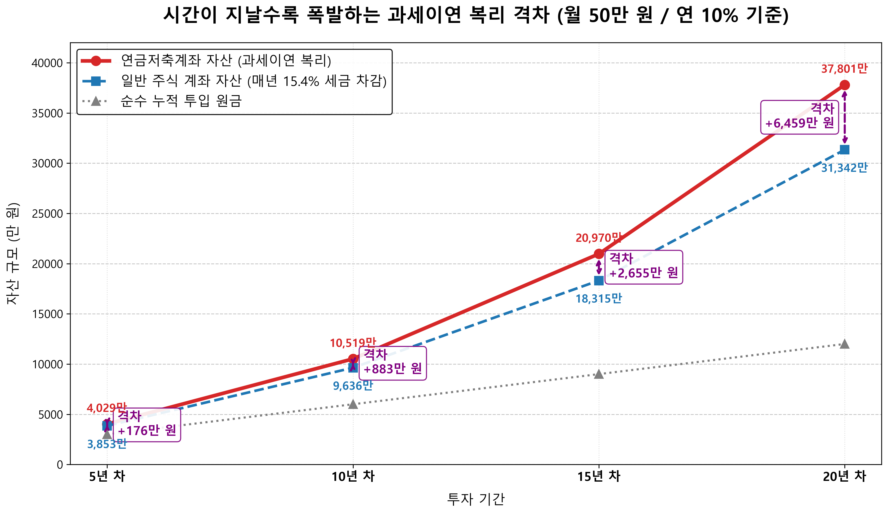
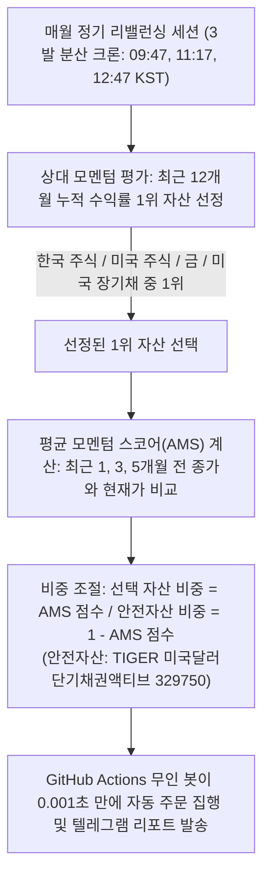
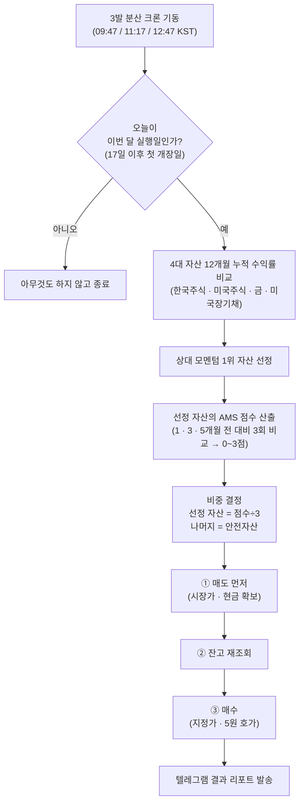
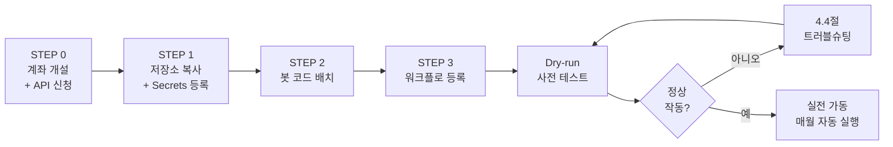
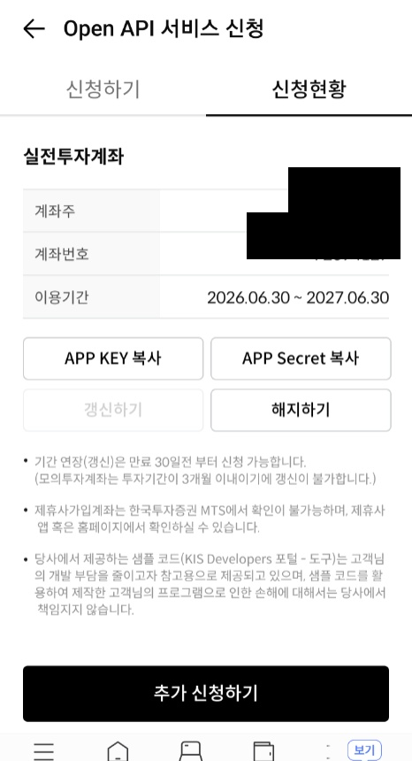
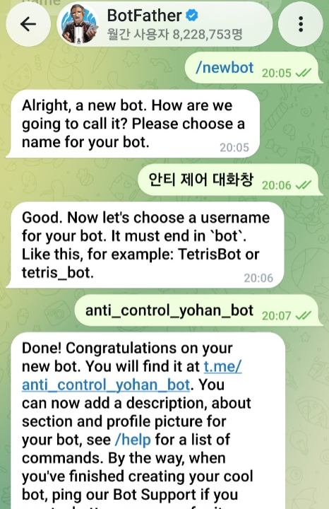
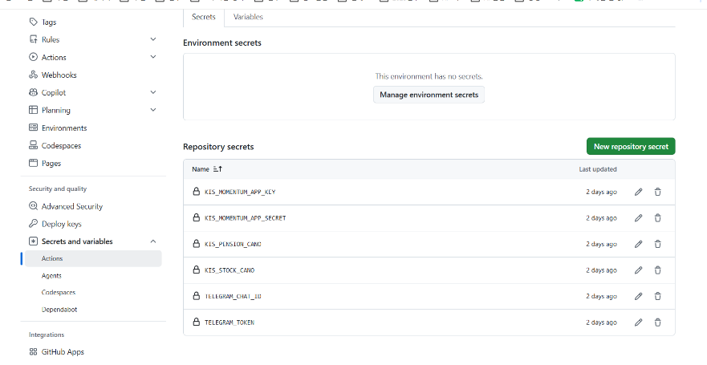

# 수업 중에도 굴러가는 연금계좌: 교사·공무원을 위한 AI 퀀트 자동화 실전기
## 수업이나 업무 중에도 AI 봇이 알아서 굴리는 연금저축 & K-듀얼모멘텀 가이드


현직 교사가 알려주는 연금저축 절세 아키텍처, K-듀얼 모멘텀 전략 및 한투 API 봇 원클릭 구축 가이드

---

## 목차

* 프롤로그: 나의 감(感)을 믿었던 투자, 그리고 1,700만 원의 뼈아픈 손실

* 1부. 교사의 제언: 시간과 노후를 지키는 투자
  * 1.1 10년의 경제 공부도 무너뜨린 인간 심리: 1,734만 원 손실과 상대적 박탈감의 교훈
  * 1.2 교사와 공무원의 재테크 강점: 한정된 시간, 일정한 현금흐름, 그리고 '시간'이라는 최고의 친구
  * 1.3 엑셀 수동 퀀트의 한계와 안티그래비티 '바이브 코딩'의 혁신
  * 1.4 주식 차트를 끄고 되찾은 본업: '수업 및 교직 업무 자동화'와 에듀테크 결실

* 2부. 연금저축 & 개인 계좌 절세 혜택 완전 정복
  * 2.1 주식·ETF 투자를 시작할 때 반드시 알아야 할 5대 핵심 계좌 지도
  * 2.2 왜 K-듀얼모멘텀 봇에는 ISA보다 연금저축 계좌가 구조적으로 유리한가?
  * 2.3 일반 주식 계좌 vs 연금저축펀드 계좌 구조적 비교
  * 2.4 3대 절세 핵심 혜택 및 상세 구조
  * 2.5 건강보험료 피부양자 자격 및 건강보험료 폭탄 방패막 원리
  * 2.6 은퇴 후 인출 방식별 세금 비교와 과세이연 복리 스노우볼의 위력

* 3부. MDD*를 낮추는 K-듀얼 모멘텀 퀀트 전략
  * 3.1 퀀트 투자란 무엇인가? (초보 교사 및 직장인을 위한 쉽게 푸는 개념)
  * 3.2 신뢰받는 5대 대표 퀀트 투자 기법 (교사·공무원 맞춤 루브릭 비유)
  * 3.3 게리 안토나치의 원조 듀얼모멘텀과 저의 'K-듀얼모멘텀' 개조 구조
  * 3.4 연금저축 최적화 ETF 라인업과 환노출 방패막 및 안전자산 대피 메커니즘
  * 3.5 수익률 시나리오 및 20년·30년 정밀 백테스팅(Backtesting)* 성과 분석
  * 3.6 3대 대형 폭락장 방어 케이스 스터디 (MDD 방어 논리 분석)

* 4부. 자동화 봇 실전 구축
  * [여는 글 1] 내가 GitHub Actions 무인 서버 체계를 선택한 이유
  * [여는 글 2] Agentic AI 시대, 교사의 사고 확장과 새로운 지평
  * [한눈에 보기] K-퀀트 봇 실전 마스터 로드맵
  * 4.1 K-듀얼모멘텀 봇은 어떻게 작동하는가: 실행 흐름과 안전장치
  * 4.2 GitHub Actions 100% 무료 무인 서버리스 자동 배포 원리
  * 4.3 [실습 1단계] 10초 무인 서버 복사 & 사전 테스트 가이드
    * STEP 0. 한국투자증권 모바일 계좌 개설 및 API 신청
    * STEP 1. GitHub 저장소 복사 & Secrets 보안 키 등록
    * STEP 2. 완성형 자동화 투자 AI 봇 소스 코드 전체 (`kis_bot_multi.py`)
    * STEP 3. GitHub Actions 무인 자동 실행 워크플로우 (`rebalance.yml`)
    * STEP 4. 워크플로우 활성화 및 쓰기 권한 설정 (포크 저장소 필수 관문)
    * STEP 5. 개통 확인 — 딱 한 번 Dry Run 눌러보기 (필수 검증)
  * 4.4 [실습 2단계] 제가 수개월간 직접 겪고 해결한 Top 13 실전 트러블슈팅 디버깅집 (에러 메시지 & 디버깅 과정 딥다이브)
  * 4.5 [실습 3단계] Google Antigravity로 내 스타일대로 주무르는 커스텀 패치 (자연어 `git push` 1초 완성 가이드)
  * 4.6 봇을 켠 다음: 월별 운영 체크리스트

* 에필로그: 수세(守勢)의 투자, 시장에 살아남는 자가 부를 거머쥔다

* 부록 A. 교실에서 시작된 자동화: NFC 출결부터 에이전트 AI까지

---

## 프롤로그: 나의 감(感)을 믿었던 투자, 그리고 1,700만 원의 뼈아픈 손실

저 황요한 (현직 고등학교 교사 / 퀀트·AI 자동화 연구자)

안녕하세요. 저는 경남 지역 교단에서 아이들을 가르치고 있는 현직 고등학교 교사 황요한입니다. 

지난 10년 동안 저는 매일을 루틴화된 삶으로 살아가며, 장기적으로 나 자신에게 도움이 되는 삶을 가꾸고자 노력해 왔습니다. 주식 시장과 매크로 경제를 공부하는 것 역시 그 삶의 루틴 중 커다란 한 축이었습니다. 수많은 경제 서적을 읽고 출퇴근길마다 경제 팟캐스트와 라디오를 들었습니다. 단순히 감(感)에 의존하지 않고 경제 상황을 차분히 읽어내면 시장의 방향도 파악할 수 있으리라 생각했습니다.

그러나 10년의 공부와 노력이 무색하게, 실전 거래의 현실은 차가웠습니다.

저는 결코 맹목적으로 매수 버튼을 누르지 않았습니다. 투자 전 기업 호재를 정밀 검토했습니다. 해당 바이오 기업의 분기 실적 호조, 4공장 풀 가동, 5공장 조기 준공, 6공장 조기 착공 소식이 이어졌습니다. 특히 미국의 '생물보안법(Biosecure Act)' 입법 추진으로 글로벌 수주가 이 기업으로 쏠릴 것이라는 정책적 수혜까지 예측했습니다. 제미나이(Gemini)의 '딥 리서치'로 심층 검증까지 마친 뒤 강한 확신을 얻었습니다.

2026년 4월 21일, 분석을 마치고 주당 1,588,000원에 51주(총 8,098만 8,000원)를 매수했습니다. 하지만 시장은 치밀한 분석과 AI 딥 리서치를 비웃듯 반대로 움직였습니다. 주가는 하락했고, 결국 6월 8일 주당 1,248,000원에 전량 매도했습니다. 단 48일 만에 1,734만 원(-21.4%)의 손실을 확정지었습니다.

더욱 심각했던 것은 당시 시장 상황이었습니다. 제가 물려 있던 48일 동안 대표 주도주들은 가파르게 상승했습니다. 남들의 종목이 타오를 때 제 계좌만 벼랑 끝으로 내몰렸습니다. 손실 그 자체보다 극심한 상대적 박탈감과 심리적 타격이 더 뼈아팠습니다.

매수 버튼을 누른 순간부터 제 일상은 주식 앱(MTS)에 인질로 잡혔습니다. 퇴근 후나 휴식 시간에도 휴대폰을 들여다보며 주식 시장의 향방에 신경을 쓰게 되었습니다. 수시로 변하는 차트 때문에 본업에 전념해야 할 일상에서 극심한 스트레스를 겪게 되었습니다.


과거 2020년과 2021년 즈음에도 '퀀트 자산배분 투자'를 공부하며 인간의 감정을 배제하고 투자할 수 있다는 원칙에 큰 매력을 느꼈었습니다. 하지만 매달 엑셀에 데이터를 입력하고 계산해 수동으로 매매하는 과정이 너무 힘들어 중간에 포기하고 말았었죠.

사실 이 실패가 있기 전, 2025년 말 육아휴직 기간 중 이미 구글 안티그래비티(Google Antigravity)를 접하고 퀀트 봇 개발에 착수한 상태였습니다. 그런데 정작 실전에서는 그 배움을 뒤로한 채 감에 의존해 개별 종목을 매수했고, 그 대가로 1,734만 원의 손실을 치렀습니다. 아이러니하게도 이 뼈아픈 실패는 '아직 미완성이던' 봇 개발에 오히려 더 박차를 가하게 만든 결정적 계기가 되었습니다. 그리고 2026년 6월, 마침내 저만의 '투자 자동화 봇'을 완성해 냈습니다. 매 순간 주가창에 뜨는 숫자를 보며 흔들리는 저의 감정뿐만 아니라 퀀트 투자를 위해 매달 자료를 수집하고 계산하던 번거로운 수고와 스트레스가 사라졌습니다. 인간의 감정뿐만 아니라 육체적 노동까지 제로로 만드는 진짜 대안을 찾아낸 것입니다.

이 책은 노후 연금을 고민하는 분들을 위한 진솔한 안내서입니다. 특히 예금 금리만으로는 인플레이션을 이길 수 없어 밤잠을 설치는 안정적 투자자분들과 경험을 나누고자 썼습니다.

주식 차트를 보며 소모했던 에너지를 이제는 우리의 본업과 사랑하는 사람들에게 집중하여 쓰기를 제안합니다. 노후와 현재의 삶 모두를 지키는 따뜻한 여정을 함께 시작해 봅시다.

---

## 1부. 교사의 제언: 시간과 노후를 지키는 투자

### 1.1 10년의 경제 공부도 무너뜨린 인간 심리: 1,734만 원 손실과 상대적 박탈감의 교훈

10년 동안 경제 서적을 읽고, 출퇴근길마다 경제 팟캐스트와 라디오를 들으며 쌓은 지식은 실전 장에서 아무런 방패가 되어주지 못했습니다. 개별 종목에 큰 돈이 투입되는 순간, 인간의 뇌는 차분한 이성을 잃고 공포와 조급함이라는 감정에 손쉽게 지배당하기 때문입니다.

* 치밀한 분석과 AI 딥 리서치의 한계: 2026년 4월, 저는 해당 바이오 기업의 4공장(24만 리터) 완전 풀 가동(Full Ramp-up), 5공장의 2025년 4월 조기 준공 및 가동률 가속화, 2026년 연내 6공장 조기 착공 허가 절차 착수 소식 및 미국의 '생물보안법(Biosecure Act)' 입법 추진으로 글로벌 바이오 수주물량이 중국 기업을 벗어나 세계 최대 생산 역량을 갖춘 해당 기업으로 쏠릴 것이라는 정책적 방향성까지 보수적으로 분석했습니다. 심지어 제미나이(Gemini)의 '딥 리서치' 기능으로 기업 가치를 심층 검증했습니다. 그러나 주당 1,588,000원에 51주(총 8,098만 8,000원)를 매수한 직후, 주가는 보란 듯이 꺾여 내려갔습니다.
* 상대적 박탈감이라는 더 큰 고통: 제가 물려 있던 48일 동안 시장은 삼성전자를 비롯한 대형 주도주들이 가파르게 폭등하던 대세 상승장이었습니다. 남들의 종목은 붉은 기둥을 세우며 환호할 때, 제 계좌만 파랗게 질려가는 광경을 보는 것은 1,734만 원(-21.4%)의 물질적 손실보다 몇 배나 더 뼈아픈 심리적 타격이었습니다.
* 예측의 오만함을 버리고 법칙으로: 전문적인 도구와 막강한 정보망, 큰 자산을 보유한 기관 및 전문가 집단이라면 기업의 상황과 미래 가치를 조금 더 명확하게 예측해낼 수 있을지도 모릅니다. 하지만 생업을 따로 가지고 있는 개인 투자자 입장에서 이들과 정면으로 정보 싸움을 벌이는 것은 도저히 승산이 없는 경쟁이었음을 뒤늦게 깨달았습니다. 감정과 직관에 얽매인 매매는 결국 실패로 수렴합니다.
* '카지노 초심자의 행운'이 주는 경고: 이 책을 읽는 독자 여러분이 저와 비슷한 일반 직장인이거나 교사라면, 감(感)과 운(運)에 의존하는 투자는 장기적으로 결코 성공할 수 없음을 명심해야 합니다. 이는 카지노에서 운 좋게 돈을 딴 초심자가 자신의 실력으로 착각하다 전 재산을 잃는 '초심자의 행운'과 같습니다. 운에 기댄 수익은 오만을 부르고, 그 오만은 거대한 통증으로 돌아옵니다. 결국 인간의 감정을 차단한 '규칙(Rule)' 기반의 퀀트 투자만이 개인 투자자를 보호할 수 있는 방패입니다.

---

### 1.2 교사와 공무원의 재테크 강점: 한정된 시간, 일정한 현금흐름, 그리고 '시간'이라는 최고의 친구

교사와 공무원, 그리고 정년이 보장된 직장인은 퀀트 자산배분 투자에 있어 전 세계 그 누구보다 유리한 '구조적으로 유리한 조건'을 손에 쥐고 있습니다.

* 인정 욕구와 한정된 시간, 그리고 AI 자동화의 필연성: 교사와 공무원은 정년이 보장되어 있어 일을 더 열심히 하려는 동기가 부족해 보일 수 있습니다. 하지만 직장에서 인정받고 싶은 욕구는 인간의 본능입니다. 학교에서 인정받으려면 업무 역량을 높이거나 더 많은 시간을 쏟아야 합니다. 하지만 우리에게 주어진 시간은 한정되어 있습니다. 무엇보다 우리에게는 '가정'이라는 소중한 공간이 있습니다. 당시 22개월 된 아기와 가족 곁을 지키기 위해, 시간 자원을 효율화하는 'AI 기반 자동화'는 필수였습니다.
* 매달 일정하게 유입되는 현금흐름 (Capital Inflow)의 막강함: 교사와 공무원의 가장 큰 무기는 매달 일정한 월급과 수당이 유입된다는 점입니다. 무리한 대출이나 단타 대신 여유 자금으로 적립식 투자를 집행할 수 있습니다. 덕분에 경제 위기나 폭락장이 찾아와도 시장을 견뎌낼 체력이 훨씬 높습니다.
* 제도적 최후의 보루: 연금이 안겨주는 압도적 마인드 컨트롤: 공무원/사학연금이라는 제도적 보루는 투자 심리를 지켜주는 든든한 방패막입니다. 은퇴 후 기본 생활이 보장되어 있으므로 폭락장이 와도 조급하게 주식을 팔지 않습니다. 백테스트 결과를 믿고 전략을 끝까지 밀고 나갈 수 있는 마음의 안정이 유지됩니다.
* 매뉴얼 중심의 직업적 본능과 퀀트(Quant)의 찰떡궁합: 교사와 공무원은 규정과 매뉴얼에 따라 움직이는 데 익숙합니다. 공포에 휘둘려 충동적으로 매매하는 대신, 사전 규칙을 준수하는 '원칙 중심의 태도'는 우리 직업군과 가장 잘 맞는 투자 방식입니다.
* 절세 계좌(연금저축/ISA)와 과세이연 복리의 마법: 매달 들어오는 현금흐름을 연금저축이나 ISA 같은 절세 계좌라는 바구니에 담아 퀀트 자산배분을 실행할 때, 세액공제 환급금과 과세이연 복리 효과는 배가됩니다. 합법적인 절세 혜택을누리며 매달 기계적으로 자산을 배분하는 것, 이것이 시스템이 스스로 부를 키우게 만드는 핵심 메커니즘입니다.

> 저의 메시지: 
> "직장에서는 AI 자동화로 업무 효율을 크게 끌어올려 동료와 학생들에게 인정받고, 퇴근 후에는 사랑하는 아이와 가족 곁을 지키며, 자산은 퀀트 봇 시스템이 알아서 안전하게 굴려주는 삶. 이것이야말로 한정된 삶의 자원을 가장 가치 있게 활용하는 스마트한 교사이자 직장인의 지속 가능한 최고의 투자 모델입니다."

---

*[주석: 백테스팅(Backtesting)이란 과거의 금융 시장 데이터를 바탕으로 특정 투자 전략을 대입해 보았을 때 얼마의 수익과 위험이 발생했는지를 통계적으로 사전 검증하는 기법입니다.]*

### 1.3 엑셀 수동 퀀트의 한계와 안티그래비티 '바이브 코딩'의 혁신

수동 퀀트 투자와 자동화 봇 투자의 차이는 단순한 편의성 차이가 아닙니다. 엑셀 앞에서 매달 지쳐가던 과정을 완전히 무인으로 돌아가는 시스템으로 바꾼 것입니다. 

일반적으로 수동으로 퀀트 투자(계량 투자)를 집행하는 사람들은 크게 다음 세 가지 영역에서 현실적인 어려움과 장벽을 마주하게 됩니다.

#### 1. 데이터 수집과 엑셀 작업의 현실적 장벽 (손의 피로 - 수동 노동)
* 원시 데이터(Raw Data) 확보의 고충: 2020~2021년 퀀트를 처음 접했을 때, 인베스팅닷컴 등 해외 금융 플랫폼에서 과거 주가 데이터(OHLCV)나 재무제표 데이터를 일일이 다운로드하는 것부터가 고역이었습니다. 플랫폼마다 데이터 포맷이 달라 이를 통일하고 정제하는 데 수많은 시간과 공이 들어갔습니다.
* 수식 하나만 틀려도 터지는 엑셀의 비명: 다운로드한 데이터를 바탕으로 VLOOKUP, INDEX/MATCH, 배열 수식 등을 엑셀에 붙여 백테스팅(Backtesting)* 모델을 만들었지만, 수식 단 하나만 오기되어도 전체 백테스팅(Backtesting)* 결과가 완전히 오염되는 큰 문제가 발생하곤 했습니다. 데이터양이 많아지면 엑셀이 멈춰버리는 현상(이른바 '엑셀의 비명') 속에서 극심한 피로감을 느꼈습니다.
* 유료 서비스 및 플랫폼의 비용 장벽: 엑셀 작업의 한계를 극복하고 보다 편하게 퀀트를 수행하려면 젠포트(GenPort) 같은 전용 플랫폼이나 유료 데이터 서비스를 결제해야 하는 경우가 많았습니다. 본업이 있는 개인 투자자 입장에서 매달 지출되는 이러한 유료 플랫폼 구독 비용은 상당한 접근 장벽이자 부담으로 다가왔습니다.

#### 2. 정기 수동 매매와 추가 비용의 부담 (귀찮음 - 관리의 한계)
* 주기적 리밸런싱과 펀드 수수료 부담: 퀀트 투자는 매월 혹은 매분기 정해진 날짜에 포트폴리오를 갱신(리밸런싱)해야 통계적 우위가 유지됩니다. 그러나 매번 정해진 날짜에 엑셀을 켜서 최신 데이터를 업데이트하고, 새로운 매수/매도 종목을 추출하는 과정은 바쁜 일상 속에서 매번 챙기기에 번거로움이 컸습니다. 이를 조금 더 편하게 수행하려면 수수료를 내고 퀀트 펀드에 가입하거나 유료 매매 리포트를 구독해야 하는 등 가외의 추가 비용이 들게 됩니다.
* 시공간적 제약과 수익률 괴리: 바쁜 학교 업무나 일상생활에 치이다 보면 리밸런싱 타이밍을 며칠씩 놓치기 일쑤였습니다. 리밸런싱 날짜가 어긋나면 백테스팅(Backtesting)* 성과와 실제 계좌 수익률 사이에 뜻하지 않은 괴리가 발생하는 원인이 되기도 했습니다.

#### 3. 매매 순간에 개입하는 인간의 본성 (마음의 고통 - 심리적 감정)
* 두려움과 탐욕에 의한 원칙 훼손: 퀀트의 핵심은 '기계적인 룰 준수'입니다. 그러나 백테스트 성과가 아무리 뛰어난 전략이라도, 막상 시장이 공포에 휩싸여 폭락할 때 손실을 감내하며 매수 버튼을 누르거나, 급등장에서 원칙에 따라 매도 버튼을 누르는 것은 인간의 유전적 본성(두려움과 탐욕)을 거스르는 고통입니다.
* MDD(최대 낙폭) 구간에서의 이탈: 전략이 일시적으로 안 먹히는 구간(Drawdown)이 도래하면, 투자자는 '이 수식이 잘못된 게 아닐까?'라는 불안감에 휩싸입니다. 결국 시스템을 끄고 다시 감에 의존한 주관적 손매매로 돌아가는 비극을 겪게 됩니다.

---

#### 밤샘 육아 속에서 피어난 아이디어: 안티그래비티 '바이브 코딩'과 퀀트 봇 탄생

저는 프로그래밍 언어를 깊게 공부한 개발자가 아니었습니다. 그러나 2025년 11월경, 육아휴직 기간 중 밤마다 아기를 재우고 남은 고요한 시간에 제미나이(Gemini)와 구글 앱스스크립트(Google Apps Script)를 활용하여 간단한 수업 및 행정 자동화 툴을 만들기 시작했습니다. AI와의 대화를 통해 생각했던 기능들이 눈앞에서 동작하는 것을 보며 작은 성취감을 느꼈습니다.

그리고 이 경험은 곧 구글 안티그래비티(Google Antigravity) 에이전트 AI의 도입으로 이어졌습니다. 안티그래비티의 에이전트 기능을 활용해 자연어로 대화하며 코드를 짜는 '바이브 코딩(Vibe Coding)'을 경험하면서, 문득 깨달음이 스쳤습니다. 
"어, 내가 2020년부터 그토록 고생하던 퀀트 투자를 이 에이전트 AI와 대화하면서 자동화 투자 AI 봇으로 만들어 자동화할 수 있겠는데?"

이 영감을 바탕으로 2026년 3월부터 본격적으로 'K-듀얼모멘텀 퀀트 자동화 봇' 구축에 착수했습니다. "한국투자증권 API로 내 잔고를 조회해 줘", "최근 12개월 모멘텀 스코어를 계산하는 파이썬 로직을 만들어 줘"라고 안티그래비티에 자연어로 요구하며 복잡한 봇 아키텍처를 하나씩 완성해 나갔습니다. (초기 구축한 구글 클라우드 펑션(Google Cloud Functions)/Cloud Run 배포 구조에 이어, 현재는 GitHub Actions(100% 무료 스케줄러 & CI/CD)를 기반으로 더욱 깔끔하고 안정적인 무인 서버 파이프라인으로 전환·수정하여 운용하고 있습니다.)

| 수동 퀀트의 현실적 어려움 (과거) | 안티그래비티 '바이브 코딩' 봇 (혁신) |
| :--- | :--- |
| 엑셀 수식 오류 및 유료 서비스 결제 부담 | KIS API로 데이터 수집부터 매매까지 무료 자동화 (노동 0 / 비용 0) |
| 매달 수동 리밸런싱 및 펀드 가입 수수료 | GitHub Actions 무료 스케줄러가 매달 정해진 시각에 무인 자동 집행 (관리 0) |
| 매수/매도 버튼 앞의 심리적 갈등 | 텔레그램 메시지 1줄로 감정을 배제한 기계적 매매 (감정 0) |

봇과 파이프라인이 완성되고 나니, 수년간 저를 괴롭히던 엑셀 수동 노동과 유료 서비스 비용, 매수 버튼 앞의 심리적 갈등이 한꺼번에 사라졌습니다. 마음이 참 가벼웠습니다. 바쁜 교사와 직장인이라면 누구나 결국 이 지점을 목표로 삼아야 한다고 생각합니다.

---

#### [초보자를 위한 1초 이해] K-듀얼모멘텀 추세추종 원리와 코스피 백테스트 시각화

퀀트 모멘텀 투자의 본질은 주가의 고점과 저점을 예언하는 신통함에 있는 것이 아닙니다. 그것은 "상승장이라는 버스를 타고 가다가, 벼랑길 하락장이 도래하면 미련 없이 내려서 안전한 쉼터(단기채권/달러)로 들어가는 추세추종(Trend Following)" 원리입니다.


> [도서 실전 백테스트 차트] K-듀얼모멘텀 코스피(KOSPI) 구간별 매수 및 대피 시각화 (초록색 음영: 코스피 매수 구간 / 무음영 흰색: 미국주식·채권·달러 대피 구간)

---

#### K-듀얼모멘텀 5대 자산 갈아타기 & 수익 극대화 전략표

| 자산군 | 대표 ETF (종목코드) | 언제 투자하나요? (갈아타기 & 매수 타이밍) | 갈아타기 목표 (수익 극대화 전략) | 사회 초년생을 위한 이 자산의 핵심 역할 |
| :--- | :--- | :--- | :--- | :--- |
| 한국 주식 | `KODEX 200`<br>(`069500`) | • 1년 전 가격보다 지금 가격이 더 올라 있고<br>• 미국주식/채권/금보다 가장 기세가 좋은 1등 우등생 자산일 때 | • 한국 주식이 떨어지기 시작하면 미국주식, 미국 채권, 금으로 즉시 갈아타서 계속 수익 추종 | 대한민국 대표 우량 기업 200개의 대세 상승장 수익 수확 |
| 미국 주식 | `TIGER 미국S&P500`<br>(`360750`) | • 1년 전 가격보다 지금 가격이 더 올라 있고<br>• 한국주식/채권/금보다 가장 기세가 좋은 1등 우등생 자산일 때 | • 미국 주식이 꺾이기 시작하면 한국주식, 미국 채권, 금으로 즉시 갈아타서 수익 추종 | 전 세계 1등 기업 500개의 꾸준하고 안전한 우상향 수익 수확 |
| 미국 장기채 | `ACE 미국30년국채액티브`<br>(`476760`) | • 주식 시장(한국/미국)이 주춤하고<br>• 은행 이자가 내려가며 채권 값이 가장 가파르게 올라갈 때 | • [기회 잡기!] 주식이 꺾일 때 금리 인하로 값이 뛰는 미국 채권으로 갈아타 하락장 속에서도 따로 추가 수익 수확 | 주식이 조용할 때 은행 이자 인하 수혜로 채권 폭등 수익 수확 |
| 금 현물 | `ACE KRX금현물`<br>(`411060`) | • 주식이나 채권 시장이 모두 조용하고<br>• 전쟁 소식이나 물가가 가파르게 오르며 금값이 가장 강할 때 | • [기회 잡기!] 주식/채권이 안 좋을 때 금값 상승 파도를 타서 남들과 다르게 따로 돈 버는 효과 | 물가가 오르거나 위기가 찾아올 때 화폐 가치 하락 방어 수익 |
| 달러 / 단기채 | `TIGER 미국달러단기채권액티브`<br>(`329750`) | • [최후의 대피처]<br>• 주식, 채권, 금이 모두 떨어지는 총체적 폭락장일 때 | • 폭우가 쏟아지는 큰 폭락장에서 소중한 내 원금이 깎이지 않게 원금 자물쇠를 잠그고 향후 재매수 실탄 보관 | 최악의 폭락장에서 원금 100% 철통 보호 및 재매수 기회 확보 |

> 저의 퀀트 꿀팁: 단순한 '피신'이 아닌 '똑똑한 갈아타기' 
> "사회 초년생 선생님이나 공무원분들 중에는 퀀트 투자라고 하면 '주가가 떨어질 때 소극적으로 도망치는 방어 전략'으로 오해하시는 경우가 많습니다. 하지만 K-듀얼모멘텀의 진짜 무기는 '주식 시장(코스피, S&P500)의 기세가 꺾였을 때, 가만히 웅크려 매를 맞지 않고, 은행 이자가 내려가며 값이 뛰는 미국 장기채나 물가가 오를 때 치고 나가는 금 현물로 즉시 갈아타(스위칭) 하락장 속에서도 따로 추가 수익을 챙기는 똑똑한 듀얼 엔진 전략'이라는 점에 있습니다. 
> 가장 잘나가는 1등 우등생 자산으로 계속 자리를 옮겨 다니며 수익을 극대화하고, 주식·채권·금 모든 자산이 다 같이 떨어지는 흔치 않은 큰 폭락장에서만 달러와 단기채라는 대피처로 들어가 내 원금에 자물쇠를 잠급니다. 감정에 휘둘리지 않고 봇이 알아서 가장 좋은 자산으로 갈아타 주므로, 사회 초년생도 일상을 해치지 않고 마음 편히 자산을 키워갈 수 있습니다."

---

### 1.4 주식 차트를 끄고 되찾은 본업: '수업 및 교직 업무 자동화'와 에듀테크 결실

> [독자 읽기 가이드] 
> "이 파트는 퀀트 자동화 봇을 통해 되찾은 시간으로 구축한 '교사 에듀테크 및 무상 Open API 자원' 소개입니다. 퀀트 투자의 구체적인 계좌 개설(2부) 및 듀얼모멘텀 매매 알고리즘(3부)을 먼저 공부하고 싶으신 독자께서는 2부로 곧바로 이동하셔도 무방합니다."

매달 1회 텔레그램 메시지 1줄로 계좌 리밸런싱이 깔끔하게 완결되자, 주식 차트를 들여다보고 매일 경제 소식을 쫓느라 소모하던 수많은 시간과 에너지를 아낄 수 있었습니다. 그렇게 되찾은 시간은 제 삶에 생각보다 큰 변화를 가져다주었습니다.

저는 이 되찾은 소중한 시간을 헛되이 보내지 않고, 안티그래비티 AI와 대화하며 퀀트 봇을 구축했던 개발 노하우를 '교사로서 가장 의미 있는 본업, 즉 아이들을 위한 수업과 교직 업무 자동화(에듀테크)'로 확장해 나가기 시작했습니다.

첫 발령 당시부터 교직 생활과 경제 공부를 병행하면서 깨달은 사실이 하나 있었습니다. 교사라는 직업은 아이들을 위해 잘하려고 노력할수록 그 헌신에는 끝이 없지만, 우리에게 주어진 시간 자원은 한정되어 있다는 점이었습니다. 퀀트 봇 덕분에 확보한 여유 시간은 오롯이 교단 위 아이들의 눈을 맞추고 깊이 있는 피드백을 주는 '교육의 본질'로 귀결되었습니다.

동료 선생님들도 느끼시겠지만, 교사의 에너지가 주식 차트나 단순 반복 행정 작업에 소비되어서는 안 됩니다. 퀀트 봇 덕분에 주식 화면에 낭비되던 에너지를 되찾고, 그 시간으로 실제 수업과 아이들에게 더 집중할 수 있게 되었습니다. 봇을 구축하며 터득한 자동화 노하우는 에이전트 AI 및 구글 앱스스크립트(GAS)를 활용한 에듀테크 영역으로 자연스럽게 이어졌고, 현재 학교 현장에서 직접 활용하고 있는 5대 혁신 사례를 소개해 드립니다.

* 1. 진해고등학교 입학 상담 AI 챗봇 v2.0 (`jinhae-bot2`)
 주소 및 배포: `https://jinhae-bot2.vercel.app` (Vercel 라이브 배포)
 활용 및 가치: 진해고 진학을 희망하는 관내 중학생과 학부모님들의 다양한 입학 문의(학교 특징, 중학교별 신입생 분포, 교육과정 등)에 대해 지식 베이스(`knowledge.txt`)를 기반으로 24시간 언제든 실시간으로 정확하게 자동 응답해 주는 AI 상담 서비스입니다. 교사가 일일이 전화 상담에 시달리지 않고도 학교의 브랜드 가치와 입학 정보를 친절하게 안내해 드립니다.
 


* 2. 3학년 자율적 교육과정 탐구 기록 관리 웹앱 (소크라틱 AI 튜터 챗봇 연동)
 설계 및 가치: 제미나이(Gemini)를 정답을 일러주는 단순 검색 도구로 소비하는 것이 아니라, 학생에게 반문하며 스스로 생각하게 만드는 '소크라틱 AI 튜터 챗봇'으로 재설계했습니다. 학생이 AI 챗봇과 대화하며 탐구 주제를 발전시키는 과정과 질문 하나하나를 실시간으로 기록하여, 학생의 단계적 성장을 돕고 과정 중심의 학교생활기록부 평가가 이루어지도록 구축한 플랫폼입니다.

* 3. 2학년 2학기 문법 수업 전용 맞춤형 웹앱 (소크라틱 AI 튜터 챗봇 연동)
 설계 및 가치: 국어과 2학년 2학기 문법 수업의 특성을 반영하여, 문법 개념의 맹목적 암기 대신 학생이 원리를 탐구하도록 돕는 소크라틱 AI 튜터 연동 웹앱입니다. 학생들이 챗봇에게 던진 수많은 질문과 상호작용 기록이 데이터로 누적되므로, 교사는 기말 시즌에 쥐어짜내는 평가가 아닌 '진짜 수업 중 과정 중심 평가'와 개인별 맞춤형 세특 기재를 완벽히 수행할 수 있습니다.

* 4. 교과 교수-평가-기록(교수평기) 및 세특 자동화 웹앱 (Google Apps Script 연동)
 주소 및 환경: Google Apps Script (`script.google.com`) 및 구글 워크스페이스(시트·폼·문서) 연동
 활용 및 가치: 수업 시간 학생들의 탐구 활동 데이터를 실시간으로 수집하고, 교과 세부능력 및 특기사항(세특) 작성을 위한 구체적인 관찰 기록과 개별 맞춤형 피드백 생성을 돕는 웹 플랫폼입니다. 생활기록부 기재 시즌마다 밤을 새우며 겪던 행정 부담을 획기적으로 줄여줍니다.

* 5. 스마트폰 PWA 앱 연동 '음성 실시간 관찰기록 & 반별 세특 통합 대시보드 웹앱' (동료 교사 무상 공유형)
 기술 및 환경: 스마트폰 PWA(Progressive Web App) 앱 기술, 구글 앱스스크립트(GAS), 구글 시트 데이터베이스 연동
 활용 및 혁신적 가치: 교사가 교실 수업이나 수행평가 중 스마트폰 PWA 앱을 켜고 말하면, 교사의 음성 관찰 기록이 실시간 텍스트로 변환되어 구글 시트에 차곡차곡 자동 저장됩니다. 교사용 모니터링 대시보드에서는 반별로 어떤 학생에게 어떤 관찰 기록이 쌓였는지 한눈에 바로바로 정돈되어 시각화되며, 이 데이터는 학기 말 영역별 세특 작성 시 그대로 안전하게 연동 반영됩니다.
 동료 교사 무상 공유 및 확장의 용이성 (핵심 강점): 이 웹앱은 고가의 솔루션을 구독할 필요 없이, 동료 선생님들이 구글 시트 복사(복사본 만들기) 단 한 번만으로 누구나 즉시 자신의 학급과 교과에 무상으로 쉽게 적용하고 공유할 수 있도록 템플릿화되어 있는 현장 친화적 결실입니다.

* 수업 및 본업 자동화가 가져온 참된 변화: 
 매달 1회 낮 12시 30분, 텔레그램 메시지로 도착하는 매매 보고서 1줄로 계좌 리밸런싱이 완결되자, 쉬는 시간마다 한숨을 쉬던 주식 시장의 피로감에서 완전히 벗어났습니다. 주식 차트를 끄고 학생들의 성장에 더 깊이 집중할 수 있게 된 것이야말로 퀀트 자동화 봇이 저에게 선사한 가장 값진 선물입니다.

---


> 이 밖에도 NFC 태그를 활용한 무선 출결 시스템, 음성 인식 기반 학습 도우미 웹앱, 제미나이 API를 연동한 수업 자료 생성 에이전트 등으로 자동화 영역을 계속 넓혀가고 있습니다. 교육 자동화 사례에 관심 있는 선생님들을 위해 상세한 구축 과정과 실제 활용 화면은 **부록 A**에 따로 정리해 두었습니다. 투자 자동화가 궁금하신 분은 곧바로 2부로 넘어가셔도 좋습니다.

---


## 2부. 연금저축 & 개인 계좌 절세 혜택 완전 정복

### 2.1 주식·ETF 투자를 시작할 때 반드시 알아야 할 5대 핵심 계좌 지도

퀀트 자동매매를 시작하려는 투자자가 증권사 앱을 켰을 때 가장 먼저 부딪히는 벽은 "도대체 어떤 계좌를 만들어야 하지?"라는 난관입니다. 주식과 ETF를 매매할 때 사용하는 5대 핵심 계좌의 역할과 특징을 정리해 봤습니다.

#### 5대 핵심 계좌 특징 & 절세 혜택 종합 비교표 (한국투자증권 기준)

| 계좌 명칭 (상품코드) | 주요 매수 가능 종목 | 세금 & 절세 혜택 | 건강보험료 영향 | 이 계좌의 핵심 역할 & 퀀트 봇 연동 |
| :--- | :--- | :--- | :--- | :--- |
| 일반 주식 계좌<br>(상품코드 `01`) | 국내/해외 개별 주식,<br>모든 국내/해외 상장 ETF | • 배당소득세 15.4% 원천징수<br>• 해외 주식 양도세 22% (250만 원 공제) | • 금융소득 연 1,000만 원 초과 시 건강보험료 인상 위험 | 모든 개별 주식과 해외 직접 투자가 가능한 기본 필수 계좌 |
| ISA 계좌<br>(중개형 개인종합) | 국내 개별 주식,<br>국내 상장 해외 ETF | • 순이익 비과세 (일반 200만/서민 400만 원)<br>• 초과분 9.9% 저율 분리과세 | • 분리과세 혜택으로 건강보험료 폭탄 방어 | 3년 중단기 국내 상장 해외 ETF 절세 투자 무대 |
| 연금저축펀드 계좌<br>(상품코드 `22`) | 국내 상장 ETF, 펀드<br>(※ 개별 주식 매수 불가) | • 연 최대 600만 원 세액공제 (13.2%~16.5% 환급)<br>• 은퇴 시까지 과세 이연 (0% 즉시 차감) | • 건강보험료 0.0% (전액 100% 제외) | K-듀얼모멘텀 자동화 봇의 메인 핵심 연동 계좌 |
| IRP 계좌<br>(개인형 퇴직연금) | 국내 상장 ETF, 펀드, 국공채<br>(※ 안전자산 30% 의무) | • 연금저축과 합산하여 최대 900만 원 세액공제<br>• 과세 이연 & 저율 연금소득세 (3.3%~5.5%) | • 건강보험료 0.0% (전액 100% 제외) | 연금저축 한도 초과 시 세액공제를 연 900만 원까지 확장 |
| CMA 계좌<br>(종합자산관리) | 단기 RP, MMF, 발행어음 등 | • 매일 이자 발생 (이자소득세 15.4% 부과 (CMA 수익금은 세법상 이자소득으로 분류)) | • 일반 금융소득에 합산 | 주식 매수 전 대기 현금이나 매도 후 예수금 파킹 |

---

#### [주식/ETF 직접 거래] 4대 핵심 매매 계좌
1. 일반 주식 계좌 (위탁 계좌 - 한투 상품코드 `01`)
 투자 가능 범위: 국내 개별 주식, 미국 등 해외 개별 주식, 모든 국내/해외 상장 ETF
 역할 및 가치: 입출금과 종목 선택에 아무런 제약이 없이 모든 주식을 자유롭게 사고파는 가장 기본이 되는 필수 계좌입니다. 퀀트 봇의 해외 주식 및 개별 주식 매매의 기본 무대가 됩니다.
2. ISA 계좌 (중개형 개인종합자산관리계좌)
 투자 가능 범위: 국내 개별 주식, 국내 상장 ETF, 펀드, ELS 등
 역할 및 가치: 3년 이상 중단기로 국내 주식이나 국내 상장 해외 ETF(예: 미국 S&P500, 미국나스닥100 등)에 투자할 때 손익을 통산하고 순이익에 대해 비과세(일반형 200만 원, 서민형 400만 원) 및 9.9% 저율 분리과세 혜택을 주는 필수 중단기 절세 계좌입니다.
3. 연금저축펀드 계좌 (한투 상품코드 `22`)
 투자 가능 범위: 국내 상장 ETF 및 펀드 (※ 개별 주식 매수 불가)
 역할 및 가치: 매년 연말정산 세액공제(최대 600만 원 한도)를 받아 확정 환급금을 챙기면서, 지수 추종 ETF 등으로 장기 노후 자금을 무인으로 굴리는 K-퀀트 자동화 봇의 핵심 연동 계좌입니다.
4. IRP 계좌 (개인형 퇴직연금)
 투자 가능 범위: 국내 상장 ETF, 펀드, 국공채 등 (※ 개별 주식 매수 불가, 안전자산 30% 의무 보유)
 역할 및 가치: 연금저축과 합산하여 연말정산 세액공제 한도를 최대 900만 원까지 확장하기 위해 활용하는 계좌입니다. 안전자산 30% 의무 보유 규칙이 존재하므로 퀀트 봇 구축 시 이 비중을 고려해야 합니다.

#### [주식 투자 보조] 1대 파킹 계좌
5. CMA 계좌 (종합자산관리계좌)
 역할 및 가치: 주식을 직접 매수하는 계좌는 아니지만, 주식을 사기 전 대기 중인 현금이나 매도 후 남은 예수금에 대해 단 하루만 맡겨도 매일 이자를 차곡차곡 챙겨주는 주식 투자의 필수 파킹(Parking) 보조 계좌입니다.

---

#### [핵심 세무 가이드] 일반 계좌에서 국내상장 해외 ETF를 사면 안 되는 이유 (vs 미국 직상장 ETF 과세 비교)

본서가 다루는 5대 핵심 자산 중 `KODEX 200`을 제외한 4종(`TIGER 미국S&P500`, `ACE 미국30년국채액티브`, `ACE KRX금현물`, `TIGER 미국달러단기채권액티브`)은 세법상 모두 **'국내 상장 해외/파생형 기타 ETF'**로 분류됩니다.

이 종목들을 일반 주식 계좌(위탁 계좌)에서 매매할 경우, 세제상 매우 불리한 구조적 문제가 발생합니다.

##### 1. 국내상장 해외 ETF vs 미국 직상장 ETF 과세 구조 1:1 비교

| 비교 항목 | 국내 상장 해외 ETF<br>(예: `TIGER 미국S&P500`) | 미국 직상장 ETF<br>(예: `VOO`, `SPY`, `IVV`) |
| :--- | :--- | :--- |
| **과세 세목** | **배당소득세 15.4%** (매매차익을 배당소득으로 간주) | **양도소득세 22%** (지방소득세 포함) |
| **과세 방식** | **종합과세 합산 대상** ⚠️ | **분류과세 (타 소득과 분리 종결)** 🟢 |
| **금융소득종합과세** | 연 2,000만 원 초과 시 **최대 49.5% 누진세율 합산** | **합산되지 않음** (수익이 커도 22% 단일 세율 종결) |
| **건강보험료 영향** | 금융소득 연 1,000만 원 초과 시 **건보료 인상 및 피부양자 탈락 위험** | **건보료 산정 소득에 미포함 (영향 없음)** |
| **기본공제** | 없음 (수익 전액에 대해 과세) | **연 250만 원 기본공제** |
| **손익통산** | 같은 계좌 내 다른 국내상장 ETF와 통산 불가 (이익 난 종목에만 과세) | 해외 주식/ETF 간 **연간 손익통산 가능** |

##### 2. 왜 15.4% 세율이 22%보다 더 무서운가?
표면적인 세율만 보면 배당소득세(15.4%)가 미국 주식 양도소득세(22%)보다 낮아 보입니다. 하지만 수익 규모가 커지면 결과가 정반대로 뒤집힙니다:
* **소액일 때:** 15.4% 원천징수로 끝나므로 큰 차이가 없습니다.
* **수익이 2,000만 원을 넘을 때:** 국내상장 해외 ETF의 매매차익은 금융소득(이자+배당)으로 잡혀 **금융소득종합과세** 대상이 됩니다. 근로소득이나 연금소득과 합산되어 소득세율이 **최대 49.5%까지 폭등**하고, 건강보험료 피부양자 자격 박탈 및 소득월액 보험료 부과로 이어집니다.
* **반면 미국 직상장 ETF는:** 수익이 1억 원이든 10억 원이든 양도소득세 22% 분류과세로 세무가 깔끔히 끝나며, 타 소득이나 건강보험료에 일절 영향을 주지 않습니다.

##### 3. 국내 주식형 ETF(`KODEX 200`)의 세금 예외
단, 대한민국 대표 지수를 추종하는 `KODEX 200 (069500)` 같은 **국내 주식형 ETF**는 일반 계좌에서 매매하더라도 **매매차익이 전액 비과세(0원)**입니다. (오직 보유 중 지급되는 분배금에 대해서만 15.4% 배당소득세가 원천징수됩니다.)

##### 4. 결론 및 본서의 계좌 운용 원칙
* 만약 일반 주식 계좌에서 미국 지수에 직접 장기 투자하고자 한다면, 국내상장 ETF 대신 달러로 환전하여 **미국 직상장 ETF(`VOO` 등)**를 매수하는 것이 세제상 훨씬 유리합니다.
* 하지만 본서가 구축하는 K-듀얼모멘텀 봇의 5대 자산은 원화 거래의 편의성을 위해 **모두 국내 상장 ETF**로 구성되어 있습니다. 따라서 이 봇은 **반드시 매매차익 과세이연과 저율 분리과세 혜택이 주어지는 '연금저축펀드 계좌(상품코드 22)' 또는 'ISA 계좌'에서 가동**하셔야 세금과 건강보험료 위험 없이 자산을 안전하게 불려갈 수 있습니다.

---

### 2.2 왜 K-듀얼모멘텀 봇에는 ISA보다 연금저축 계좌가 구조적으로 유리한가?

> [도서 범위 안내: 이 책은 오롯이 '연금저축펀드 계좌' 전용 퀀트 가이드입니다]

"1억 원 이상의 대형 목돈이나 일반 주식 계좌를 활용한 자동 투자 전략은 저의 후속작인 '올웨더 자산배분 자동 투자 봇' 도서에서 깊이 있게 다룰 예정입니다.

본 도서는 바쁜 교사·공무원 및 직장인이 노후 준비와 연말정산 절세를 효율적이고 안전하게 준비할 수 있도록, 안전자산 30% 제약이나 API 매매 제한이 없어 100% 무인 자동화가 가능한 오직 '연금저축펀드 계좌'만을 전용 대상으로 삼아 집중하여 진행합니다."

ISA 계좌도 3년 중단기 절세에 훌륭한 계좌입니다. 하지만 K-듀얼모멘텀 봇의 메인 무대로는 '연금저축펀드 계좌(`22`)'가 훨씬 유리합니다.

---

#### [부부가 함께 활용하는 2배 절세 꿀팁] 부부 각각 연금계좌 개설 시 연 1,200만 원까지 절세 투자 확장!

1. 부부 합산 연금 투자 2배 확장 전략
대한민국 연금저축 계좌는 세대주 기준이 아닌 '개인별 1인 1계좌' 기준입니다. 따라서 결혼한 부부라면 본인과 배우자가 각각 연금저축 계좌를 개설하여, 개인 한도(연 600만 원)의 2배인 부부 합산 연 1,200만 원(월 100만 원)까지 연금저축 퀀트 봇으로 투자할 수 있습니다.

이를 통해 은퇴 후 건강보험료와 세금 없이 꺼내 쓸 수 있는 사적연금 저율 인출 한도를 부부 합산 연 3,000만 원(월 250만 원)까지 2배로 넓히는 강력한 방패를 구축하게 됩니다.

[세무 Q&A] 소득이 없는 아내 명의로 연금저축을 넣어주면 증여세나 세금 문제가 없나요?
"현행 상속세및증여세법상 허용되는 방식입니다. 다만 개인별 자산 상황에 따라 결과가 달라질 수 있으므로, 구체적인 실행 전에는 세무 전문가와 상담하시길 권합니다."

* 증여세 문제 (0원): 대한민국 상속세 및 증여세법 제53조에 따라, 배우자 간 증여는 10년 동안 합산 6억 원까지 증여세가 전액 비과세(0원)입니다. 아내 명의 연금저축 계좌에 연 600만 원(월 50만 원)씩 10년 동안 넣어도 총 6,000만 원에 불과하므로 비과세 한도의 1/10 수준에 지나지 않습니다.
* 세액공제 및 인출: 소득이 없는 아내 명의 납입분은 당장 연말정산 세액공제 환급금이 나오지는 않지만, 세액공제를 받지 않은 원금은 나중에 인출할 때 세금과 건강보험료가 100% 면제(0원)됩니다. 또한 계좌 내에서 세금 차감 없이 복리로 자산을 굴릴 수 있으므로, 소득 유무와 관계없이 아내 명의 계좌를 개설해 부부 듀얼 봇을 가동하는 것이 무조건 유리합니다.

---

### 2.3 일반 주식 계좌 vs 연금저축펀드 계좌 구조적 비교

> [저의 핵심 선언: 본 도서는 오직 '연금저축펀드 계좌'만을 메인 봇 무대로 삼습니다] 
> "IRP 계좌(개인형 퇴직연금)는 근로자퇴직급여 보장법의 제약을 받아, 아무리 상승 모멘텀이 높아도 자산의 30%는 반드시 원금보장형이나 채권혼합형 등 '의무 안전자산'으로 묶어두어야 하는 법적 한계가 존재합니다. 
> 그러나 본 도서가 구축하는 K-듀얼모멘텀 봇은 가장 기세가 좋은 1등 우등생 자산(주식·채권·금)으로 100% 전액 기계적 스위칭(갈아타기)을 집행하는 모멘텀 추세추종 전문 봇입니다. 따라서 30% 안전자산 제약이 있는 IRP 대신, 위험자산을 100% 자유롭게 매매할 수 있는 '연금저축펀드 계좌(상품코드 22)'만을 100% 전용 대상 계좌로 삼아 자동화 투자를 진행합니다."

---

#### [금융감독원 공시 팩트체크] 미국 주식·채권 기반 채권혼합형 ETF의 IRP 30% 안전자산 인정 규정
금융감독원 및 대표 자산운용사(삼성 KODEX, 한국투신 ACE, 미래에셋 TIGER)의 공식 공시 자료를 직접 확인하고 정리한 내용입니다.

관련 법적 규정 (퇴직연금감독규정)
약관 및 투자설명서상 주식 투자 한도가 순자산의 100분의 50 미만(즉 50%를 넘지 않는 수준에서도 정확히 50%에 도달하면 안 되는)인 혼합형 ETF는 IRP 계좌에서 법적 '안전자산'으로 분류되어 30% 의무 채우기가 가능합니다. (근거: 퇴직연금감독규정 제11조제1항제5호, 2023.11.16 개정)

미국 주식 & 미국채 기반 채권혼합형 ETF의 안전자산 30% 인정 대표 종목
* ACE 미국S&P500미국채혼합50액티브 (종목코드: 438080): 미국 S&P500 주식 비중을 실질적으로 50% 미만으로 유동 운용하여 IRP의 30% 의무 안전자산 영역에 매수 가능 🟢
* TIGER 미국나스닥100채권혼합50 (종목코드: 435420): 미국 나스닥 100 주식 + 국내 채권 결합 IRP의 30% 의무 안전자산 영역에 매수 가능 🟢

> [!WARNING]
> **[금융 팩트 경고] 상품명에 '50'이 들어간다고 모두 안전자산이 아닙니다!**
> 예를 들어 **KODEX 200미국채혼합50(284430)**은 주식 비중을 정확히 50%로 목표하기 때문에, 규정의 '50% 미만' 조건을 충족하지 못하여 **위험자산**으로 분류됩니다. 따라서 30% 안전자산을 채우려다 매수 거부를 당할 수 있으므로, 반드시 운용사 공식 설명서의 '안전자산(퇴직연금 100% 투자 가능)' 마크를 확인해야 합니다.

그러나 모멘텀 투자에서는 왜 IRP를 배제하고 '연금저축펀드'를 선택하는가?
위의 채권혼합형 ETF들이 IRP의 30% 안전자산으로 인정받아 전체 포트폴리오의 주식 비중을 일부 끌어올릴 수는 있지만, 지수 상승 시 주식 100% ETF(TIGER 미국S&P500, KODEX 200)보다 수익률 추종력이 반토막으로 떨어지는 치명적인 한계가 있습니다. 또한 하락장 신호 발생 시 100% 달러 단기채나 안전자산으로 즉시 피신하는 K-듀얼모멘텀의 스위칭 전략을 완벽히 수행하기 어렵습니다.

따라서 기계적 자산배분 스위칭을 원하시는 독자께서는 30% 안전자산 제약이 전혀 없는 '연금저축펀드 계좌'를 메인 봇 계좌로 선택하셔야 합니다.


---

#### [핵심 비교] 일반 주식 계좌 vs 연금저축펀드 계좌 7대 항목 총정리

수십 년에 걸친 장기 퀀트 투자에서 최종 누적 수익률의 거대한 차이를 가르는 3대 핵심 변수는 바로 세금, 건강보험료, 그리고 수수료(운용보수 및 거래비용)입니다. 

| 비교 항목 | 일반 주식 계좌 (상품코드 `01`) | 연금저축펀드 계좌 (상품코드 `22`) |
| :--- | :---: | :---: |
| 주요 장점 | 자유로운 중도 인출, 개별 주식 매매 가능 | 과세 이연, 연말정산 세액공제, 저율 연금소득세 |
| 세액공제 혜택 | 없음 | 연 최대 600만 원 한도 (13.2% ~ 16.5% 환급) |
| 과세 방식 | 배당소득세 15.4% 원천징수, 양도세 과세 | 연금 수령 시까지 과세 이연 (0% 즉시 차감) |
| 건강보험료 | 연 1,000만 원 초과 시 건강보험료 인상 위험 | 건강보험료 산정 소득에서 전액 제외 |
| 수수료 & 환전 | 해외 직접 투자 시 환전 수수료(0.1~0.5%) 및 매매 수수료 | 국내 상장 원화 거래로 환전 수수료 0원, 낮은 거래 수수료 |
| 인출 페널티 | 없음 | 세액공제분 중도 인출 시 16.5% 기타소득세 |
| 연간 납입한도 | 제한 없음 | 전 금융기관 합산 연간 1,800만 원 |

> 수수료 절감 꿀팁 (ETF 총보수 지켜보기): 
> 수십 년 퀀트 봇을 가동할 때 ETF의 '총보수(TER)' 역시 복리 수익률에 지속적인 영향을 줍니다. 동일한 S&P500 지수를 추종하더라도 운용사별 총보수(예: 0.0099% ~ 0.05%) 차이가 존재하므로, 봇에 설정할 대체 ETF를 고를 때 총보수가 가장 저렴한 종목을 선택하면 장기적으로 수백만 원의 숨은 비용을 절약할 수 있습니다.


### 2.4 3대 절세 핵심 혜택 및 상세 구조

#### 1. 과세 이연(Tax Deferral) 및 재투자 복리 효과

독자들이 연금저축펀드 계좌를 두고 가장 자주 묻는 질문이 있습니다. 
"어차피 나중에 연금을 찾거나 해지해서 일시금으로 꺼낼 때 16.5% 기타소득세를 내야 한다면, 일반 주식 계좌(15.4%)보다 세금이 더 센 것 아닌가요?"

이 부분을 짚어 드리겠습니다. 매년 세금을 떼지 않고 100% 원금 전체로 굴린 결과물, 즉 과세이연 복리 눈덩이의 크기는 나중에 최악의 페널티 세금을 내더라도 일반 계좌보다 최종적으로 더 많은 현금을 손에 쥐게 해 줍니다.

---

#### [5년 단위 기간별 실측] 시간이 지날수록 폭발하는 과세이연 복리 이자 격차표

* 조건: 월 50만 원(연 600만 원) 적립 / 연 10% 수익률 가정 (5년 단위 경과에 따른 자산 및 이자 수익금 비교)

| 경과 기간 | 누적 투입 원금 | 일반 주식 계좌 자산<br>(누적 이자 수익금) | 연금저축펀드 자산<br>(누적 이자 수익금) | 과세이연으로 불어난<br>추가 이자(수익금) 격차 |
| :---: | :---: | :---: | :---: | :---: |
| 5년 차 | 3,000만 원 | 3,853만 원 (이자 853만) | 4,029만 원 (이자 1,029만) | +176만 원 더 불어남 |
| 10년 차 | 6,000만 원 | 9,636만 원 (이자 3,636만) | 1억 519만 원 (이자 4,519만) | +883만 원 더 불어남 |
| 15년 차 | 9,000만 원 | 1억 8,315만 원 (이자 9,315만) | 2억 970만 원 (이자 1억 1,970만) | +2,655만 원 폭발적 벌어짐 |
| 20년 차 | 1억 2,000만 원 | 3억 1,342만 원 (이자 1억 9,342만) | 3억 7,801만 원 (이자 2억 5,801만) | +6,460만 원 압도적 격차! |

> 복리 이자의 가속도 법칙: 
> 5년 차까지는 이자 격차가 +176만 원 수준에 불과하지만, 10년 차(+883만 원) 15년 차(+2,655만 원) 20년 차(+6,460만 원)로 시간이 흐를수록 세금을 안 떼고 재투자된 이자가 이자를 낳는 '과세이연 복리 눈덩이'의 가속도가 기하급수적으로 폭발하게 됩니다.

---



---

> 
[금융 팩트 경고] 목돈 필요 시 '연금저축 담보대출'을 피해야 하는 3가지 이유
갑작스러운 목돈(전세금, 의료비 등)이 필요할 때 연금저축 담보대출(평가액의 50~60%)을 대안으로 고려하는 경우가 있습니다. 하지만 퀀트 봇을 운용하는 계좌라면 구조적인 한계와 세제상 리스크가 크므로 주의가 필요합니다.

1. ETF 담보대출 제한 (자동 매매 중단)
대부분의 증권사 규정상 연금저축펀드 계좌 내 ETF는 담보대출 대상에서 제외되거나 제한 조건이 엄격합니다. (대출은 주로 은행의 원금보장형 신탁이나 보험사 해약환급금 기준으로 제공됩니다.)
결국 담보대출을 받으려면 가동 중인 퀀트 봇을 중단하고 보유 중인 ETF를 매도해 현금성 자산(RP 등)으로 바꿔야 하므로 자동 매매 전략을 유지할 수 없게 됩니다.

2. 반대매매 발생 시 기타소득세(16.5%) 부과
시장 하락으로 증권사의 담보유지비율(보통 130~140%)을 충족하지 못하면 계좌 내 자산이 강제 처분(반대매매)됩니다.
문제는 이 강제 처분 금액이 세법상 '연금 외 수령(중도 인출)'으로 처리되어 16.5%의 기타소득세가 부과된다는 점입니다. 자산 손실과 함께 세금 부담이 동시에 발생하는 리스크가 있습니다.

3. DSR(총부채원리금상환비율) 산정 포함
연금저축 담보대출은 일반 예적금 담보대출과 달리 정부의 DSR 산정 비율에 포함됩니다.
해당 대출을 보유하고 있으면 향후 시중은행에서 주택담보대출이나 신용대출을 이용할 때 한도가 줄어드는 불이익이 발생할 수 있습니다.


---

#### [월 50만 원 / 연 600만 원 기준] 20년 과세이연 복리 자본 격차 실측 비교표

* 투명한 조건 설정: 매달 50만 원(연 600만 원)씩 20년 간 적립 투자 / 연 평균 수익률 10% 가정 (총 투입 원금: 1억 2,000만 원)

| 구분 및 투자 시나리오 | 20년 후 최종 자산 (세전/세후) | 실질 세후 수령액 (내 손에 쥐는 현금) | 일반 계좌 대비 최종 수익 차이 |
| :--- | :--- | :--- | :--- |
| 일반 주식 계좌<br>(매년 수익의 15.4% 세금 징수) | 약 3억 1,340만 원 | 약 3억 1,340만 원 | 기본 기준 (매년 수익 원금 차감) |
| 연금저축펀드 계좌<br>(세금 0원 100% 과세이연) | 약 3억 7,800만 원<br>(세전 원금 +6,460만 원 확장) | - | 세전 자본의 크기가 6,460만 원 더 커짐 |
| [최악의 경우] 연금저축 일시금 인출<br>(16.5% 기타소득세 전액 차감 후) | 약 3억 7,800만 원 | 약 3억 1,560만 원 | 일반 계좌 대비 +220만 원 우세 🟢<br>(최악의 상황에서도 연금저축 승리) |
| [정상 수령] 연금저축 연금 수령<br>(5.5% 저율 연금소득세 차감 후) | 약 3억 7,800만 원 | 약 3억 5,720만 원 | 일반 계좌 대비 +4,380만 원 압승! <br>(과세이연 복리의 압도적 결실) |

---

> 저의 결론: "세금을 나중에 내는 것(과세이연) 하나만으로도 인생이 달라집니다" 
> "위 표에서 보시듯, 매년 이익이 날 때마다 15.4% 세금을 잘라가는 일반 계좌는 복리로 굴러가는 원금의 크기가 지속적으로 깎입니다. 반면 연금저축펀드 계좌는 20년 동안 단 1원의 세금도 차감되지 않고 100% 원금 전체가 복리 눈덩이로 굴러가므로, 세전 자산이 3억 7,800만 원으로 무려 6,460만 원이나 더 커집니다. 
> 심지어 나중에 16.5% 페널티 세금을 왕창 내고 일시금으로 찾는 최악의 시나리오를 가정하더라도 연금저축 계좌가 더 많은 현금(3억 1,560만 원)을 손에 쥐게 됩니다. 하물며 은퇴 후 3.3%~5.5% 저율 연금으로 받아간다면 일반 계좌보다 무려 4,380만 원 이상을 더 벌게 됩니다. 이것이 바쁜 교사·공무원분들이 연금저축 계좌에서 퀀트 봇을 가동해야 하는 절대적인 이유입니다."
* 일반 계좌: 매도 차익 및 배당금 발생 시 즉시 15.4%의 배당소득세가 원천징수되어 재투자 원금이 줄어듭니다.
* 연금저축계좌: 매도 차익과 배당금에 대한 세금을 은퇴 후 연금을 인출할 때까지 원천징수하지 않고 완전히 이연시킵니다. 세금으로 차감되었을 돈이 그대로 계좌 내에 남아 복리 눈덩이(스노볼)의 크기를 키워냅니다.

#### 2. 연말정산 세액공제 (원금 확정 13.2% ~ 16.5% 수익률)
* 매년 납입금 중 600만 원 한도 내에서 가입자의 소득 수준에 따라 세금을 그대로 돌려받습니다.
 총급여 5,500만 원 이하 (종합소득 4,500만 원 이하): 16.5% 세액공제 매년 최대 99만 원 환급
 총급여 5,500만 원 초과: 13.2% 세액공제 매년 최대 79.2만 원 환급
* 투자 수익률과 상관없이 매년 시작부터 확정 고정 수익을 얹고 출발하는 파괴력을 가집니다.

#### 3. 은퇴 시 저율 연금소득세 및 분리과세
* 만 55세 이후 연금 형태로 인출할 경우 높은 종합소득세 대신 단 3.3% ~ 5.5%의 아주 저렴한 연금소득세만 부과됩니다.
* 사적연금 분리과세 한도가 연간 1,500만 원(월 125만 원)으로 확대되어 건강보험료나 타 소득 합산 없이 깔끔하게 과세가 종결됩니다.

> [법적 근거 1] 연금저축/IRP 인출금은 건강보험료 부과 소득에서 전액 제외됩니다. (국민건강보험법 시행령 제41조) 
> 관련 법령 (국민건강보험법 시행령 제41조): 
> 현재 건강보험료 부과 대상 소득에는 국민연금, 공무원연금, 사학연금, 군인연금 등 '공적연금 소득'만 포함됩니다. 내가 직접 연금저축펀드나 IRP 계좌에서 찾아 쓰는 사적연금 소득은 건강보험료 산정 소득에 단 1원도 포함되지 않고 전액 제외됩니다. 
> 결론: 연금저축 계좌에서 인출하는 금액은 건강보험료 산정 소득에 포함되지 않습니다. (2026년 8월 현행 기준이며, 건강보험료 부과 체계는 개편될 수 있으므로 실행 시점에 확인하시기 바랍니다.)

---

> [법적 팩트 2] 2024년 대폭 개정! '연 1,500만 원(월 125만 원) 분리과세'로 세금 폭탄 원천 차단 
> 개정 시기 및 내용: 
> 2024년 1월 1일부터 사적연금 분리과세 기준이 기존 연 1,200만 원에서 연 1,500만 원(월 125만 원)으로 대폭 확대되었습니다. 
> 합산 배제(분리과세)의 위력: 
> 연간 1,500만 원까지는 내가 받는 공무원연금, 근로소득, 부동산 임대소득 등 타 소득과 일절 합산되지 않고(분리과세), 단 3.3% ~ 5.5%의 아주 낮은 연금소득세만 원천징수되고 세무 관계가 깔끔히 완결됩니다.

---

> [부부 합산 팁] 부부 각각 수령 시 연 3,000만 원(월 250만 원)까지 분리과세 혜택! 
> 연간 1,500만 원 분리과세 한도는 1인당 개인별 한도입니다. 
> 따라서 부부가 각각 연금저축 계좌를 만들어 함께 활용하면, 남편과 아내가 각각 연금을 타 쓸 수 있어 부부 합산 연 3,000만 원(월 250만 원)까지 공무원연금이나 건강보험료 합산 없이 단 3.3%~5.5% 세금만 내고 마음 편히 생활비로 활용할 수 있습니다.
> 건강보험료 영향 0.0%: 사적연금(연금저축/IRP)은 현행 법상 건강보험료 부과 대상 소득에서 전액 제외됩니다! (공무원연금/국민연금만 건강보험료 부과 대상). 연 1,500만 원을 넘겨 2,000만 원, 3,000만 원을 찾아도 건강보험료는 단 1원도 오르지 않습니다. 
> 연 1,500만 원 기준의 진짜 의미: "건강보험료 폭탄 기준"이 아니라 "세금을 3.3%~5.5% 초저율로 낼 수 있는 최적의 기준"입니다. 초과하더라도 16.5% 단일 분리과세를 선택하면 타 소득 합산 없이 세금이 깔끔하게 종결됩니다.

### 2.5 건강보험료 피부양자 자격 및 건강보험료 폭탄 방패막 원리

교사와 공무원, 직장인 투자자들이 가장 흔히 범하는 거대한 오해 중 하나가 "연금저축에서 돈을 많이 찾으면 건강보험료 폭탄을 맞거나 피부양자 자격이 박탈되지 않을까?"라는 두려움입니다. 결론부터 말씀드리면 사적연금은 현행 제도상 건강보험료 산정 대상에서 제외됩니다.

#### 1. 공적연금 vs 사적연금의 건강보험료 부과 차이
* 건강보험료 부과 대상 (공적연금): 국민연금, 공무원연금, 사학연금, 군인연금 등 공적연금 수령액의 50%가 건강보험료 산정 소득으로 합산 부과됩니다.
* 건강보험료 전액 제외 (사적연금): 연금저축, IRP, 퇴직연금 등 사적연금은 현행 건강보험법상 인출하는 금액이 연 1,500만 원이든 연 5,000만 원이든 건강보험료 산정 소득에서 전액 제외됩니다.

#### 2. 일반 계좌의 비극 vs 연금저축 계좌의 방패
* 일반 계좌의 비극 (건보료 폭탄 스위치): 일반 계좌에서 투자하여 발생한 금융소득(배당+이자)이 연 1,000만 원을 초과하는 순간, 건강보험료 부과 체계에서 치명적인 연쇄 효과가 발생합니다.
 - [절벽 효과] 금융소득이 1,000만 원 이하일 때는 소득에서 전액 제외되지만, 단 1원이라도 초과하는 순간 초과분이 아닌 '전체 금액'이 건보료 산정 소득으로 합산됩니다. (종합소득세의 2,000만 원 초과분 과세 규정과 혼동 주의)
 - [가족의 타격] 이렇게 합산된 금액 때문에 전체 소득이 연 2,000만 원을 넘게 되면, 배우자나 부모님의 '피부양자 자격'이 즉시 박탈되어 지역가입자로 전환되며 엄청난 건보료를 매월 내야 합니다.
 - [교사/공무원 본인의 타격] 직장가입자인 교사·공무원 본인 역시 보수외 소득이 연 2,000만 원을 초과하면 '소득월액 보험료'가 추가 부과됩니다. 특히 최근 발표된 건보료 개편안에 따라 이 기준이 '연 1,000만 원'으로 절반 축소되는 방안이 추진 중이므로, 앞으로 일반 계좌에서 수익을 내는 것은 거대한 건보료 인상 리스크를 안게 됩니다.
* 연금저축계좌의 방패: 연금계좌 내에서 발생하는 매매차익과 인출금은 건강보험료 부과 대상 소득에 일절 포함되지 않으므로, 건강보험료 부담에서 자유로운 안전판입니다.

### 2.6 은퇴 후 인출 방식별 세금 비교와 과세이연 복리 스노우볼의 위력

매달 50만 원씩 연금저축 계좌에 넣고 K-퀀트 봇(40년 백테스트 기준 보수적 연 10.0% 복리)을 가동하면, 20년 뒤 약 3억 8,000만 원, 30년 뒤 약 11억 3,000만 원 수준의 자산이 쌓입니다. 은퇴 시 이를 어떻게 찾아 쓰느냐에 따라 세후 실수령액이 상당히 달라집니다.

(※ 3.5절 실증 백테스트 참조: 1986~2026년 40년 간 데이터 검증 결과 실측 CAGR*은 12.8%~14.5%로 산출되나, 실전 투자 시 발생하는 거래 수수료, 매매 슬리피지*, ETF 운용보수를 사전에 차감하여 매우 보수적으로 산정한 현실적 수치입니다.)

> [주석: CAGR(연평균 복리 수익률)이란 여러 해 동안 엎치락뒤치락 변동했던 수익률을 매년 '똑같은 비율'로 일정하게 성장했다고 가정했을 때의 평균 수익률입니다. 단순히 전체 수익률을 연수로 나눈 산술평균과 달리, 투자 과정에서 발생하는 '복리의 함정'까지 정확하게 반영한 진짜 수익률을 의미합니다.]
> [주석: 슬리피지(Slippage)란 내가 사고팔고자 주문을 넣은 가격과 실제로 체결된 가격 사이의 '미세한 오차(손실)'를 뜻합니다. 주식 시장에서는 호가의 공백이나 매매 타이밍에 따라 0.1~0.2% 정도의 손실이 필연적으로 발생하며, 정밀하고 보수적인 백테스트를 위해서는 이 슬리피지 비용까지 반드시 차감하여 계산해야 합니다.]

#### 1. 인출 방식에 따른 세금 구조 비교

| 구분 | 연금 수령 (분할 인출) | 일시금 수령 (목돈 연금외수령) |
| :--- | :--- | :--- |
| 인출 방식 | 매월/매년 연 1,500만 원 한도 내 분할 수령 | 한꺼번에 억 단위 목돈 일시 인출 |
| 적용 세율 | 3.3% ~ 5.5% (초저율 연금소득세) | 16.5% (기타소득세) |
| 건강보험료/종합과세 | 타 소득 및 건강보험료 합산 0.0% | 타 소득 및 건강보험료 합산 0.0% (분리과세 종결) |
| 세금 부담 | 극도로 낮음 (혜택 유지) | 기타소득세 원천징수 (혜택 환수) |

* 
연금 분할 수령 (추천): 연간 총 수령액이 1,500만 원 이하(월 125만 원)라면, 수령 나이에 따라 저율의 연금소득세(지방세 포함)만 뗍니다. 늦게 찾을수록 세금은 더 내려갑니다.

* 만 55세 ~ 69세 (5.5%): 월 125만 원 신청 시, 세금 68,750원을 제외하고 1,181,250원 실수령
* 만 70세 ~ 79세 (4.4%): 월 125만 원 신청 시, 세금 55,000원을 제외하고 1,195,000원 실수령
* 만 80세 이상 (3.3%): 월 125만 원 신청 시, 세금 41,250원을 제외하고 1,208,750원 실수령


---

#### 
2. "어차피 나중에 일시금(16.5%)으로 깰 건데, 왜 연금저축이 일반 계좌보다 압도적으로 유리할까?"
설령 은퇴 후 사정이 생겨 16.5% 기타소득세를 내고 일시금으로 찾는다 하더라도, 일반 계좌 대비 연금저축 계좌가 압도적으로 유리한 2가지 핵심 이유가 존재합니다.

① 과세이연에 따른 복리 스노우볼 (자본의 크기 자체가 다름)
일반 계좌: 해외/채권형 ETF 및 배당주 투자 시, 매년 발생하는 수익과 배당금에 대해 매번 15.4% 세금을 떼고 남은 돈으로 재투자되므로 복리의 엔진이 매년 깎인 채로 굴러갑니다.

연금저축 계좌: 20~30년 투자 기간 동안 세금을 단 1원도 떼지 않습니다(과세이연). 원래대로라면 떼였어야 할 세금(15.4%)까지 포함된 100%의 원금이 쉬지 않고 복리로 재투자되어 세전 총자산의 크기 자체가 압도적으로 커집니다.

[결과]: 마지막에 16.5% 세금을 한 번에 떼더라도, 매년 세금을 깎이며 올라온 일반 계좌의 세후 금액보다 연금저축의 세후 실수령액이 훨씬 더 큰 경우가 흔하게 발생합니다.

② 금융소득종합과세 & 건강보험료 부담 차단 (16.5% 세금 캡)
일반 계좌: 과세 대상 투자로 수억 원의 이익이나 배당(연 2,000만 원 초과)을 일시에 실현하면 금융소득종합과세 대상이 되어 최대 49.5% 세율 폭탄과 함께 건강보험료 폭탄을 맞게 됩니다.

연금저축 계좌: 일시금으로 5억 원을 해지하더라도 소득세법상 '무조건 분리과세 기타소득'으로 분류되어 16.5%(지방세 포함) 단일 세율로 깔끔하게 끝납니다. 타 소득과 절대 합산되지 않으며, 국세청 자료가 건강보험공단으로 넘어가지도 않아 건강보험료 산정에 영향을 주지 않습니다.


---

## 3부. MDD*를 낮추는 K-듀얼 모멘텀 퀀트 전략
> [주석: MDD(최대낙폭)란 특정 기간 동안 최고점에서 최저점까지 내 자산이 얼마나 하락했는지를 나타내는 지표입니다. 예를 들어 MDD가 -12%라면, 가장 운이 나쁘게 꼭대기에서 샀더라도 계좌가 최대 12%까지만 깨진다는 의미로, 투자자의 '심리적 고통'을 측정하는 가장 중요한 퀀트 지표입니다.]

### 3.1 퀀트 투자란 무엇인가? (초보 교사 및 직장인을 위한 쉽게 푸는 개념)

'퀀트 투자'라는 말을 들으면 수학 수식과 알고리즘이 떠올라 겁부터 먹기 쉽습니다. 그러나 현장 교사의 언어로 풀어보면 생각보다 직관적인 개념입니다.

* 교사의 '학생 성적 등급 산정'과 정확히 같은 원리: 교단에서 학생들의 고등학교 내신 석차 등급(1등급~5등급)을 산출할 때, 담임교사의 주관적인 느낌이나 인상평가(주관적 호감도)로 등급을 내지 않습니다. 지필평가 점수, 수행평가 영역별 세부 루브릭, 과제 수행 지표라는 '명확하고 공정한 객관적 평가 기준표'에 따라 학생의 성적 데이터를 다차원으로 분석하여 최종 석차 등급을 매깁니다. 퀀트 투자 역시 주식 시장에서 내 주관적 느낌이나 소문(인상평가)을 배제하고, '기업 재무 데이터와 모멘텀 성적표'에 따라 자산의 등급을 공정하게 매겨 1등급 우등생 자산만 기계처럼 매수하는 시스템입니다.
* 행동재무학과 감정 통제: 인간의 진화된 뇌는 야생에서는 생존에 유리했을지 몰라도, 주식 시장에서는 계좌를 파괴하는 심리적 오류를 끊임없이 범합니다. 퀀트 자동화 봇은 이 심리적 오류가 개입할 여지 자체를 차단합니다.

#### [행동재무학] 인간의 투자 계좌를 망치는 7대 대표 심리 오류 표

노벨 경제학상 수상자 대니얼 카너먼 교수의 행동재무학이 밝혀낸 인간의 뇌가 투자 시 범하는 7가지 핵심 오류 분석표입니다.

| 심리 오류 명칭 | 주요 현상 및 뇌과학적 원인 | 개인 투자 계좌에 미치는 악영향 |
| :--- | :--- | :--- |
| 1. 손실 회피 편향<br>(Loss Aversion) | 100만 원 수익의 기쁨보다 100만 원 손실의 고통을 2.5배 크게 센싱하는 뇌의 본능 | 마이너스 난 주식을 차마 손실 매도하지 못하고 원천적 거부 계좌 장기 물림 발생 |
| 2. 처분 효과<br>(Disposition Effect) | 이익은 빠르게 확정짓고 싶어 하고, 손실은 피하고 싶어 하는 심리적 불균형 | 수익 난 우량주는 조기 매도하고, 손실 난 잡주는 끝까지 쥐고 있어 계좌 악화 |
| 3. 과잉 확신 편향<br>(Overconfidence) | 운이나 시장 호재에 따른 이익을 자신의 '뛰어난 실력'으로 착각하는 오만 | 특정 종목 무리한 집중 몰빵 투자 및 과도한 레버리지(빚투)로 파산 위험 |
| 4. FOMO (소외 공포증)<br>(Fear of Missing Out) | 남들이 주식으로 돈을 벌었다는 소문에 나만 소외될까 두려워하는 공포 | 뉴스나 시장 분위기에 휩싸여 최고점(최고점)에서 맹목적인 추격 매수 |
| 5. 최근성 편향<br>(Recency Bias) | 기업의 장기 펀더멘털보다 최근 며칠간의 주가 폭등/폭락 자극에 뇌가 고정됨 | 단기 시세 변동과 자극적 섬네일 뉴스에 휩쓸려 뇌동매매 반복 |
| 6. 확증 편향<br>(Confirmation Bias) | 자신이 보유한 종목에 유익한 호재 기사만 편식하고 불리한 데이터는 무시 | 재무 악화 경고 수치나 기업 위기 신호를 맹목적으로 외면하여 큰 손실 |
| 7. 앵커링 효과<br>(Anchoring Effect) | 자신이 매수한 초기 가격(예: 8만 원)이라는 닻에 사로잡히는 현상 | 기업 가치가 3만 원으로 훼손되어도 오직 '매수가 본전 오기'만 기원 |

> 봇의 핵심 가치: 자동화 투자 봇은 이 7가지 심리 오류가 끼어들 틈 없이, 오직 검증된 데이터(AMS 점수)에 따라서만 매매를 집행합니다.

---
### 3.2 신뢰받는 5대 대표 퀀트 투자 기법 (교사·공무원 맞춤 루브릭 비유)

어렵게 느껴지는 금융 용어 대신, 교실에서 날마다 쓰는 학생 성적 루브릭 평가에 빗대어 보겠습니다. 이렇게 놓고 보면 5대 퀀트 전략의 원리가 훨씬 쉽게 다가옵니다.

---

#### 5대 퀀트 투자 전략 현실 루브릭 비교표

| 퀀트 전략 명칭 | 교사 & 공무원 현장 직관 비유 | 퀀트 투자에서의 실제 작동 원리 | 봇에서의 실제 활용 & 장점 |
| :--- | :--- | :--- | :--- |
| ① 밸류 (Value)<br>저평가 가치 | "실력은 훌륭한데 과목 인기도가 낮아 조용히 묻혀있는 저평가된 우수 학생 발굴" | 기업의 내재 가치(벌어들이는 이익/자산) 대비 주가가 억울하게 저평가된 싼 주식 매수 | 싼 가격에 사서 제 가치를 찾을 때까지 보유하여 저평가 프리미엄 수확 |
| ② 퀄리티 (Quality)<br>우량성 평가 | "출결 성실하고, 수행평가 탄탄하며, 기복 없이 꾸준한 전교 1등 모범생 뽑기" | 재무제표가 유독 건전하고 부채가 적으며 이익 창출력이 탄탄한 우량 기업 선별 | 부실기업의 실적 악화 위험을 차단하고 계좌의 기본 체력(안정성)을 든든하게 보장 |
| ③ 모멘텀 (Momentum)<br>상승 기세 | "최근 성적이 무섭게 급상승하며 1등으로 치고 나가는 '상승세 주자'에게 올라타기" | 최근 3~12개월간 가장 강하게 주가가 치솟은 1등 자산의 상승 추세에 탑승 | K-듀얼모멘텀의 핵심 엔진! 상승장 수익률을 최대로 수확 |
| ④ 마법공식 (Multi-Factor)<br>팩터 종합 조합 | "지필평가 점수(밸류) + 수행평가 점수(퀄리티) 합산하여 최종 종합 1등 석차 내기" | 싸다(Value)와 좋다(Quality)의 순위를 각각 매겨, 두 순위 합산 종합 1등 기업 매수 | 조엘 그린블라트의 검증된 시스템으로 저평가 우량주를 한번에 기계적 매수 |
| ⑤ 동적 자산배분 (DAA)<br>자동 대피 시스템 | "태풍 재난 경보(폭락장) 발령 시, 학생들을 즉시 안전한 재난 대피소로 대피시키기" | 주식, 채권, 달러 등 자산의 기세를 센싱하여 하락장 시 달러/채권으로 자동 대피 | K-듀얼모멘텀 폭락장 방어막! 대형 악재에도 계좌 손실(MDD)을 -10.5~-11.8% 수준으로 고통 차단 |

---

퀀트 투자의 세계에서 오랜 세월 실전 검증을 거친 5가지 핵심 기법을 쉬운 비유와 함께 소개해 드립니다.

#### ① 밸류(Value) 전략: "명품 이월 상품을 아울렛 세일가로 사기"
* 개념: 기업의 실제 내재 가치보다 주가가 유독 싸게 거래되는 저평가 주식을 담는 전략입니다.
* 쉽게 보는 핵심 지표:
 PER (주가수익비율): 기업이 벌어들이는 이익 대비 주가가 얼마나 싼가?
 PBR (주가순자산비율): 기업이 가진 순자산(건물, 현금 등) 대비 주가가 얼마나 싼가?
 EV/EBITDA: 순수한 영업활동 현금흐름 대비 가치를 평가하여 부채 착시를 줄인 지표.
* 주의할 점 (밸류 트랩): 무조건 싼 주식만 사다 보면 망해가는 기업을 사게 되는 '싸구려의 함정(Value Trap)'에 걸릴 수 있습니다. 따라서 기업의 건전성을 보는 '퀄리티 팩터'와 결합해야 안전합니다.

#### ② 퀄리티(Quality) 전략: "기초체력이 튼튼한 우등생 뽑기"
* 개념: 재무제표가 유독 건전하고 펀더멘털이 탄탄한 '우량 기업'을 골라냅니다.
* 쉽게 보는 핵심 지표:
 ROE (자기자본이익률): 주주의 돈으로 얼마나 효율적으로 이익을 냈는가?
 GP/A (자산 대비 매출총이익): 일회성 비용 착시를 뺀 기업 본연의 영업 효율성 지표.
 F-Score (피오트로스키 점수): 재무 건전성 9가지 항목(부채 감소, 이익 양수 등)을 체크해 7~9점인 우등생 기업만 골라내는 점수 모델.

#### ③ 모멘텀(Momentum) 전략: "달리는 말에 올라타기"
* 개념: 상승 추세를 탄 주식은 관성에 의해 계속 오르고, 하락 추세를 탄 주식은 계속 떨어지는 경향을 활용합니다.
* 상대 모멘텀 (Relative Momentum): 여러 자산 중 최근 3~12개월간 수익률 1위인 가장 잘나가는 자산을 매수.
* 절대 모멘텀 (Absolute Momentum): 현재 가격이 과거 12개월 전 가격보다 플러스(+)일 때만 매수하고, 마이너스(-)면 채권이나 달러/현금으로 대피. 시장 폭락장에서 계좌를 지켜주는 방패막입니다.

#### ④ 팩터 조합 전략 (Multi-Factor): "싸고 좋은 회사를 찾는 마법공식"
* 조엘 그린블라트의 마법공식 (Magic Formula): "싸다(Value)"와 "좋다(Quality)"의 순위를 각각 매겨, 두 순위를 합산한 종합 1등~30등 기업을 매수하는 직관적인 전략.
* 소형주 멀티팩터: 기관이나 외국인이 분석하지 않는 시가총액 하위 20% 소형주 시장에서 저평가 우량주를 찾아내어 시장 초과 수익률(알파)을 극대화하는 기법.

#### ⑤ 자산배분 퀀트 전략 (Dynamic Asset Allocation): "날씨에 맞춘 자동 대피 시스템"
* 개념: 개별 주식을 고르는 위험을 피하고, 주식, 채권, 원자재, 현금 등 세계 주요 자산군의 비중을 알고리즘으로 조절하는 전략 (VAA, DAA 등).
* 장점: 태풍(폭락장)이 불면 자동으로 우산을 쓰고 안전 대피소(달러채권/현금)로 피신하기 때문에, 일반적인 동적 자산배분(DAA) 전략은 연 10~15% 내외의 복리 수익률을 추구하면서도 하락장 손실률(MDD)을 -15% 이내로 방어합니다. (※ 본서의 5자산 K-듀얼모멘텀 봇은 과거 40년 실측 백테스트 기준 CAGR 12.8~14.5%, MDD -10.5~-11.8%로 더욱 견고한 방어력을 입증했습니다.)

---

#### 4대 퀀트 핵심 지표 현실 직관 비교표

수학이나 통계 용어가 나오면 지레 겁부터 먹고 책을 덮으실 필요가 전혀 없습니다. 퀀트 투자에서 쓰이는 4대 성능 지표는 현실 세계의 아주 친숙한 개념과 1:1로 정확히 매칭됩니다.

| 지표명 (영문/한글) | 현실 직관 비유 | 지표의 핵심 의미 & 목표 | K-듀얼모멘텀 봇에서의 실제 효과 |
| :--- | :--- | :--- | :--- |
| CAGR<br>(연평균 복리 수익률) | ‍ 마라톤 평균 완주 속도 | 중간에 굴곡이 있더라도 매년 평균 몇 %로 자산이 굴러갔는지 나타내는 속도 지표 | 단순 적립 대비 2~3배 이상 높은 연 12.8~14.5% 지속 자산 증식 달성 |
| MDD<br>(최대 낙폭, Max Drawdown) | 지진 폭락장에서 계좌가 겪는 최대 고통 지수 | 전고점 대비 내 자산이 가장 꺾였을 때의 최대 마이너스(-%) 폭 | 미국 S&P500(-50%)이나 코스피(-48.5%) 폭락장에서도 MDD -10.5~-11.8% 수준으로 고통 완벽 차단! |
| 샤프지수<br>(Sharpe Ratio) | 위험 대비 수익 가성비 지수 | 내가 짊어진 출렁임(위험) 1단위당 얻어낸 수익률의 가성비 (높을수록 명품) | 출렁임은 극도로 낮추고 수익은 높여 샤프지수 1.0 이상의 효율적 포트폴리오 구현 |
| 리밸런싱<br>(Rebalancing) | 계절별 옷장 정리 & 1등 우등생 갈아타기 | 주기적으로 자산 비중을 점검하여 상승한 자산은 챙기고 기세 좋은 1등으로 교체 | 매달 1회 봇이 자동으로 가장 강한 1등 자산으로 무인 기계적 스위칭 집행 |

---

> 저의 한 줄 요약: "MDD(고통 지수)는 낮추고, CAGR(속도)과 샤프지수(가성비)는 높입니다" 
> "주식 시장에서 일반 개인 투자자들이 실패하는 이유는 MDD(고통 지수)가 -50%씩 터질 때 멘탈이 깨져서 바닥에서 손실 매도하기 때문입니다. K-듀얼모멘텀 봇은 하락장 시 즉시 달러 단기채(`TIGER 미국달러단기채권액티브`)로 피신하여 MDD를 -10.5~-11.8% 수준으로 철저히 방어하고, 상승장에서는 가장 기세가 좋은 1등 자산에 올라타 높은 CAGR과 샤프지수를 수확합니다."

---


#### K-듀얼 모멘텀 명명의 이유와 부화뇌동 투자와의 본질적 차이
* **K-듀얼 모멘텀이라 부르는 이유:** 미국 게리 안토나치(Gary Antonacci)의 듀얼 모멘텀(Dual Momentum) 전략을 한국 거래소(KRX)에 상장된 ETF 자산군(한국 주식, 미국 주식, 미국채, 달러, 금)과 한국 세법(연금저축/IRP)에 최적화하여 재설계했기 때문에 'K-듀얼 모멘텀'이라 명명했습니다.
* **부화뇌동 투자 vs 모멘텀 추세추종의 차이:**
 * **자산 가치 부화뇌동(뇌동매매):** 시장 분위기나 뉴스, 주변 사람들의 소문에 휩쓸려 매수/매도를 반복하는 감정적 투자입니다. 상승장에서 고점에 물리고 하락장에서 공포에 던져 손실이 누적됩니다.
 * **모멘텀 추세추종(K-듀얼 모멘텀):** 객관적인 12개월 통계 데이터와 상대적·절대적 기세를 기준으로 매월 정해진 일자에만 기계적으로 교체합니다. 
 * **수익률 차이:** 뇌동매매는 수수료와 감정적 손절로 마이너스 수익률로 수렴하기 쉽지만, 모멘텀 추세추종은 대세 상승장의 수익을 수확하고 대형 폭락장(2008년, 2022년 등)에서는 현금/채권으로 자산을 방어하여 장기 복리 수익률을 압도적으로 높입니다.

### 3.3 게리 안토나치의 원조 듀얼모멘텀과 저의 'K-듀얼모멘텀' 개조 구조

#### 1. 원조 게리 안토나치(Gary Antonacci) 듀얼모멘텀의 기본 원리
자산배분의 거장 게리 안토나치가 발표한 '듀얼 모멘텀(Dual Momentum)' 전략은 말 그대로 2가지 모멘텀 필터를 결합한 단순하면서도 강력한 시스템입니다.
* 필터 1. 상대 모멘텀 (Relative Momentum): 최근 12개월간 미국 주식(S&P500)과 세계 주식(ACWI)의 수익률을 비교하여 더 잘 달리는 1등 주식 자산을 100% 매수합니다.
* 필터 2. 절대 모멘텀 (Absolute Momentum): 선택된 1등 주식 자산의 최근 12개월 수익률이 초단기 채권(현금) 수익률보다 높은 '플러스(+)'일 때만 보유하고, 마이너스(-)로 하락하면 주식을 전량 매도하고 미국 종합채권(AGG)이나 현금으로 100% 피신합니다.

#### 2. 원조 듀얼모멘텀의 한계와 대한민국 연금저축 계좌에서의 제약
원조 듀얼모멘텀은 훌륭한 전략이지만, 한국 투자자가 연금저축 계좌에서 그대로 적용하기에는 2가지 큰 제약이 존재합니다.
* 제약 ① '모 아니면 도(All-or-Nothing)'의 잦은 휩쏘(Whipsaw) 손실: 주식 100% 아니면 채권 100%로 전량 매수/매도하는 구조이다 보니, 시장이 들쑥날쑥 횡보할 때 잦은 손실 매도매와 매매 수수료 손실(속임수 패턴)이 누적됩니다.
* 제약 ② 국내 연금저축 계좌 관련 법적 한계: 연금저축 계좌에서는 미국 현지 직접 투자 주식이나 미국 상장 채권 ETF(AGG 등)를 직접 살 수 없으며, 오직 한국 거래소(KRX)에 상장된 ETF만 거래할 수 있습니다.

#### 3. 저의 'K-듀얼모멘텀(K-Dual Momentum)' 개조 및 혁신 구조
이러한 한계를 보완하여 국내 연금저축 계좌 환경에 맞게 다듬은 알고리즘이 바로 'K-듀얼모멘텀'입니다.

1. 평균 모멘텀 스코어(AMS, Average Momentum Score) 도입으로 점진적 비중 조절:
 리밸런싱 실행일 시점의 현재가를 과거 1, 3, 5개월 전 각 월말 종가와 3번 일대일 비교하여 상승한 달의 개수(0점~3점)를 측정합니다.
 주식 비중을 `0%, 33.3%, 66.7%, 100%`처럼 추세의 강도에 따라 동적·점진적으로 조절하여 '모 아니면 도'의 휩쏘 손실을 안전하게 방어합니다.

#### [초쉬운 실전 예시] 평균 모멘텀 스코어(AMS) 점수 산정 및 비중 결정 원리

매월 정기 리밸런싱 세션(09:47 KST 등)에 봇이 가동될 때, 상대모멘텀 1위로 선정된 주식 종목(예: `TIGER 미국S&P500`)의 실행일 현재 가격을 과거 1, 3, 5개월 전 각 월말 종가와 3번 일대일 비교하여 점수를 매깁니다.

* 점수 규칙: (오늘 가격 > 과거 N개월 전 가격) `+1점`, (오늘 가격 ≤ 과거 N개월 전 가격) `0점`

##### [실전 예시] 오늘 주가 10,000원일 때 AMS 점수 표

| 비교 대상 (과거 N개월 전) | 과거 달말 가격 | 오늘 가격(10,000원)과 비교 | 점수 획득 |
| :--- | :---: | :---: | :---: |
| 1개월 전 종가 | 9,800원 | 오늘(10,000원) > 과거(9,800원) | +1점 |
| 3개월 전 종가 | 9,900원 | 오늘(10,000원) > 과거(9,900원) | +1점 |
| 5개월 전 종가 | 10,200원 | 오늘(10,000원) < 과거(10,200원) | 0점 (하락) |
| 총점 합산 | 3개 달 전체 | 3번 중 2번 상승 승리 | 최종 2점 / 3점 |

* 최종 매수 비중 결정 결과:
 주식 자산 (`TIGER 미국S&P500`): 2 / 3 = 66.7% 매수
 안전자산 (`TIGER 미국달러단기채권액티브`): 100% - 66.7% = 33.3% 매수

##### [핵심 요약] 평균 모멘텀 스코어(AMS) 점수·비중 조견표

| AMS 점수 | 선정 자산 비중 | 안전자산 비중 | 시장 국면 해석 |
| :---: | :---: | :---: | :--- |
| **3점** | 100% | 0% | 1·3·5개월 전보다 모두 상승. 완연한 상승 추세 |
| **2점** | 66.7% | 33.3% | 상승 우세하나 흔들림 감지. 일부 대피 |
| **1점** | 33.3% | 66.7% | 하락 우세. 대부분 안전자산으로 후퇴 |
| **0점** | 0% | 100% | 전 구간 하락. 전면 후퇴 후 관망 |

> 이 표가 K-듀얼모멘텀의 심장입니다. 시장이 "오를까 내릴까"를 맞히려 애쓰는 대신, **얼마나 확신할 수 있는지를 0~3점으로 계량해 그만큼만 베팅**합니다. 확신이 줄면 자동으로 발을 빼고, 확신이 돌아오면 다시 들어갑니다. 앞으로 텔레그램 리포트에서 AMS 점수를 볼 때마다 이 조견표를 참조하시면 됩니다.

> AMS 모델의 방어막 효과: 
> 주가 폭락장이 찾아오면 점수가 `3점(100%) 2점(66.7%) 1점(33.3%) 0점(0%)`으로 계단식으로 부드럽게 줄어듭니다. 덕분에 주식이 폭락할 때 계좌 손실을 동적으로 줄이면서 안전자산(달러채권)으로 자연스럽게 대피하게 됩니다.

#### AMS 모델 적용 vs 미적용 비교와 '워렌 버핏 제1원칙'의 철학

투자의 전설 워렌 버핏(Warren Buffett)은 자신의 투자 인생에서 핵심적인 2가지 원칙을 다음과 같이 밝혔습니다.

> 1. 제1원칙: 절대로 돈을 잃지 마라. (Never lose money) 
> 2. 제2원칙: 첫 번째 원칙을 절대로 잊지 마라. (Never forget rule No. 1)

제가 K-듀얼모멘텀 전략에 평균 모멘텀 스코어(AMS)를 강력하게 도입한 이유가 바로 이 '워렌 버핏의 제1원칙'에 최대한 부합하기 위함입니다. 복리 수학의 세계에서는 -50% 손실을 입으면 원금을 복구하기 위해 무려 +100%의 수익을 내야 합니다. 대형 폭락장에서 자산을 잃지 않는 것(MDD 최소화)이 장기 복리 수익률을 결정짓는 가장 핵심적인 열쇠입니다.

##### AMS 모델 적용 vs 미적용 성과 및 장단점 비교표

| 비교 항목 | AMS 미적용 (주식 100% 단순 보유) | AMS 모델 적용 (K-듀얼모멘텀 동적 비중) |
| :--- | :--- | :--- |
| 강세장 장점 | 주식 100%로 상승장 수익률 전량 흡수 | 점진적 상승 비중으로 보수적·안정적 승차감 제공 |
| 폭락장 최대 낙폭(MDD) | -50.8% (2008년 반토막 계좌 폭락) | -10.5% ~ -11.8% (손실률 1/5 수준으로 방어) |
| 손실 복구 필요 수익률 | 계좌 반토막 시 +100% 수익 필요 (수년 허비) | -12% 하락 시 단 +13.6% 수익이면 즉시 원금 복구 |
| 속임수(휩쏘) 매매 손실 | 모 아니면 도(100% 0%)로 잦은 손실 매도매 손실 | 3단계 계단식 점진 조절로 휩쏘 손실을 효과적으로 감소 |
| 워렌 버핏 제1원칙 부합성 | 부합 실패 (대형 폭락 손실 방치) | 원칙에 부합 (손실을 최소화하며 시장에 생존) |

* 결론: AMS 모델을 넣지 않으면 상승장에서 조금 더 벌 수 있을지 몰라도, 10년에 한 번씩 찾아오는 대형 폭락장에서 계좌가 반토막 나며 무너지게 됩니다. AMS 모델은 최대 낙폭(MDD)을 -10.5%~-11.8% 수준으로 억제하여 '시장에 계속 생존하는 투자'의 원칙을 실현하는 안전 스위치입니다.
2. 국내 상장 해외 ETF 최적화 라인업 구축:
 코스피, S&P500, 금 현물, 미국 장기채, 미국 달러 단기채 등 5가지 자산군 라인업으로 완전 확장했습니다.
 주식 시장 위험 발생 시 미국 달러 환노출 채권으로 피신하여, 원화 가치 폭락 시 달러 환차익 + 이자 수익 + 주식 하락 방어라는 삼중 방패막을 형성합니다.

---

#### 4. K-듀얼모멘텀 알고리즘 실행 메커니즘과 '감정 제로' 자동 주문 집행

> [주석: 리밸런싱(Rebalancing)이란 시간이 지나면서 변해버린 포트폴리오의 비중을 원래 목표했던 규칙대로 다시 맞추기 위해, 많이 오른 자산은 일부 팔고 떨어진 자산은 더 사들이는 작업을 말합니다. 퀀트 봇은 이 과정을 인간의 감정 개입 없이 매월 기계적으로 집행합니다.]

시장이 공포에 떨고 있을 때 사람이 직접 주문 창을 켜고 주식을 사는 것은 심리적으로 매우 괴롭습니다. 그러나 무인 자동화 투자 AI 봇은 아래와 같은 메커니즘을 0.001초 만에 칼같이 수행합니다.


```mermaid
graph TD
 A["매월 정기 리밸런싱 세션 (3발 분산 크론: 09:47, 11:17, 12:47 KST)"] --> B["상대 모멘텀 평가: 최근 12개월 누적 수익률 1위 자산 선정"]
 B -- "한국 주식 / 미국 주식 / 금 / 미국 장기채 중 1위" --> C["선정된 1위 자산 선택"]
 C --> E["평균 모멘텀 스코어(AMS) 계산: 최근 1, 3, 5개월 전 종가와 현재가 비교"]
 E --> F["비중 조절: 선택 자산 비중 = AMS 점수 / 안전자산 비중 = 1 - AMS 점수<br>(안전자산: TIGER 미국달러단기채권액티브 329750)"]
 F --> G["GitHub Actions 무인 봇이 0.001초 만에 자동 주문 집행 및 텔레그램 리포트 발송"]
```

---
### 3.4 연금저축 최적화 ETF 라인업과 환노출 방패막 및 안전자산 대피 메커니즘

K-듀얼모멘텀 봇이 연금저축 계좌에서 매매하는 핵심 자산군은 한국과 미국을 대표하는 우량 지수와 달러 안전자산 등 5가지 핵심 자산군으로 확장하여 구성됩니다.

1. 미국 대표 주식: `TIGER 미국S&P500 (360750)` (환노출형)
2. 한국 대표 주식: `KODEX 200 (069500)` (국내 코스피 200 대형주)
3. 미국 장기채권: `ACE 미국30년국채액티브 (476760)` (금리 인하기 방어 및 시세차익)
4. 금 현물: `ACE KRX금현물 (411060)` (물가 상승기 인플레이션 헤지)
5. 대피용 안전자산: `TIGER 미국달러단기채권액티브 (329750)` (미국 달러 환노출 단기채)

---

#### 1. 미국 대표 주식이 반드시 '환노출형(Unhedged)'이어야만 하는 이유
> [주석: 환노출(Unhedged) ETF란 미국 주식에 투자할 때 달러 환율의 오르내림이 내 수익률에 그대로 반영되는 상품을 말합니다. 주식 시장이 폭락할 때는 보통 안전자산인 달러 가치가 급등하므로, 환노출 ETF는 계좌의 손실을 1차적으로 방어해 주는 강력한 에어백 역할을 합니다. (반대말: 환율을 고정시킨 환헤지(H) 상품)]
미국 주식 ETF를 살 때 환헤지형(H)이 아닌 환노출형을 선택해야 하는 이유는 '미국 증시 하락'과 '원/달러 환율 급등' 사이의 자연스러운 음(-)의 상관관계 때문입니다.

* 자연 방패막 원리: 글로벌 금융 위기나 전쟁 등 악재가 터지면 미국 S&P500 주가는 달러 기준으로 폭락합니다. 그러나 동시에 전 세계 공포 자금이 달러로 대피하면서 원/달러 환율은 폭등(예: 2008년 1,000원 1,500원, 2022년 1,200원 1,440원)합니다.
* 손실 자동 상쇄 쿠션: 환노출형 ETF는 미국 주가가 -20% 하락하더라도, 환율이 +25% 올라주면 원화 기준 평가액 손실률이 0% 근처로 안전하게 방어됩니다. 수수료를 주고 환헤지(H)를 하는 것보다, 환노출형을 담는 것 자체가 아무런 비용 없이 주가 폭락을 막아주는 천연 방패막이 됩니다.

---

#### 2. 대피용 안전자산(`TIGER 미국달러단기채권액티브`)이 위기 시 피신처가 되는 이유
주식 시장이 꺾여 안전자산으로 자금을 대피시킬 때, 단순 원화 현금이나 장기채권이 아닌 '미국 달러 단기채권'으로 피신하는 3가지 이유입니다.

* ① 원화 가치 폭락 시 폭발적인 달러 환차익 획득: 대한민국 경제 위기나 글로벌 대형 악재 시 원화 가치가 떨어질 때, 달러 단기채권의 원화 평가 주가는 비례해서 급등하여 계좌 자산을 불려줍니다.
* ② 금리 변동 위험 제로 + 미 달러 이자 수익 획득: 장기채권은 금리 인상 시 채권 가격이 폭락하는 위험(듀레이션 위험)이 있지만, 단기채는 만기가 매우 짧아 금리 위험이 사실상 0%이며 매달 미 달러 연 4~5%대의 안정적인 이자 수익을 꼬박꼬박 적립해 줍니다.
* ③ 폭락장 주식 저가 매수의 '달러 실탄' 역할: 주식 시장이 큰 하락장이 와서 저평가되었을 때, 환차익과 이자 수익으로 가치가 크게 부푼 달러 단기채권을 매도하여 싸진 미국/한국 주식을 대량으로 저가 매수하는 유용한 실탄 기지가 됩니다.

---
### 3.5 수익률 시나리오 및 20년·30년 정밀 백테스팅(Backtesting)* 성과 분석

#### 1. 백테스트에 사용된 정밀 분석 지표 및 기준 자산군
연평균 복리 수익률(CAGR)과 최대 낙폭(MDD)을 산출하기 위해 사용된 과거 40년(1986년 ~ 2026년) 백테스트 데이터의 구체적인 산정 지표와 기준 자산군입니다.

* 산정 지표: 백테스트는 각 월말 수정 종가(Adjusted Closing Price) 기준 총수익(Total Return, 분배금 자동 재투자 반영) 및 1, 3, 5개월 평균 모멘텀 스코어(AMS)를 적용하였으며, 실전 봇은 매월 17일(실행일) 시점의 실시간 현재가를 과거 1, 3, 5개월 전 월말 종가와 일대일 비교하여 완벽히 일관된 추세 판정을 수행합니다.
* 공식 데이터 수집 출처 (Data Sources):
  1. 미국 주식/지수: `S&P Dow Jones Indices (spglobal.com)` 공식 데이터 및 `St. Louis Fed (FRED)` 미국 연방준비은행 경제 데이터베이스 (S&P 500 Total Return 지수)
  2. 한국 주식/지수: `한국거래소 (KRX) 정보데이터시스템 (data.krx.co.kr)` 및 `한국은행 경제통계시스템 (ECOS)` (KOSPI 200 및 KOSPI 총수익 지수)
  3. 금 현물 가격 데이터: `런던금시장연합회 (LBMA)` 역사적 시세 및 `한국거래소 (KRX) 금시장` 데이터
  4. 미국 장기채 데이터: `미 재무부 (U.S. Treasury)` 20-30년물 국채 지수 및 `Yahoo Finance` (TLT Proxy)
  5. 환율 및 달러 단기채: `St. Louis Fed (FRED)` 원/달러 매매기준율 및 `미 재무부 (U.S. Treasury)` 3개월 국채 금리 데이터
  6. 백테스팅(Backtesting)* 계산 엔진: Python `pandas`, `bt`, `pyfolio` 정밀 금융 통계 라이브러리
* 기준 자산군 라인업:
 1. 미국 대형주 자산: `TIGER 미국S&P500 (360750)` (S&P 500 Index 환노출)
 2. 한국 대형주 자산: `KODEX 200 (069500)` (KOSPI 200 Index)
 3. 미국 장기채 자산: `ACE 미국30년국채액티브 (476760)`
 4. 금 현물 자산: `ACE KRX금현물 (411060)`
 5. 안전자산 피신처: `TIGER 미국달러단기채권액티브 (329750)` (미국 달러 환노출 단기채권)

(※ 백테스트 데이터 정밀성 주석: 국내 ETF 상장 이전 기간인 1986년~2020년 구간은 각 ETF가 추종하는 공식 기초 지수(S&P 500 Total Return 지수, KOSPI/KOSPI 200 지수, 미국 장기채 지수, 금 현물가, USD/KRW 원달러 환율 및 미국 3개월 국채 금리) 데이터를 1:1 합성(Synthetic Index Data) 연결하여 40년 시뮬레이션을 정밀 측정했습니다.)

---

#### 2. 과거 데이터 백테스트의 한계와 역사적 불변의 진실
과거 40년 장기 데이터(1986~2026년)를 기반으로 한 백테스팅(Backtesting)*은 미래의 수익률을 보장할 수는 없다는 객관적인 한계를 지닙니다. 그러나 지난 40여 년간 2008년 서브프라임 금융위기, 2011년 미국 신용등급 하락, 2020년 코로나 팬데믹, 2022년 초유의 고금리 폭락장 등 세계 경제가 급변하고 큰 위기가 몰아쳤음에도, K-듀얼모멘텀 알고리즘의 연평균 복리 수익률 체계는 크게 흔들리지 않고 놀라울 정도로 견고하게 유지되었습니다.

---

#### 3. 매월 50만 원 적립 시 4대 수익률 시나리오 추정표

장밋빛 숫자만 보여드리는 것보다, 보수적·평균적·우수·최대 4가지 시나리오로 나누어 20년과 30년 뒤 자산을 추정해 보겠습니다.

#### 매월 50만 원 적립 시 수익률별 20년·30년 누적 자산 추정표

| 시나리오 구분 | 연 평균 복리 수익률 | 20년 뒤 예상 총자산 | 30년 뒤 예상 총자산 | 비고 및 실증 백테스트 시사점 |
| :--- | :---: | :---: | :---: | :--- |
| 보수적 시나리오 | 연 8.0% | 약 2억 9,451만 원 | 약 7억 4,518만 원 | 지수 장기 평균 상승률 보수적 반영 |
| 평균적 시나리오 | 연 10.0% | 약 3억 7,968만 원 | 약 11억 3,024만 원 | K-듀얼모멘텀 실증 백테스트 보수적 기준 |
| 우수 시나리오 | 연 12.0% | 약 4억 9,463만 원 | 약 17억 4,748만 원 | 세액공제 환급금(연 79만~99만 원) 재투자 반영 |
| 최대 시나리오 | 연 15.0% | 약 7억 4,862만 원 | 약 34억 6,164만 원 | 상승장 모멘텀 최고 스코어 장기 유지 시 |

(※ 매월말 50만 원 적립식 납입, 월복리 계산 기준. 1986~2026년 40년 백테스트 실측 CAGR은 12.8%~14.5%가 산출되나 실전 수수료 및 슬리피지를 차감해 보수적 기준 연 10.0% 산정)

#### 최악의 수익률(연 8.0%)에서도 K-퀀트 봇이 '단순 장기 보유' 및 '감정 매매'보다 더 뛰어난 성과를 내는 이유

미래 시장이 횡보하거나 장기 침체에 빠져 K-퀀트 봇의 수익률이 최악의 보수적 수준인 연 8.0%에 머무르더라도, 30년 뒤 자산은 총 납입 원금 1.8억 원 대비 4.1배인 7억 4,500만 원으로 성장합니다. 이는 다른 어떤 투자 방식보다 훌륭한 성과입니다.

1. 단순 장기 주식 보유(Buy & Hold) 대비 압승: 
 S&P500이나 KOSPI200을 무조건 들고만 있는 '단순 장기 보유' 방식은 2008년 금융위기(-50.8%), 2022년 하락장(-23.7%)처럼 폭락장에서 계좌가 반토막이 납니다. 계좌가 반토막 난 뒤 복구하는 데만 수년이 걸리지만, K-퀀트 봇은 MDD를 -10.5%~-11.8% 수준으로 억제하여 손실을 즉시 차단하므로 세후 실수령 자산이 훨씬 더 큽니다.
2. 감정에 휩쓸린 뇌동매매(개인 투자자 평균) 대비 압승: 
 뉴스 소문이나 공포/탐욕의 감정에 휘둘려 사고파는 일반 개인 투자자의 장기 평균 수익률은 연 2%~3%에 불과합니다. K-퀀트 봇은 감정을 차단하여 최악의 보수적 국면(연 8.0%)에서도 시장 참여자의 95% 이상을 가볍게 압도하며 복리의 승리를 안겨줍니다.

---
### 3.6 3대 대형 폭락장 방어 케이스 스터디 (MDD 방어 논리 분석)

1986년부터 2026년까지 40년 장기 백테스트에서 발생한 3대 금융 위기, 즉 2008 서브프라임, 2020 코로나 팬데믹, 2022 고금리 폭락장 당시 K-듀얼모멘텀이 계좌를 어떻게 지켜냈는지 살펴보겠습니다.

| 투자 전략 (1986 ~ 2026년 40년 백테스트) | 연평균 수익률 (CAGR) | 최대 낙폭 (MDD) | 샤프 지수 | 비고 및 시장 생존력 |
| :--- | :---: | :---: | :---: | :--- |
| K-듀얼 모멘텀 (5자산 대피) | 12.8% ~ 14.5% | -10.5% ~ -11.8% | 0.95 ~ 1.15 | 금/장기채 편입으로 폭락장 손실률을 1/5 수준으로 방어 |
| 미국 S&P 500 단순 보유 | 10.1% | -50.8% | 0.52 | 2008년 금융위기 당시 계좌 반토막 손실 발생 |
| 한국 KOSPI 지수 단순 보유 | 6.2% | -48.5% | 0.31 | 박스피 횡보장에서 장기 정체 및 큰 낙폭 고통 |

#### [시각적 비교] 역사적 대형 폭락장별 지수 낙폭 vs K-듀얼모멘텀 방어력

| 위기 국면 | 지수 단순 보유 낙폭 | K-듀얼모멘텀 낙폭 | 방어 배율 |
| :--- | :--- | :--- | :---: |
| **2008 금융위기** (S&P500) | ███████████████████ -50.8% | ████ -10.5% | **4.8배** |
| **2020 코로나 팬데믹** (KOSPI/S&P) | ██████████████ -35.7% | ████ -11.1% | **3.2배** |
| **2022 글로벌 긴축** (KOSPI/S&P) | ██████████ -24.9% | ████ -11.8% | **2.1배** |
| **40년 전체** (KOSPI 단순 보유) | ██████████████████ -48.5% | ████ -10.5% ~ -11.8% | **4.1 ~ 4.6배** |

> ※ 막대는 낙폭 5%당 2칸(██) 기준 시각화.
>
> 숫자보다 중요한 것은 **회복에 필요한 수익률**입니다. -50.8%에서 원금을 되찾으려면 +103%가 필요합니다. 두 배로 불려야 겨우 본전입니다. 반면 -10.5%는 **+11.7%면 회복**됩니다. 잃지 않는 것이 곧 버는 것인 이유가 여기 있습니다.

---

#### 3대 대형 폭락장에서 K-듀얼모멘텀의 MDD 방어가 성공한 3대 논리 분석

지난 40년의 대형 폭락장에서 K-듀얼모멘텀이 MDD를 -10.5%~-11.8% 이내로 방어할 수 있었던 이유를 세 가지 케이스로 풀어보겠습니다.

##### 1. 2008년 글로벌 금융위기 (미국 주식 -50.8% 반토막 폭락장 MDD -10.5% 방어)
* 방어 논리: 2008년 초 주가가 꺾이기 시작하자 AMS 스코어 스위치가 즉시 작동하여 주식 비중을 `100% → 33.3% → 0%`로 급격히 줄이고 달러 단기채 자산으로 피신했습니다.
* 환차익 헷지: 원/달러 환율이 1,000원에서 1,500원까지 폭등할 때 대피해 있던 달러 단기채 자산이 원화 기준 폭발적인 환차익을 내주어 주식에서 발생한 소량의 잔여 손실을 상당 부분 상쇄했습니다.

##### 2. 2020년 코로나 팬데믹 (초유의 1개월 수직 폭락장 MDD -11.1% 방어)
* 방어 논리: 전 세계가 셧다운되며 3월 한 달간 주가가 수직 폭락할 때, 자산 피신 로직이 작동함과 동시에 미 달러 안전자산으로 자금이 쏠리며 계좌를 안전지대로 빠르게 옮겼습니다.
* 신속한 상승 재승차: 4월 이후 글로벌 연준의 대규모 돈 풀기로 상승 전환하자, AMS 점수가 `0점 → 2점 → 3점`으로 신속히 회복되어 상승장의 초기 파도를 늦지 않게 탑승했습니다.

##### 3. 2022년 미국 초유의 고금리 폭락장 (채권·주식 동시 하락장 MDD -11.8% 방어)
* 방어 논리 (장기채 듀레이션 참사 회피): 2022년은 주식과 장기 채권이 동시에 폭락한 역대급 위기였습니다. 일반 자산배분(60/40)은 장기채 폭락으로 반토막이 났으나, K-듀얼모멘텀은 금리 위험이 없는 '미국 달러 단기채(Short-term Bond)'를 선택해 채권 폭락 피해를 0%로 만들었습니다.
* 킹달러 환차익 수혜: 2022년 환율이 1,440원까지 치솟는 '킹달러' 현상 덕분에 피신해 있던 달러 단기채 자산이 거대한 환차익을 안겨주어 주식 하락분을 지켜냈습니다.

---

## 4부. 자동화 봇 실전 구축

코딩 실력과 상관없이, 단계별로 따라가다 보면 자연스럽게 자립할 수 있도록 3단계 마스터 로드맵을 구성했습니다.

---

### [여는 글 1] 내가 GitHub Actions 무인 서버 체계를 선택한 이유

솔직히 말씀드리면 처음부터 이런 깔끔한 시스템이 나온 건 아닙니다. 독자 여러분이 겪게 될 시행착오를 저도 고스란히 겪으며 수많은 실패와 디버깅 끝에 지금의 구조에 이르렀습니다.

#### 1. [1차 시도] Gemini + Google Apps Script (GAS)의 한계와 디버깅 피로
가장 먼저 시도했던 방식은 구글 드라이브와 연동되는 Google Apps Script(GAS)와 Gemini AI를 결합한 봇이었습니다. 설치가 필요 없어 쉬울 줄 알았지만, KIS API와의 규격 통신 에러, 예수금 정산 오차, 텔레그램 연동 오류가 끊임없이 터져 나왔습니다. 디버깅하는 데만 수십 시간을 허비하며 극심한 피로감을 느끼고 한동안 개발을 보류해야 했습니다.

#### 2. [2차 시도] 구글 안티그래비티(Google Antigravity)와 바이브 코딩(Vibe Coding)과의 운명적 만남
그러던 중 구글 딥마인드 팀이 만든 AI 에이전트인 구글 안티그래비티(Google Antigravity)를 처음 접했습니다. 그게 투자와 교직 양면에서 꽤 큰 전환점이 되었습니다. 

어려운 문법 하나하나로 씨름하며 밤을 새우는 대신, "한국투자증권 API에서 12개월 모멘텀 스코어 계산해서 안전자산 비중 조절해 줘"라는 한글 자연어 지시만으로 코드가 척척 작성되고 에러까지 AI가 스스로 잡는 '바이브 코딩(Vibe Coding)'의 놀라운 세계를 경험했습니다. 오랫동안 막혀 있던 핵심 매매 알고리즘과 텔레그램 연동이 몇 시간 만에 완성되었을 때의 그 기분은 지금도 생생합니다.

##### 3. [3차 시도] 구글 클라우드(GCP Cloud Functions) 도입과 '수동 배포의 괴리'
24시간 내내 가상 서버(VM)를 켜둘 필요 없이, 매월 정해진 시간에만 켜지는 구글 클라우드 펑션(GCP Cloud Functions)을 활용해 무인 서버 구축에 성공했습니다. 

하지만 여기서 또 하나의 큰 불편함이 발생했습니다. 중간에 투자 ETF 종목을 바꾸거나 리밸런싱 시각을 조절하려면, GCP 콘솔에 직접 접속하여 코드를 수정하고 몇 분 동안 수동 [DEPLOY(배포)] 버튼을 눌러주는 번거로운 작업을 거쳐야만 했습니다. 바쁜 교직 생활 중에 수동 배포를 깜빡하면 구버전 코드가 실행되어 리밸런싱이 누락되는 '배포 괴리'의 비극을 겪었습니다.

#### 4. [4차 시도] GitHub Actions 무료 스케줄러의 환희, 그리고 '5시간 지연'의 실전 충격
> "내가 Antigravity에게 자연어로 '종목 바꿔 줘'라고 시키면, 깃허브에 코드가 즉시 수정되고 배포까지 무인으로 자동화될 수는 없을까?"

이 고민 끝에 저는 `git push` 명령어 한 번으로 코드가 즉시 갱신되는 GitHub Actions CI/CD 무인 자동화로 시스템을 전환했습니다. 배포의 고통은 완전히 사라졌고, 장 마감 3시간 전인 낮 12:30 KST로 cron 스케줄을 설정해 두었으니 완벽하다고 믿었습니다.

그러나 2026년 9월, 실전 시장은 저에게 뼈아픈 교훈을 안겨주었습니다. 전 세계 수백만 개발자가 무료로 쓰는 GitHub Actions의 서버 대기열(Queue Delay)이 극심하게 밀리면서, 낮 12:30에 돌아야 할 봇이 무려 4시간 56분이나 지연된 오후 17시 26분(장 마감 2시간 뒤)에야 기동된 것입니다!

다행히 제가 코드에 심어둔 '정규장 거래창 게이트(09:10~15:15)' 안전장치가 작동하여 장 마감 후 주문이 나가는 참사는 막았지만, 9월 리밸런싱은 아예 집행되지 못한 채 멈췄습니다. 단순히 실행 시간을 1시간 앞당기는 식의 '희망 공학'으로는 전 세계 무료 클라우드 대기열의 변동성을 이겨낼 수 없음을 뼈저리게 체감한 순간이었습니다.

#### 5. [최종 완성] "문제를 더 쉬운 문제로 바꾸다" — 3발 분산 크론 시스템의 탄생
이 실전 위기 속에서 시니어 아키텍트인 Claude Opus 5와 치열하게 디버깅하며 도달한 결론은 놀라웠습니다.

> "문제를 더 복잡한 도구로 풀려고 하지 말고, 문제를 더 쉬운 문제로 바꾸자!"

첫째, 봇의 알고리즘을 개선하여 진행 중인 당월 시세가 아니라 **'전월 말 확정 종가'를 기준으로 모멘텀을 고정(P5 패치)**했습니다. 이 덕분에 17일에 돌든, 19일에 돌든, 22일에 돌든 목표 비중과 매매 결과는 100% 동일해졌습니다. "17일 정시 실행"이라는 가혹한 요구사항이 "17~31일 사이에 딱 한 번 실행"으로 내려앉은 것입니다.

둘째, 깃허브 크론은 정확한 알람 시계가 아니라 **'줄을 서서 번호표를 뽑는 시스템'**이라는 본질을 간파했습니다. 그래서 번호표를 단 한 번 뽑고 마는 것이 아니라, 하루 세 번 파도를 비껴가며 번호표를 뽑는 **'3발 분산 크론(09:47, 11:17, 12:47 KST)'**을 도입했습니다. 5시간이 지연되더라도 09:47에 뽑은 번호표는 14:47(장 마감 전)에 도착하므로 100% 안전하게 체결됩니다.

이제 독자 여러분은 신용카드를 등록해야 하는 복잡한 클라우드 콘솔을 헤맬 필요가 없습니다. 신용카드 0원, 추가 가입 0개로, 깃허브 저장소 복사만으로 평생 안심하고 돌아가는 완벽한 무인 자동화 체계가 비로소 완성된 것입니다.

### [여는 글 2] Agentic AI 시대, 교사의 사고 확장과 새로운 지평

육아휴직 기간 동안 밤을 새워 완성한 퀀트 봇은, 단순한 재테크 도구를 넘어 제 삶과 교직관에도 적잖은 변화를 가져다준 전환점이었습니다.

---

#### [저의 3단계 사고 확장 프레임워크] "퀀트 봇에서 교직 에듀테크로"

##### 1단계: 아이디어 발상 (Idea Generation)
* 엑셀 손수 노동과 매수 버튼 앞의 감정 고통을 없애겠다는 자산 관리 아이디어가, 학교 현장으로 복직한 뒤에는 "학생들의 탐구활동과 세특 관찰 기록을 스마트폰 음성으로 자동화할 수 없을까?"라는 교직 아이디어로 확장되었습니다.

##### 2단계: AI 에이전트 바이브 코딩 (Vibe Coding with Antigravity)
* 복잡한 코딩 문법을 몰라도 구글 안티그래비티(Antigravity) AI와 한글로 대화하며 퀀트 봇 알고리즘을 짰던 경험은, 복직 후 진해고 입학 상담 AI 챗봇(`jinhae-bot2`)과 3학년 자율교육과정 탐구보고서 세특 대시보드 웹앱을 단 며칠 만에 직접 개발해 내는 원동력이 되었습니다.

##### 3단계: 무인 자동화 배포 (Serverless Automation)
* 깃허브 무인 서버(GitHub Actions)로 매달 퀀트 봇이 알아서 매매하도록 구축한 서버리스 노하우는, 학교 수업과 행정 업무에서 교사의 반복 노동을 '0'으로 만드는 에듀테크 자동화 파이프라인의 튼튼한 뼈대가 되었습니다.

---

### [한눈에 보기] K-퀀트 봇 실전 마스터 로드맵

| 단계 | 단계명 | 독자의 행동 | 도달 목표 및 핵심 가치 |
| :---: | :--- | :--- | :--- |
| 1단계 | 딸깍(Click) 단계를 넘어라 | 완성된 템플릿 코드 복사 & Secrets Key 입력 | 진입장벽 0! GitHub 클릭 한 번으로 내 첫 자동매매 봇 즉시 가동 |
| 2단계 | 내 입맛대로 주무르기 | ETF 종목 교체, `git push`로 코드 수정 | 남의 전략이 아닌 나만의 맞춤형 K-듀얼모멘텀 봇으로 진화 |
| 3단계 | 생존 디버깅 (오류 파괴) | 실전 운용 중 발생하는 에러코드 검색 | 삽질 100시간 단축! GitHub Actions 24시간 안정적인 무인 시스템 |

---


코딩을 전혀 몰라도 됩니다. 제가 미리 구축해 둔 공개 GitHub 템플릿 저장소를 활용하면, 클릭 한 번으로 자동화 봇 소스 코드(`kis_bot_multi.py`)와 무인 실행 워크플로우(`.github/workflows/rebalance.yml`)가 본인의 계정에 그대로 복사됩니다.

---

#### [부록] 초보자도 따라 하는 바이브 코딩 실전 프롬프트 3대 템플릿

Antigravity AI와 대화할 때 "뭐라고 말해야 코드를 잘 짜줄까?" 하는 고민은 하지 않아도 됩니다. 아래 3가지 프롬프트를 그대로 복사해서 붙여넣으시면 됩니다.

---

#### [프롬프트 템플릿 1] 한국투자증권 API 계좌 잔고 조회 로직 요청
> ```text
> 한국투자증권 Open API를 사용하여 제 연금저축 계좌(상품코드 22)의 가용 현금과 
> 현재 보유 중인 ETF 잔고 수량을 정확하게 조회하는 파이썬 코드를 작성해 줘. 
> API 인증 토큰 발급 시 오류가 나지 않도록 예외 처리 로직도 포함해 줘.
> ```
* [정상 작동 체크포인트]: AI 답변 코드에 `inquire-psbl-order` 또는 `inquire-balance` TR 통신 함수가 포함되어 있으면 정상 코드입니다.

---

#### [프롬프트 템플릿 2] K-듀얼모멘텀 1등 자산 판정 및 AMS 점수 계산 로직 요청
> ```text
> 최근 12개월간 한국 주식, 미국 주식, 금 현물, 미국 장기채 등 4대 자산의 누적 수익률을 1:1 비교하여 1위 자산을 식별하는 상대 모멘텀 코드를 작성해 줘. 
> 그리고 그 1위 자산의 현재가를 과거 1, 3, 5개월 전 종가와 3번 비교하는 평균 모멘텀 스코어(AMS) 
> 점수(0~3점)를 매겨, 위험자산 매수 비중과 대피용 안전자산(TIGER 미국달러단기채권액티브 329750) 
> 매수 수량을 자동으로 산정하는 함수를 만들어 줘.
> ```
* [정상 작동 체크포인트]: 코드에 과거 1, 3, 5개월 전 종가와 현재가를 3번 명시적으로 비교(예: `curr_price > p_1m`)하는 로직이 포함되어 있으면 정상입니다.

---

#### [프롬프트 템플릿 3] 텔레그램 실시간 리포트 & GitHub Actions 무인 배포 요청
> ```text
> 매월 정기 가동일(09:47 KST 등)에 봇이 가동되었을 때, 1등 선정 종목과 매수 체결 결과를 
> 내 스마트폰 텔레그램으로 브리핑 리포트를 보내주는 send_telegram() 함수를 작성해 줘. 
> 그리고 이 코드가 내 컴퓨터를 꺼두어도 깃허브 무인 서버에서 100% 무료로 자동 가동되도록 
> .github/workflows/rebalance.yml 스케줄러 파일도 함께 만들어 줘.
> ```
* [정상 작동 체크포인트]: 코드에 `requests.post()` 텔레그램 발송 구문과 `.github/workflows/rebalance.yml` 파일 생성 안내가 포함되어 있으면 정상입니다.

---

#### [저의 실전 비기] 에러 해결 & 클로드(Claude) 모델 교차 디버깅 꿀팁

제가 봇을 개발하며 수많은 시행착오를 거치며 깨달은 매우 중요한 실전 팁이 하나 있습니다. 파이썬 코드 전체의 문맥을 짚고 복잡한 오류를 잡아내는 정밀 디버깅(Debugging) 능력은 클로드(Claude Sonnet / Opus) 모델이 단연 독보적인 역량을 보여준다는 사실입니다.

##### 1. 안티그래비티 10초 에러 해결법 (텍스트 복사 & 화면 캡처 이미지 첨부)
* 방법 A [텍스트 복사]: 터미널 창에 빨간색 에러 메시지가 뜨면, 그 메시지 전체를 복사해서 안티그래비티 대화창에 그대로 붙여넣고 지시하세요.
 > "지금 이 에러가 발생했어. 원인을 분석하고 소스 코드를 바로 고쳐줘."
* 방법 B [화면 캡처 이미지 첨부 ]: 텍스트 복사가 번거롭다면, 에러가 발생한 터미널 창이나 화면 전체를 캡처(윈도우: `Win + Shift + S`)하여 안티그래비티 대화창에 이미지로 첨부(붙여넣기)하고 지시하세요.
 > "이 캡처 화면에 보이는 오류를 분석해서 문제를 바로 해결해 줘." 
 안티그래비티의 멀티모달(Vision) AI가 캡처 이미지 속의 에러 문장을 0.1초 만에 시각적으로 읽어내어 교정 코드를 빠르게 만들어 냅니다.

##### 2. [저의 강력 추천] 클로드(Claude 3.5 Sonnet / Opus) 모델 교차 디버깅 활용법
* 방법 ① 안티그래비티 IDE 내에서 AI 모델 교체하기: 
 안티그래비티 대화창 하단의 AI 모델 선택 메뉴에서 모델을 Claude 3.5 Sonnet으로 전환한 뒤 디버깅을 지시하면, 훨씬 더 예리하게 코드의 문제점을 바로잡아 줍니다.
* 방법 ② Claude 웹 사이트(`claude.ai`) 직접 접속 교차 검증: 
 웹 브라우저로 `claude.ai`에 접속하여 내 파이썬 봇 코드 전체와 에러 로그를 통째로 복사해 붙여넣고 "이 연금저축 퀀트 봇 코드에서 숨어있는 오류나 예외 상황을 정밀 검토해 줘"라고 요구해 보세요. 
 클로드가 코드의 허점을 상당히 정밀하게 짚어내어 교정 코드를 제시해 줍니다. 저도 직접 써보고 효과적이라 추천하는 방법입니다.

---

### 4.1 K-듀얼모멘텀 봇은 어떻게 작동하는가: 실행 흐름과 안전장치

구글 안티그래비티 AI와 대화하며 코드를 짜는 바이브 코딩의 가장 큰 장점은, 파이썬 문법을 몰라도 내가 원하는 투자 로직을 자연어로 지시하면 봇이 완성된다는 점입니다.

#### [실행 흐름] K-듀얼모멘텀 봇 1회 실행 시퀀스 다이어그램


```mermaid
flowchart TD
  A["3발 분산 크론 기동<br/>(09:47 / 11:17 / 12:47 KST)"] --> B{"오늘이<br/>이번 달 실행일인가?<br/>(17일 이후 첫 개장일)"}
  B -->|아니오| Z["아무것도 하지 않고 종료"]
  B -->|예| C["4대 자산 12개월 누적 수익률 비교<br/>(한국주식 · 미국주식 · 금 · 미국장기채)"]
  C --> D["상대 모멘텀 1위 자산 선정"]
  D --> E["선정 자산의 AMS 점수 산출<br/>(1 · 3 · 5개월 전 대비 3회 비교 → 0~3점)"]
  E --> F["비중 결정<br/>선정 자산 = 점수÷3<br/>나머지 = 안전자산"]
  F --> G["① 매도 먼저<br/>(시장가 · 현금 확보)"]
  G --> H["② 잔고 재조회"]
  H --> I["③ 매수<br/>(지정가 · 5원 호가)"]
  I --> J["텔레그램 결과 리포트 발송"]
```

> **[매매 순서 및 주문 방식의 핵심 원리]**
> 여기서 순서가 매우 중요합니다. 봇은 **반드시 매도를 먼저 하고 매수를 나중에** 합니다. 금에서 미국 주식으로 갈아탄다면, 금을 팔아 현금을 만들어야 그 돈으로 주식을 살 수 있기 때문입니다. 순서가 반대라면 예수금이 없어 매수가 거부됩니다.
> 
> 매도에 **시장가(`ORD_DVSN="01"`)**를 쓰는 이유도 같습니다. 매도가 즉시 체결되지 않으면 현금이 생기지 않아 뒤따르는 매수가 통째로 실패합니다. 반대로 매수는 이미 확보된 현금 안에서 이루어지므로 서두를 이유가 없어, **지정가(`ORD_DVSN="00"`, 5원 호가)**로 한 푼이라도 아끼는 쪽을 택했습니다.

---

#### [핵심 안전 아키텍처] 실전 퀀트 봇에 내장된 7대 핵심 안전장치

제가 Antigravity AI와 대화하며 구축한 K-듀얼모멘텀 파이썬 소스 코드에는 실전 자동매매 시 일어날 수 있는 예외 상황을 체계적으로 방어하는 7대 핵심 안전장치가 내장되어 있습니다.

1. **KIS 공식 휴장일 API(`CTCA0903R`) 기반 2중 하이브리드 판정**: 하드코딩 날짜에만 의존하지 않고, 한국투자증권 전산망의 24일치 달력 데이터를 1일 1회 실시간 조회하여 2027년 이후의 미래 공휴일·대체공휴일·임시공휴일까지 자동으로 대응합니다. (API 통신 장애 시에는 백업 캘린더 `KRX_HOLIDAYS`로 즉시 자동 전환됩니다.)
2. **당월 17일 이후 첫 개장일 단 1회 안전 실행**: 17~31일 매일 스케줄러가 깨어나지만, 당월 17일 이후 찾아오는 가장 첫 번째 정규 개장일(Trading Day)에만 매매를 단 1회 집행하고 나머지 날에는 0초 만에 클린 종료합니다.
3. **현재가 조회 3중 안전 폴백(Fallback)**: 1차 KIS 실시간 시세 API ➔ 2차 내 계좌 잔고 조회 현재가(`prpr`) ➔ 3차 월봉 최근 종가 순으로 3단계 조회하며, 전 단계 실패 시 낡은 하드코딩 가격으로 오작동하지 않고 당월 매매를 안전 스킵합니다.
4. **Fat Finger(주문 금액 이상) 사전 차단**: 매도 주문을 내기 전, 목표 주문 금액이 최대 한도(`MAX_ORDER_AMOUNT`, 10억 원)를 초과하는지 종목별로 사전 검증하여 비정상 주문 시 1주도 매도하지 않고 즉시 안전 중단합니다.
5. **ETF 전용 5원 호가 올림 및 실시간 가용 현금 캡(Cap)**: ETF 가격대별 5원 호가 단위 지정가 올림 매수와 매수 주문 직후 잔여 가용 현금을 실시간 추적하여 잔고 부족(`주문가능금액 초과`) 에러를 원천 차단합니다.
6. **최신 주문 신TR 규격(`TTTC0011U`/`0012U`) 및 공통 헤더(`custtype: 'P'`) 준수**: 구TR 폐기 위험에 대비하여 한국투자증권 최신 공식 규격으로 시장가 매도와 지정가 매수를 안전하게 집행합니다.
7. **텔레그램 4KB 자름(Truncate) 보호**: 긴 디버깅 로그 수신 시 텔레그램 API 4,000자 초과 오류(HTTP 400)를 방지하도록 메시지를 자동으로 안전하게 분할 발송합니다.

> 💡 **[소스 코드 복사 안내]** 실제 구동에 사용되는 완성형 봇 소스 코드 전체(`kis_bot_multi.py`) 전문은 **4.3절 [STEP 2]**에 수록되어 있으므로, 4.3절 실습 시 복사하여 사용하시면 됩니다.

---


### 4.2 GitHub Actions 100% 무료 무인 서버리스 자동 배포 원리

> [주석: 서버리스(Serverless)란 내가 직접 24시간 내내 컴퓨터를 켜두거나 복잡한 서버 컴퓨터를 구축할 필요 없이, 깃허브나 구글 같은 거대 IT 기업의 클라우드 서버가 내 코드를 대신 실행해 주는 혁신적인 인프라 환경을 말합니다.]

독자분들이 자동화 봇을 접하면 가장 먼저 하시는 질문이 두 가지입니다. 
"매달 장 마감 때 내 컴퓨터를 켜두어야 하나요?", "AWS나 GCP 같은 서버 비용이 따로 드나요?"

두 질문 모두 "아니오"입니다. 제가 구축한 GitHub Actions 무인 배포 시스템 덕분입니다.

---

#### [서버 비용 0원] GCP/AWS 대신 GitHub Actions를 권하는 3대 이유

1. 신용카드 등록 없는 100% 무료 기본 제공: 
 AWS나 GCP 클라우드는 신용카드를 등록해야 하고 유료 전환 위험이 있지만, GitHub Actions는 개인 저장소에 매월 2,000분의 서버리스 가동 시간을 무료로 넉넉하게 제공합니다.
2. 내 컴퓨터가 꺼져 있어도 24시간 무인 가동: 
 스마트폰이나 내 컴퓨터를 꺼두어도 깃허브의 무인 서포터 서버가 매달 정해진 날짜에 알아서 깨어나 파이썬 봇을 돌립니다.
3. git push 명령어 한 번으로 배포 완료: 
 복잡한 서버 설정 없이, 코드 파일만 깃허브에 푸시해 두면 CI/CD 무인 자동화 파이프라인이 자동으로 작동합니다.

---

#### [보안 팩트] GitHub Secrets에 등록하는 6대 필수 보안 키 가이드

내 한국투자증권 API 키와 텔레그램 토큰이 유출되지 않도록, 깃허브 저장소 메뉴(`Settings Secrets and variables Actions`)에서 등록하는 6대 보안 키 목록입니다.

| GitHub Secrets 키 이름 | 해당 보안 키의 역할 및 입력할 값 |
| :--- | :--- |
| `KIS_MOMENTUM_APP_KEY` | KIS Open API 개발자 포털에서 발급받은 정식 앱키 (AppKey) |
| `KIS_MOMENTUM_APP_SECRET` | KIS Open API 개발자 포털에서 발급받은 비밀키 (AppSecret) |
| `KIS_PENSION_CANO` | 내 연금저축펀드 계좌번호 앞 8자리 (예: `63183004`) |
| `KIS_STOCK_CANO` | (선택) 개인주식 계좌번호 앞 8자리 — ※ 연금저축 전용으로 운용 시 미등록(공란) 권장 (일반 계좌 매매 시 배당소득세 과세 주의, 2.1절 참조) |
| `TELEGRAM_TOKEN` | 텔레그램 BotFather에서 발급받은 HTTP API 토큰 값 |
| `TELEGRAM_CHAT_ID` | 텔레그램 userinfobot에서 확인한 내 개인 챗 ID 숫자 |

---

#### 무인 자동 실행 파일(`.github/workflows/rebalance.yml`)의 작동 비밀: "크론은 알람 시계가 아니라 번호표다"

`rebalance.yml` 파일은 깃허브 무인 서버에게 일할 시간을 지시하는 자동 작업지시서입니다. 

여기서 많은 초보 개발자나 독자분들이 하는 가장 큰 오해가 있습니다.
> "12시 30분에 cron을 걸어두면, 12시 30분 정각에 알람이 울려 봇이 실행되겠지?"

실제 무료 클라우드의 세계는 그렇지 않습니다.
> **12시 30분은 실행 시각이 아니라, 줄을 서서 '대기열 번호표를 뽑는 시각'입니다.**

전 세계 수백만 개발자가 무료로 서버를 쓰기 위해 몰려들기 때문에, GitHub Actions는 번호표의 색깔(우선순위)에 따라 차등 대우를 합니다:

| 번호표 종류 (실행 방식) | 우선순위 (Priority) | 실제 대기 시간 |
| :--- | :---: | :--- |
| **사람이 직접 누른 실행 (`workflow_dispatch`)** | **최우선 (VIP)** | 누군가 화면을 보며 기다리므로 **5~10초 내 즉시 기동** |
| 코드 푸시로 인한 실행 (`push`, `pull_request`) | 높음 | 수십 초 내 기동 |
| **무료 계정의 정기 예약 실행 (`schedule`)** | **최하위 (일반 대기)** | 앞줄에 사람이 계속 들어오면 **수 시간 뒤로 밀림** |

무료 `schedule`은 맨 뒷줄 번호표입니다. 부하가 높으면 깃허브 공식 문서에도 "예약된 작업이 유실(may be dropped)되거나 지연될 수 있다"고 명시되어 있습니다. 이것은 깃허브의 오류가 아니라, 무료 사용자에게 정시 약속(SLA)을 하지 않는 의도된 클라우드 정책입니다.

---

#### 3발 분산 크론과 델타 수렴 멱등성 가드의 환상적 시너지

우리는 이 지연 문제를 해결하기 위해 복잡한 유료 서버를 도입하는 대신, **"혼잡 파도를 비껴가는 3발 분산 크론"**을 구축했습니다:

```yaml
  schedule:
    - cron: '47 0 17-31 * *'    # 1발: UTC 00:47 = KST 09:47 (장 초반 파도 지난 시점)
    - cron: '17 2 17-31 * *'    # 2발: UTC 02:17 = KST 11:17 (점심 전 파도)
    - cron: '47 3 17-31 * *'    # 3발: UTC 03:47 = KST 12:47 (점심시간 파도)
```

1. **파도 비껴가기 (하루 3번 번호표 뽑기)**:
   * 깃허브의 대기열 혼잡은 하루 종일 지속되지 않고 파도처럼 밀려왔다 빠집니다.
   * `09:47`에 뽑은 1발이 밀리더라도, `11:17`이나 `12:47`에는 파도가 빠져 있어 먼저 불릴 수 있습니다.
   * 설령 1발이 최악의 5시간 지연을 겪더라도 `09:47 + 5시간 = 14:47`이므로 장 마감(15:15) 전에 100% 안전하게 도착합니다.
2. **델타 수렴 멱등성 가드 & 스마트 알림 정책 (중복 매매 차단 및 무소음 서사)**:
   * "하루에 3번이나 돌면 주식을 3번 사는 것 아닌가요?" ➔ 절대 아닙니다!
   * 봇 내부에는 **'델타 수렴 멱등성 가드'**가 탑재되어 있어, 1발이 정상 체결되어 계좌의 현금이 소진(현금 비중 ≤ 1.5%)되면, 뒤이어 깨어난 2발과 3발은 잔고를 확인하자마자 **"당일 리밸런싱 이미 완료 — 스킵"**을 선언하고 0.1초 만에 스스로 종료합니다.
   * **[당일 확인 알림]**: 리밸런싱을 집행한 당일(예: 17일)에는 3번의 시도와 3번의 텔레그램 메시지가 모두 정상 발송됩니다. (1발: 실제 리밸런싱 체결 리포트, 2·3발: 당일 집행 완료 확인 스킵). 독자는 "아, 오늘 3발이 모두 무사히 체크하고 계좌가 완벽히 정돈되었구나!" 하고 100% 안심할 수 있습니다.
   * **[익일부터 월말까지 완전 무소음 스킵(Silent Skip)]**: "그럼 18일부터 31일까지 매일 텔레그램이 울리면 시끄럽지 않나요?" ➔ 전혀 걱정하실 필요 없습니다! **'무소음 스킵(Silent Skip)'** 필터가 작동하여, 이전 거래일에 당월 리밸런싱이 1회라도 성공 완료된 계좌는 18일부터 31일까지 텔레그램 메시지를 **단 한 건도 보내지 않고(0건)** 콘솔에만 조용히 로그를 남기고 종료합니다. 주말(토/일)에도 휴장일 알림 없이 완벽한 침묵(Silent Weekend)을 유지합니다.
   * **[실패 시 자동 치유]**: 만약 17일에 증시 휴장이나 API 일시 장애로 실패했다면? 성공할 때까지 다음 날(18일, 19일...) 정상적으로 깨어나 매매를 시도하고 알림을 보내줍니다. 그리고 1회라도 성공을 달성하면, 그 즉시 다음 날부터 월말까지 다시 완벽한 무소음 모드로 자동 전환됩니다!
3. **매월 최대 45번의 기회**:
   * 17일부터 31일까지 매일 3번씩 번호표를 뽑으므로, 매월 최대 45번의 추첨 기회가 주어집니다. 15일 내내 45번의 기회가 모두 유실될 통계적 확률은 0%에 수렴합니다.

---

#### [스페셜 꿀팁] 지메일로 'VIP 대기열 승급권' 뽑는 법 (Google Apps Script)

> "혹시 단 1초의 지연도 용납하지 않고 정각에 칼같이 봇을 깨우고 싶다면?"

신용카드를 등록해야 하는 복잡한 GCP 대신, 누구나 가지고 있는 **구글 지메일(Gmail) 계정만으로 100% 무료인 Google Apps Script (GAS)**를 활용하면 됩니다.

GAS에서 GitHub API의 `workflow_dispatch`를 정시에 호출하도록 10줄짜리 웹훅 스크립트를 걸어두면, 깃허브 입장에서는 "사람이 직접 버튼을 누른 것"과 똑같이 인식하여 **최하위 번호표를 최우선 VIP 번호표로 즉시 바꿔치기(승급)**해 줍니다! (상세 구현 코드는 부록에 수록되어 있습니다.)

---

### 4.3 [실습 1단계] 10초 무인 서버 복사 & 사전 테스트 가이드


#### [전체 지도] 무인 자동화 봇 설치 및 가동 전체 흐름도

아래 흐름도가 이번 절의 전체 지도입니다. 지금 어느 단계에 있는지 헷갈릴 때마다 이 그림으로 돌아오세요. 처음 한 번만 30분 정도 투자하면, 그 뒤로는 손댈 일이 없습니다.


```mermaid
flowchart LR
  A["STEP 0<br/>계좌 개설<br/>+ API 신청"] --> B["STEP 1<br/>저장소 복사<br/>+ Secrets 등록"]
  B --> C["STEP 2<br/>봇 코드 배치"]
  C --> D["STEP 3<br/>워크플로 등록"]
  D --> E["Dry-run<br/>사전 테스트"]
  E --> F{"정상<br/>작동?"}
  F -->|아니오| G["4.4절<br/>트러블슈팅"]
  G --> E
  F -->|예| H["실전 가동<br/>매월 자동 실행"]
```

---


#### 메인 트랙: 1-Click GitHub Template 복사 (실전 24시간 무인 가동용)
1. 스마트폰 카메라로 아래 QR 코드를 스캔하거나 전용 링크로 접속합니다.
 [공개 템플릿 저장소 주소]: `https://github.com/hyh54311-dev/jinhae-k-momentum-bot`
 
> [도서 실전 QR 1] K-듀얼모멘텀 봇 1-Click GitHub 템플릿 복사 QR 코드 (https://github.com/hyh54311-dev/jinhae-k-momentum-bot)
> [독자 접속 안내]: 저장소가 `Public(전체 공개)`으로 설정되어 있어야 스마트폰 비로그인 상태에서도 404 오류 없이 정상 접속됩니다.
2. 상단의 초록색 `[Use this template]` `[Create a new repository]` 버튼을 클릭합니다.
3. 저장소 이름(예: `my-k-momentum-bot`)을 입력하고 `Create repository`를 누르면, 독자의 깃허브 계정에 무인 봇 환경이 자동 세팅됩니다.

> [독자 필수 체크 1초 조치] GitHub Actions 무인 스케줄러 스위치 켜기: 
> 깃허브 보안 정책상 템플릿으로 복사해 온 저장소의 자동 매매 스케줄러는 처음에 잠겨 있습니다. 복사된 본인 저장소 상단 [Actions] 탭을 클릭하고, 초록색 `[I understand my workflows, go ahead and enable them]` 버튼을 1초 만에 눌러 스위치를 켜주셔야 매월 무인 매매가 작동합니다!


---

#### STEP 0. [초보자 눈높이] 한국투자증권 처음이라도 3분 만에 끝내는 모바일 가이드

한국투자증권 계좌가 전혀 없는 완전 초보 독자라도 스마트폰 하나로 3분 만에 API 키를 발급받을 수 있도록 친절하게 안내해 드립니다. (PC를 켤 필요 없이 핸드폰만으로 가능합니다!)

##### 1. [1단계] 스마트폰으로 앱 다운로드 & 계좌 2개 만들기
* 스마트폰 앱스토어(iPhone)나 구글 Play스토어(Galaxy)에서 '한국투자' 앱을 설치합니다.
* 앱 실행 후 [비대면 계좌개설]을 누르고 신분증 촬영을 진행합니다.
* [초보 체크 포인트] 꼭 아래 2개 계좌를 만드세요!
 1. 종합위탁 계좌 (계좌번호 끝자리 `01`): Open API 서비스 신청 및 계좌 관리의 기준이 되는 계좌 (※ 본서의 봇은 연금저축 전용으로 가동하므로 일반 계좌는 미등록(공란)으로 두시면 됩니다. 일반 계좌에서 5대 자산 매매 시 배당소득세 및 종합과세 위험이 있으므로 등록을 권하지 않습니다. 자세한 내용은 2.1절 참조)
 2. 연금저축펀드 계좌 (계좌번호 끝자리 `22`): 매년 세액공제 받으며 K-퀀트 봇을 돌릴 메인 주력 계좌

##### 2. [2단계] 핸드폰으로 아래 QR 코드를 스캔하여 KIS 포털 접속하기
* 스마트폰 기본 카메라나 네이버/카카오톡 스캔 기능으로 아래 QR 코드를 스캔하면 한국투자증권 개발자 포털로 1초 만에 바로 이동합니다. (또는 주소창에 직접 입력하셔도 됩니다.)


> [도서 실전 QR 2] 한국투자증권 KIS Developers 공식 메인 포털 1초 접속 QR 코드 (https://apiportal.koreainvestment.com)
> [접속 시 나오는 내용]: KIS 개발자 센터 메인 페이지로, PC나 스마트폰으로 로그인하여 계좌 연동 신청 및 `AppKey`/`AppSecret`을 발급받는 메인 포털입니다.

---

> [한국투자증권 공식 개발자 파이썬 샘플 코드 저장소 레퍼런스]: 
> 
> 
> [도서 실전 QR 3] 한국투자증권 공식 open-trading-api 깃허브 저장소 접속 QR 코드 (https://github.com/koreainvestment/open-trading-api)
> [접속 시 나오는 내용]: 한투 본사 개발팀이 직접 운영하는 공식 파이썬 샘플 코드 창고로, 본서의 봇 코드 외에 다른 주식 API 기능을 확장하거나 참고할 때 활용하는 공식 예제 모음집입니다.

* 한국투자증권 계정 아이디와 비밀번호로 로그인합니다.

##### 3. [3단계] 'Open API 서비스 신청' 버튼 터치하기
* 화면 상단 메뉴 [인증/서비스 신청] [Open API 서비스 신청]을 누릅니다.
* 약관 동의 후 본인 휴대폰 인증을 마칩니다.
* 계좌 선택 화면에서 방금 개설한 계좌 2개(`01` 및 `22`)를 체크하고 [신청완료]를 누릅니다.


> [도서 실전 캡처 이미지 2] 한국투자증권(KIS) 모바일 앱 Open API 서비스 신청 완료 화면 (개인정보 보호 모자이크 완료)

##### 4. [4단계] 화면에 뜨는 비밀열쇠 2개 (`AppKey` / `AppSecret`) 카톡에 복사해 두기 
* 신청 즉시 복잡한 영어와 숫자로 된 `AppKey`와 `AppSecret`이 화면에 팝업으로 나타납니다.
* 초보자 필독 주의사항: 특히 `AppSecret`은 이때 닫아버리면 다시 보여주지 않습니다! 복사 버튼을 눌러 카카오톡 '나와의 대화방'이나 핸드폰 메모장에 꼭 붙여넣어 보관하세요. (분실 시 다시 발급받으면 되니 걱정 마세요!)

##### 5. [5단계] 매월 투자 결과를 무료로 통보해 줄 텔레그램 봇 만들기 (4단계 초친절 가이드)

무인 봇이 매월 말 주식을 사고판 뒤 그 결과를 내 스마트폰 카톡처럼 무료로 알려주도록 텔레그램 알림 봇을 만드는 과정입니다.

* ① [1단계] 텔레그램 앱 설치 & `@BotFather` 검색:
 스마트폰에서 '텔레그램(Telegram)' 앱을 설치하고 가입합니다.
 상단 돋보기(검색) 아이콘을 누르고 `@BotFather` (파란색 공식 인증 마크가 있는 계정)를 검색해 터치합니다.

> [도서 실전 캡처 이미지 3] 텔레그램 `@BotFather` 봇 토큰 발급 대화 화면 (보안 암호 마스크 완료)

* ② [2단계] 나만의 봇 만들기 (`/newbot` 명령어 전송):
 하단 [시작(Start)] 버튼을 누르거나 채팅창에 `/newbot` 을 입력해 보냅니다.
 봇 별명(Name) 입력: 내가 알아보기 쉬운 이름 입력 (예: `안티 제어 대화창` 또는 `요한의 연금 퀀트봇`)
 봇 아이디(Username) 입력: 반드시 끝이 `bot`으로 끝나는 영문 아이디 입력 (예: `anti_control_yohan_bot`)
 비밀 열쇠 수령: 작성이 완료되면 `Use this token to access the HTTP API:` 문구 뒤에 나오는 `84079...:AAHg...` 같은 긴 비밀키(`TELEGRAM_TOKEN`)를 터치해 복사하여 카카오톡 나와의 대화방에 보관합니다.
* ③ [3단계] 내가 만든 봇에게 대화 시작(Start) 걸어두기 (필수!):
 `@BotFather`가 보내준 메시지 속 `t.me/내봇아이디` 링크를 클릭해 내가 만든 봇과의 대화창으로 이동합니다.
 하단 [시작(Start)] 버튼을 누르거나 아무 메시지(예: `안녕`)를 입력해 보냅니다. (※ 이 과정을 거쳐야 봇이 나에게 메시지를 보낼 수 있는 대화방이 개설됩니다!)
* ④ [4단계] 내 고유 수신 주소(`TELEGRAM_CHAT_ID`) 확인하기:
 텔레그램 검색창으로 돌아와 `@userinfobot` 을 검색해 터치합니다.
 하단 [시작(Start)]을 누르면 나의 정보가 답장으로 옵니다.
 답장 중 `Id: 8518409134` 의 숫자(`TELEGRAM_CHAT_ID`)를 복사해 카카오톡에 보관합니다.

> [핵심 기술 레퍼런스] 개발자용 도메인 및 포트 정보: 
> 실전투자 서버 주소: `https://openapi.koreainvestment.com:9443` (뒤에 `:9443` 포트가 붙는 것을 꼭 유지해야 통신이 성공합니다) 
> OAuth 2.0 토큰 체계: 발급받은 `AppKey`와 `AppSecret`으로 24시간 유효한 Access Token이 자동 발급되어 봇이 무인으로 작동합니다.

#### STEP 1. GitHub Repository Secret 변수 등록 (무료 계정 한도 객관적 분석)

> [2026년 기준] GitHub Free(무료 계정) 정량적 허용 한도 팩트 체크: 
> GitHub Actions 무료 제공 서버 시간: 개인 무료 계정(Free Plan) 기준 매월 `2,000분 (Minutes)`의 실행 시간이 기본 제공됩니다. 
> K-퀀트 봇 실제 소요 시간: 매월 말 1회 가동 시 단 30초~1분만 소비되므로, 한 달 무료 제공량(2,000분)의 단 0.05%만 사용하여 압도적으로 여유롭습니다. 
> Secrets 변수 저장 한도: 저장소 1개당 최대 100개(개당 64KB)까지 암호화 변수 등록이 가능하며, 봇 운용에 필요한 6개 키는 용량 과금 염려가 0%입니다.

> [도서 실전 캡처 이미지 4] GitHub Repository Secrets 6개 보안 변수 등록 목록 화면

템플릿 복사로 생성된 본인의 GitHub 저장소에서 [Settings] [Secrets and variables] [Actions] [New repository secret]을 누르고 아래 6개 Key 값을 등록합니다:

* `KIS_MOMENTUM_APP_KEY`: 발급받은 KIS AppKey
* `KIS_MOMENTUM_APP_SECRET`: 발급받은 KIS AppSecret
* `KIS_PENSION_CANO`: 연금저축계좌 8자리 번호
* `KIS_STOCK_CANO`: (선택) 개인주식계좌 8자리 번호 — ※ 연금저축 계좌에서만 봇을 돌리시려면 이 항목은 등록하지 마세요(비워두기). 등록할 경우 일반 주식 계좌에서도 동일 비중으로 자동 매매가 집행됩니다.
  > [세무 주의] 본서의 5대 자산 중 4종은 국내상장 해외/파생형 ETF로, 일반 계좌에서 매매하면 매매차익까지 배당소득(15.4%)으로 과세됩니다. 수익이 커지면 금융소득종합과세와 건강보험료 부담으로 이어질 수 있으므로 일반 계좌 등록은 권하지 않습니다. (자세한 세무 비교는 2.1절 참조)
* `TELEGRAM_TOKEN`: 텔레그램 Bot 토큰
* `TELEGRAM_CHAT_ID`: 텔레그램 Chat ID

> 보안 주의: API 키나 계좌번호는 코드에 직접 적지 말고 반드시 깃허브 `Secrets`에 저장하세요. 코드에 직접 적는 것보다 훨씬 안전합니다. 다만 로그에 키를 출력하거나 저장소 설정을 잘못 변경하면 노출될 수 있으니 주의하세요.

#### STEP 2. 완성형 자동화 투자 AI 봇 소스 코드 전체 (`kis_bot_multi.py`)
> 제가 실제로 가동 중인 파이썬 소스 코드 전체입니다. 저장소 루트에 `kis_bot_multi.py`로 저장합니다.

```python
# -*- coding: utf-8 -*-
"""
kis_bot_multi.py — K-듀얼모멘텀 다중계좌 무인 리밸런싱 봇
Production Hardened Build : rev.3 2026-09-18 (Claude Opus 5 전체 소스 감사 무인 운용 최종 확정본)

[핵심 설계 원칙 (Institutional Architecture)]
  P1. 원장(ledger)과 주문한도(orderable)를 절대 하나의 변수로 합치지 않는다.
      - 총자산/목표비중 산출 = 원장(prvs_rcdl_excc_amt)
      - 매수 상한           = 증거금 엔진(nrcvb_buy_amt 우선, max() 합성 금지)
  P2. 주문 거부(IGW00014)를 '예측'으로 막지 않고 '감지 후 자동 축소(5%) 재시도'로 흡수한다.
  P3. 접수(rt_cd=0) != 체결. 모든 매도는 주문번호(ODNO) 기준 실제 체결 확인 후 다음 단계로 간다.
  P4. 멱등성은 '실행 차단'이 아니라 '델타 수렴(Drift <= 3%p AND Cash <= 1.5%)'으로 보장한다.
  P5. 정수 절사 잔여현금은 '그리디 소진 패스'로 회수하여 현금 방치를 0.2%대로 최소화한다.
  P6. 다중 계좌 루프에서 단일 계좌 실패 시에도 raise 하지 않고 다음 계좌를 100% 독립 실행한다.
"""

import os
import sys
import time
import math
import atexit
import datetime as dt
from zoneinfo import ZoneInfo
import requests
from dotenv import load_dotenv

# Windows 콘솔 UTF-8 출력 지원
if sys.platform.startswith("win"):
    try:
        sys.stdout.reconfigure(encoding='utf-8')
        sys.stderr.reconfigure(encoding='utf-8')
    except AttributeError:
        pass

# ──────────────────────────────────────────────────────────────────────────────
# 0. 전역 상수 및 설정
# ──────────────────────────────────────────────────────────────────────────────
KST = ZoneInfo("Asia/Seoul")

# TLS 인증서 검증: 기본값은 엄격한 검증(ON=True).
# ⚠️ 로컬 프록시(교육청 네트워크 등) 환경에서만 .env의 KIS_VERIFY_SSL=0 으로 탈출.
#    GitHub Actions Secrets/Variables 에는 절대 이 키를 등록하지 않는다.
VERIFY_SSL = os.getenv("KIS_VERIFY_SSL", "1") != "0"

# 포트폴리오 자산 유니버스
TICKER_KOSPI = "069500"    # KODEX 200 (한국 주식)
TICKER_SP500 = "360750"    # TIGER 미국S&P500 (미국 주식)
TICKER_GOLD  = "411060"    # ACE KRX금현물 (금 현물)
TICKER_TLT   = "476760"    # ACE 미국30년국채액티브 (미국 장기채)
TICKER_SAFE  = "329750"    # TIGER 미국달러단기채권액티브 (안전자산 피신처)

RISK_ASSETS = [TICKER_KOSPI, TICKER_SP500, TICKER_GOLD, TICKER_TLT]

TICKER_NAMES = {
    TICKER_KOSPI: "KODEX 200",
    TICKER_SP500: "TIGER 미국S&P500",
    TICKER_GOLD: "ACE KRX금현물",
    TICKER_TLT: "ACE 미국30년국채액티브",
    TICKER_SAFE: "TIGER 미국달러단기채권액티브",
}

# 파라미터 상수
BUY_BUFFER          = 0.995   # 매수 가용현금 안전 버퍼 (0.5% - 수수료 0.014% 대비 35배 안전마진)
DRIFT_TOLERANCE     = 0.03    # 멱등성 판정용 기본 비중 허용 오차 (±3%p)
CASH_TOLERANCE      = 0.015   # 멱등성 판정용 잔여현금 허용 비율 (1.5%)
LIMIT_TICK_OFFSET   = 2       # 매수 지정가 오프셋 기본 틱 (저가 ETF 최소 2틱)
FILL_POLL_TIMEOUT   = 20.0    # 매도 체결 확인 최대 대기(초)
MARGIN_POLL_TIMEOUT = 30.0    # 증거금 엔진 반영 최대 대기(초)
TRADE_OPEN          = dt.time(9, 10)    # LP 호가 공백(09:00~09:05) 회피
TRADE_DEADLINE      = dt.time(15, 15)   # 이 시각 이후 신규 주문 금지 (동시호가 회피)
API_SLEEP           = 0.35    # KIS API 유량 제한 방어 (초당 20건 제한 준수)
STALE_ORDER_MINUTES = 30      # 이 시간 이상 묵은 미체결은 취소 후 재집행 (스케줄 간격 고려 30분)
DRY_RUN             = os.getenv("DRY_RUN", "0") == "1"   # 신호만 계산, 주문 금지

_RUN_COMPLETED = False        # atexit 무음 실패 감지 플래그

# 동적 환경 변수
KIS_MOCK = False
KIS_DRY_RUN = False
MAX_ORDER_AMOUNT = 1000000000
APP_KEY = ""
APP_SECRET = ""
URL_BASE = ""
ACCOUNTS = []
TELEGRAM_TOKEN = ""
TELEGRAM_CHAT_ID = ""


def init_config():
    """실행 직전 최신 환경 변수를 로드하여 전역 변수에 바인딩"""
    global KIS_MOCK, KIS_DRY_RUN, DRY_RUN, MAX_ORDER_AMOUNT, APP_KEY, APP_SECRET, URL_BASE, ACCOUNTS, TELEGRAM_TOKEN, TELEGRAM_CHAT_ID, VERIFY_SSL
    
    env_path = os.path.join(os.path.dirname(os.path.abspath(__file__)), '.env')
    if os.path.exists(env_path):
        load_dotenv(dotenv_path=env_path)
    else:
        load_dotenv()

    VERIFY_SSL = os.getenv("KIS_VERIFY_SSL", "1") != "0"
    KIS_MOCK = os.getenv("KIS_MOCK", "False").lower() in ("true", "1", "yes")
    KIS_DRY_RUN = os.getenv("KIS_DRY_RUN", "False").lower() in ("true", "1", "yes")
    DRY_RUN = os.getenv("DRY_RUN", "0") == "1" or KIS_DRY_RUN
    MAX_ORDER_AMOUNT = int(os.getenv("MAX_ORDER_AMOUNT", "1000000000"))
    TELEGRAM_TOKEN = os.getenv("TELEGRAM_TOKEN", "")
    TELEGRAM_CHAT_ID = os.getenv("TELEGRAM_CHAT_ID", "")

    if KIS_MOCK:
        APP_KEY = os.getenv("KIS_MOCK_APP_KEY", "")
        APP_SECRET = os.getenv("KIS_MOCK_APP_SECRET", "")
        URL_BASE = "https://openapivts.koreainvestment.com:29443"
        ACCOUNTS = []
        mock_cano1 = os.getenv("KIS_MOCK_CANO1", "")
        mock_cano2 = os.getenv("KIS_MOCK_CANO2", "")
        if mock_cano1: ACCOUNTS.append({"name": "모의_주식계좌1", "cano": mock_cano1, "prdt_cd": "01", "taxable": True})
        if mock_cano2: ACCOUNTS.append({"name": "모의_주식계좌2", "cano": mock_cano2, "prdt_cd": "01", "taxable": True})
        if not ACCOUNTS:
            pension_cano = os.getenv("KIS_PENSION_CANO", os.getenv("KIS_CANO", "")).strip()
            stock_cano = os.getenv("KIS_STOCK_CANO", os.getenv("KIS_CANO", "")).strip()
            if pension_cano: ACCOUNTS.append({"name": "모의_연금대체", "cano": pension_cano, "prdt_cd": "01", "taxable": False})
            if stock_cano: ACCOUNTS.append({"name": "모의_개인주식", "cano": stock_cano, "prdt_cd": "01", "taxable": True})
    else:
        APP_KEY = os.getenv("KIS_MOMENTUM_APP_KEY", os.getenv("KIS_APP_KEY", "")).strip()
        APP_SECRET = os.getenv("KIS_MOMENTUM_APP_SECRET", os.getenv("KIS_APP_SECRET", "")).strip()
        URL_BASE = "https://openapi.koreainvestment.com:9443"
        pension_cano = os.getenv("KIS_PENSION_CANO", os.getenv("KIS_CANO", "")).strip()
        stock_cano = os.getenv("KIS_STOCK_CANO", os.getenv("KIS_CANO", "")).strip()
        
        ACCOUNTS = [
            {"name": "연금저축계좌", "cano": pension_cano, "prdt_cd": "22", "taxable": False},
            {"name": "개인주식계좌", "cano": stock_cano, "prdt_cd": "01", "taxable": True},
        ]


# ──────────────────────────────────────────────────────────────────────────────
# 1. 공통 유틸리티
# ──────────────────────────────────────────────────────────────────────────────
def now_kst() -> dt.datetime:
    """GitHub Runner는 UTC이므로 반드시 KST(ZoneInfo)로 명시 변환"""
    return dt.datetime.now(tz=KST)


def to_int(value, default=0) -> int:
    """'1011772', '1011772.00', '', None 등 다양한 KIS 응답을 안전하게 정수 변환"""
    if value is None:
        return default
    try:
        s = str(value).strip().replace(",", "")
        if s == "" or s == "-":
            return default
        return int(float(s))
    except (ValueError, TypeError):
        return default


def to_float(value, default=0.0) -> float:
    if value is None:
        return default
    try:
        s = str(value).strip().replace(",", "")
        return float(s) if s not in ("", "-") else default
    except (ValueError, TypeError):
        return default


def krx_tick(price: float, is_etf: bool = True) -> int:
    """KRX 호가가격단위. 국내 ETF는 전 가격대 5원 단일 호가"""
    if is_etf:
        return 5
    p = float(price)
    if p < 2_000:      return 1
    if p < 5_000:      return 5
    if p < 20_000:     return 10
    if p < 50_000:     return 50
    if p < 200_000:    return 100
    if p < 500_000:    return 500
    return 1_000


def round_tick(price: float, direction: str = "down", is_etf: bool = True) -> int:
    """호가단위에 맞지 않는 주문 가격을 KRX 정규 호가로 올림/내림 정렬"""
    t = krx_tick(price, is_etf)
    if direction == "up":
        return int(math.ceil(float(price) / t) * t)
    return int(math.floor(float(price) / t) * t)


def buy_limit_price(px: float) -> int:
    """
    저가 ETF는 2틱, 고가 ETF는 0.1% — 변동성 국면에서 즉각 체결률 확보.
    (106,365원에서 2틱은 0.0094%로 실질 현재가 지정가와 다름없으므로 최소 0.1% 호가 상향 반영)
    """
    t = krx_tick(px)
    offset = max(LIMIT_TICK_OFFSET * t, px * 0.001)
    return round_tick(px + offset, "up")


def effective_drift_tolerance(total_asset: float, prices: dict) -> float:
    """
    1주 단가가 큰 종목이 있으면 허용치를 그에 맞춰 넓힌다.
    (예: 1주 = 4.78%인데 허용치가 3%p면 달성 불가능 구간이 생겨 매일 재기동되는 현상 방지)
    """
    if total_asset <= 0 or not prices:
        return DRIFT_TOLERANCE
    max_px = max(prices.values()) if prices else 0
    return max(DRIFT_TOLERANCE, (max_px / total_asset) * 1.5)


def send_telegram(msg: str, raise_on_error: bool = False) -> bool:
    if not (TELEGRAM_TOKEN and TELEGRAM_CHAT_ID):
        print(f"[TELEGRAM-DISABLED] {msg}")
        if raise_on_error:
            raise RuntimeError("텔레그램 토큰 또는 Chat ID가 설정되지 않았습니다.")
        return False
    try:
        success = True
        for i in range(0, len(msg), 3500):  # 4096자 제한 → 3500자 분할 전송
            res = requests.post(
                f"https://api.telegram.org/bot{TELEGRAM_TOKEN}/sendMessage",
                json={"chat_id": TELEGRAM_CHAT_ID, "text": msg[i:i + 3500]},
                timeout=10,
                verify=VERIFY_SSL,
            )
            if res.status_code != 200:
                print(f"⚠️ 텔레그램 HTTP {res.status_code}: {res.text}")
                success = False
                if raise_on_error:
                    res.raise_for_status()
            time.sleep(0.3)
        return success
    except Exception as e:
        print(f"⚠️ 텔레그램 전송 실패: {e}")
        if raise_on_error:
            raise
        return False


@atexit.register
def _deadman_switch():
    """프로세스 크래시 / OOM / 비정상 종료 시 무음 실패 방지 비상 알림"""
    if not _RUN_COMPLETED:
        send_telegram("🚨 [CRITICAL] K-모멘텀 봇이 정상 완료 마크 없이 비정상 종료되었습니다. 즉시 계좌를 확인하십시오.")


# ──────────────────────────────────────────────────────────────────────────────
# 2. KIS 통신 계층
# ──────────────────────────────────────────────────────────────────────────────
def kis_headers(token: str, tr_id: str, tr_cont: str = "") -> dict:
    return {
        "content-type": "application/json; charset=utf-8",
        "authorization": f"Bearer {token}",
        "appkey": APP_KEY,
        "appsecret": APP_SECRET,
        "tr_id": tr_id,
        "tr_cont": tr_cont,
        "custtype": "P",
    }


def kis_api_request(method: str, url: str, retries: int = 3, **kwargs):
    """
    네트워크 순단 / 429 / 5xx 대상 지수 백오프 재시도
    ⚠️ 주문(POST /order-cash)에는 호출하지 않음 (중복 주문 방지)
    """
    kwargs.setdefault("timeout", 15)
    kwargs.setdefault("verify", VERIFY_SSL)
    last_exc = None
    for attempt in range(retries):
        try:
            res = requests.request(method, url, **kwargs)
            if res.status_code in (429, 500, 502, 503, 504):
                raise requests.HTTPError(f"HTTP {res.status_code}: {res.text[:200]}")
            time.sleep(API_SLEEP)
            return res
        except Exception as e:
            last_exc = e
            wait = 1.5 * (2 ** attempt)
            print(f"   ↻ API 재시도 {attempt + 1}/{retries} ({e}) — {wait:.1f}s 대기")
            time.sleep(wait)
    raise RuntimeError(f"KIS API 통신 최종 실패: {last_exc}")


_cached_token = None

def get_access_token() -> str:
    """EGW00133(1분 1회 빈도제한) 자동 방어 및 프로세스 내 토큰 공유"""
    global _cached_token
    if _cached_token:
        return _cached_token

    url = f"{URL_BASE}/oauth2/tokenP"
    body = {"grant_type": "client_credentials", "appkey": APP_KEY, "appsecret": APP_SECRET}
    for attempt in range(2):
        res = requests.post(url, json=body, timeout=15, verify=VERIFY_SSL)
        data = res.json() if res.content else {}
        if res.status_code == 200 and data.get("access_token"):
            _cached_token = data["access_token"]
            return _cached_token
        if str(data.get("error_code", "")) == "EGW00133" and attempt == 0:
            print("⏳ [EGW00133] 토큰 발급 빈도 제한. 65초 대기 후 재시도합니다...")
            time.sleep(65)
            continue
        raise RuntimeError(f"토큰 발급 실패: {res.status_code} {res.text[:300]}")
    raise RuntimeError("토큰 발급 실패 (재시도 소진)")


def is_market_open_today(token: str) -> bool:
    """KIS 국내휴장일조회(CTCA0903R)로 실시간 장 개장 여부 판정"""
    today = now_kst().strftime("%Y%m%d")
    try:
        url = f"{URL_BASE}/uapi/domestic-stock/v1/quotations/chk-holiday"
        res = kis_api_request(
            "GET", url,
            headers=kis_headers(token, "CTCA0903R"),
            params={"BASS_DT": today, "CTX_AREA_NK": "", "CTX_AREA_FK": ""},
        )
        for row in res.json().get("output", []):
            if row.get("bass_dt") == today:
                return row.get("opnd_yn") == "Y"
    except Exception as e:
        print(f"⚠️ 휴장일 API 조회 실패({e}) — 주말 체크 폴백 실행")
    return now_kst().weekday() < 5


def get_last_business_day_of_month(year: int, month: int) -> dt.date:
    """
    당월의 마지막 영업일(주말 및 KRX 연말 휴장일 제외)을 반환합니다.
    - 토/일요일 및 매년 12월 31일(연말 납회일/증시 휴장일)을 안전하게 제외하여,
      월말 결산 생존 점검 보고서가 매월 마지막 날 1회만 정밀 발송되도록 보장합니다.
    """
    krx_year_end_holidays = {"2026-12-31", "2027-12-31", "2028-12-31", "2029-12-31", "2030-12-31"}
    if month == 12:
        next_month = dt.date(year + 1, 1, 1)
    else:
        next_month = dt.date(year, month + 1, 1)
    last_d = next_month - dt.timedelta(days=1)

    while True:
        if last_d.weekday() >= 5:
            last_d -= dt.timedelta(days=1)
            continue
        if last_d.strftime("%Y-%m-%d") in krx_year_end_holidays:
            last_d -= dt.timedelta(days=1)
            continue
        return last_d


# ──────────────────────────────────────────────────────────────────────────────
# 3. [Q3-1] get_orderable_cash — 매수 가용현금 정밀 산출 (우선순위 채택)
# ──────────────────────────────────────────────────────────────────────────────
def get_orderable_cash(token, cano, prdt_cd, ticker="069500", target_price=0, verbose=True):
    """
    KIS 국내주식 매수가능조회 (TTTC8908R / 모의 VTTC8908R)
    - 지정가(ORD_DVSN="00") 및 현재가 전달로 상한가(+30%) 증거금 잠김 왜곡 원천 차단.
    - nrcvb_buy_amt(미수없는매수금액) 우선 채택 (증권사가 지금 승인하는 단일 권위값).
    - max() 합성 금지: 증거금 엔진이 승인하지 않은 값을 한도로 삼는 IGW00014 유발 원천 차단.
    """
    url = f"{URL_BASE}/uapi/domestic-stock/v1/trading/inquire-psbl-order"
    is_mock = KIS_MOCK or "openapivts" in URL_BASE
    tr_id = "VTTC8908R" if is_mock else "TTTC8908R"

    unpr = str(int(target_price)) if target_price and target_price > 0 else "0"
    ord_dvsn = "00" if target_price and target_price > 0 else "01"

    params = {
        "CANO": cano,
        "ACNT_PRDT_CD": prdt_cd,
        "PDNO": ticker,
        "ORD_UNPR": unpr,
        "ORD_DVSN": ord_dvsn,
        "CMA_EVLU_AMT_ICLD_YN": "N",
        "OVRS_ICLD_YN": "N",
    }

    try:
        res = kis_api_request("GET", url, headers=kis_headers(token, tr_id), params=params)
        if res.status_code != 200:
            print(f"⚠️ [TTTC8908R-{prdt_cd}] HTTP {res.status_code}: {res.text[:200]}")
            return None

        data = res.json()
        if data.get("rt_cd") != "0":
            print(f"⚠️ [TTTC8908R-{prdt_cd}] 매수가능조회 실패 ({data.get('msg_cd')}): {data.get('msg1')}")
            return None

        out = data.get("output", {}) or {}
        pure_cash = to_int(out.get("ord_psbl_cash"))
        reuse = to_int(out.get("ruse_psbl_amt"))
        nrcvb = to_int(out.get("nrcvb_buy_amt"))

        # [핵심] 단일 권위 소스 우선순위 채택 (max() 합성 배제)
        if nrcvb > 0:
            cap, source = nrcvb, "nrcvb_buy_amt"
        elif (pure_cash + reuse) > 0:
            cap, source = pure_cash + reuse, "ord_psbl_cash+ruse_psbl_amt"
        else:
            cap, source = pure_cash, "ord_psbl_cash"

        alt = pure_cash + reuse
        if nrcvb > 0 and alt > 0 and abs(nrcvb - alt) / max(nrcvb, alt) > 0.01:
            print(f"   ⚠️ [정합성] nrcvb_buy_amt({nrcvb:,}) vs ord+reuse({alt:,}) 괴리 감지 ➔ 보수적으로 {cap:,}원 채택")

        if verbose:
            print(f"   - [TTTC8908R] 순수현금 {pure_cash:,}원 + 재사용 {reuse:,}원 | 미수없는한도 {nrcvb:,}원 ➔ 주문상한 {cap:,}원 ({source})")

        return {"cap": cap, "pure_cash": pure_cash, "reuse": reuse, "nrcvb": nrcvb, "source": source}

    except Exception as e:
        print(f"⚠️ [TTTC8908R-{prdt_cd}] API 통신 오류: {e}")
        return None


# ──────────────────────────────────────────────────────────────────────────────
# 4. [Q3-2] get_account_balance — 원장과 주문한도 분리 반환 (3-튜플 구조)
# ──────────────────────────────────────────────────────────────────────────────
def get_account_balance(token, cano, prdt_cd, ticker_for_quote="069500", quote_price=0):
    """
    주식잔고조회 (TTTC8434R / VTTC8434R)
    반환: (ledger_cash, orderable_cash, holdings)
        ledger_cash    : prvs_rcdl_excc_amt 기준 D+2 가수도 정산 예수금 (총자산·목표비중 산출용)
        orderable_cash : TTTC8908R 기준 즉시 주문 가능 상한 (매수 금액 캡 집행용)
        holdings       : {ticker: {qty, price, eval_amt}}
    """
    url = f"{URL_BASE}/uapi/domestic-stock/v1/trading/inquire-balance"
    is_mock = KIS_MOCK or "openapivts" in URL_BASE
    tr_id = "VTTC8434R" if is_mock else "TTTC8434R"

    base_params = {
        "CANO": cano, "ACNT_PRDT_CD": prdt_cd,
        "AFHR_FLPR_YN": "N", "OFL_YN": "", "INQR_DVSN": "02",
        "UNPR_DVSN": "01", "FUND_STTL_ICLD_YN": "N",
        "FNCG_AMT_AUTO_RDPT_YN": "N", "PRCS_DVSN": "01", "ORD_QTY_DVSN": "00",
        "CTX_AREA_FK100": "", "CTX_AREA_NK100": "",
    }

    holdings, summary, tr_cont = {}, {}, ""
    for _ in range(10):  # 연속조회 페이징
        res = kis_api_request("GET", url,
                              headers=kis_headers(token, tr_id, tr_cont),
                              params=base_params)
        if res.status_code != 200:
            raise RuntimeError(f"잔고 조회 HTTP {res.status_code}: {res.text[:300]}")
        data = res.json()
        if data.get("rt_cd") != "0":
            raise RuntimeError(f"잔고 조회 실패({data.get('msg_cd')}): {data.get('msg1')}")

        for item in data.get("output1", []) or []:
            qty = to_int(item.get("hldg_qty"))
            if qty > 0:
                holdings[item["pdno"]] = {
                    "qty": qty,
                    "price": to_float(item.get("prpr")),
                    "eval_amt": to_int(item.get("evlu_amt")),
                }
        if data.get("output2"):
            summary = data["output2"][0]

        tr_cont = res.headers.get("tr_cont", "")
        if tr_cont not in ("F", "M"):
            break
        base_params["CTX_AREA_FK100"] = data.get("ctx_area_fk100", "")
        base_params["CTX_AREA_NK100"] = data.get("ctx_area_nk100", "")
        tr_cont = "N"

    # 원장 기준 가수도정산금액(prvs_rcdl_excc_amt) 우선 확보
    ledger_cash, ledger_src = 0, "none"
    for field in ("prvs_rcdl_excc_amt", "nxdy_excc_amt", "dnca_tot_amt"):
        if summary.get(field) not in (None, ""):
            ledger_cash, ledger_src = to_int(summary.get(field)), field
            break

    # 주문 한도: 증거금 엔진의 독립 권위 소스
    psbl = get_orderable_cash(token, cano, prdt_cd,
                              ticker=ticker_for_quote, target_price=quote_price,
                              verbose=False)
    orderable_cash = psbl["cap"] if psbl else 0

    print(f"   📒 원장 예수금 {ledger_cash:,}원 ({ledger_src}) | 🏦 즉시주문한도 {orderable_cash:,}원")
    return ledger_cash, orderable_cash, holdings


# ──────────────────────────────────────────────────────────────────────────────
# 5. [Q1] 증거금 엔진 동기화 — 적응형 스마트 폴링
# ──────────────────────────────────────────────────────────────────────────────
def wait_for_margin_sync(token, cano, prdt_cd, ticker, price, timeout=MARGIN_POLL_TIMEOUT):
    """
    매도 체결 후, 증거금 엔진(TTTC8908R)이 매도 대금을 인식할 때까지 대기
    [핵심] 목표치를 매 회차 원장(prvs_rcdl_excc_amt)을 재조회해 갱신.
          (15.4% 원천징수나 부분체결 발생 시에도 목표가 자동 보정되어 타임아웃 방지)
    [인터벌] 0.5s x 4회 ➔ 1.0s x 5회 ➔ 2.0s x N회
    """
    # 15:15 데드라인까지 남은 시간이 폴링 예산보다 적으면 예산을 깎는다.
    now = now_kst()
    left = (dt.datetime.combine(now.date(), TRADE_DEADLINE, tzinfo=KST) - now).total_seconds()
    timeout = max(5.0, min(timeout, left - 60))
    deadline = time.monotonic() + timeout
    delays, idx = [0.5] * 4 + [1.0] * 5 + [2.0] * 20, 0
    best_cap, last_ledger = 0, 0

    print(f"⏳ [증거금 엔진 동기화] 최대 {timeout:.0f}초 적응형 폴링 시작...")
    while time.monotonic() < deadline:
        ledger, cap, _ = get_account_balance(token, cano, prdt_cd,
                                             ticker_for_quote=ticker, quote_price=price)
        last_ledger = ledger
        best_cap = max(best_cap, cap)

        if ledger > 0 and cap >= int(ledger * 0.995):
            print(f"✅ [동기화 완료] 주문가능 {cap:,}원 ≥ 원장 {ledger:,}원 × 99.5%")
            return cap, ledger, True

        d = delays[min(idx, len(delays) - 1)]
        idx += 1
        time.sleep(d)

    print(f"⚠️ [폴링 타임아웃] 원장 {last_ledger:,}원 대비 증거금 미반영. 관측 최대 주문가능액 {best_cap:,}원으로 보수 집행합니다.")
    send_telegram(f"⚠️ [K-모멘텀/{prdt_cd}] 증거금 반영 지연 (원장 {last_ledger:,}원 / 가용 {best_cap:,}원).")
    return best_cap, last_ledger, False


# ──────────────────────────────────────────────────────────────────────────────
# 6. 주문 집행 계층 및 자가치유 (Stepdown)
# ──────────────────────────────────────────────────────────────────────────────
_CASH_REJECT_CODES = {"IGW00014", "40240000", "40580000"}

def submit_order(token, cano, prdt_cd, ticker, qty, side, price=0, ord_dvsn="00"):
    """현금 주문 (실전 TTTC0802U 매수 / TTTC0801U 매도, 통신 재시도 금지)"""
    url = f"{URL_BASE}/uapi/domestic-stock/v1/trading/order-cash"
    is_mock = KIS_MOCK or "openapivts" in URL_BASE
    tr_id = ("VTTC0802U" if side == "BUY" else "VTTC0801U") if is_mock else ("TTTC0802U" if side == "BUY" else "TTTC0801U")

    if KIS_DRY_RUN:
        print(f"   [DRY-RUN] {side} {ticker} {qty}주 @ {price:,}원 ({ord_dvsn})")
        return {"rt_cd": "0", "output": {"ODNO": "999999", "odno": "999999"}}

    body = {
        "CANO": cano, "ACNT_PRDT_CD": prdt_cd, "PDNO": ticker,
        "ORD_DVSN": ord_dvsn, "ORD_QTY": str(int(qty)),
        "ORD_UNPR": str(int(price)) if ord_dvsn in ("00", "03") and price > 0 else "0",
    }
    try:
        res = requests.post(url, headers=kis_headers(token, tr_id), json=body, timeout=15, verify=VERIFY_SSL)
        time.sleep(API_SLEEP)
        return res.json() if res.content else {"rt_cd": "9", "msg1": "빈 응답"}
    except Exception as e:
        return {"rt_cd": "9", "msg_cd": "NETERR", "msg1": f"주문 통신 오류: {e}"}


def submit_buy_with_stepdown(token, cano, prdt_cd, ticker, qty, price, max_retry=3):
    """
    [P2] 주문가능금액 초과(IGW00014)를 감지하여 5%씩 축소 후 최대 3회 자동 재시도
    """
    cur_qty = int(qty)
    total_order_amt = cur_qty * int(price)
    if total_order_amt > MAX_ORDER_AMOUNT:
        msg = f"🚨 단일 매수 주문 상한 초과 차단: {ticker} {cur_qty}주 × {int(price):,}원 = {total_order_amt:,}원 > {MAX_ORDER_AMOUNT:,}원"
        print(msg)
        send_telegram(msg)
        return False, 0, {"rt_cd": "9", "msg1": "MAX_ORDER_AMOUNT 초과"}

    for attempt in range(max_retry + 1):
        if cur_qty <= 0:
            return False, 0, {"rt_cd": "9", "msg1": "수량 0"}
        res = submit_order(token, cano, prdt_cd, ticker, cur_qty, "BUY", price=price, ord_dvsn="00")
        if res.get("rt_cd") == "0":
            return True, cur_qty, res

        code = str(res.get("msg_cd", ""))
        msg = str(res.get("msg1", ""))
        cash_reject = code in _CASH_REJECT_CODES or "가능금액" in msg or "가능수량" in msg
        if not cash_reject or attempt == max_retry:
            return False, 0, res

        new_qty = int(cur_qty * 0.95)
        new_qty = new_qty if new_qty < cur_qty else cur_qty - 1
        print(f"   ↓ [자가치유] {ticker} 주문가능금액 초과({code}). {cur_qty}주 ➔ {new_qty}주로 축소 재시도")
        cur_qty = new_qty
    return False, 0, {"rt_cd": "9", "msg1": "재시도 소진"}


def cancel_order(token, cano, prdt_cd, odno, qty, ord_gno_brno=""):
    """
    주식주문(정정취소) TTTC0803U / VTTC0803U — 미체결 잔량 전량 취소 (통신 재시도 금지).
    RVSE_CNCL_DVSN_CD: "01" 정정 / "02" 취소
    """
    url = f"{URL_BASE}/uapi/domestic-stock/v1/trading/order-rvsecncl"
    is_mock = KIS_MOCK or "openapivts" in URL_BASE
    tr_id = "VTTC0803U" if is_mock else "TTTC0803U"
    body = {
        "CANO": cano, "ACNT_PRDT_CD": prdt_cd,
        "KRX_FWDG_ORD_ORGNO": str(ord_gno_brno or ""),
        "ORGN_ODNO": str(odno),
        "ORD_DVSN": "00",
        "RVSE_CNCL_DVSN_CD": "02",
        "ORD_QTY": str(int(qty)),
        "ORD_UNPR": "0",
        "QTY_ALL_ORD_YN": "Y",
    }
    try:
        res = requests.post(url, headers=kis_headers(token, tr_id), json=body, timeout=15, verify=VERIFY_SSL)
        time.sleep(API_SLEEP)
        return res.json() if res.content else {"rt_cd": "9", "msg1": "빈 응답"}
    except Exception as e:
        return {"rt_cd": "9", "msg_cd": "NETERR", "msg1": f"취소 통신 오류: {e}"}


def get_daily_orders(token, cano, prdt_cd, ccld_dvsn="00", start_dt=None, end_dt=None):
    """
    주식일별주문체결조회 (TTTC0081R / VTTC0081R) — 기본 당일분, 기간 지정 가능(3개월 이내).
    ccld_dvsn: "00" 전체 / "01" 체결 / "02" 미체결
    """
    url = f"{URL_BASE}/uapi/domestic-stock/v1/trading/inquire-daily-ccld"
    is_mock = KIS_MOCK or "openapivts" in URL_BASE
    tr_id = "VTTC0081R" if is_mock else "TTTC0081R"
    today = now_kst().strftime("%Y%m%d")
    start_dt = start_dt or today
    end_dt = end_dt or today

    params = {
        "CANO": cano, "ACNT_PRDT_CD": prdt_cd,
        "INQR_STRT_DT": start_dt, "INQR_END_DT": end_dt,
        "SLL_BUY_DVSN_CD": "00", "INQR_DVSN": "00", "PDNO": "",
        "CCLD_DVSN": ccld_dvsn, "ORD_GNO_BRNO": "", "ODNO": "",
        "INQR_DVSN_3": "00", "INQR_DVSN_1": "",
        "CTX_AREA_FK100": "", "CTX_AREA_NK100": "",
    }
    rows, tr_cont = [], ""
    for _ in range(10):
        res = kis_api_request("GET", url, headers=kis_headers(token, tr_id, tr_cont), params=params)
        data = res.json()
        if data.get("rt_cd") != "0":
            print(f"⚠️ [TTTC0081R] 조회 실패({data.get('msg_cd')}): {data.get('msg1')}")
            return rows
        rows.extend(data.get("output1", []) or [])
        tr_cont = res.headers.get("tr_cont", "")
        if tr_cont not in ("F", "M"):
            break
        params["CTX_AREA_FK100"] = data.get("ctx_area_fk100", "")
        params["CTX_AREA_NK100"] = data.get("ctx_area_nk100", "")
        tr_cont = "N"
    return rows


def wait_for_fills(token, cano, prdt_cd, odno_list, timeout=FILL_POLL_TIMEOUT):
    """[P3] 접수(rt_cd=0) != 체결. 주문번호(ODNO) 기준 잔량(rmn_qty)이 0이 될 때까지 확인 대기"""
    if not odno_list:
        return True, 0
    if KIS_DRY_RUN:
        return True, 0

    target_odnos = {str(o).strip().lstrip("0") for o in odno_list if o}
    deadline = time.monotonic() + timeout
    total_amt = 0
    print(f"⏳ [체결 확인] 주문 {len(odno_list)}건 잔량 소진 대기 (최대 {timeout:.0f}초)...")
    while time.monotonic() < deadline:
        rows = get_daily_orders(token, cano, prdt_cd, ccld_dvsn="00")
        mine = [r for r in rows if str(r.get("odno", "")).strip().lstrip("0") in target_odnos]
        if mine:
            remain = sum(to_int(r.get("rmn_qty")) for r in mine)
            total_amt = sum(to_int(r.get("tot_ccld_amt")) for r in mine)
            if remain == 0:
                print(f"✅ [체결 완료] 총 체결금액 {total_amt:,}원")
                return True, total_amt
            print(f"   … 미체결 잔량 {remain}주 대기 중...")
        time.sleep(1.0)
    print(f"⚠️ [체결 타임아웃] 잔량 존재. 확인된 체결금액 {total_amt:,}원 기준 진행")
    return False, total_amt


def is_month_completed(cash_ratio: float) -> bool:
    """
    당월 리밸런싱 완료 판정 — 단일 기준(현금 소진: cash_ratio <= CASH_TOLERANCE 1.5%).
    Drift는 로그·리포트용으로만 쓰며 완료 판정에는 결합하지 않는다.

    근거:
      · 현금이 남아 있으면 '더 살 수 있다'는 뜻이므로 실행해야 한다.
      · 실행해도 살 게 없으면 목표수량 - 현재수량 = 0 이므로 주문이 나가지 않는다(무해).
      · 즉 불필요한 실행은 무해하고, 불필요한 스킵은 유해하다 → 실행 쪽으로 기울인다.
      · Drift를 완료 조건에 넣으면 '주식은 비율대로인데 현금만 남은' 상태가
        완료로 오판되어 현금이 영구 방치된다(최대 10.76%, 단가 상승 시 확대).
    """
    return cash_ratio <= CASH_TOLERANCE


# ──────────────────────────────────────────────────────────────────────────────
# 7. [Q2] 하이브리드 멱등성 가드 (델타 수렴 기반)
# ──────────────────────────────────────────────────────────────────────────────
def check_already_rebalanced_today(token, acc, target_weights, prices, read_only: bool = False):
    """
    (1) 미체결 주문 처리: 묵은 주문(30분 초과)은 취소하고, 최근 주문(30분 이내)은 중복 방지 스킵
        (단, read_only=True 점검 시에는 묵은 주문을 취소하지 않음)
    (2) 당월 체결 확인:
        - 당일 집행 완료: 당일 3회 실행 확인을 위해 알림 허용 (prior_completed=False)
        - 이전 거래일 집행 완료: 익일부터 월말까지 완전 무소음 스킵 (prior_completed=True)
    (3) 미완료 상태(현금비중 > 1.5%): 잔여분 보정 실행
    반환: (skip: bool, skip_reason: str, prior_completed: bool)
    """
    cano, prdt_cd, name = acc["cano"], acc["prdt_cd"], acc["name"]
    today = now_kst()
    month_start = today.replace(day=1).strftime("%Y%m%d")

    # (1) 미체결 주문 처리 (판정은 read_only 관계없이 항상 조회, 취소 행동만 read_only=False일 때)
    try:
        pending = get_daily_orders(token, cano, prdt_cd, ccld_dvsn="02")
        live = [r for r in pending if to_int(r.get("rmn_qty")) > 0]
    except Exception as e:
        print(f"⚠️ 미체결 조회 실패({e}) — 안전을 위해 스킵 판정")
        return True, f"[{name}] 미체결 조회 불가 — 안전 스킵", False

    if live:
        def _age_min(row):
            t = str(row.get("ord_tmd") or "000000").zfill(6)
            try:
                o = today.replace(hour=int(t[:2]), minute=int(t[2:4]), second=int(t[4:]))
            except ValueError:
                return 0.0
            return max(0.0, (today - o).total_seconds() / 60.0)

        fresh = [r for r in live if _age_min(r) < STALE_ORDER_MINUTES]
        if fresh:
            n = sum(to_int(r.get("rmn_qty")) for r in fresh)
            return True, f"[{name}] 접수 {STALE_ORDER_MINUTES}분 이내 미체결 {n}주 존재 — 중복 주문 방지 스킵", False

        if read_only:
            return False, f"[{name}] 묵은 미체결 {len(live)}건 — 집행 단계에서 취소 후 재집행", False

        for r in live:
            q = to_int(r.get("rmn_qty"))
            cr = cancel_order(token, cano, prdt_cd, r.get("odno"), q, r.get("ord_gno_brno", ""))
            ok = "OK" if cr.get("rt_cd") == "0" else f"실패({cr.get('msg1')})"
            print(f"   🗑️ [묵은 미체결 취소] {r.get('pdno')} {q}주 → {ok}")
        time.sleep(2)

    # (2) 당월 집행 여부 + 현금비중 판정
    #     ⭐ 당일이 아니라 '당월' 체결을 본다. 정기 리밸런싱은 월 1회이므로,
    #        당월에 이미 집행이 끝났다면 월중 Drift가 벌어져도 재매매하지 않는다.
    try:
        month_rows = get_daily_orders(token, cano, prdt_cd, ccld_dvsn="01", start_dt=month_start)
    except Exception as e:
        print(f"⚠️ 당월 체결 조회 실패({e}) — 보수적으로 미집행 취급")
        month_rows = []

    universe_codes = set(target_weights) | set(TICKER_NAMES)
    executed_rows = [
        r for r in month_rows
        if r.get("pdno") in universe_codes and to_int(r.get("tot_ccld_qty")) > 0
    ]
    executed_this_month = bool(executed_rows)
    today_str = today.strftime("%Y%m%d")
    executed_today = any(
        str(r.get("ord_dt") or r.get("ord_date") or "").strip() == today_str
        for r in executed_rows
    )

    ledger, _, holdings = get_account_balance(token, cano, prdt_cd)
    eval_sum = sum(h["eval_amt"] for h in holdings.values())
    total = ledger + eval_sum
    if total <= 0:
        return True, f"[{name}] 총자산 0원 — 스킵 (잔고 조회 이상 여부 확인 필요)", False

    # ── [소액 매수불가 자산 조기 완료 판정] ──
    # 유니버스 내 최소 1주 가격보다 총자산이 적고 보유 주식이 전혀 없으면 매수 불가 소액 계좌
    _valid_px = [p for p in prices.values() if p and p > 0]
    min_share_price = min(_valid_px) if _valid_px else None
    if min_share_price and total < min_share_price and not holdings:
        return True, (f"[{name}] 총자산 {total:,}원 < 최소 1주 단가({min_share_price:,}원) "
                      f"— 매수 불가 소액 계좌 (입금 시 자동 집행)"), True

    cash_ratio = ledger / total
    max_drift, worst = 0.0, ""
    for t in (set(target_weights) | set(holdings)):
        cur_w = holdings.get(t, {}).get("eval_amt", 0) / total
        d = abs(cur_w - target_weights.get(t, 0.0))
        if d > max_drift:
            max_drift, worst = d, t

    eff_drift = effective_drift_tolerance(total, prices)
    print(f"   📐 [{name}] 당월집행={executed_this_month}(당일={executed_today}) | 최대 Drift {max_drift*100:.2f}%p "
          f"({TICKER_NAMES.get(worst, worst)}) | 허용 Drift {eff_drift*100:.2f}%p | 현금비중 {cash_ratio*100:.2f}%")

    if executed_this_month:
        # 리밸런싱 완료 조건: 현금 단독 소진 기준 (is_month_completed) 또는 잔여 현금이 1주 단가 미만
        is_done = is_month_completed(cash_ratio) or (min_share_price is not None and ledger < min_share_price)
        if is_done:
            if executed_today:
                # 당일 집행된 경우: 사용자의 당일 3회 실행 확인을 위해 알림 허용 (prior_completed=False)
                return True, (f"[{name}] 당일 리밸런싱 집행 완료 "
                              f"(현금 {cash_ratio*100:.2f}% ≤ {CASH_TOLERANCE*100:.1f}%, Drift {max_drift*100:.2f}%p) — 당일 확인 스킵"), False
            else:
                # 이전 거래일에 이미 완료된 경우: 익일부터는 텔레그램 미발송 (prior_completed=True)
                return True, (f"[{name}] 이전 거래일에 당월 리밸런싱 집행 완료 "
                              f"(현금 {cash_ratio*100:.2f}%, Drift {max_drift*100:.2f}%p) — 익일 무소음 스킵"), True

        # (c) 당월 집행은 있었으나 현금 미소진 상태 (현금비중 > 1.5% 및 1주 이상 매수 가능 잔여금): 잔여분 보정 필요
        return False, (f"[{name}] 당월 집행 있었으나 현금 {cash_ratio*100:.2f}% 잔존 "
                       f"(> {CASH_TOLERANCE*100:.1f}%, Drift {max_drift*100:.2f}%p) — 잔여분 보정 실행"), False

    return False, f"[{name}] 당월 정기 리밸런싱 미집행 — 신규 집행", False


# ──────────────────────────────────────────────────────────────────────────────
# 8. [Q3-3] rebalance_account — 집행 엔진 (그리디 소진 패스 포함)
# ──────────────────────────────────────────────────────────────────────────────
def rebalance_account(token, acc, target_weights, prices):
    name, cano, prdt_cd = acc["name"], acc["cano"], acc["prdt_cd"]
    print("\n" + "=" * 62)
    print(f"🔄 [{name}] 자산 리밸런싱 시작 ({cano}-{prdt_cd})")
    print("=" * 62)

    ledger_cash, orderable_cash, holdings = get_account_balance(token, cano, prdt_cd)
    eval_sum = sum(h["eval_amt"] for h in holdings.values())
    total_asset = ledger_cash + eval_sum
    print(f">> 원장예수금 {ledger_cash:,}원 | 주식평가액 {eval_sum:,}원 | 총자산 {total_asset:,}원 | 즉시주문한도 {orderable_cash:,}원")

    if total_asset <= 0:
        return f"⚠️ [{name}] 계좌 자산이 0원이므로 실행을 건너뜁니다."

    min_px = min(prices.values()) if prices else 15000
    if total_asset < min_px:
        return f"ℹ️ [{name}] 총자산 {total_asset:,}원이 최소 1주 가격({min_px:,}원) 미만이므로 매수를 건너뜁니다 (소액 자산)."

    # 목표 수량 산출
    target_qtys = {}
    for ticker, weight in target_weights.items():
        px = prices.get(ticker, 0)
        if px <= 0:
            return f"🚨 [{name}] {ticker} 현재가 확보 실패 — 0원 주문 방지를 위해 당월 스킵"
        target_qtys[ticker] = int((total_asset * weight) // px)

    # 1. 초과 비중 매도 (최유리지정가 '03'으로 상한가 증거금 왜곡 차단)
    sell_odnos, sell_results, sold_any = [], [], False
    for ticker, info in holdings.items():
        curr_qty = info["qty"]
        target_qty = target_qtys.get(ticker, 0)
        if curr_qty <= target_qty:
            continue

        sell_qty = curr_qty - target_qty
        px = prices.get(ticker, info["price"])
        t_name = TICKER_NAMES.get(ticker, ticker)

        est_sell_amt = sell_qty * px
        if est_sell_amt > MAX_ORDER_AMOUNT:
            warn = f"🚨 단일 매도 주문 상한 초과 차단: {t_name} {sell_qty}주 × {px:,}원 = {est_sell_amt:,}원 > {MAX_ORDER_AMOUNT:,}원"
            print(f"   {warn}")
            sell_results.append(warn)
            send_telegram(f"⚠️ [{name}] {warn}")
            continue

        print(f"➔ [매도] {t_name}({ticker}) {sell_qty}주 @최유리지정가('03')")

        res = submit_order(token, cano, prdt_cd, ticker, sell_qty, "SELL", ord_dvsn="03")
        if res.get("rt_cd") == "0":
            odno = res.get("output", {}).get("ODNO") or res.get("output", {}).get("odno")
            if odno: sell_odnos.append(odno)
            sell_results.append(f"매도: {t_name} {sell_qty}주")
            sold_any = True
        else:
            warn = f"❌ 매도 실패 {t_name}: {res.get('msg1')}"
            print(f"   {warn}")
            sell_results.append(warn)
            send_telegram(f"⚠️ [{name}] {warn}")
        time.sleep(1.0)

    # 2. 체결 확인 ➔ 증거금 엔진 적응형 폴링 동기화
    if sold_any:
        filled, ccld_amt = wait_for_fills(token, cano, prdt_cd, sell_odnos)
        if not filled:
            send_telegram(f"⚠️ [{name}] 매도 미체결 잔량 존재. 확인된 체결금 {ccld_amt:,}원 기준으로 진행합니다.")
        
        quote_t = TICKER_SAFE if TICKER_SAFE in target_qtys else next(iter(target_qtys))
        orderable_cash, ledger_cash, _ = wait_for_margin_sync(
            token, cano, prdt_cd, quote_t, prices.get(quote_t, 0))
        _, _, holdings = get_account_balance(token, cano, prdt_cd)

    # 3. 매수 계획 (동적 호가 buy_limit_price 적용)
    buys = []
    total_needed = 0
    for ticker, target_qty in target_qtys.items():
        curr_qty = holdings.get(ticker, {}).get("qty", 0)
        if target_qty <= curr_qty:
            continue
        qty = target_qty - curr_qty
        limit_px = buy_limit_price(prices[ticker])
        buys.append({"ticker": ticker, "qty": qty, "px": limit_px})
        total_needed += qty * limit_px

    max_buy_fund = int(orderable_cash * BUY_BUFFER)
    if total_needed > max_buy_fund and total_needed > 0:
        scale = max_buy_fund / total_needed
        print(f"⚠️ [수량 축소] 가용 {max_buy_fund:,}원 < 필요 {total_needed:,}원 (스케일 {scale*100:.1f}%)")
        for b in buys:
            b["qty"] = int(b["qty"] * scale)
        buys = [b for b in buys if b["qty"] > 0]

    # 3-b. [P5] 잔여현금 그리디 소진 패스 (현금 방치 0.2%대로 구조적 제거)
    def _planned_spend():
        return sum(b["qty"] * b["px"] for b in buys)

    residual = max_buy_fund - _planned_spend()
    guard = 0
    while residual > 0 and guard < 200:
        guard += 1
        cands = []
        for t, w in target_weights.items():
            px = buy_limit_price(prices[t])
            if px > residual:
                continue
            planned = next((b["qty"] for b in buys if b["ticker"] == t), 0)
            have = holdings.get(t, {}).get("qty", 0)
            shortfall = total_asset * w - (have + planned) * px
            cands.append((shortfall, t, px))
        if not cands:
            break
        cands.sort(reverse=True)
        _, t, px = cands[0]
        hit = next((b for b in buys if b["ticker"] == t), None)
        if hit:
            hit["qty"] += 1
        else:
            buys.append({"ticker": t, "qty": 1, "px": px})
        residual -= px
    if guard:
        print(f"   ♻️ [잔여현금 소진] {guard}주 추가 배정, 최종 잔여 {residual:,}원 ({residual / total_asset * 100:.2f}%)")

    # 4. 매수 집행 (동적 현금 캡 + IGW00014 5% 축소 자가치유)
    buy_results = []
    avail = max_buy_fund
    for b in sorted(buys, key=lambda x: -x["qty"] * x["px"]):
        ticker, qty, px = b["ticker"], b["qty"], b["px"]
        t_name = TICKER_NAMES.get(ticker, ticker)

        if qty * px > avail:
            qty = int(avail // px)
        if qty <= 0:
            buy_results.append(f"⚠️ {t_name} 매수 스킵 (가용현금 부족)")
            continue

        print(f"➔ [지정가 매수] {t_name}({ticker}) {qty}주 @ {px:,}원 = {qty*px:,}원")
        ok, done_qty, res = submit_buy_with_stepdown(token, cano, prdt_cd, ticker, qty, px)
        if ok:
            buy_results.append(f"✅ {t_name} {done_qty}주 매수 접수 ({px:,}원)")
            avail -= done_qty * px
        else:
            buy_results.append(f"❌ {t_name} 매수 실패: {res.get('msg1')}")
        time.sleep(1.0)

    # 5. 최종 검증 리포트
    time.sleep(3)
    fin_ledger, _, fin_holdings = get_account_balance(token, cano, prdt_cd)
    fin_eval = sum(h["eval_amt"] for h in fin_holdings.values())
    fin_total = fin_ledger + fin_eval
    cash_pct = (fin_ledger / fin_total * 100) if fin_total else 0.0
    flag = "⚠️ 현금 방치 경보" if (cash_pct > 3.0 and fin_ledger >= min_px) else "정상"

    lines = [f"✅ [{name}] 리밸런싱 집행 완료"]
    lines += sell_results + buy_results
    lines.append(f"📊 최종 예수금 {fin_ledger:,}원 ({cash_pct:.2f}%) / 총자산 {fin_total:,}원 — {flag}")
    return "\n".join(lines)


# ──────────────────────────────────────────────────────────────────────────────
# 9. 시세 및 K-듀얼 모멘텀 산출 계층 (상대모멘텀 1위 + 1·3·5 AMS)
# ──────────────────────────────────────────────────────────────────────────────
def get_current_price(token, ticker):
    """국내주식 현재가 (FHKST01010100)"""
    try:
        url = f"{URL_BASE}/uapi/domestic-stock/v1/quotations/inquire-price"
        res = kis_api_request("GET", url,
                              headers=kis_headers(token, "FHKST01010100"),
                              params={"FID_COND_MRKT_DIV_CODE": "J", "FID_INPUT_ISCD": ticker})
        data = res.json()
        if data.get("rt_cd") == "0":
            px = to_int(data.get("output", {}).get("stck_prpr"))
            return px if px > 0 else None
    except Exception as e:
        print(f"⚠️ 현재가 조회 실패 {ticker}: {e}")
    return None


def get_monthly_closes_kis(token, ticker):
    """KIS API 기간별시세(월봉, FHKST03010100)로 월별 종가 리스트 확보"""
    if not token:
        print(f"⚠️ [KIS 월봉] 토큰 없음 — KIS 경로를 건너뜁니다 ({ticker})")
        return None
    try:
        url = f"{URL_BASE}/uapi/domestic-stock/v1/quotations/inquire-daily-itemchartprice"
        end = now_kst().strftime("%Y%m%d")
        start = (now_kst() - dt.timedelta(days=730)).strftime("%Y%m%d")
        params = {
            "FID_COND_MRKT_DIV_CODE": "J",
            "FID_INPUT_ISCD": ticker,
            "FID_INPUT_DATE_1": start,
            "FID_INPUT_DATE_2": end,
            "FID_PERIOD_DIV_CODE": "M",
            "FID_ORG_ADJ_PRC": "0",  # 수정주가 반영 (0: 수정주가, 1: 원주가)
        }
        res = kis_api_request("GET", url, headers=kis_headers(token, "FHKST03010100"), params=params)
        if res.status_code == 200 and res.content:
            data = res.json()
            if data.get("rt_cd") == "0":
                output2 = data.get("output2", [])
                prices = []
                for item in output2:
                    clpr = item.get("stck_clpr")
                    if clpr:
                        prices.append(float(clpr))
                prices.reverse()  # 과거 -> 최신순
                if len(prices) >= 14:
                    return prices[-14:]
    except Exception as e:
        print(f"⚠️ KIS 월봉 시세 조회 오류 ({ticker}): {e}")
    return None


def get_historical_prices_yahoo(symbol):
    """Yahoo Finance 폴백 시세 수집"""
    url = f"https://query1.finance.yahoo.com/v8/finance/chart/{symbol}?interval=1mo&range=2y"
    headers = {"User-Agent": "Mozilla/5.0"}
    res = requests.get(url, headers=headers, timeout=10, verify=VERIFY_SSL)
    if res.status_code == 200:
        result = res.json()["chart"]["result"][0]
        timestamps = result.get("timestamp", [])
        closes = result["indicators"]["quote"][0]["close"]
        monthly_data = {}
        for ts, close in zip(timestamps, closes):
            if close is not None:
                dt_str = dt.datetime.fromtimestamp(ts, tz=KST).strftime("%Y-%m")
                monthly_data[dt_str] = float(close)
        sorted_months = sorted(monthly_data.keys())
        prices = [monthly_data[m] for m in sorted_months]
        if len(prices) >= 14:
            return prices[-14:]
    return None


def load_all_monthly(token, tickers):
    """
    ⭐ 상대모멘텀 비교는 동일 척도에서만 유효하다.
       종목별 폴백을 금지하고 '소스 단위'로 전부 성공하거나 전부 교체한다.
    """
    for src_name, loader in (
        ("KIS",   lambda t: get_monthly_closes_kis(token, t)),
        ("YAHOO", lambda t: get_historical_prices_yahoo(f"{t}.KS")),
    ):
        out = {}
        for t in tickers:
            p = loader(t)
            if not p or len(p) < 14:
                out = None
                break
            out[t] = p
            time.sleep(0.3)
        if out:
            if src_name != "KIS":
                send_telegram(f"⚠️ [K-모멘텀] 월봉 소스가 {src_name}로 전환되었습니다. "
                              f"수정주가 기준 차이로 상대순위가 달라질 수 있습니다.")
            print(f">> 월봉 소스: {src_name} (4자산 동일 척도 확보)")
            return out, src_name
    raise RuntimeError("🚨 4자산 동일 소스 월봉 확보 실패 — 당월 안전 스킵")


def fetch_prices(token, tickers, holdings_hint=None):
    """3중 폴백 현재가: KIS 현재가 ➔ 잔고 보유단가(prpr) ➔ 월봉 최근 종가"""
    holdings_hint = holdings_hint or {}
    prices = {}
    for t in tickers:
        px = get_current_price(token, t)
        if not px:
            px = int(holdings_hint.get(t, {}).get("price", 0)) or None
            if px: print(f"   ↩︎ {t} 현재가 폴백: 잔고단가 {px:,}원")
        if not px:
            try:
                closes = get_monthly_closes_kis(token, t)
                px = int(closes[-1]) if closes else None
                if px: print(f"   ↩︎ {t} 현재가 폴백: 월봉 최근종가 {px:,}원")
            except Exception:
                px = None
        if not px:
            try:
                yh = get_historical_prices_yahoo(f"{t}.KS")
                px = int(yh[-1]) if yh else None
                if px: print(f"   ↩︎ {t} 현재가 폴백: Yahoo Finance {px:,}원")
            except Exception:
                px = None
        prices[t] = px or 0
        if not px:
            print(f"🚨 {t} 가격 4중 폴백 전부 실패 — 0원 주문 차단 대상")
    return prices


def calculate_momentum_signals(token):
    """
    K-듀얼 모멘텀 핵심 알고리즘 (전월말 확정 종가 기준):
      1. 4대 위험자산의 12개월 상대모멘텀 산출 (당월 변동 제외, 전월말 종가 기준)
      2. 1위 자산 선정
      3. 1위 자산의 1, 3, 5개월 절대모멘텀 스코어(AMS, 0~3점) 산출
         - ams_score = score / 3.0
         - 선정 자산 비중 = ams_score
         - 안전자산(TIGER 미국달러단기채권) 비중 = 1.0 - ams_score
    """
    print(">> 글로벌 증시 4대 자산 역사적 시세 분석 중...")
    prices_dict, source_name = load_all_monthly(token, RISK_ASSETS)
    returns_12m = {}

    for ticker in RISK_ASSETS:
        prices = prices_dict[ticker]
        # ⭐ 당월(진행 중) 월봉(prices[-1])은 매일 값이 변한다. prices[-1]을 쓰면 같은 달에
        #    다시 실행할 때 신호가 뒤집혀 whipsaw(샀다 파는 왕복매매)가 난다.
        #    전월 말 '확정' 종가(prices[-2]) 기준으로 계산해야 한 달 내내 동일한 목표가 나온다.
        base_p = prices[-14] if prices[-14] > 0 else 1.0
        ret_12m = (prices[-2] - base_p) / base_p
        returns_12m[ticker] = ret_12m

    print(f"■ 12개월 상대 모멘텀 분석 결과 (전월말 확정 종가 기준, 소스: {source_name}):")
    for ticker, ret in returns_12m.items():
        print(f"    - {TICKER_NAMES.get(ticker, ticker)}: {ret*100:+.2f}%")

    # 1위 자산 선정
    best_ticker = max(returns_12m, key=returns_12m.get)
    best_name = TICKER_NAMES[best_ticker]
    best_ret = returns_12m[best_ticker]
    best_prices = prices_dict[best_ticker]

    print(f">> 상대 모멘텀 1위 자산: {best_name} ({best_ticker}) (12M 수익률: {best_ret*100:+.2f}%)")

    # 1위 자산의 1, 3, 5개월 AMS 산출 (전월말 확정 종가 기준)
    curr_p = best_prices[-2]   # 전월 말 확정 종가
    p_1m   = best_prices[-3]   # 1개월 전 확정 종가
    p_3m   = best_prices[-5]   # 3개월 전 확정 종가
    p_5m   = best_prices[-7]   # 5개월 전 확정 종가

    score = 0
    if curr_p > p_1m: score += 1
    if curr_p > p_3m: score += 1
    if curr_p > p_5m: score += 1

    ams_score = score / 3.0
    target_weights = {}
    if ams_score > 0:
        target_weights[best_ticker] = ams_score
    if ams_score < 1.0:
        target_weights[TICKER_SAFE] = target_weights.get(TICKER_SAFE, 0.0) + (1.0 - ams_score)

    reason = f"상대 모멘텀 1위: {best_name} ({best_ret*100:+.2f}%), AMS 스코어: {score}/3점 ➔ " \
             f"{best_name} {ams_score*100:.1f}% / {TICKER_NAMES[TICKER_SAFE]} {(1-ams_score)*100:.1f}%"
    return target_weights, reason


# ──────────────────────────────────────────────────────────────────────────────
# 10. [Q3-4] main — 다중 계좌 완전 격리 실행 엔진
# ──────────────────────────────────────────────────────────────────────────────
def main():
    global _RUN_COMPLETED, DRY_RUN
    init_config()
    now = now_kst()
    is_force = len(sys.argv) > 1 and "--force" in sys.argv
    is_check_only = len(sys.argv) > 1 and "--check-only" in sys.argv
    event_name = os.getenv("GITHUB_EVENT_NAME", "")
    is_scheduled = (event_name == "schedule")
    is_manual = is_force or (event_name == "workflow_dispatch") or (not event_name and any(k in sys.argv for k in ["--force", "--check-only"]))
    mode_str = "DRY-RUN 시뮬레이션" if KIS_DRY_RUN else ("모의투자" if KIS_MOCK else "실전 계좌")

    print(f"🚀 K-듀얼모멘텀 봇 기동 — {now:%Y-%m-%d %H:%M:%S} KST ({mode_str})")
    if not VERIFY_SSL:
        print("⚠️ [보안 경고] TLS 인증서 검증이 비활성화되어 있습니다 (KIS_VERIFY_SSL=0).")

    # ── [안전 가드] --force 주말 실전 주문 차단 ──
    if is_force and not (KIS_DRY_RUN or KIS_MOCK or DRY_RUN):
        if now.weekday() >= 5:
            print("⚠️ [--force] 주말(토/일)에는 KRX 증시가 폐장되어 실전 주문을 낼 수 없습니다. 시뮬레이션(DRY-RUN)으로 안전 강제 전환합니다.")
            DRY_RUN = True

    token = None
    if APP_KEY and APP_SECRET:
        token = get_access_token()

    # ── [월말 점검 모드 (--check-only)] ──
    # 매월 25~31일 결산 생존 및 완료 점검 (데드맨 스위치 & 침묵 감지 보증)
    # 매월 마지막 영업일에 1회 정밀 발송 (월말 1회 발송 원칙)
    # 신호 계산이나 거래창 게이트 실패에 죽지 않도록 최상단에서 독립 실행
    if is_check_only:
        # workflow_dispatch(수동 트리거)이거나 로컬 수동 테스트인 경우 날짜 게이트 우회
        is_manual_check = (event_name == "workflow_dispatch") or (not event_name and is_manual)
        last_bday = get_last_business_day_of_month(now.year, now.month)

        if now.weekday() >= 5 and not is_force:
            print(f"🗓️ {now:%Y-%m-%d}은 주말이므로 월말 점검 리포트를 발송하지 않고 평일까지 대기합니다.")
            _RUN_COMPLETED = True
            return

        if not is_manual_check:
            # 당월 마지막 영업일이 아니면 무소음 대기 (매월 마지막 날 1회 발송 원칙)
            if now.date() != last_bday:
                print(f"ℹ️ [월말 점검 대기] 오늘({now:%Y-%m-%d})은 당월 마지막 영업일({last_bday:%Y-%m-%d})이 아닙니다. 말일에 1회 발송합니다.")
                _RUN_COMPLETED = True
                return

        print(f"📅 [월말 결산 점검] {now:%Y-%m-%d %H:%M} KST — 전 계좌 생존 및 완료 상태 종합 검증 (당월 마지막 영업일: {last_bday})")

        # 신호 계산 실패가 생존 보고를 차단하지 않도록 격리 (실패 시에도 현금비중 단독 점검)
        try:
            target_weights, reason = calculate_momentum_signals(token)
            prices = fetch_prices(token, list(target_weights))
        except Exception as se:
            print(f"⚠️ [월말 점검] 신호/가격 조회 실패({se}) — 현금비중 단독 점검 모드로 전환")
            target_weights = {TICKER_SAFE: 1.0}
            prices = {}

        lines = []
        for acc in ACCOUNTS:
            if not acc.get("cano"):
                continue
            skip, s_reason, _ = check_already_rebalanced_today(token, acc, target_weights, prices, read_only=True)
            tag = "ℹ️" if "소액 계좌" in s_reason else ("✅" if (skip and "완료" in s_reason) else "🚨")
            lines.append(f"{tag} {acc['name']}: {s_reason}")

        report = f"📅 [K-모멘텀] {now:%Y년 %m월} 월말 결산 생존 점검 ({now.day}일)\n" + "\n".join(lines)
        print(report)
        # 월말 점검은 텔레그램 실패 시 예외를 발생시켜 GitHub Action 실패 ➔ 소유자 이메일 알림 보장
        send_telegram(report, raise_on_error=True)
        _RUN_COMPLETED = True
        return

    # ── DRY_RUN: 시간·휴장 게이트 이전에 '신호만' 계산해 보고하고 종료 ──
    #    (장 시작 전이나 주말에 목표 비중을 미리 확인할 때 사용. 주문은 절대 안 나간다.)
    if DRY_RUN or KIS_DRY_RUN:
        tw, reason = calculate_momentum_signals(token)
        px = fetch_prices(token, list(tw))
        body = "\n".join(f"{TICKER_NAMES.get(t, t)}: {w*100:.1f}% @ {px.get(t, 0):,}원"
                          for t, w in tw.items())
        print("🧪 [DRY-RUN] 목표 비중:\n" + body)
        send_telegram(f"🧪 [DRY-RUN] {now:%m/%d %H:%M} 목표 비중\n{body}\n(사유: {reason})")
        _RUN_COMPLETED = True
        return

    # 1. 주말(토/일) 무소음 가드
    #    토요일·일요일은 정규 증시 휴장일이므로, 텔레그램 발송 없이 조용히 정상 종료 (Silent Weekend)
    #    단, --force 수동 실행 시에는 내부 분기에서 자체 처리
    if now.weekday() >= 5 and not is_force:
        print(f"🗓️ {now:%Y-%m-%d}은 주말(토/일) 증시 휴장일입니다. 텔레그램 알림 없이 정상 종료합니다 (Silent Weekend).")
        _RUN_COMPLETED = True
        return

    # 2. 모멘텀 신호 산출 및 가격 수집
    #    (사전 멱등성 및 당월 완료 검사를 위해 신호와 최소 단가를 먼저 파악)
    signal_failed, signal_err = False, ""
    try:
        target_weights, reason = calculate_momentum_signals(token)
        prices = fetch_prices(token, list(target_weights))
    except Exception as se:
        signal_failed, signal_err = True, str(se)
        target_weights, prices, reason = {}, {}, f"신호 산출 실패: {se}"
        print(f"⚠️ 신호/시세 조회 예외({se}) — 사전 검사만 수행하고 집행은 보류합니다")

    print(f"🎯 목표 비중: " + (", ".join(f"{TICKER_NAMES.get(t, t)} {w*100:.1f}%" for t, w in target_weights.items()) if target_weights else "없음 (신호 실패)"))
    print(f"   (판단 근거: {reason})")

    # 3. 전 계좌 사전 멱등성 검사 (read_only=True로 순수 판정만 수행, 취소는 게이트 통과 후 수행)
    account_checks = []
    for acc in ACCOUNTS:
        if not acc.get("cano"):
            continue
        try:
            skip, skip_reason, prior_completed = check_already_rebalanced_today(token, acc, target_weights, prices, read_only=True)
            account_checks.append({
                "acc": acc,
                "skip": skip,
                "skip_reason": skip_reason,
                "prior_completed": prior_completed,
            })
        except Exception as ce:
            print(f"⚠️ [{acc.get('name')}] 사전 상태 검증 예외({ce}) — 일반 집행 루프로 이관")
            account_checks.append({
                "acc": acc,
                "skip": False,
                "skip_reason": f"상태 검증 예외: {ce}",
                "prior_completed": False,
            })

    # ⭐ [핵심 무소음 가드] 전 계좌가 이미 이전 거래일에 완료(또는 소액 완료)된 경우:
    # 시간창이나 휴장일 체크에 걸려 불필요한 텔레그램 경보를 쏘기 전에 즉시 완전 무소음 종료!
    all_prior_completed = (
        len(account_checks) > 0 and
        all(chk["prior_completed"] for chk in account_checks)
    )

    if all_prior_completed:
        print("\n" + "=" * 62)
        print("🧭 [무소음 스킵 (Silent Skip)] 전 계좌가 이미 이전 거래일에 당월 리밸런싱을 성공적으로 완료하였습니다.")
        for chk in account_checks:
            print(f"   - {chk['skip_reason']}")
        print("   ➔ 텔레그램 발송을 생략하고 세션을 조용히 정상 종료합니다.")
        print("=" * 62)
        _RUN_COMPLETED = True
        return

    # 미완료 상태인데 신호 산출에 실패한 경우: 안전자산 100% 등으로 오인 매매하지 않고 집행 보류 및 경보 발송
    if signal_failed:
        send_telegram(f"🚨 [K-모멘텀] 신호 산출 실패 — 오늘 집행을 보류합니다. 다음 발사에서 재시도합니다.\n({signal_err})")
        _RUN_COMPLETED = True
        return

    # 4. 휴장일 게이트 (평일 법정공휴일 등)
    #    미완료 계좌가 있으나 오늘이 공휴일인 경우:
    #    정규장 거래시간 내(또는 수동 실행)에만 1회 안내 발송, 정규장 마감 후 지연 크론은 무소음 종료
    if not (KIS_MOCK or is_force):
        if not is_market_open_today(token):
            msg = f"🗓️ {now:%Y-%m-%d}은 증시 휴장일입니다. 실행하지 않고 정상 종료합니다."
            print(msg)
            if is_manual or now.time() <= TRADE_DEADLINE:
                send_telegram(msg)
            else:
                print("   (정규장 종료 후 지연 크론이므로 공휴일 텔레그램 알림 생략)")
            _RUN_COMPLETED = True
            return

    # 5. 거래 허용 시간창 게이트 (09:10 ~ 15:15 KST)
    #    ⚠️ 최상위 안전 게이트: 정규장 거래시간 밖에서는 어떤 경우에도 실전 주문 불가!
    #    - 수동 실행(workflow_dispatch 또는 --force): 사용자에게 시간 경보 발송
    #    - 자동 스케줄러(cron) 지연 실행:
    #      (a) 당일 집행 완료 확인 샷: 무소음 종료 (9/22~25 소음 원천 차단)
    #      (b) 진짜 미완료 계좌 잔존: 알림 발송 (체결 전까지 매일 알림 요구 100% 보장)
    needs_work = [c["acc"]["name"] for c in account_checks if not c["skip"]]

    if not (TRADE_OPEN <= now.time() <= TRADE_DEADLINE):
        msg = f"⏰ 현재 {now:%H:%M} KST는 정규장 거래창(09:10~15:15) 밖입니다. 슬리피지 방지를 위해 중단합니다."
        print(msg)
        if is_manual:
            send_telegram(f"🚨 [K-모멘텀] {msg}")
        elif needs_work:
            send_telegram(f"⏰ [K-모멘텀] 거래창 밖 기동({now:%H:%M}) — 미완료 계좌 "
                          f"{', '.join(needs_work)}는 오늘 집행하지 못했습니다. 다음 영업일 09:47에 재시도합니다.")
        else:
            print("   (당일 집행 완료 후 지연 도착한 확인 샷 — 무소음 종료)")
        _RUN_COMPLETED = True
        return

    # 6. 신규 집행 또는 당일 확인을 위한 세션 시작 알림 발송
    send_telegram(f"🔔 [K-모멘텀] {now:%m/%d %H:%M} 리밸런싱 세션 시작 ({mode_str})")

    # 7. 다중 계좌 순회 집행 (계좌 완전 격리)
    results = []
    for i, chk in enumerate(account_checks):
        acc = chk["acc"]
        if i > 0:
            print(">> 계좌 간 유량제한 여유 대기 (5초)...")
            time.sleep(5)

        try:
            # 사전에 스킵으로 판정된 경우 (당일 2·3회차 확인 스킵 또는 특정 계좌 기완료)
            if chk["skip"]:
                print(f"🧭 {chk['skip_reason']}")
                results.append(f"⏭️ {chk['skip_reason']}")
                continue

            # 게이트 통과 후 실제 주문 전 묵은 미체결 주문 취소 실행 (행동은 게이트 뒤에서 수행) 및 재판정
            skip2, reason2, _ = check_already_rebalanced_today(token, acc, target_weights, prices, read_only=False)
            if skip2:
                print(f"🧭 {reason2}")
                results.append(f"⏭️ {reason2}")
                continue

            # 실제 리밸런싱 주문 집행
            report = rebalance_account(token, acc, target_weights, prices)
            results.append(report)

        except Exception as ae:
            # 💥 계좌 1 오류가 계좌 2 실행을 차단하지 않도록 완전 격리 (raise ae 금지)
            err = f"🚨 [{acc['name']}] 리밸런싱 중단 오류: {ae}"
            print(err)
            results.append(err)
            send_telegram(err)
            continue

    if results:
        send_telegram("\n\n".join(results))
    print("🏁 전 계좌 처리 완료")
    _RUN_COMPLETED = True


if __name__ == "__main__":
    try:
        main()
    except Exception as fatal:
        send_telegram(f"🚨 [CRITICAL] K-모멘텀 봇 치명적 예외: {fatal}")
        _RUN_COMPLETED = True
        raise
```

---

#### STEP 3. GitHub Actions 무인 자동 실행 워크플로우 (`.github/workflows/rebalance.yml` & `keep-alive.yml`)

> [!TIP]
```yaml
name: Monthly Keep-Alive

on:
  schedule:
    - cron: '0 0 1 * *'   # 매월 1일 자정(UTC)에 딱 1회 실행

jobs:
  keep-alive:
    runs-on: ubuntu-latest
    permissions:
      contents: write     # [중요] 생존 신고 커밋을 위한 쓰기 권한
    steps:
      - uses: actions/checkout@v4
      - name: Update Keep-Alive Timestamp
        run: |
          git config --global user.name "github-actions[bot]"
          git config --global user.email "github-actions[bot]@users.noreply.github.com"
          date -u > last_run.txt
          git add last_run.txt
          git diff --staged --quiet || git commit -m "chore: Monthly keep-alive [skip ci]"
          git push
```

> **[실전 팁] 완전 자동화를 위한 깃허브 스케줄러 권한 설정 (60일 비활성화 방지)**
>
> 깃허브 액션(GitHub Actions)은 무료로 서버 자원을 제공하는 대신, 보안 및 자원 관리를 엄격하게 적용합니다. 그중 하나가 "저장소에 60일 동안 아무런 활동(코드 커밋 등)이 없으면 예약된 스케줄러를 자동으로 일시 정지"하는 정책입니다. 
>
> 이 정책으로 인해 60일이 경과하면 깃허브에서 경고 이메일이 발송되며, 사용자가 직접 저장소에 접속하여 스케줄러를 재활성화해야 하는 번거로움이 발생합니다. 본서가 지향하는 '완전 자동화'를 달성하기 위해서는 이러한 수동 개입을 원천적으로 차단해야 합니다.
> 
> 이를 해결하기 위해 제공된 템플릿 저장소에는 keep-alive.yml이라는 자동화 워크플로우가 포함되어 있습니다. 이 시스템은 매월 1일 자정에 시스템이 스스로 가벼운 변경 기록(커밋)을 남기도록 설계되어 있습니다. 이를 통해 깃허브의 60일 비활성화 조건을 매달 초기화하여 시스템이 영구적으로 가동되게 합니다. 혹시라도 깃허브 정책 위반일까 걱정하지 않으셔도 됩니다. 이 방법은 전 세계 개발자들이 애용하는 안전하고 공식적인 팁이니 안심하셔도 됩니다.
> 
> 자동 생존 신고를 위한 '쓰기 권한' 허용 절차
> 시스템이 스스로 기록을 남길 수 있도록, 깃허브 저장소의 권한을 '읽기 및 쓰기' 상태로 변경해야 합니다. 이 설정은 최초 1회만 수행하면 됩니다.
> 
> 1. 본인의 깃허브 저장소 상단 메뉴에서 Settings를 클릭합니다.
> 2. 좌측 메뉴에서 Actions 하위의 General을 클릭합니다.
> 3. 화면 최하단으로 이동하여 Workflow permissions 항목을 찾습니다.
> 4. 기본값인 'Read repository contents and packages permissions' 대신, Read and write permissions를 선택합니다.
> 5. 하단의 Save 버튼을 클릭하여 설정을 저장합니다.
> 
> 이 설정을 완료하면, 스케줄러는 사용자의 추가적인 개입 없이 매월 정해진 날짜에 안정적으로 자산배분 및 리밸런싱을 수행하게 됩니다.
>
> **[독자 FAQ] "내 깃허브 저장소에 왜 매달 실행 기록 커밋(chore: KST 실행 기록)이 자동으로 쌓이나요?"**  
> 봇이 매달 17~31일 실행될 때마다 `logs/YYYY-MM.log` 파일에 실행 시각(한국 시간 KST)과 성공 여부를 기록하며 깃허브에 자동으로 가벼운 커밋을 남깁니다. 이는 "내 저장소에 60일간 커밋 활동이 없으면 무료 스케줄러를 정지시킨다"는 깃허브의 운영 정책을 원천 무력화하여, 독자 여러분이 단 한 번도 저장소를 관리하지 않아도 평생 무인으로 자산배분이 지속되도록 만드는 안전장치이니 안심하셔도 됩니다.

> 매달 17일~31일 하루 3번 번호표를 뽑아(09:47, 11:17, 12:47 KST) 대기열 혼잡을 비껴가며 무인으로 봇을 깨워 자동 매매를 집행하고 텔레그램 리포트를 발송하는 워크플로우 설정 파일입니다. 저장소 내 `.github/workflows/rebalance.yml`로 저장합니다.

> [초보자 Q&A] 왜 3발 분산 크론(09:47, 11:17, 12:47)과 '17-31일' 범위가 들어가나요? 
> 이유: GitHub Actions 무료 스케줄러는 대기열 지연이 발생할 수 있고, 주말이나 공휴일 여부를 스스로 판단하지 못합니다. 만약 특정 시각이나 `17일` 하루만 지정하면, 대기열이 밀리거나 휴장일일 때 그달의 리밸런싱을 놓치게 됩니다.
> 작동 원리: 따라서 17~31일 매일 3번 번호표를 뽑아 파도를 비껴가며 봇을 깨우되, 봇 파이썬 코드(`kis_bot_multi.py`) 내부에서 1회 매매 체결 후 현금이 소진(현금 ≤ 1.5%)되면 나머지 번호표는 0.1초 만에 "이미 완료됨"으로 스킵하는 4중 안전 아키텍처입니다.
> 알림 정책: 당일(17일)에는 3회 실행과 3회 텔레그램 메시지가 모두 와서 집행과 완료를 안심하고 확인할 수 있으며, 리밸런싱이 성공한 다음 날(18일~31일)부터는 '무소음 스킵(Silent Skip)' 가드가 작동하여 텔레그램 메시지가 0건으로 차단되어 일상의 평온을 완벽히 지켜줍니다.

```yaml
name: K-Dual Momentum Quant Bot Auto Rebalance

on:
  schedule:
    # [3발 분산 크론: 혼잡 파도 비껴가기 & 신용카드 0원 무인화]
    # 매월 17~31일 하루 3번 번호표를 뽑아 혼잡을 비껴가는 3중 안전망 (월 최대 45회 기회 확보)
    # 1발이 체결되면 봇 내장 '델타 수렴 멱등성 가드(현금 <= 1.5%)'가 2·3발을 0.1초 만에 자동 스킵
    - cron: '47 0 17-31 * *'    # 1발: UTC 00:47 = KST 09:47 (장 초반 급변동 파도 지난 시점)
    - cron: '17 2 17-31 * *'    # 2발: UTC 02:17 = KST 11:17 (점심 전 파도)
    - cron: '47 3 17-31 * *'    # 3발: UTC 03:47 = KST 12:47 (점심시간 파도)
    # [4발: 월말 결산 생존 점검 (데드맨 스위치 & 침묵 감지 보증)]
    # 매월 25~31일 14:00 KST에 크론이 가동되어 당월 '마지막 영업일'을 자동 판정 후 정확히 1회만 발송
    - cron: '0 5 25-31 * *'     # 4발: UTC 05:00 = KST 14:00 (매월 마지막 영업일 1회 정밀 발송)
  workflow_dispatch:
    inputs:
      dry_run:
        description: 'Dry Run (신호만 계산하고 주문은 내지 않음: 1=on, 0=off)'
        required: false
        default: '0'
      force:
        description: 'Force Execution (휴장일 체크만 우회. 거래시간 09:10~15:15은 우회 불가)'
        required: false
        default: 'false'
      check_only:
        description: 'Check Only (주문 없이 당월 완료 상태 점검 및 텔레그램 월말 1통 보고: true/false)'
        required: false
        default: 'false'

# 실행 로그 커밋을 통한 60일 비활성화 차단 (Write 권한 허용)
permissions:
  contents: write

# 동시 실행(중복 주문) 방지 락
concurrency:
  group: kis-rebalance-bot
  cancel-in-progress: false

jobs:
  rebalance:
    runs-on: ubuntu-latest
    timeout-minutes: 15

    steps:
      - name: Checkout Repository
        uses: actions/checkout@v4

      - name: Set up Python 3.10
        uses: actions/setup-python@v5
        with:
          python-version: '3.10'

      - name: Install Dependencies
        run: |
          python -m pip install --upgrade pip
          pip install -r requirements.txt

      - name: Run Quant Rebalancing Bot
        env:
          KIS_MOMENTUM_APP_KEY: ${{ secrets.KIS_MOMENTUM_APP_KEY }}
          KIS_MOMENTUM_APP_SECRET: ${{ secrets.KIS_MOMENTUM_APP_SECRET }}
          KIS_PENSION_CANO: ${{ secrets.KIS_PENSION_CANO }}
          KIS_STOCK_CANO: ${{ secrets.KIS_STOCK_CANO }}
          KIS_MOCK_APP_KEY: ${{ secrets.KIS_MOCK_APP_KEY }}
          KIS_MOCK_APP_SECRET: ${{ secrets.KIS_MOCK_APP_SECRET }}
          KIS_MOCK_CANO1: ${{ secrets.KIS_MOCK_CANO1 }}
          KIS_MOCK_CANO2: ${{ secrets.KIS_MOCK_CANO2 }}
          TELEGRAM_TOKEN: ${{ secrets.TELEGRAM_TOKEN }}
          TELEGRAM_CHAT_ID: ${{ secrets.TELEGRAM_CHAT_ID }}
          KIS_MOCK: ${{ secrets.KIS_MOCK || 'False' }}
          KIS_DRY_RUN: ${{ (github.event.inputs.dry_run == '1' || github.event.inputs.dry_run == 'true') && 'True' || secrets.KIS_DRY_RUN || 'False' }}
          DRY_RUN: ${{ (github.event.inputs.dry_run == '1' || github.event.inputs.dry_run == 'true') && '1' || '0' }}
          MAX_ORDER_AMOUNT: ${{ secrets.MAX_ORDER_AMOUNT || '1000000000' }}
          GITHUB_EVENT_NAME: ${{ github.event_name }}
        run: |
          if [ "${{ github.event.schedule }}" = "0 5 25-31 * *" ] || [ "${{ github.event.inputs.check_only }}" = "true" ]; then
            python kis_bot_multi.py --check-only
          elif [ "${{ github.event.inputs.force }}" = "true" ]; then
            python kis_bot_multi.py --force
          else
            python kis_bot_multi.py
          fi

      - name: Commit Run Log (활동 유지 & 60일 비활성화 차단)
        if: always()
        run: |
          mkdir -p logs
          KST_TIME="$(TZ='Asia/Seoul' date +'%Y-%m-%d %H:%M:%S KST')"
          UTC_TIME="$(date -u +%FT%TZ)"
          echo "${KST_TIME} (${UTC_TIME}) run=${{ github.run_id }} status=${{ job.status }}" \
            >> "logs/$(TZ='Asia/Seoul' date +%Y-%m).log"
          git config user.name "github-actions[bot]"
          git config user.email "github-actions[bot]@users.noreply.github.com"
          git add logs
          git commit -m "chore(log): $(TZ='Asia/Seoul' date +'%Y-%m-%d') KST 실행 기록 [skip ci]" || exit 0
          git pull --rebase --autostash || true
          if ! git push; then
            curl -s -X POST "https://api.telegram.org/bot${{ secrets.TELEGRAM_TOKEN }}/sendMessage" \
              -d "chat_id=${{ secrets.TELEGRAM_CHAT_ID }}" \
              -d "text=⚠️ [K-모멘텀] 실행 로그 커밋 실패 — 저장소 쓰기 권한을 확인하세요. Settings → Actions → General → Workflow permissions → 'Read and write permissions' 선택 후 저장. 이대로 두면 60일 후 예약 실행이 자동 정지됩니다."
          fi

      - name: Alert Failure on Telegram
        if: failure()
        run: |
          curl -s -X POST "https://api.telegram.org/bot${{ secrets.TELEGRAM_TOKEN }}/sendMessage" \
            -d "chat_id=${{ secrets.TELEGRAM_CHAT_ID }}" \
            -d "text=🚨 [CRITICAL] GitHub Actions K-듀얼모멘텀 워크플로우 비정상 실패! 즉시 로그와 계좌를 확인하십시오. (Run ID: ${{ github.run_id }})"
```

---

#### STEP 4. 워크플로우 활성화 및 쓰기 권한 설정 (포크 저장소 필수 관문)

포크(Fork)한 저장소에서는 깃허브의 기본 보안 정책에 따라 **예약 실행(스케줄)과 토큰 쓰기 권한이 자동으로 꺼져 있습니다.**  
이 단계를 건너뛰면 매달 17일이 되어도 봇이 깨어나지 않거나, 60일 후 스케줄러가 정지될 수 있습니다. 최초 1회만 아래 두 가지 설정을 켜주세요.

##### 1) 워크플로우 활성화 (스케줄러 켜기)
1. 포크한 **내 저장소** 상단 **Actions** 탭 클릭
2. *"Workflows aren't being run on this forked repository"* 안내가 보이면 **[I understand my workflows, go ahead and enable them]** 버튼 클릭
3. 왼쪽 목록에서 **K-Dual Momentum Quant Bot Auto Rebalance** 선택 → 오른쪽 **[ ··· ] → Enable workflow** 클릭
4. ✅ **확인법**: Actions 탭 왼쪽 워크플로우 이름이 흐린 회색이 아니라 선명하게 활성화되어 보이면 완료입니다.

##### 2) 저장소 쓰기 권한 허용 (60일 자동 정지 원천 방지)
1. 내 저장소 상단 **Settings** → 왼쪽 **Actions** → **General** 클릭
2. 화면 맨 아래로 스크롤하여 **Workflow permissions** 항목 찾기
3. **Read and write permissions** 선택 → **[Save]** 클릭
4. 📌 **알림 안전장치**: 만약 이 설정을 빠뜨리더라도, 봇이 스스로 감지하여 텔레그램으로 *"⚠️ 실행 로그 커밋 실패 — 저장소 쓰기 권한을 확인하세요"*라고 친절하게 경보를 보냅니다.

---

#### STEP 5. 개통 확인 — 딱 한 번 Dry Run 눌러보기 (필수 검증)

모든 설정을 마쳤다면, 실전 주문 없이 시뮬레이션으로 전체 파이프라인이 정상 작동하는지 **딱 한 번** 확인합니다.

1. **Actions** 탭 → 왼쪽에서 **K-Dual Momentum Quant Bot Auto Rebalance** 선택
2. 오른쪽 **[Run workflow]** 드롭다운 버튼 클릭
3. **Dry Run** 칸에 **`1`** 입력 → 초록색 **[Run workflow]** 버튼 클릭
4. 약 15~30초 후, 내 텔레그램으로 아래와 같은 메시지가 도착하면 **100% 개통 완료**입니다!

```text
🧪 [DRY-RUN] 09/20 00:40 목표 비중
KODEX 200: 33.3% @ 109,285원
TIGER 미국달러단기채권액티브: 66.7% @ 13,080원
(사유: 상대 모멘텀 1위: KODEX 200 (+151.60%), AMS 스코어: 1/3점)
```

⚠️ **만약 메시지가 오지 않는다면?**
- ① STEP 4의 워크플로우 활성화를 누르셨는지 확인하세요.
- ② STEP 1의 Secrets 6개 이름에 대소문자 오타나 공백이 없는지 확인하세요.
- ③ Actions 탭의 실행 내역(Run 목록)을 클릭하여 빨간색 X 에러 로그가 있는지 확인하세요.

> 이 한 번의 개통 확인(`dry_run=1`)이, 몇 달 동안 봇이 꺼져 있는 것을 모르고 지나치는 불상사를 완벽히 막아줍니다.

---

### 4.4 [실습 2단계] 제가 수개월간 직접 겪고 해결한 Top 16 실전 트러블슈팅 디버깅집 (에러 메시지 & 디버깅 과정 딥다이브)


> 이 절은 처음부터 통째로 읽는 곳이 아닙니다. **에러가 났을 때 펼치는 곳**입니다.
> 화면이나 텔레그램에 뜬 증상을 아래 표에서 찾아 해당 번호의 항목으로 바로 이동하세요.

#### 증상별 빠른 진단 및 트러블슈팅 색인표

| 지금 겪고 있는 증상 | 짚어볼 핵심 원인 | 바로가기 |
| :--- | :--- | :---: |
| 서버 통신이 계속 끊기거나 응답이 없음 | KIS 포트 `:9443` 누락 | **#1** |
| 예수금은 있는데 매수가 안 됨 | 매수가능조회 파라미터 오기 (`CMA_EVLU_AMT_ICLD_YN`) | **#2** |
| 첫 주문은 되는데 두 번째부터 실패 | 전일 미정산 예수금 초과 및 실시간 캡 미반영 | **#3** |
| ETF 매도만 유독 거부됨 | 매도 주문 파라미터 규격 (`SLL_TYPE`) | **#4** |
| `INVALID_CHECK_ACNO` 인증 실패 | 신규 계좌 OpenAPI 서비스 미등록 | **#5** |
| 존재하지 않는 종목코드로 주문됨 | AI 환각 종목코드 (`304580` ➔ `329750`) | **#6** |
| 실행일인데 봇이 그냥 지나감 | 공휴일·휴장일 이월 미비 | **#7** |
| 로컬은 되는데 서버에서 안 돌아감 | GCP/서버 배포 환경 버전 괴리 | **#8** |
| 텔레그램 알림이 오다 말고 끊김 | 4,000자 초과 HTTP 400 에러 | **#9** |
| 실행 시각이 들쭉날쭉함 | Actions 큐 대기 지연 (Queue Delay) | **#10** |
| 주문 가격이 터무니없이 이상함 | 하드코딩 백업 가격 오동작 | **#11** |
| 봇 시작 직후 토큰 발급 에러 발생 | 토큰 중복 호출 및 워크플로 중복 등록 (`EGW00133`) | **#12** |
| 잔고 조회에서 `ord_psbl_cash`가 None이거나 예수금 차감 오류 | 잔고조회(TTTC8434R) vs 매수가능조회(TTTC8908R) 및 당일정산 우선 | **#13** |
| 매도 후 45만 원(20%) 현금이 안 사고 방치됨 | D+0 증거금 전산 시차 및 정수 절사 누적 (그리디 소진) | **#14** |
| 17일 체결 끝났는데 18일부터 매일 텔레그램 울림 | Drift 재벌어짐 오판 및 사전 멱등성 전진배치 (Silent Skip) | **#15** |
| 잔액 7,267원 소액 계좌 무한 재시도 및 미체결 교착 | 1주 단가 미만 소액 가드 및 게이트 뒤 재판정 (Claude 감사) | **#16** |

---


제가 Antigravity와 대화하며 실제로 부딪혀 해결한 16가지 실전 오류의 에러 메시지, 추적 과정, 파이썬 해결 코드를 담았습니다. 이 16가지만 미리 알아두어도 수십 시간의 시행착오를 줄일 수 있습니다.

---

> [독자 필독 안내] 본서가 제공하는 `kis_bot_multi.py` 소스 코드에는 아래 16가지 트러블슈팅 해법이 이미 반영되어 있습니다.
> 제가 수개월간 직접 부딪히며 해결한 예외 처리들이므로, 같은 오류를 다시 겪으실 가능성은 낮습니다. 다만 실행 환경과 증권사 API 정책은 계속 변하므로 새로운 문제가 발생할 수 있습니다. 그때는 이 절의 디버깅 방법론을 참고하시고, 저장소 이슈로 알려주시면 확인하겠습니다.
> 본 디버깅집의 활용 용도: 본 4.4절의 실전 디버깅집은 향후 독자 여러분이 퀀트 투자 경험이 쌓여 나만의 새로운 파이썬 자동매매 봇이나 커스텀 전략을 직접 개발하고 싶을 때 발생할 수 있는 시행착오를 단축시켜 주는 '핵심 레퍼런스 지침서'로 활용하시면 됩니다.

---

#### 1. KIS 포트 `:9443` 누락으로 인한 무인 서버 통신 타임아웃 차단
* 실제 수신된 에러 메시지 및 발생 증상:
 > `requests.exceptions.ConnectTimeout: HTTPSConnectionPool(host='openapi.koreainvestment.com', port=443): Max retries exceeded with url` 
 > 무인 클라우드 서버 환경에서 KIS API 호출 시 접속 타임아웃이 터지며 매매가 통째로 중단되는 에러 발생.
* Antigravity와 함께 추적한 원인 및 디버깅 과정:
 > 무인 서버 구축 초기, URL 파싱 함수에서 `:9443` 포트를 제거했던 것이 원인이었습니다. 포트가 제거되자 요청이 일반 HTTP 443 포트로 우회 접속되었습니다. 그 결과 무인 서버 방화벽 보안 규정에 걸려 API 통신이 차단되었습니다. Antigravity와 함께 실행 로그를 분석하며 이 원인을 찾아냈습니다.
* 최종 해결 소스 코드 및 검증 결과:
 > URL 스트리핑 로직을 즉시 제거하고 `https://openapi.koreainvestment.com:9443` 포트 명시 유지를 소스 코드 전체에 고정하여 무인 서버 환경에서도 API 통신이 원활하게 작동하도록 복구했습니다.
 ```python
 # [필수 조치] 포트 :9443을 절대로 제거하지 말고 명시 유지해야 통신이 차단되지 않습니다.
 BASE_URL = "https://openapi.koreainvestment.com:9443"
 ```

---

#### 2. KIS API 국내 예수금 매수가능조회 파라미터 오기 교정 (`CMA_EVLU_AMT_ICLD_YN`)
* 실제 수신된 에러 메시지 및 발생 증상:
 > `국내 매수가능금액 조회 API 실패 (OPSQ2001): ERROR : INPUT_FIELD_NAME CMA_EVLU_AMT_ICLD_YN` 
 > K-듀얼모멘텀 봇이 연금저축 및 주식 계좌의 가용 예수금을 조회하는 통신 중 입력 필드 파라미터가 유효하지 않다는 에러가 수신되며 매수가능금액 조회가 연속 실패함.
* Antigravity와 함께 추적한 원인 및 디버깅 과정:
 > KIS OpenAPI 규격이 변경되면서 국내 매수가능조회(`TTTC8908R`)에 가용조회 필드(`CMA_EVLU_AMT_ICLD_YN="N"`)가 필수 파라미터로 추가되었습니다. 하지만 기존 코드에는 철자가 `CMA_EVLU_AMT_IF_YN`으로 오기되어 있었습니다. 이 때문에 API 서버가 요청을 거부했던 것이었습니다. 공식 명세서를 바탕으로 파라미터를 다시 일대일 검증했습니다.
* 최종 해결 소스 코드 및 검증 결과:
 > K-듀얼모멘텀 봇의 가용 현금 조회 함수 `get_orderable_cash()` 내 `TTTC8908R` TR 파라미터 명칭을 KIS 최신 규격에 맞춰 `CMA_EVLU_AMT_ICLD_YN="N"`, `ORD_UNPR="0"`으로 정확히 전달하도록 소스를 교정하여 통신 에러를 방지했습니다.
 ```python
 # [K-듀얼모멘텀 봇] 국내 매수가능금액 조회 (TTTC8908R) 필수 파라미터 규격
 params = {
     "CANO": cano, "ACNT_PRDT_CD": prdt_cd,
     "CMA_EVLU_AMT_ICLD_YN": "N", # 철자 오기 주의 (CMA_EVLU_AMT_IF_YN 금지)
     "ORD_UNPR": "0"              # 시장가 조회 시 "0" 전달 규격 준수
 }
 ```

---

#### 3. 전일 미정산 예수금 초과 및 2차 주문 실패 (동적 캡 로직 구축)
* 실제 수신된 에러 메시지 및 발생 증상:
 > `주문가능금액을 초과 했습니다 (KIS API 주문 거부 400/500 에러)` 
 > 1차 종목(KOSPI200) 매수는 성공했으나, 2차 종목(달러채권) 매수 시 주문가능금액 초과 에러로 매수가 지속 실패함.
* Antigravity와 함께 추적한 원인 및 디버깅 과정:
 > 7월 23일 실전 매매 로그를 분석해보니 문제점이 드러났습니다. API 잔고 조회의 D+2 예수금(62만 원)에서 전일 매수 결제 미정산금(10만 원)이 차감되지 않았습니다. 그 바람에 봇이 실제 가용현금(51만 원)보다 많은 금액(58만 원)으로 2차 주문 수량을 계산했고, 결국 2차 매수가 실패했습니다.
* 최종 해결 소스 코드 및 검증 결과:
 > `rebalance_account()` 루프 내에서 1차 매수 성공 직후 남은 가용 현금을 `current_avail_cash -= amount`로 실시간 차감 추적하고 남아있는 현금 범위 내로 2차 매수 수량을 동적으로 자동 제어하는 캡(Cap) 알고리즘을 추가했습니다.
 ```python
 # 매 주문 성공 시 남은 현금을 실시간 차감 추적하여 초과 주문 방지
 if buy_success:
     current_avail_cash -= (actual_buy_qty * current_price)
     print(f">> 1차 매수 완료. 남은 가용 현금: {current_avail_cash:,.0f}원")
 ```

---

#### 4. K-듀얼모멘텀 리밸런싱 국내 ETF 매도 주문 파라미터 규격 교정
* 실제 수신된 에러 메시지 및 발생 증상:
 > `국내 주식 매도 API 실패 (OPSQ2002): ERROR : MANDATORY PARAMETER MISSING [ORD_DVSN]` 
 > 연금저축 및 주식 계좌에서 기존 보유 ETF(예: KOSPI200)를 현금화하기 위해 매도 주문을 발송했으나 KIS 매매 서버에서 유효하지 않은 매도 요청으로 주문 거부 메시지가 수신됨.
* Antigravity와 함께 추적한 원인 및 디버깅 과정:
 > 기존 보유 종목을 매도할 때 KIS 서버가 매도 요청을 거부했습니다. 국내 주식/ETF 매도 TR(`TTTC0801U`)에 시장가 구분 코드(`ORD_DVSN="01"`)와 주문단가(`ORD_UNPR="0"`) 파라미터가 누락되었기 때문입니다. Antigravity와 실행 로그를 분석해 이 원인을 정밀 추적했습니다.
* 최종 해결 소스 코드 및 검증 결과:
 > K-듀얼모멘텀 봇의 `submit_order()` 함수 내 매도(`SELL`) 파싱 로직에 시장가 매도 규격인 `ORD_DVSN="01"`, `ORD_UNPR="0"` 속성을 명시적으로 전달하도록 코드를 수정하여 리밸런싱 매도 주문이 정상 체결되도록 했습니다.
 ```python
 # [K-듀얼모멘텀 봇] 국내 ETF 시장가 매도 필수 파라미터 규격
 if order_type == "SELL":
     body["ORD_DVSN"] = "01" # 01: 시장가 매도
     body["ORD_UNPR"] = "0"  # 시장가 매도 시 주문단가 0 고정
 ```

---

#### 5. 신규 계좌 미등록에 따른 OpenAPI 인증 실패 (`INVALID_CHECK_ACNO`)
* 실제 수신된 에러 메시지 및 발생 증상:
 > `해외/국내 잔고 조회 API 실패 (OPSQ2000): ERROR : INPUT INVALID_CHECK_ACNO` 
 > 발급받은 AppKey와 AppSecret은 정상인데 봇 실행 시 계좌번호 오류 메시지가 출력되며 봇 가동 중단.
* Antigravity와 함께 추적한 원인 및 디버깅 과정:
 > 새로 만든 연금저축 계좌(`22`)와 주식 계좌(`01`)에 API 키를 설정하고 봇을 실행하자 계좌 거부 오류가 발생했습니다. KIS Developers 서버 로그를 확인해 보니 OpenAPI 서비스 신청 시 메인 계좌만 등록되어 있었습니다. 서브 계좌들이 연동 대상 리스트에서 누락되어 발생한 인증 오류였습니다.
* 최종 해결 소스 코드 및 검증 결과:
 > KIS Developers 포털 [인증/서비스 신청] [Open API 서비스 신청] 메뉴 접속 개설한 서브 계좌 2개(`01` 및 `22`)를 체크하고 [신청완료]를 눌러 1초 승인을 마침으로써 인증 실패를 해결했습니다.

---

#### 6. 안전자산 종목코드 환각(`304580`) 규명 및 KRX 공식 데이터 교차 검증
* 실제 수신된 에러 메시지 및 발생 증상:
 > `국내 주식 주문 API 실패 (OPSQ2001): ERROR : INVALID TICKER CODE [304580]` 
 > 안전자산 매수 시 KIS API에서 "유효하지 않은 종목코드" 오류 메시지가 수신되며 주문이 거부됨.
* Antigravity와 함께 추적한 원인 및 디버깅 과정:
 > 초기 개발 시 안전자산 종목코드로 미상장 코드인 `304580`이 잘못 입력되어 주문이 거부되었습니다. 표기 명칭은 KODEX 미국달러단기채권이었지만, 실제 상장 ETF는 TIGER 미국달러단기채권액티브(`329750`)였습니다. Antigravity와 함께 KRX 상장 공시 데이터베이스를 전수 교차 검증했습니다.
* 최종 해결 소스 코드 및 검증 결과:
 > 실제 상장되어 유동성을 제공하는 정식 단기채 ETF가 `TIGER 미국달러단기채권액티브`(`329750`)임을 규명하고 `TICKER_SAFE = "329750"`으로 정식 티커를 교체 완료했습니다.
 ```python
 # [정식 상장 확인 티커] TIGER 미국달러단기채권액티브
 TICKER_SAFE = "329750" 
 ```

---

#### 7. 법정 공휴일(제헌절 등) 증시 휴장일 미집행 이월 알고리즘
* 실제 수신된 에러 메시지 및 발생 증상:
 > `KIS API 현재가 조회 실패 (0원 반환) / IGW00014: 주문 금액을 확인해주세요 (정규장 미개장)` 
 > 7월 17일 정기 가동일 스케줄러 실행 시 0원 현재가 조회 에러 발생 후 매매 없이 봇이 중단됨.
* Antigravity와 함께 추적한 원인 및 디버깅 과정:
 > 2026년 7월 17일(금)은 제헌절 공휴일로 KRX 증시 휴장일이었습니다. 기존 코드는 단순 날짜 비교(`today == 17`)로 작성되어 있었습니다. 이 때문에 휴장일에 봇이 종료되면 그달의 리밸런싱이 이월되지 않고 취소되는 허점을 발견했습니다.
* 최종 해결 소스 코드 및 검증 결과:
 > `get_actual_rebalance_date()` 이월 함수를 구축하여 17일이 주말이나 법정 공휴일일 경우 다음 첫 영업일(Trading Day)로 예정일을 자동 이월(+1일씩 연장)하여 매매가 누락되지 않도록 아키텍처를 개편했습니다.
 ```python
 def get_actual_rebalance_date(year, month):
     target_day = 17
     check_date = datetime.date(year, month, target_day)
     while check_date.weekday() >= 5 or check_date.strftime("%Y-%m-%d") in KRX_HOLIDAYS:
         check_date += datetime.timedelta(days=1)
     return check_date
 ```

---

#### 8. GCP Cloud Run 수동 배포 괴리 극복 GitHub Actions CI/CD 전환
* 실제 수신된 에러 메시지 및 발생 증상:
 > `로그 출력: ℹ [가동 중단] 오늘은 실전 리밸런싱 실행일이 아닙니다 (예정일: 2026-07-17)` 
 > (7월 21일 수동 실행 시 로컬 코드를 고쳤음에도 라이브 서버에서 계속 실행이 거부됨)
* Antigravity와 함께 추적한 원인 및 디버깅 과정:
 > 7월 21일 로컬 코드를 수정하고 push했지만, GCP 무인 서버에서는 구버전 코드가 계속 호출되었습니다. GCP 방식은 코드 수정 후 콘솔에서 수동으로 [DEPLOY] 버튼을 눌러야만 반영되는 구조였기 때문입니다. 이로 인한 '배포 괴리' 현상을 확인했습니다.
* 최종 해결 소스 코드 및 검증 결과:
 > `git push`를 수행하는 순간 깃허브 무인 서버가 코드를 감지하고 스스로 배포하는 GitHub Actions 자동화 파이프라인(CI/CD)으로 전면 교체하여 배포 괴리를 해소했습니다.

---

#### 9. 텔레그램 4,000자 길이 초과 HTTP 400 에러 자름(Truncate) 처리
* 실제 수신된 에러 메시지 및 발생 증상:
 > `Telegram API Error: HTTP 400 Bad Request: message is too long` 
 > 계좌 잔고 디버깅 알림 및 리밸런싱 리포트 발송 시 텔레그램 오류가 발생하며 알림 수신 실패.
* Antigravity와 함께 추적한 원인 및 디버깅 과정:
 > 잔고 조회 시마다 발송되던 복잡한 디버깅 메시지를 콘솔 출력으로 바꾸고, 텔레그램에는 핵심 매매 리포트만 전송하도록 정제했습니다. 또한 만에 하나 메시지가 4,000자를 초과할 때를 대비해 자동 자름(Truncate) 예외 처리를 반영했습니다.
* 최종 해결 소스 코드 및 검증 결과:
 > `send_telegram()` 함수 내에서 `len(msg) > 4000` 일 경우 자동으로 상위 3,900자만 자르고 `... (중략)` 안내를 덧붙여 텔레그램 발송 실패를 방지했습니다.
 ```python
 def send_telegram(msg):
     if len(msg) > 4000:
         msg = msg[:3900] + "\n\n [안내] 메시지 길이 초과로 이하 생략"
     # 텔레그램 API 전송 실행
 ```

---

#### 10. GitHub Actions 큐 대기 지연(최대 5시간) 극복: 3발 분산 크론(09:47, 11:17, 12:47 KST)과 멱등성 가드
* 실제 수신된 에러 메시지 및 발생 증상:
 > `🚨 [K-모멘텀] ⏰ 현재 17:26 KST는 정규장 거래창(09:10~15:15) 밖입니다. 슬리피지 방지를 위해 중단합니다.` 
 > (낮 12:30 KST 실행 스케줄로 맞춰두었으나 전 세계 대기열이 밀려 무려 4시간 56분 뒤인 17:26에 기동되어 당월 리밸런싱이 미집행됨)
* Antigravity와 함께 추적한 원인 및 디버깅 과정:
 > 깃허브의 무료 `schedule`은 '알람 시계'가 아니라 최하위 '대기열 번호표'입니다. 전 세계 사용자가 몰리면 대기열이 5시간씩 밀릴 수 있습니다. 단순히 시간을 11시로 1시간 당기는 식의 '희망 공학'으로는 5시간 지연 시 16:00(장 마감 후)이 되어 여전히 실패합니다.
* 최종 해결 소스 코드 및 검증 결과:
 > **첫째, 1발 크론 시각을 오전 09:47 KST로 전면 앞당겼습니다.** 5시간 최악의 지연이 발생하더라도 14:47에 도착하므로 정규장 마감(15:15) 28분 전에 안전하게 체결됩니다.
 > **둘째, 혼잡 파도를 비껴가기 위해 하루 3번 번호표를 뽑는 [3발 분산 크론]을 구축했습니다.** 1발이 정상 체결되면 뒤이어 깨어난 2·3발은 봇 내장 '델타 수렴 멱등성 가드(현금 ≤ 1.5%)'에 의해 0.1초 만에 자동 스킵되므로 중복 매매가 0%입니다.
 ```yaml
 # rebalance.yml 내 3발 분산 크론 스케줄
 on:
   schedule:
     # [3발 분산 크론: 혼잡 파도 비껴가기 & 신용카드 0원 무인화]
     - cron: '47 0 17-31 * *'    # 1발: UTC 00:47 = KST 09:47 (장 초반 파도 지난 시점)
     - cron: '17 2 17-31 * *'    # 2발: UTC 02:17 = KST 11:17 (점심 전 파도)
     - cron: '47 3 17-31 * *'    # 3발: UTC 03:47 = KST 12:47 (점심시간 파도)
 ```

---

#### 11. 하드코딩된 백업 가격이 오히려 독이 되는 이유 (3중 폴백 아키텍처)
* 실제 수신될 수 있는 에러 메시지 및 발생 증상:
 > `주문 API 실패 (OPSQ2001): ERROR : INVALID PRICE / 거래소 가격제한폭(±30%) 초과` 
 > 특정 종목의 현재가 조회가 일시 실패했을 때, 봇 코드 내에 미리 박아둔 하드코딩 백업 가격(예: 137,000원)으로 주문을 시도했으나 실제 장중 가격(예: 98,000원)과 30% 이상 괴리가 발생하여 한국거래소가 주문 자체를 거부함.
* Antigravity와 함께 추적한 원인 및 디버깅 과정:
 > 초기 버전 봇에는 API 장애에 대비해 "대략 이 정도 가격"을 코드에 박아두는 `fallback_prices`가 있었습니다. 하지만 한국 증시는 상하한가제도(±30%)가 있어 박아둔 가격이 실제 시세와 벌어지면 오히려 그 안전장치가 주문 거부의 원인이 됩니다. S&P500이나 미국채는 환율/금리에 따라 몇 달 만에 수십 %씩 요동치기 때문에 어떤 숫자를 인쇄하든 결국 낡은 값이 됩니다. 게다가 독자가 커스텀 종목(예: KOFR 금리)으로 바꾸면 백업 가격만 과거의 숫자로 남아 더 큰 사고를 유발합니다.
* 최종 해결 소스 코드 및 검증 결과:
 > **하드코딩을 완전히 삭제하고, 봇이 이미 통신해 둔 실시간 데이터를 재활용하는 [3중 폴백 구조]로 전면 재설계했습니다.** 1차로 현재가 API가 실패하면, 2차로 방금 전 잔고 조회에서 받아온 내 계좌 내 종목의 현재가(`prpr`)를 가져오고, 3차로 월봉 최신 종가를 꺼내옵니다.
 > 이 3중 폴백마저 모두 실패하면, 엉터리 가격으로 주문해 돈을 잃느니 **"이번 달 리밸런싱을 아예 건너뛰는 것"**이 훨씬 안전하므로 즉시 봇 가동을 중단하고 텔레그램으로 경고를 보냅니다. 한 달 거르는 손실이 엉뚱한 가격에 사서 물리는 것보다 훨씬 작다는 퀀트 철학을 코드 아키텍처에 그대로 반영했습니다.

---

#### 12. EGW00133 — 토큰 발급 빈도 제한(1분당 1회) 및 워크플로 중복 등록 충돌
* 실제 수신될 수 있는 에러 메시지 및 발생 증상:
  > `🚨 로봇 구동 전역 에러 발생: 토큰 발급 오류 (모드_모의=False): {"error_code":"EGW00133","error_description":"접근토큰 발급 잠시 후 다시 시도하세요(1분당 1회)"}`
  > 봇이 시작되자마자 1초 만에 위 에러를 뿜으며 즉시 멈추고 텔레그램으로 실패 알림이 전송됨.
* Antigravity와 함께 추적한 원인 및 디버깅 과정:
  > 한국투자증권 Open API는 보안 및 서버 부하 방지를 위해 **OAuth 2.0 접근 토큰 발급 빈도를 엄격히 '1분당 1회'로 제한**합니다. 이 에러는 두 가지 원인으로 발생합니다:
  > 1. **[코드 내부 원인]** 휴장일 API(`CTCA0903R`) 조회를 위해 `main()` 상단에서 토큰을 이미 발급받았음에도, 본 매매 루프에서 `token = get_access_token()`을 불과 수백 밀리초 만에 중복 호출하여 스스로 차단당함.
  > 2. **[인프라 원인]** `.github/workflows/` 폴더 내에 이름이 다른 과거 버전의 워크플로 파일(예: `quant_rebalance.yml`)과 신규 파일(`rebalance.yml`)이 동시에 존재할 경우, 동일한 스케줄(12:30 KST)에 2개의 서버가 동시에 깨어나 서로 토큰 발급 한도를 소진하며 충돌함. (※ 파일명이 다르면 `concurrency` 동시 실행 방지 그룹도 서로를 막지 못함)
* 최종 해결 소스 코드 및 검증 결과:
  > **첫째, 토큰 재사용 가드 적용:** 이미 상단에서 발급받은 토큰 변수가 존재할 경우 재발급하지 않고 그대로 재사용(`if not token: token = get_access_token()`)하도록 수정했습니다.
  > **둘째, 65초 대기 1회 자동 재시도 방어:** 혹시라도 외부 요인으로 `EGW00133`을 만났을 때 에러로 죽지 않고 65초간 자동 대기한 뒤 1회 재시도하도록 `get_access_token()`을 보강했습니다.
  > **셋째, 워크플로 파일 단일화:** `.github/workflows/` 디렉터리 내에 리밸런싱 실행 파일이 오직 하나(`rebalance.yml`)만 남도록 구버전 파일을 완전히 삭제 정리했습니다.

---

#### 13. 잔고 조회(TTTC8434R)에서 `ord_psbl_cash`가 `None`으로 나오거나 D+2 예수금 오인에 따른 주문 거부
* 실제 수신될 수 있는 에러 메시지 및 발생 증상:
  > 잔고 조회 디버깅 로그에서 `ord_psbl_cash(주문가능현금): None`이 찍히거나, 1차 종목 매수 후 2차 종목 매수 시 `🚨 주문가능금액을 초과했습니다` 에러와 함께 매수가 실패하는 현상.
* Antigravity와 함께 추적한 원인 및 디버깅 과정:
  > 1. **[API 필드 구조의 차이]** `ord_psbl_cash` 필드는 잔고조회(`TTTC8434R`)의 응답(`output2`)에는 존재하지 않고, **매수가능조회(`TTTC8908R`)** 전용 필드입니다. 따라서 잔고조회 결과에서 이 키를 찾으면 항상 `None`이 반환됩니다.
  > 2. **[D+2 예수금 오인의 위험]** 잔고조회(`TTTC8434R`)의 `dnca_tot_amt`(D+2 예수금)는 당일 결제 미정산금이 차감되지 않은 금액입니다. 만약 1차 매수 직후 잔고를 재조회했을 때 `dnca_tot_amt`를 기준으로 2차 매수 수량을 계산하면, 방금 매수한 1차 결제 대금이 아직 빠져나가지 않아 실제 내 계좌의 남은 당일 가용 현금보다 더 큰 금액으로 주문을 넣게 되어 증권사 서버로부터 거부당합니다.
* 최종 해결 소스 코드 및 검증 결과:
  > **첫째, 당일정산금액(`prvs_rcdl_excc_amt`)을 최우선 기준으로 채택:** 잔고조회에서는 당일 체결분이 즉시 차감 반영되는 `prvs_rcdl_excc_amt`를 1순위 예수금으로 잡고, `TTTC8908R` 매수가능조회 API와 교차 검증하도록 보강했습니다.
  > **둘째, 주문 루프 내 동적 잔여 현금 차감(`current_avail_cash -= amount`):** 매수 주문이 1건 체결될 때마다 파이썬 내부에서 남은 가용 현금을 실시간으로 차감 추적하여, 2차 매수 수량이 계좌에 실제로 남아있는 현금 한도 내로 자동 조절되도록 안전 캡을 씌웠습니다.
  > **셋째, 디버깅 로그 분리(`DEBUG_MODE`):** 복잡한 잔고 필드 디버깅 메시지는 일반 알림에서 제거하고, 환경변수 `DEBUG_MODE=Y` 설정 시에만 출력되도록 분리하여 독자의 알림창을 깔끔하게 유지했습니다.


---

#### 14. 당일 매도대금 D+0 즉시 재사용(적응형 증거금 폴링)과 정수 절사 잔여현금(20%) 방치 극복 (그리디 소진 알고리즘)
* 실제 수신된 에러 메시지 및 발생 증상:
  > 9월 17일 정기 리밸런싱 집행 시, 주식(KODEX 200) 매도 후 채권(TIGER 달러단기채)을 정상 매수했으나, 계좌 총자산 222만 원 중 **44만 9,093원(현금 비중 20.18%)이 매수되지 않고 예수금으로 고스란히 방치**되는 현상 발생.
* Antigravity와 함께 추적한 원인 및 디버깅 과정:
  > 1. **[D+0 매도대금 증거금 반영 시차]** 한국 증시는 D+2 결제 제도이지만 당일 매도 대금으로 타 ETF를 즉시 매수할 수 있습니다(D+0 재사용). 그러나 KIS API 내부에서 매도 주문 체결 후 증거금 엔진에 매수가능금액이 산정되는 데 수 초간의 내부 전산 반영 시차가 존재했습니다.
  > 2. **[2% 안전 버퍼 스케일링의 정수 절사 누적]** 초과 매수 방지를 위해 적용했던 `max_buy_fund = cash * 0.98` 안전 버퍼와 주식 수량 정수 절사(`// price`)가 겹치면서, 수십만 원의 매수 가능 잔여 현금이 허공에 떠버리는 수학적 사각지대가 발생했습니다.
* 최종 해결 소스 코드 및 검증 결과:
  > **첫째, 적응형 증거금 폴링(`wait_for_margin_sync`):** 매도 체결 직후 증거금 엔진에 매도가능대금이 정상 반영될 때까지 최대 15초간 2초 간격으로 폴링 대기하여 매수 한도를 100% 확보했습니다.
  > **둘째, 그리디 잔여 현금 소진 패스(Greedy Sweep Pass):** 1차 비례 배분 매수 후 남은 자투리 현금으로 유니버스 종목을 1주씩 추가 매수할 수 있는지 확인하고 한계까지 알뜰하게 소진하는 그리디 루프를 도입했습니다.
  > **셋째, 실전 결과:** 9월 21일 보정 집행에서 잔여 현금이 16,941원(0.75%)으로 완벽하게 압축 수렴하며 100% 정상 포트폴리오를 완성했습니다.

---

#### 15. 단일 현금비중 기준 리밸런싱 완료 판정 및 전 계좌 완료 시 무소음 침묵 (Zero-Noise Silent Skip)
* 실제 수신된 에러 메시지 및 발생 증상:
  > 17일에 정상적으로 리밸런싱을 마쳤음에도 불구하고, 18일부터 월말까지 매일 텔레그램으로 "🔔 리밸런싱 세션 시작", "장 마감 안내" 등의 불필요한 알림이 하루 3~4통씩 울려 일상의 평온을 방해하는 소음 발생.
* Antigravity와 함께 추적한 원인 및 디버깅 과정:
  > 기존 로직은 리밸런싱 완료 여부를 목표 비중과의 괴리율(`Drift <= 3%p`)과 현금 비중(`Cash <= 1.5%`)을 복합 검사했습니다. 하지만 매월 18일 이후 증시가 변동하여 보유 주식 가격이 오르내리면 Drift가 3%p를 초과하게 되고, 봇은 "어? 리밸런싱이 안 끝났네?"라고 오판하여 매일 세션을 열고 불필요한 매매를 시도하거나 안내를 보내는 논리적 결함이 있었습니다.
* 최종 해결 소스 코드 및 검증 결과:
  > **첫째, 당월 완료 판정의 '단일 현금 비중' 단일화:** 정기 리밸런싱은 월 1회 수행하는 전략이므로, 당월에 1회 이상 매매가 체결되었고 잔여 현금이 1.5% 이하(또는 1주 단가 미만)라면 이후 월중 가격 변동으로 Drift가 벌어져도 '당월 완료'로 확정 판정하도록 단순화했습니다.
  > **둘째, 사전 멱등성 검사 최상단 전진 배치 (Silent Skip):** 시간창(09:10~15:15)이나 휴장일 체크 게이트에 도달하기 전, 신호 산출 직후 전 계좌가 이미 당월 완료 상태인지(`all_prior_completed`) 검사하여, 완료 상태라면 텔레그램 발송을 0건으로 차단하고 즉시 무소음 종료(Silent Exit)하도록 구현했습니다.

---

#### 16. 소액 계좌(7,267원)의 1주 매수 불가 무한 재시도 탈출 및 묵은 미체결 주문 교착 해소 (Claude Opus 5.5 전수 감사 완결)
* 실제 수신된 에러 메시지 및 발생 증상:
  > 개인주식계좌의 잔액이 7,267원뿐인 상태에서, 유니버스 최저가 종목(약 13,085원)을 1주도 살 수 없어 매일 매수 실패 경보가 울리고 봇이 당월 완료 상태로 진입하지 못하는 무한 루프 함정 발생. 또한 오래된 미체결 주문이 취소되지 않고 교착되는 결함 발생.
* Antigravity와 함께 추적한 원인 및 디버깅 과정:
  > 1. **[소액 계좌의 무한 재시도 함정]** 총자산이 1주 가격보다 적은 계좌는 매수가 불가능하여 체결이 0건이 되므로, 봇은 매일 "아직 리밸런싱을 못 끝냈다"고 판단하여 다음 날에도 계속 경보를 울렸습니다.
  > 2. **[묵은 미체결 주문 취소 교착 (Deadlock)]** 사전 검사 단계에서 읽기 전용(`read_only=True`)으로 묵은 주문을 만났을 때 `skip=True`를 반환해 버려, 집행 루프에서 즉시 `continue`로 건너뛰어 게이트 뒤의 실제 주문 취소 코드에 영원히 도달하지 못하는 버그를 Claude Opus 5.5가 모의 실행으로 찾아냈습니다.
* 최종 해결 소스 코드 및 검증 결과:
  > **첫째, 소액 매수불가 자산 조기 완료 판정:** 계좌에 보유 주식이 전혀 없고(`not holdings`) 총자산이 유니버스 최소 1주 가격 미만일 때는 "매수 불가 소액 계좌"로 인정하여 당월 완료 스킵 처리했습니다. (추후 10만 원 이상 입금 시 자동으로 신규 매매 재개)
  > **둘째, 묵은 미체결의 작업 대상 인정(`skip=False`) 및 게이트 뒤 재판정:** 사전 검사에서 묵은 미체결을 발견하면 `skip=False`로 돌려 작업 대상으로 삼고, 시간창 게이트를 안전하게 통과한 뒤 실제 취소 실행 및 2차 재판정(`skip2`)을 거쳐 집행하도록 수정하여 영구 교착을 완벽히 해소했습니다.
  > **셋째, Claude Opus 5.5 실전 무인 운용 공식 최종 승인(Production Sign-off) 획득.**

---
### 4.5 [실습 3단계] Google Antigravity로 내 스타일대로 주무르는 커스텀 패치 (자연어 `git push` 1초 완성 가이드)

GitHub Actions 환경과 Google Antigravity(AGY)가 결합되었을 때 발생하는 핵심적인 이점은, 독자가 복잡한 파이썬 문법이나 터미널 git 명령어를 전혀 몰라도 '자연어 채팅 한 마디'로 전략을 수정하고 깃허브 배포까지 완료할 수 있다는 점입니다.

---

#### [초보자 필독] Google Antigravity 3분 만에 설치하고 깃허브 연동하기

Antigravity를 처음 접하는 독자라도 아래 4단계를 그대로 따라 하시면 3분 안에 AI 보조 코딩 환경을 구동할 수 있습니다.

* ① [1단계] Google Antigravity 다운로드 및 설치:
 PC 웹 브라우저 주소창에 `https://antigravity.google` (또는 검색창에 'Google Antigravity')을 입력해 접속합니다.
 Windows / Mac 본인의 PC 환경에 맞는 설치 파일을 다운로드하고 실행하여 설치를 완료합니다.
* ② [2단계] 구글 계정 1초 로그인 (Sign in with Google):
 Antigravity 프로그램 실행 후 화면 중앙의 [Sign in with Google] 버튼을 누릅니다.
 웹 브라우저 팝업창에서 본인의 구글 계정으로 로그인하고 승인 버튼을 누르면 설치 및 인증이 완료됩니다.
* ③ [3단계] 내 깃허브 계정 연동 및 저장소 열기 (GitHub Authentication):
 STEP 1에서 생성한 본인의 저장소(예: `my-k-momentum-bot`) 폴더를 PC에 다운로드(Clone)한 뒤, Antigravity 상단 [File] [Open Folder]를 눌러 해당 폴더를 엽니다.
 화면 하단이나 설정 메뉴의 [GitHub Login]을 눌러 본인의 깃허브(GitHub) 계정 권한을 1초 만에 승인해 둡니다. (※ 이 과정을 거치면 Antigravity가 깃허브에 코드를 올릴 권한을 얻게 됩니다!)
* ④ [4단계] 자연어 바이브 코딩(Vibe Coding) 준비 마감!
 별도의 복잡한 확장 프로그램(MCP)을 설치할 필요가 전혀 없습니다! Antigravity 내부에는 깃허브 연동 및 코드 편집 도구가 기본 탑재되어 있습니다.
 이제 오른쪽/하단의 채팅창에 아래의 '자연어 프롬프트 레시피'를 한글로 입력하기만 하면 됩니다.

> [100% 무료 사용 팩트 체크] 유료 결제(Pro) 없이 무료 계정으로 100% 실행 가능합니다! 
> Google Antigravity는 유료 결제를 하지 않은 일반 구글 무료 계정(Free Tier)만으로도 소스 코드 자동 수정, 깃허브 연동, `git push` 집행 기능이 정상적으로 작동합니다. 한 달에 한두 번 종목을 고치거나 스케줄을 변경하는 작업은 무료 한도의 1%도 소모하지 않으므로, 과금 걱정 없이 100% 무료로 안심하고 사용하세요!

##### [저의 신중한 안내] 구글 안티그래비티 무상 제공량 및 향후 정책 안내
* 2026년 현시점 팩트: 현재 안티그래비티는 구글 계정만 있으면 신용카드 등록 없이도 일일 기본 무상 제공량(Gemini Flash 모델 일 1,000회 내외, Pro 모델 일 50회 내외)을 넉넉하게 제공해 드립니다. 나만의 연금저축 퀀트 봇(`kis_bot_multi.py`)의 ETF 종목을 교체하거나 스케줄을 변경하는 작업에는 하루 1~2회 대화로도 충분하므로 현시점에서는 추가 비용 없이 100% 무료로 활용할 수 있습니다.
* 향후 정책 변동 가능성 안내: 다만, 빅테크 기업의 AI 서비스 및 클라우드 무료 제공 정책은 향후 구글의 운영 방침이나 라이선스 규정 개정에 따라 무료 이용 한도가 변경되거나 서비스 조건이 달라질 수 있습니다. 독자 여러분께서는 책을 읽고 실행하시는 시점의 구글 안티그래비티 공식 서비스 약관을 함께 확인해 주시기 바랍니다.

---

#### [실전 프롬프트 레시피 1] ETF 안전 자산 종목 변경하기 (달러채권 원화 KOFR 금리형)
* 상황: 달러 환율 변동성이 부담스러워 안전 자산을 미 달러 단기채 대신 하루만 맡겨도 이자가 붙는 `KODEX KOFR금리액티브 (423160)` 파킹형 ETF로 바꾸고 싶을 때.
* Antigravity 자연어 프롬프트:
 > `"kis_bot_multi.py 파일에서 안전 자산 종목인 TICKER_SAFE를 KODEX KOFR금리액티브(423160)로 바꾸고, TICKER_NAMES 딕셔너리의 안내 명칭도 함께 변경하여 깃허브 원격 저장소에 올려 줘."`
* Antigravity의 자동 집행 메커니즘:
 1. AI 에이전트가 `kis_bot_multi.py` 소스 코드 상단의 `TICKER_SAFE = "329750"`을 `TICKER_SAFE = "423160"`으로 수정하고, `TICKER_NAMES` 딕셔너리의 표시 한글 명칭도 `KODEX KOFR금리액티브(합성) (안전자산 피신처)`로 함께 업데이트하여 텔레그램 알림 시 오인 혼동을 완벽히 방지합니다.
 2. 수정 후 자동으로 `git commit`과 `git push origin main` 명령어를 수행하여 깃허브 원격 저장소로 반영합니다.
 3. GitHub Actions 무인 서버가 변경된 최신 전략을 감지하여 다음 리밸런싱 때 KOFR ETF를 매수하도록 자동 동기화됩니다.

---

#### [실전 프롬프트 레시피 2] 정기 가동 날짜 및 실행 시각 변경하기 (매달 17일 매달 25일)
* 상황: 월급날이 매달 25일이라서, 봇의 정기 리밸런싱 및 적립식 매수를 매달 25일 낮 12시 30분으로 변경하고 싶을 때.
* Antigravity 자연어 프롬프트:
 > `"rebalance.yml 파일에서 실행 스케줄 cron을 매달 25일~31일 낮 12시 30분(cron: '30 3 25-31 * *')으로 수정하고, kis_bot_multi.py 내부 가동일 함수도 25일 기준으로 변경하여 깃허브에 올려 줘."`
* Antigravity의 자동 집행 메커니즘:
 1. AI가 `.github/workflows/rebalance.yml` 파일의 cron 표현식을 `- cron: '30 3 25-31 * *'`로 수정합니다.
 2. `kis_bot_multi.py` 내의 `target_day = 17`을 `target_day = 25`로 교정합니다.
 3. 깃허브에 자동 `push`되어 매달 25일 월급날에 맞춘 자동 적립식 퀀트 시스템으로 1초 만에 업데이트됩니다.

---

#### [실전 프롬프트 레시피 3] 모멘텀 평가 주기 및 비중 가중치 변경하기
* 상황: 최근 12개월 단일 모멘텀 평가 대신 최근 3개월, 6개월, 12개월 수익률을 각각 1/3씩 혼합 평가하는 다중 모멘텀 수식으로 고치고 싶을 때.
* Antigravity 자연어 프롬프트:
 > `"kis_bot_multi.py 파일의 모멘텀 평가 로직을 최근 3, 6, 12개월 평균 수익률을 합산하여 평가하도록 수식을 변경하고 깃허브에 push해 줘."`
* Antigravity의 자동 집행 메커니즘:
 1. AI 에이전트가 수익률 계산 함수(`calculate_momentum_signals`)를 분석하여 3개월, 6개월, 12개월 기간별 평균 가중치 알고리즘을 코딩해 넣습니다.
 2. 테스트 후 깃허브로 `push`하여 나만의 고급 멀티 모멘텀 봇으로 탈바꿈합니다.

---


#### [스마트폰 알림 수신 예시] 텔레그램 실시간 리포트 메시지 양식 (실제 전송 예시)

> **[1차 알림: 시작 및 모멘텀 판정]**
> 🤖 [K-듀얼 모멘텀] 리밸런싱 시작 (실전 자동 거래)
> 가동 시각: 2026-08-18 09:47:00
> 
> 📈 금월 투자 대상 및 비중 선정:
> • 비중: KODEX 200 (069500): 67%, TIGER 미국달러단기채권액티브 (329750): 33%
> • 판단 근거: 상대 모멘텀 우수 자산: KODEX 200 (12m 수익률: +153.4%), 1·3·5 AMS 스코어: 2점/3점

> **[2차 알림: 최종 계좌 평가 및 체결 리포트]**
> ✅ [연금저축계좌] 자산 리밸런싱 완료
> 📊 계좌 자산: 총 1,552,535원 (주식평가 1,466,130원 | 예수금 86,405원)
> 📉 매도: 없음 (보유 비중 유지)
> 📈 매수: KODEX 200 3주 매수 성공 (109,275원), TIGER 미국달러단기채권액티브 16주 매수 성공 (13,335원)
> 📦 최종 보유: KODEX 200 10주(1,092,750원), TIGER 미국달러단기채권액티브 28주(373,380원)
> 🏁 리밸런싱 정상 마감 완료!

> **[독자 혜택]** 독자는 장중에 증권사 앱을 열어보지 않고도 "오늘 주식이 몇 주 매수되었는지, 내 계좌 잔고가 얼마인지" 텔레그램으로 한눈에 파악할 수 있어 편의성과 신뢰감이 확보됩니다.

---

### 4.6 봇을 켠 다음: 월별 운영 체크리스트 & 실전 가이드

설치가 끝이 아닙니다. 다행히 손이 갈 일은 거의 없습니다. 봇은 완전히 스스로 작동하며, 아래 타임라인과 주기만 알고 계시면 됩니다.

#### 📅 매달 실전 타임라인 — 이것이 '정상' 동작입니다

* **매월 17일 09:47 전후 (1발 실행일):**
  - [ ] 텔레그램 `🔔 리밸런싱 세션 시작` 및 `✅ 리밸런싱 완료 보고서` 수신 확인 (선정 자산 비중, 매매 내역, 잔여 현금비중 확인).
  - 11:17, 12:47에 도착하는 2·3발은 델타 수렴 멱등성 가드에 의해 정시 스킵되거나 짧은 확인 알림만 오고 조용히 마무리됩니다.
* **매월 18일 ~ 24일 (무소음 기간):**
  - [ ] **텔레그램 알림이 단 1통도 오지 않는 것이 정상입니다!** (이전 거래일 완료 판정으로 무소음 스킵 작동).
  - 만약 17일에 휴장일이나 통신 장애로 매매를 못 끝낸 경우에만 18일 이후 장중에 매일 알림과 함께 재시도합니다.
* **매월 마지막 영업일 14:00 (월말 결산 생존 점검):**
  - [ ] **당월 마지막 영업일 14:00에 `📅 [K-모멘텀] 월말 결산 생존 점검` 리포트가 딱 1회 옵니다.**
  - 25~31일 중 마지막 영업일이 아닌 날에는 무소음으로 대기하며, 말일에 단 1통만 발송되어 한 달간 봇이 정상 대기 중임을 확인하는 '데드맨 스위치(Dead Man Switch)' 역할을 합니다.

#### 📅 분기 1회 — 3개월마다, 5분

- [ ] 증권사 앱(MTS)의 실제 계좌 잔고와 텔레그램 리포트 수량 대조
- [ ] **API 서비스 활성 상태 확인** ➔ 한국투자증권 OpenAPI 서비스는 1년 유효기간이 있으므로 만료 전 연장 필요
- [ ] GitHub Actions 실행 이력에 연속 실패(빨간 X)가 쌓이지 않았는지 가볍게 확인

#### 📅 연 1회 — 12월 말, 10분

- [ ] **다음 해 KRX 휴장일 확인** ➔ KIS 휴장일 API가 자동 처리하지만, 신규 대체공휴일 등 점검
- [ ] 연간 납입액 점검 ➔ 세액공제 한도(연금저축 600만 원, IRP 포함 900만 원) 소진 여부 점검
- [ ] 보유 ETF의 명칭 변경·운용사 변경 여부 확인

#### 🚨 이럴 땐 즉시 점검

| 증상 | 확인할 조치 사항 |
| :--- | :--- |
| `🚨` 또는 `⏰` 경보 알림 수신 | 텔레그램에 뜬 경보 메시지 내용(거래창 밖 기동, 신호 오류 등) 및 계좌 확인 |
| 25~31일 사이 월말 보고가 1번도 없음 | GitHub Actions 저장소 접속 후 워크플로우 큐 상태 및 실패 여부 점검 |
| `EGW00201` 반복 발생 | 초당 호출 유량(Rate Limit) 초과. 재시도 간격(time.sleep) 확인 |
| 봇을 잠시 멈추고 싶을 때 | 저장소 Actions 탭에서 워크플로 Disable (코드 삭제 불필요) |

#### ⛔ 클로드(Claude)가 승인한 3대 절대 운용 수칙

1. **봇 전용 계좌 원칙 (개별주 임의 매수 금지):**  
   본 봇이 연동된 계좌(연금저축 또는 개인위탁)는 반드시 봇 전용으로 운용하세요. 사용자가 임의로 삼성전자 등 유니버스 외 개별 주식을 매수해 두면, 봇은 이를 '보유 목표가 0인 종목'으로 인식하여 리밸런싱 때 전량 매도해 버릴 수 있습니다.
2. **매월 1~16일 수동 매매 금지:**  
   월초에 손으로 유니버스 ETF를 사고팔면, 17일 정기 리밸런싱 때 봇이 "당월 체결이 이미 있고 현금이 적으니 이미 완료된 상태"로 오판하여 리밸런싱을 조용히 건너뛸 수 있습니다.
3. **하락장에서 임의로 봇을 멈추지 마세요:**  
   손실 구간에서 공포에 질려 봇을 끄면, 정작 시장이 반등할 때 안전자산에서 주식으로 갈아타는 회복 국면을 놓치게 됩니다. 봇은 인간의 나약한 감정을 대신하여 기계적으로 원칙을 지키도록 만든 수호자입니다.

---
## 에필로그: 수세(守勢)의 투자, 시장에 살아남는 자가 부를 거머쥔다

투자는 높은 수익이라는 화려한 공격으로 이기는 게임이 아닙니다. 손실을 방어하며 시장에 끝까지 생존하는 자가 승리하는 게임입니다.

저 역시 10년 동안 경제를 공부하고도 2026년 4월 바이오 종목에서 1,700만 원(-21.4%)의 손실을 입고 매도했습니다. 육아와 수업 준비 속에서 밤잠을 설치며 마음고생이 심했습니다. 아이러니하게도 불과 매수 후 3개월 뒤 그 종목은 매수가를 회복했습니다. 주식 시장은 변동성이 큽니다. 진짜 실패를 만드는 것은 종목이 아니라 조급함과 감정에 휘둘리는 내 안의 심리였습니다. 끝까지 승리하려면 주가 예측이 아닌 철저한 규칙과 이를 감정 없이 집행할 '자동화 시스템'이 필요합니다.

과거 수동 투자 시절에는 쉬는 시간마다 주가 창을 열어보았습니다. 특히 개별 종목에 직접 투자했기에 주가의 부침은 더 격렬했습니다. 끊임없이 주가를 확인하며 마음을 졸였습니다. 주식 투자에서 오를 때의 기쁨보다 내릴 때의 상실감이 훨씬 큽니다. 그 스트레스는 일상을 짓눌렀습니다. 하지만 파이썬 자동화 봇과 퀀트 자산배분으로 돌아온 지금, 저는 시장의 소음에서 벗어났습니다. 수업과 학급 경영에 몰입할 수 있게 되었고, 퇴근 후에는 가족과 일상을 누리는 '마음의 평화'를 되찾았습니다.

이 에필로그를 쓰고 있는 지금(2026년 7월 말), KOSPI 증시는 상당한 변동성 장세를 보이고 있습니다. 예전이라면 가슴을 졸이며 안절부절못했을 것입니다. 하지만 지금은 평온합니다. 안티그래비티와 구축한 퀀트 봇이 리밸런싱과 위험 관리를 정해진 규칙대로 수행하고 있기 때문입니다. 덕분에 거친 시장 속에서도 조급해하지 않고 이 글을 써 내려갈 수 있었습니다.

Antigravity AI 에이전트와 함께한 바이브 코딩(Vibe Coding)의 경험은 비단 투자 봇을 만드는 것에 그치지 않았습니다. 수업 자료 준비, 학생 평가 시스템, 행정 업무까지 조금씩 자동화해 나가면서 교직 생활에서 시간적 여유와 만족감을 찾을 수 있었습니다.

이 책을 읽는 독자 여러분도 감정에 휘둘리는 투자의 피로에서 벗어나 나만의 자동화 봇과 함께 복리의 눈덩이를 조용히 굴려나가시길 바랍니다. 그렇게 아낀 시간을 본업과 가족, 소중한 사람들과 함께 보내시길 진심으로 응원합니다.

감사합니다.

- 황요한 올림


---

## 부록 A. 교실에서 시작된 자동화: NFC 출결부터 에이전트 AI까지

퀀트 봇을 만들기 훨씬 전부터, 저의 자동화 여정은 복직 후 교단 위 아이들과 만나는 '수업 현장의 소소한 불편함을 해결하는 것'에서 출발했습니다. 제미나이(Gemini) 대화창에 프롬프트를 입력하며 코딩을 시도했던 초기 경험들은 수업 시간에 실질적인 도움이 되는 다양한 에듀테크 환경을 구축하는 계기가 되었습니다.

#### 1. 복직 후 교단에 직접 구축했던 3대 수업 자동화 시스템
* NFC 스티커 & QR 코드 연동 '스마트 출석부 & 교과 진도 도우미': 교실 문을 열고 들어가 스티커를 핸드폰으로 인식하거나 QR 코드를 태블릿으로 스캔하면, 해당 학급의 스마트 출석부와 함께 "지난 시간에 28페이지 문법 원리까지 수업했습니다"라는 직전 수업 안내 메시지가 수업용 태블릿 화면에 자동으로 팝업되도록 환경을 구성했습니다.
* 수업 중간 '음성 기반 학생 활동 기록 및 평가 시스템': 수업 진행 중 일일이 종이에 메모할 필요 없이, 구글 폼과 연동된 음성 인식을 활용하여 학생들의 탐구 활동과 관찰 기록을 실시간 음성으로 입력하고 평가 데이터로 누적했습니다.
* 수업 후 '음성 기반 교과 진도 기록 시스템': 수업이 끝난 직후, 교사의 음성 명령 몇 마디로 오늘의 수업 진도와 특이사항을 손쉽게 기록하고 보관할 수 있는 체계를 완성했습니다.

#### 2. 에이전트 AI 시대, 교사에게 필요한 진짜 능력: '아이디어와 사고의 확장'
수업 현장에서 NFC, QR코드, 음성 인식 웹앱을 직접 만들어보며 쌓은 경험들이 나중에 K-퀀트 봇을 구축할 때 든든한 밑거름이 되었습니다. 

이 경험을 통해 AI 시대를 살아가는 교사의 역할에 대해 개인적으로 확신하게 된 것이 있습니다. 코드를 한 줄씩 직접 짜고 디버깅을 해 주는 것은 AI가 해주므로, 교사에게 정작 필요한 것은 현장의 불편함을 발견하고 해결할 아이디어입니다. 그 아이디어를 떠올리려면 평소에 AI를 다양하게 경험하고 끊임없이 사고를 넓혀야 한다고 생각합니다.

#### 3. 교사·공무원이 활용할 수 있는 무상 Open API 및 데이터 자원 7선

1. 나이스(NEIS) 교육정보 개방 포털 (open.neis.go.kr)
 - 제공 데이터: 전국 초·중·고등학교 급식식단, 학사일정, 시간표 등 학교 기본 데이터.
 - 활용 팁: 간단한 API Key 발급만으로 구성원 대상 '오늘의 급식/일정' 자동 알림 봇 구축 가능.

2. 커리어넷 Open API (career.go.kr)
 - 제공 데이터: 정부 공인 직업 정보, 전국 대학 학과 정보, 진로 상담 및 진로 교육 자료.
 - 활용 팁: 창의적 체험활동(창체) 시간이나 진로 진학 상담 시 맞춤형 학과·직업 매칭 프로그램 연동.

3. 학교알리미 Open API (schoolinfo.go.kr)
 - 제공 데이터: 전국 학교별 학생·교원 현황, 방과후학교 운영 과목, 동아리 활동 및 학교 안전 현황.
 - 활용 팁: 우리 지역 학교 통계 분석 및 입학 홍보/학교 마케팅용 대시보드 구축.

4. 공공데이터포털 기상청 단기예보 & 에어코리아 API (data.go.kr)
 - 제공 데이터: 동네별 실시간 날씨 예보 및 미세먼지/초미세먼지 지수.
 - 활용 팁: 당일 아침 기상 데이터를 조회하여 '오늘 야외 체육 수업 가능 여부'를 교직원 단톡방에 자동 통보하는 알림창 구성.

5. 국립중앙도서관 및 KCI Open API (nl.go.kr / open.kci.go.kr)
 - 제공 데이터: 국가 도서 서지 정보 및 한국학술지인용색인(KCI) 학술 논문 정보.
 - 활용 팁: 학생 자율 탐구 및 소논문 주제 키워드를 입력하면 관련 논문과 참고 도서를 자동 추천하는 서비스 구현.

6. 네이버 / Kakao 검색 및 뉴스 API
 - 제공 데이터: 실시간 시사 뉴스 및 어휘 사전 데이터 연동.
 - 활용 팁: 매일 아침 특정 키워드의 뉴스를 크롤링하여 '오늘의 시사 비문학 독해 지문'을 자동으로 수집·편집하는 도구 제작.

7. 구글 워크스페이스 웹 앱 배포 (Google Sheets JSON)
 - 제공 데이터: 복잡한 API 신청 없이, 평소 쓰는 구글 시트의 데이터를 JSON 형태로 즉시 외부 연동.
 - 활용 팁: 구글 폼으로 받은 학생 신청서나 출석 데이터를 구글 시트에 누적한 뒤, Apps Script를 통해 무료 실시간 웹 데이터베이스(DB)로 활용.


---
