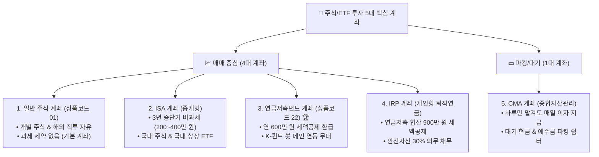

# 🗺️ [2.1절 보완] 주식·ETF 투자를 위한 5대 핵심 계좌 지도 & 종합 비교표

### 1. 🗺️ [한눈에 보는 시각화 지도] 주식 투자 5대 계좌 지형도

---

### 2. 📊 [독자 맞춤형] 5대 핵심 계좌 특징 및 절세 혜택 종합 비교표

| 계좌 명칭 (상품코드) | 주요 매수 가능 종목 | 세금 & 절세 혜택 💡 | 건보료 영향 🛡️ | 이 계좌의 핵심 역할 & 퀀트 봇 연동 |
| :--- | :--- | :--- | :--- | :--- |
| **일반 주식 계좌** (상품코드 `01`) | 국내/해외 개별 주식, 모든 국내/해외 상장 ETF | • 배당소득세 15.4% 원천징수 • 해외주식 양도세 22% (250만 원 공제) | • 금융소득 연 1,000만 원 초과 시 건보료 인상 위험 ⚠️ | 모든 개별 주식과 해외 직투가 가능한 기본 필수 계좌 |
| **ISA 계좌** (중개형 개인종합) | 국내 개별 주식, 국내 상장 해외 ETF | • 순이익 비과세 (일반 200만/서민 400만 원) • 초과분 9.9% 저율 분리과세 | • 분리과세 혜택으로 건보료 폭탄 방어 🛡️ | 3년 중단기 국내 상장 해외 ETF 절세 투자 무대 |
| **연금저축펀드 계좌** (상품코드 `22`) 🏆 | 국내 상장 ETF, 펀드 *(※ 개별 주식 매수 불가)* | • **연 최대 600만 원 세액공제 (13.2%~16.5% 환급)** • 은퇴 시까지 과세 이연 (0% 즉시 차감) | • **건강보험료 0.0% (전액 100% 제외) 🛡️** | **K-듀얼모멘텀 자동화 봇의 메인 핵심 연동 계좌** |
| **IRP 계좌** (개인형 퇴직연금) | 국내 상장 ETF, 펀드, 국공채 *(※ 안전자산 30% 의무)* | • 연금저축과 합산하여 **최대 900만 원 세액공제** • 과세 이연 & 저율 연금소득세 (3.3%~5.5%) | • **건강보험료 0.0% (전액 100% 제외) 🛡️** | 연금저축 한도 초과 시 세액공제를 연 900만 원까지 확장 |
| **CMA 계좌** (종합자산관리) | 단기 RP, MMF, 발행어음 등 | • 매일 이자 발생 (배당소득세 15.4% 부과) | • 일반 금융소득에 합산 | 주식 매수 전 대기 현금이나 매도 후 예수금 파킹 |
