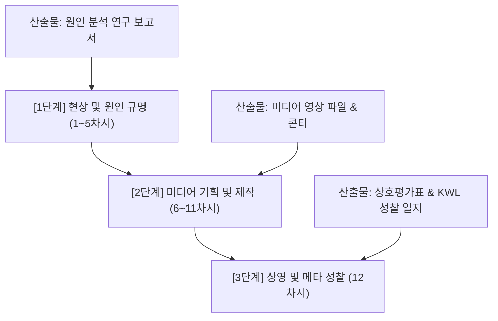

# [교사용 지도서] '쉬었음 청년' 현상 탐구 및 미디어 제작 프로젝트 (12차시)

본 지도서는 2026학년도 학교 자율적 교육과정 운영 계획에 따라 선정된 **탐구 주제 2. ‘쉬었음 청년’ 현상의 근본 원인은 무엇인가?**를 지도하기 위해 개발되었습니다. 국어, 사회, 영어, 수학, 과학, 진로 등 다양한 교과의 교사들이 전공에 관계없이 흐름에 따라 체계적이고 깊이 있는 융합 수업을 이끌 수 있도록 구성되었습니다.

---

## Ⅰ. 프로젝트 개요 및 지도 방향

### 1. 지도 목표
* **주도적 질문과 탐구**: 통계 데이터와 사회 구조적 요인, 당사자의 심리를 연계하여 청년 실업 및 '쉬었음' 현상의 다차원적 원인을 규명한다.
* **공감과 타자 이해**: 편견("일하기 싫어 쉬는 청년들")에서 벗어나 청년들이 처한 고용 환경과 심리적 무기력을 공감적으로 이해한다.
* **창의적 메시지 전달**: 탐구 결과를 대중이 공감할 수 있는 미디어 콘텐츠(연극, 뉴스, 다큐, 광고)로 시각화 및 서사화하여 발신한다.

### 2. 프로젝트 단계별 산출물

---

## Ⅱ. 차시별 교수·학습 과정안 (1~12차시)

### [1단계] 자료 분석 및 보고서 작성 단계 (1~5차시)

#### ■ 1차시: 우리 사회의 '쉬었음'을 마주하다
* **핵심 질문**: 우리 사회의 '쉬었음 청년' 현상은 무엇이며, 우리는 이를 어떻게 바라보고 있는가?
* **학습 목표**: '쉬었음 청년'의 대략적인 현황을 파악하고, 내면의 선입견을 성찰하여 초기 탐구 가설을 세울 수 있다.
* **준비물**: 뉴스 기사 스크랩(인쇄물), 모둠별 전지(또는 브레인라이팅용 포스트잇), 패들렛(Padlet) 등 온라인 도구.
* **수업 흐름**:
  1. **도입 (10분)**: 최근 '쉬었음 청년 40만 명 돌파' 등 언론 보도 요약 제시.
     * *교사 발문*: "쉬었음 청년이라는 말을 들었을 때 가장 먼저 떠오르는 단어나 이미지는 무엇인가요? 솔직하게 이야기해 봅시다."
  2. **전개 (30분)**: 
     * 뉴스 보도 스크랩을 모둠별로 읽고 주요 키워드 추출.
     * **브레인라이팅 활동**: "이들은 왜 쉬고 있을까?"에 대해 개인별 의견을 작성하고 분류.
     * **가설 설정**: 거시적 원인(일자리 부족, 대학 진학 문제 등)과 미시적 원인(개인 의지, 번아웃 등)으로 분류하여 '초기 가설 목록표' 작성.
  3. **정리 (10분)**: 모둠별로 작성한 가설 목록을 공유하고, 탐구의 방향성을 확립.
* **교사용 지도 팁**:
  * 학생들이 "그냥 게을러서 노는 것이다"라는 개인 윤리적 평가에 머무르지 않도록, "이들이 취업 시장에서 겪었을 첫 경험은 무엇이었을까?" 등의 질문을 던져 **구조적 맥락과 공감적 시각**을 자극하십시오.

---

#### ■ 2차시: 통계 데이터의 목소리를 듣다
* **핵심 질문**: 통계 데이터와 정책 보고서는 '쉬었음 청년'의 규모와 추이를 어떻게 말해주는가?
* **학습 목표**: 통계청 공공 데이터를 활용하여 최근 5개년 '쉬었음' 청년의 추이를 파악하고 집단별 특징을 분석할 수 있다.
* **준비물**: 엑셀/구글 스프레드시트 이용이 가능한 기기, 통계청 데이터 가이드북.
* **수업 흐름**:
  1. **도입 (10분)**: 통계 데이터의 중요성 설명.
     * *교사 발문*: "1차시에서 세운 우리의 가설이 참인지 거짓인지 검증하려면 무엇이 필요할까요? 숫자로 증명해 봅시다."
  2. **전개 (30분)**:
     * **국가통계포털(KOSIS)** 접속 가이드 안내: [경제활동인구조사] -> [비경제활동인구] 중 '쉬었음' 데이터 수집.
     * **교차 분석 실습**: 연령별(20~24세 vs 25~29세), 성별, 학력별 데이터를 추출하여 꺾은선그래프나 원그래프로 시각화.
     * **데이터 독해**: 특정 집단(예: 20대 후반, 대졸 이상)에서 쉬었음 인구가 급증하는 현상을 발견하고 그 의미 해석.
  3. **정리 (10분)**: 시각화한 분석표를 제출하고 발견한 특징을 한 문장으로 요약 발표.
* **교사용 지도 팁**:
  * 데이터 수집이 어려운 학생들을 위해 교사가 사전에 5개년 핵심 데이터를 요약한 엑셀 파일을 공유하는 것도 좋은 방법입니다. 꺾은선그래프의 기울기가 급격히 변하는 지점(예: 코로나19 시기, 대졸 취업 한파기 등)에 주목하게 하세요.

---

#### ■ 3차시: 노동시장 이중구조와 구조적 원인 파악
* **핵심 질문**: 노동시장의 구조적 요인은 청년들을 어떻게 '쉬었음'으로 내모는가?
* **학습 목표**: 대기업-중소기업 격차 및 고용 불안정성 등 거시적 노동 구조와 일자리 미스매치 현상을 설명할 수 있다.
* **준비물**: 구조적 요인 분석 텍스트 자료(KDI 또는 한국노동연구원 보고서 요약본).
* **수업 흐름**:
  1. **도입 (10분)**: '노동시장 이중구조' 개념 판서.
     * *교사 발문*: "왜 많은 청년들이 구인난을 겪는 중소기업에 가지 않고 '쉬었음'을 선택할까요? 개인의 눈높이 문제일까요, 일자리의 질적 격차 문제일까요?"
  2. **전개 (30분)**:
     * **이중 노동시장 개념 학습**: 1차 노동시장(대기업, 정규직, 고임금)과 2차 노동시장(중소기업, 비정규직, 저임금)의 임금/복지/사회적 인식 격차 분석.
     * **플랫폼/비정규 노동 실태**: 불안정한 고용 형태(긱 워커, 프리랜서 등)가 청년들의 구직 피로감을 높이는 과정 논의.
     * **미스매치 분석**: 대기업 선호 현상과 양질의 일자리 부족 사이의 괴리를 도출하여 '구조적 요인 분석표' 작성.
  3. **정리 (10분)**: 구조적 요인이 개인의 진로 선택에 미치는 압박을 정리하며 차시 마무리.
* **교사용 지도 팁**:
  * 임금 수준뿐 아니라 고용 안전망(4대 보험, 정규직 전환율 등)과 삶의 질(야근 문화, 워라밸) 등 종합적인 근로 환경 격차가 청년의 구직 이탈을 유발한다는 점을 중점적으로 짚어 줍니다.

---

#### ■ 4차시: 통계 뒤의 사람, 당사자의 목소리를 만나다
* **핵심 질문**: 당사자들의 진짜 목소리는 무엇이며, 심리적 요인은 어떻게 작용하는가?
* **학습 목표**: 인터뷰 자료를 통해 구직 좌절에 따른 심리적 번아웃과 무기력의 발생 과정을 공감적으로 추적할 수 있다.
* **준비물**: 청년 인터뷰 영상(다큐멘터리 클립), 당사자 구직 수기 자료.
* **수업 흐름**:
  1. **도입 (10분)**: 숫자가 가리는 개개인의 삶에 주목.
     * *교사 발문*: "통계 수치 '40만 명' 속 한 사람의 하루는 어떻게 흘러갈까요? 영상 속 청년의 말과 표정에 집중해 봅시다."
  2. **전개 (30분)**:
     * **미디어 클립 시청**: EBS 다큐프라임 '청년 니트(NEET)', 혹은 시사 다큐멘터리의 '쉬었음 청년' 인터뷰 시청.
     * **인터뷰 텍스트 마이닝**: 당사자들이 반복해서 말하는 단어(예: "면접 탈락", "비교", "가족의 눈치", "무기력") 분석.
     * **심리적 번아웃 마인드맵**: 누적된 거절 경험 -> 학습된 무기력 -> 자기효능감 저하 -> 사회적 은둔으로 이어지는 인과 관계 마인드맵화.
  3. **정리 (10분)**: 작성한 심리 매핑 분석 노트를 모둠 내에서 공유 및 제출.
* **교사용 지도 팁**:
  * 이 차시는 감성적 공감이 핵심입니다. 학생들에게 "만약 여러분이 50번의 이력서 탈락을 겪는다면 아침에 눈을 떴을 때 어떤 기분일지" 상상해 보도록 유도하십시오.

---

#### ■ 5차시: 다차원적 분석 보고서 완성 (1단계 완료)
* **핵심 질문**: 다양한 분석 자료를 종합하여 내린 '쉬었음 청년' 현상의 다차원적 원인은 무엇인가?
* **학습 목표**: 1~4차시 탐구 결과를 종합하여 서론-본론-결론의 형식을 갖춘 완성도 높은 '원인 분석 연구 보고서'를 완성할 수 있다.
* **준비물**: 모둠별 분석 데이터, [연구 보고서 양식](file:///D:/OneDrive%20-%20%EA%B2%BD%EC%83%81%EB%82%A8%EB%8F%84%EA%B5%90%EC%9C%A1%EC%B2%AD/%EB%B0%94%ED%83%95%20%ED%99%94%EB%A9%B4/%EC%A7%84%ED%95%B4%EA%B3%A0%EB%93%B1%ED%95%99%EA%B5%90/2026%ED%95%99%EB%85%84%EB%8F%84/antigravity_folder/%EC%89%AC%EC%97%88%EC%9D%8C_%EC%B2%AD%EB%85%84_%EC%97%B0%EA%B5%AC%EB%B3%B4%EA%B3%A0%EC%84%9C_%EC%96%91%EC%8B%9D.md).
* **수업 흐름**:
  1. **도입 (5분)**: 보고서 작성 기준 및 평가 항목 설명.
  2. **전개 (40분)**:
     * **종합 및 인과 지도 작성**: 노동 구조(외인)가 심리적 무기력(내인)으로 이어져 '쉬었음'에 도달하는 종합 인과 모형 설계.
     * **보고서 집필**: 모둠원들이 서론(배경), 본론(통계, 구조, 심리), 결론(정책 제안)을 분담하여 집필하고 종합.
     * **출처 및 윤리 확인**: 인용 자료의 출처가 정확히 기재되었는지 교차 확인.
  3. **정리 (5분)**: 완성된 1단계 최종 보고서를 교사에게 업로드/제출.
* **교사용 지도 팁**:
  * 단순 짜깁기가 되지 않도록 **"구조-심리적 원인의 종합적 인과관계(본론 4)"** 부분을 면밀히 피드백해 주십시오. "이 보고서는 3학년의 경우 개별 세특의 든든한 근거가 되므로 완성도를 끝까지 끌어올리자"고 격려합니다.

---

### [2단계] 시나리오 작성 및 미디어 표현 단계 (6~11차시)

#### ■ 6차시: 우리의 진단을 어떻게 알릴 것인가?
* **핵심 질문**: 우리의 원인 분석 결과를 대중에게 가장 효과적으로 전달할 수 있는 미디어 매체는 무엇인가?
* **학습 목표**: 보고서의 메시지를 가장 잘 표현할 수 있는 미디어 매체를 선택하고 기획서를 작성할 수 있다.
* **준비물**: 미디어 기획서 양식, 매체별(연극/뉴스/다큐/공익광고) 우수 제작 사례 링크.
* **수업 흐름**:
  1. **도입 (10분)**: 보고서의 핵심 메시지 브리핑.
     * *교사 발문*: "우리가 발견한 '구조적 미스매치와 무기력'이라는 원인을 대중에게 가장 임팩트 있게 전달하려면 어떤 그릇에 담아야 할까요?"
  2. **전개 (30분)**:
     * **매체 선택 토의**:
       * *연극*: 부모-자식 간의 감정선 대립을 표현하는 데 유리함.
       * *뉴스*: 정보 전달의 신뢰성, 구조적 문제 부각에 효과적.
       * *공익광고*: 강력한 상징과 압축적인 카피로 대중 인식 개선에 적절함.
     * **기획서 작성**: 선택 매체, 기획 의도, 타겟(대중/부모/정책입안자 등), 핵심 카피 및 전달 메시지 확정.
  3. **정리 (10분)**: 모둠별 미디어 기획서를 공유하고 교사의 1차 피드백을 수렴.
* **교사용 지도 팁**:
  * 모둠원들의 성향(발표 선호, 연기 선호, 영상 편집 강자 등)을 파악하여 적합한 매체를 선택하도록 유도하십시오. 연기에 어려움을 겪는 모둠은 목소리 중심의 라디오 드라마나 팟캐스트, 혹은 자료 화면 중심의 뉴스 보도로 유도하는 것이 효과적입니다.

---

#### ■ 7차시: 메시지를 시나리오와 대본에 심다
* **핵심 질문**: 쉬었음 청년의 내러티브(Narrative)와 핵심 메시지를 어떻게 시나리오에 담을 것인가?
* **학습 목표**: 매체 특성에 맞는 시나리오/대본의 초안을 작성하고 입체적인 캐릭터와 갈등 구도를 설정할 수 있다.
* **준비물**: 시나리오/대본 작성 양식지, 샘플 대본.
* **수업 흐름**:
  1. **도입 (10분)**: 캐릭터 입체성의 중요성 교육.
     * *교사 발문*: "주인공이 단순히 집에서 게임만 하는 모습으로만 묘사되면 대중은 어떤 생각을 할까요? 100장의 원서를 쓰던 순간의 치열함을 대사와 상황으로 보여주어야 합니다."
  2. **전개 (30분)**:
     * **인물 및 상황 설정**: 주인공, 대립 인물(가장 가까운 부모 등), 사회적 목소리를 배정.
     * **대본 집필**: 씬(Scene)별 대사, 지시문, 나레이션 작성.
     * **스토리 텔링 구조 적용**: 발단(희망찬 구직) -> 전개(반복되는 탈락) -> 위기/절정(번아웃과 주변과의 대립) -> 결말(사회의 공감과 재기 준비)의 서사 구축.
  3. **정리 (10분)**: 대본 초안 완성 여부를 점검하고 다음 시간 피드백 준비.
* **교사용 지도 팁**:
  * 국어(문학/화작) 교과와 연계하여 극 갈등 구조를 설계하도록 조언하고, 지나치게 인위적인 대사 대신 실제 청년들이 쓰는 현실적인 어휘(예: "취준", "자소서", "필기 컷")를 사용하게 지도합니다.

---

#### ■ 8차시: 대본 피드백 및 스토리보드(콘티) 설계
* **핵심 질문**: 시나리오가 주제 의식을 명확히 전달하고 있으며, 제작 현실성이 있는가?
* **학습 목표**: 피드백을 반영해 대본을 수정하고, 화면 구도와 음향을 설계하는 스토리보드(콘티)를 작성할 수 있다.
* **준비물**: 스토리보드(콘티) 양식지.
* **수업 흐름**:
  1. **도입 (10분)**: 릴레이 피드백 룰 안내.
  2. **전개 (30분)**:
     * **동료 교차 피드백**: "이 대사가 우리 분석 보고서의 구조적 원인을 잘 드러내고 있는가?"를 기준으로 피드백 진행.
     * **대본 최종 수정**: 피드백을 반영하여 지시문과 대사 가다듬기.
     * **스토리보드(콘티) 작성**: 카메라 앵글(바스트/풀샷/클로즈업), 자막 위치, 효과음/배경음악 상세 설계.
     * **역할 분담**: 연출, 촬영, 출연, 소품, 편집 등 모둠 내 분담 확정.
  3. **정리 (10분)**: 수정된 대본 및 콘티를 공유하고 촬영 계획 확인.
* **교사용 지도 팁**:
  * 촬영 단계에서 발생할 수 있는 시행착오를 줄이기 위해, "학교 내에서 정말로 촬영할 수 있는 장소인가?"를 확인하고 과도한 컴퓨터 그래픽(CG)이나 야외 촬영이 필요한 콘티는 현실적으로 수정하도록 조언하십시오.

---

#### ■ 9차시: 리허설과 최종 촬영 계획 점검
* **핵심 질문**: 실제 촬영/녹화를 위해 연기와 연출, 촬영 구도를 어떻게 조율할 것인가?
* **학습 목표**: 리허설을 통해 동선과 연기를 조율하고, 소품 및 촬영 장비를 최종 점검할 수 있다.
* **준비물**: 리허설 체크리스트, 모의 소품(이력서 등), 촬영 기기.
* **수업 흐름**:
  1. **도입 (10분)**: 촬영 전 준비의 중요성 강조.
     * *교사 발문*: "촬영 당일 '아, 삼각대를 안 가져왔다!' 하거나 장소 섭외가 안 되어 헤매는 일이 없도록 오늘 모든 리허설과 세팅을 마쳐야 합니다."
  2. **전개 (30분)**:
     * **동선 및 대사 리허설**: 배우들의 발음, 속도, 동선을 체크하며 소리가 울리거나 작게 들리는지 확인.
     * **촬영 구도 테스트**: 스마트폰을 삼각대에 거치하고 구도를 확인하여 흔들림이 없는지 테스트 촬영.
     * **체크리스트 작성**: 촬영 장소 예약 확인, 소품(의상, 이력서, 합격 여부 화면 캡처 등) 최종 점검.
  3. **정리 (10분)**: 리허설 결과를 바탕으로 촬영 계획서 최종 수정 및 제출.
* **교사용 지도 팁**:
  * 소리가 명확하게 녹음되지 않는 경우가 많습니다. "촬영 시 카메라와 인물의 거리를 최소화하거나 스마트폰 이어폰 마이크를 핀마이크 대용으로 활용하는 법" 등 실용적인 꿀팁을 전수해 주십시오.

---

#### ■ 10차시: 렌즈에 담아내는 청년의 서사 (촬영)
* **핵심 질문**: 기획한 시나리오와 콘티대로 생생하게 메시지를 영상으로 담아내고 있는가?
* **학습 목표**: 스토리보드에 맞추어 학교 내외의 지정된 장소에서 영상을 소음 없이 안전하게 촬영할 수 있다.
* **준비물**: 스마트폰, 삼각대, 소품, 촬영 허가 구역 표지판.
* **수업 흐름**:
  1. **도입 (5분)**: 촬영 에티켓 및 안전 예방 교육 (타 학급 방해 금지).
  2. **전개 (40분)**:
     * **현장 촬영 진행**: 모둠별로 배정된 공간(빈 교실, 동아리실, 교정 등)에서 촬영 진행.
     * **컷별 촬영 및 백업**: OK 컷과 NG 컷을 촬영 계획서에 기록하며 진행하고, 촬영본이 스마트폰에 잘 저장되었는지 즉시 모니터링.
  3. **정리 (5분)**: 촬영 장소 원상 복구 및 교실 복귀.
* **교사용 지도 팁**:
  * 교사는 교내 순찰을 통해 안전 사고를 예방하고 타 학급의 정규 수업에 지장이 가지 않도록 통제해 줍니다. 촬영이 계획보다 지연되는 모둠은 분량을 축소하거나 컷을 합치는 과감한 연출 조정을 지도하십시오.

---

#### ■ 11차시: 편집, 메시지를 벼리다 (2단계 완료)
* **핵심 질문**: 전달력을 높이고 오해를 줄이기 위해 어떻게 영상을 편집하고 완성할 것인가?
* **학습 목표**: 편집 소프트웨어를 사용하여 영상을 컷 편집하고, 필수 자막과 가독성 있는 자막, 오디오를 삽입하여 완성할 수 있다.
* **준비물**: 모둠별 촬영 원본 영상, 노트북 또는 스마트 패드(CapCut, VLLO 등 편집 앱 설치).
* **수업 흐름**:
  1. **도입 (10분)**: 편집 구성 요건 및 주의 사항 안내.
     * *주의 사항*: 모든 대사에는 자막 필수, 무료 폰트(나눔글꼴 등) 사용, 배경음악 저작권 확인.
  2. **전개 (35분)**:
     * **컷 편집 및 자막 삽입**: 흐름에 방해되는 부분을 과감히 자르고(컷 편집), 핵심 통계나 중요한 대사는 강조 자막 적용.
     * **사운드 밸런스 조절**: 나레이션이나 대사 소리가 배경음악에 묻히지 않도록 오디오 레벨 조정.
     * **인코딩 및 제출**: 완성된 영상(연극/뉴스/다큐 5~7분 내외, 공익광고 1~2분 내외)을 MP4 포맷으로 인코딩하여 제출.
  3. **정리 (5분)**: 제출 상태 확인 및 최종 시사회 안내.
* **교사용 지도 팁**:
  * 편집 단계에서 시간이 가장 오래 걸립니다. 특수효과나 화려한 화면 전환보다는 **"메시지의 흐름과 대사 전달력"**에 집중하도록 지도하고, 최종 렌더링 시 용량이 너무 크지 않도록 해상도는 FHD(1080p) 수준으로 타협하게 유도하십시오.

---

## Ⅲ. 탐구 지원 데이터 및 참고 자료 (KOSIS 경로)

교사가 통계 분석 지도시 학생들에게 제공할 실제 통계청 데이터 경로와 추천 미디어 리스트입니다.

### 1. 국가통계포털(KOSIS) 실무 데이터 추출 경로
1. **KOSIS 국가통계포털(kosis.kr) 접속**
2. **주제별 통계** -> **고용·노동** -> **경제활동인구조사** 선택
3. **[성/연령별/교육정도별 비경제활동인구]** 테이블 클릭
4. **조회 조건 설정**:
   * **활동상태별**: "비경제활동인구" 하위 항목 중 **'쉬었음'** 선택
   * **연령별**: **15~19세**, **20~24세**, **25~29세** 선택 (청년층 세분화)
   * **시계열 설정**: 최근 **5개년(월별 또는 연간)** 설정
5. **데이터 다운로드**: 엑셀(CSV) 파일로 내려받아 2차시 활동지에 활용하도록 지도.

### 2. 수업 활용 추천 시각 및 미디어 자료
* **다큐멘터리**: 
  * EBS 다큐프라임 「청년 니트(NEET), 쉬어도 괜찮아」 
  * KBS 다큐 인사이트 「청년, 쉬었음」 편
* **보고서**: 
  * 한국노동연구원(KLI) 「청년층 비경제활동인구 '쉬었음'의 동태적 특징 분석」
  * 한국개발연구원(KDI) 「청년고용 이중구조가 미치는 사회경제적 영향」
